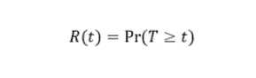
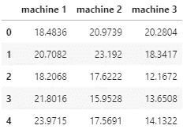
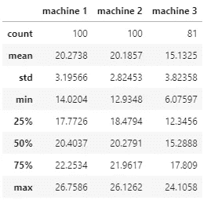
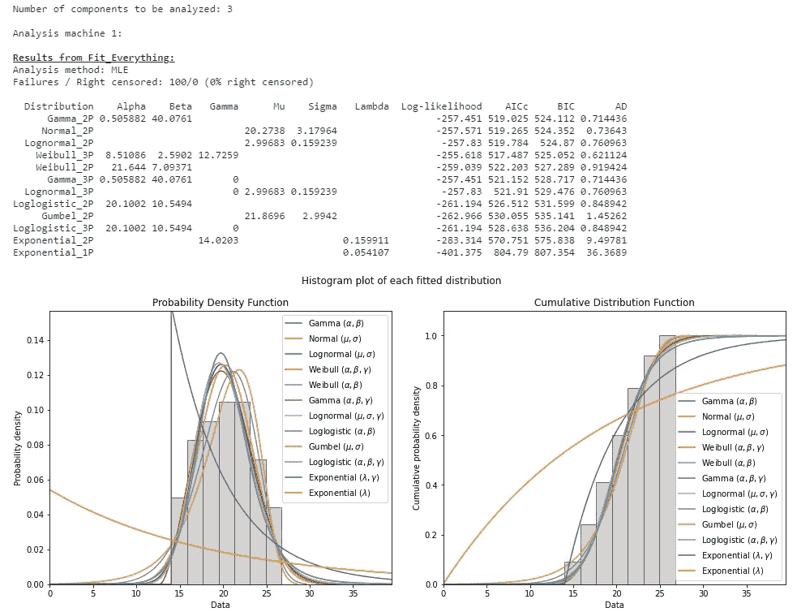
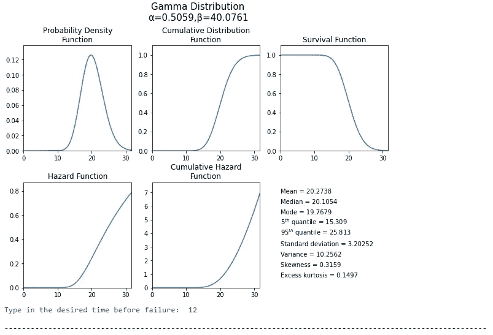
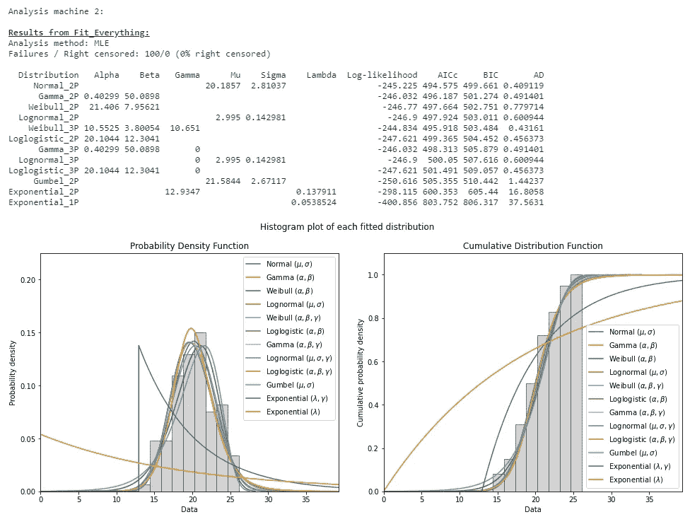
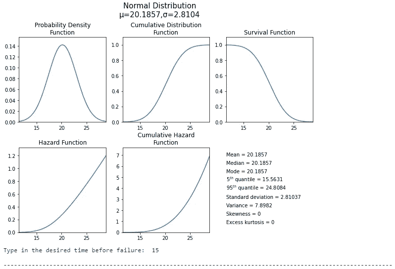
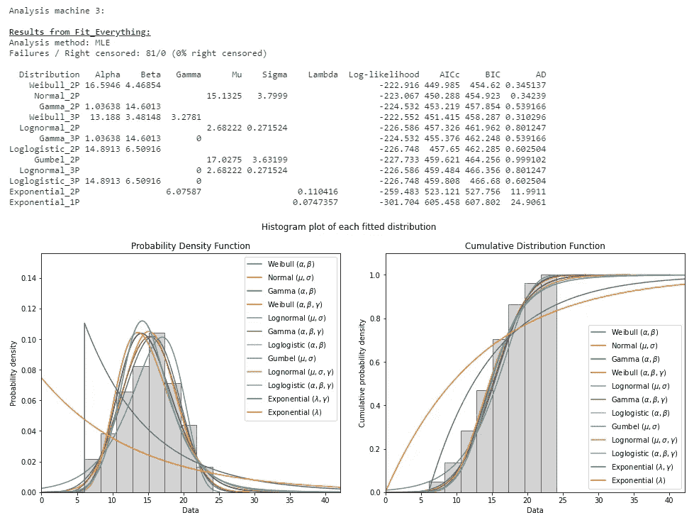
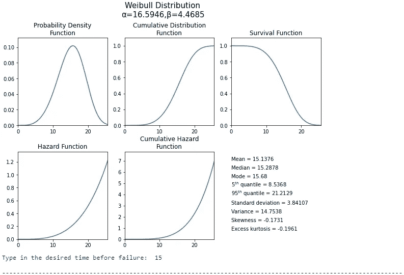

# 用 Python 进行可靠性分析——串行系统

> 原文：<https://medium.datadriveninvestor.com/reliability-analysis-with-python-serial-systems-2ad39da3765b?source=collection_archive---------3----------------------->

## 面向工业工程师的 Python

## 全面生产维护

Image by [Carlos Aranda](https://unsplash.com/@carlosaranda) available at [Unsplash](https://unsplash.com/photos/QMjCzOGeglA)

# 可靠性

可靠性是一个项目、产品、机器或设备在给定的时间段内，在特定的操作**条件**下，执行所需的**功能**的**概率**。换句话说，它是一段时间内无故障的概率。

可靠性侧重于物品、产品、机器或设备在投入使用后继续发挥功能的时间(即部件的生命周期)。可靠性可以被视为进入时间域的质量。其公式表示为:

其中 *f* ( *t* )是给定分布的概率密度函数。

# 计算部件可靠性

计算特定时间内部件可靠性所需的步骤如下:

*   **步骤#1:获取故障时间** —定义样本大小，并获取每个组件出现故障前的功能时间。
*   **步骤#2:确定最符合数据的分布**——基于收集数据的直方图，拟合多个概率分布，并确定最能描述数据的分布。
*   **步骤#3:获取分布参数**——获取所选分布的位置、尺度和附加参数，以确定其概率密度函数、累积分布函数和生存函数。
*   **步骤#4:获得概率** —使用累积密度函数获得时间 *t* 之前的故障概率，使用生存函数获得时间 *t* 之后的可靠性。

# 计算串联系统的可靠性

串联系统的可靠性在于其单个部件可靠性的乘积。它的公式可以表示为:

在这种配置下，如果任何单个组件的可靠性很差，由于它们之间的严格依赖性，整个系统的可靠性会受到显著影响。

对于下面的例子，让我们假设一个工程师有兴趣计算一个由三个部件组成的串联系统的可靠性，其故障前的期望时间如下:机器 1 为 12 周，机器 2 为 15 周，机器 3 为 15 周。

工程师能够收集机器 1 和 2 的 100 个故障时间和机器 3 的 81 个故障时间。(假设的)数据可以在这里找到[。让我们来看看 Python 代码！](https://github.com/rsalaza4/Python-for-Industrial-Engineering/blob/master/Total%20Productive%20Maintenance/failure_times.csv)

**第一成分分析:**

根据对第一个组件(即机器 1)的统计分析，其故障时间最符合具有两个参数的伽马分布。

**第二成分的分析:**

根据对第二组件(即机器 2)的统计分析，其故障时间最符合正态分布。

**第三成分分析:**

根据对第三个组件(即机器 3)的统计分析，其故障时间最符合具有两个参数的威布尔分布。

结果表明，串联系统的整体可靠性为 51.11%。在第 15 周，串联系统的可靠性受到机器 3 的可靠性的严重影响；换句话说，机器 3 不太可能在 15 周之后无故障地继续运行。

# 总结想法

在时域中，可靠性代表了产品质量和系统功能的重要组成部分。制造商和生产商希望他们的机器和系统能够持续运行一段时间，以免因缺乏维护而出现潜在故障。因此，每次了解一个组件的可靠性 *t* 变得至关重要，以便能够提前计划所需的维护，避免巨大的停工经济损失。

本指南涵盖了如何使用 [**可靠性**](https://reliability.readthedocs.io/en/latest/index.html#) Python 库计算串联系统可靠性的分步指南。考虑到 Python 在专业人士和学者中的高受欢迎程度，Python 代表了一个能够执行统计分析的伟大工具。虽然有其他程序和统计软件能够分析可靠性(如 Minitab、R、Microsoft Excel)，但质量和工业工程师应根据其编码和分析技能决定使用哪一种，同时遵守组织的目标和客户的规范。

*— —*

*如果你觉得这篇文章有用，欢迎在* [*GitHub*](https://github.com/rsalaza4/Python-for-Industrial-Engineering/blob/master/Total%20Productive%20Maintenance/Reliability%20Analysis%20-%20Serial%20Systems.py) *上下载我的个人代码。你也可以直接在 rsalaza4@binghamton.edu 给我发邮件，在*[*LinkedIn*](https://www.linkedin.com/in/roberto-salazar-reyna/)*上找到我。有兴趣了解工程领域的数据分析、数据科学和机器学习应用的更多信息吗？通过访问我的媒体* [*个人资料*](https://robertosalazarr.medium.com/) *来探索我以前的文章。感谢阅读。*

罗伯特