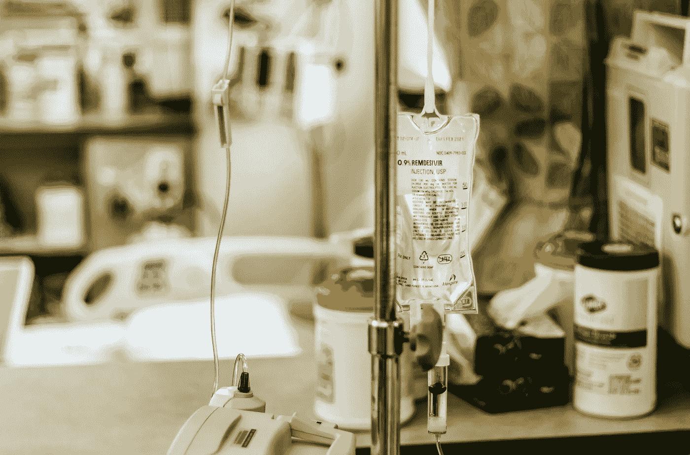

# Remdesivir 将恢复时间从 15 天减少到 11 天。那有用吗？

> 原文：<https://medium.datadriveninvestor.com/remdesivir-during-corona-whats-the-fuss-all-about-5fd3b3f3689f?source=collection_archive---------7----------------------->

从作为第一个病人的随机药物到美国最受欢迎的药物……让我们来谈谈医药的失败者实际上有多有用。

Photo by [Dimitri Karastelev](https://unsplash.com/@thedotter?utm_source=unsplash&utm_medium=referral&utm_content=creditCopyText) on [Unsplash](https://unsplash.com/s/photos/remdesivir?utm_source=unsplash&utm_medium=referral&utm_content=creditCopyText)

Remdesivir 是唯一获得 FDA 批准用于治疗 COVID19 患者的药物。 在过去的一个月里，这种药物引起了许多起伏，尤其是对美国医疗保健业而言。这种药物于 4 月 29 日上市，而全国各地的医生都在为终于有一种医疗批准的药物来帮助他们的病人而欢欣鼓舞。他们很快意识到没有人能使用这种药物。

***医院面临药品短缺***

全国各地的医院都缺乏这种药物，但更重要的是，没有公布的指南或任何形式的数据来解释这种药物的使用。简单地说，他们不知道哪些病人应该服用这种药物？应该给最严重的病例还是初始阶段的病例使用？由于供应有限，他们甚至没有试错的余地。

> 波士顿塔夫茨医疗中心传染病科主任海伦·鲍彻博士告诉路透社，“我们希望将药物导向那些最有可能受益而最不可能受到伤害的人。”

# NIAID 刚刚发布了关于 Remdesivir 的数据

5 月 22 日[NIAID](https://www.nejm.org/doi/full/10.1056/NEJMoa2007764)(国家过敏和传染病研究所)[发布了美国第一个 COVID19 主要临床试验的数据！](https://www.nejm.org/doi/full/10.1056/NEJMoa2007764)这终于回答了关于 remdesivir 用法的最重要的问题。

## Remdesirvir 对埃博拉、中东呼吸综合征和非典有希望，但对 COVID19 却出乎意料

在过去的几个月里，Remdesivir 一直是最有争议的药物之一。这是一种由 Gilead Sciences Inc .开发的广谱抗病毒药物。它之前在患有埃博拉病毒疾病的人类身上进行了测试，并在治疗中东呼吸综合征(MERS) 和严重急性呼吸综合征(SARS)的动物模型中显示出了[的前景，这两种疾病都是由其他冠状病毒引起的。](https://www.niaid.nih.gov/news-events/remdesivir-prevents-mers-coronavirus-disease-monkeys)

## 令人惊讶的药物隔夜恢复

Remdesivir 从未被认为是击败 COVID19 的可行方案。但在看到美国第一位 COVID19 患者病情恶化后，医生决定在他出现症状后的第 6 天给他用药。患者当时患有肺炎，呼吸困难，需要输氧。医生们做了最后的努力，决定给他用 Remdesivir，令他们吃惊的是，病人第二天就好多了。他的呼吸正常了，他们可以切断氧气供应。

这一令人惊讶的一夜康复促使从美国到中国的各国医生开始研究这种神奇的药物。

> 第一次实验的结果促使 NIAID 主任和美国冠状病毒特别工作组成员安东尼·s·福奇医学博士说，
> 
> “我们迫切需要一种安全有效的方法来治疗新冠肺炎。虽然雷地昔韦已经用于一些新冠肺炎患者，但我们没有确凿的数据表明它可以改善临床结果。一项随机、安慰剂对照的试验是确定一项实验性治疗是否能让患者受益的金标准。

## 第一项研究于四月发布——有希望

4 月 29 日，由 NIAID 完成的一项名为[适应性新冠肺炎治疗试验](https://www.niaid.nih.gov/news-events/nih-clinical-trial-remdesivir-treat-covid-19-begins) (ACTT)的 [**前期研究**发布，它谈到了使用该药物缩短的恢复期。对于其他组患者，给予患者 10 天疗程的药物优于安慰剂治疗。](https://www.nih.gov/news-events/news-releases/nih-clinical-trial-shows-remdesivir-accelerates-recovery-advanced-covid-19)

> 给药 10 天表明恢复期从 15 天显著缩短至 11 天。

初步结果表明，接受 remdesivir 的患者比接受安慰剂的患者恢复时间快 31%。结果显示存活获益，安慰剂组的死亡率为 11.6%，雷地昔韦组为 8%。

> 死亡率从 11.6%下降到 8%。

## 最近的一项研究表明，中等严重程度的患者获益最大

5 月 22 日发布的最新研究让我们对初步研究有了更深入的了解。这项研究对 1063 名患者进行了 8 分制分类。其中一半接受安慰剂，另一半接受药物。受益最大的患者的严重程度为 5 级(需要吸氧)，受益率为 47%。严重程度为 4(未接受氧气)的患者获得 38%的益处，6(接受高流量氧气)的患者获得 20%的益处，7(接受机械通气)的患者从 20%略有下降。

> 受益最大的患者的严重程度为 5(需要氧气)，与安慰剂相比，受益 47%。

## 中国研究显示雷地昔韦无效

该研究还将自己与 4 月 29 日发表的一项中国研究进行了比较，该研究称，remdesivir 的“临床益处微不足道”。然而，这项研究的样本量要小得多，只有 237 名患者。最重要的是，由于中国疫情的结束，它没有完成。

 [## 在医疗保健中使用人工智能的伦理|数据驱动的投资者

### 人工智能(AI)正被应用于任何管理大量数据的行业，并且在一个…

www.datadriveninvestor.com](https://www.datadriveninvestor.com/2020/03/21/the-ethics-of-using-ai-in-healthcare/) 

当然，对这项研究有一些批评。正如统计数据中提到的，纪念斯隆-凯特琳癌症中心健康政策和结果中心的主任彼得·巴赫(Peter Bach)表示*他不确定死亡率降低的结果，因为更严重的患者被放在安慰剂组。*

> 巴赫博士说，他“不太相信在最高风险群体中，安慰剂比干预更多的情况下会有死亡率上的好处”

全国各地的医生和评论家的意见清楚地表明需要更长时间的临床试验研究。但最重要的是，这项研究本身消除了所有之前提出的关于 Remdesivir 的担忧和疑问。

## 结论:Remdesivir 这次不足以拯救我们

从这一案例得出的结论清楚地表明，仅用 Remdesivir“是不够的”。

该研究明确得出结论说，单独的雷地昔韦不是疫情的解决方案，尽管研究表明它是有用的，但它需要与另一种药物联用才能达到最大的疗效。

正如论文中提到的…

> “这些初步发现支持对因新冠肺炎而住院并需要补充氧气治疗的患者使用雷地昔韦。然而，尽管使用了雷地昔韦，死亡率仍然很高，很明显，仅用抗病毒药物治疗是不够的。未来的策略应该评估抗病毒药物与其他治疗方法或抗病毒药物组合的联合应用，以继续改善新冠肺炎患者的预后