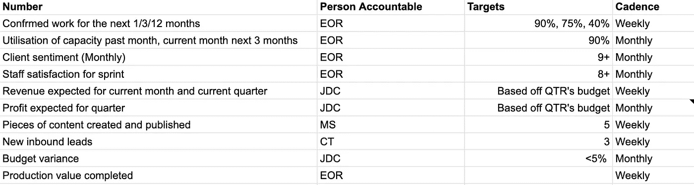
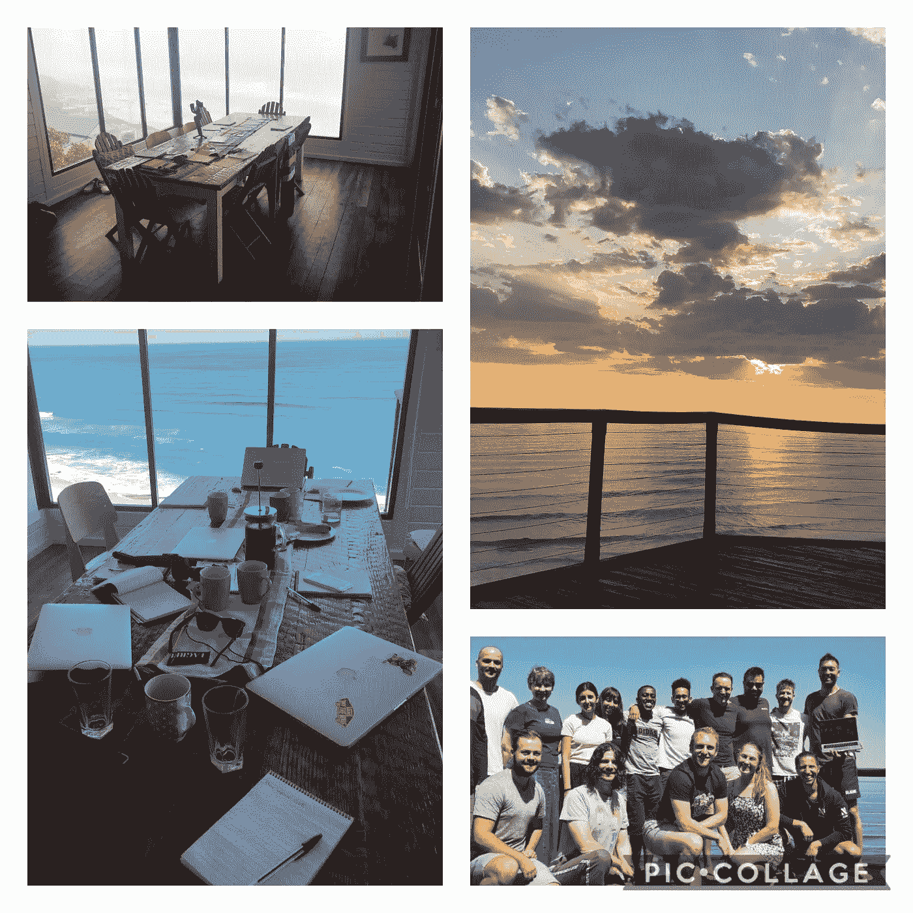
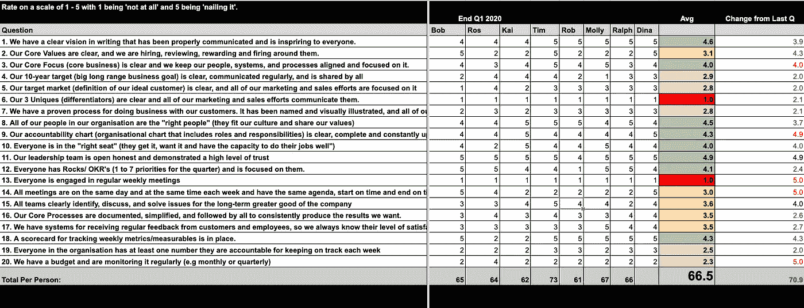
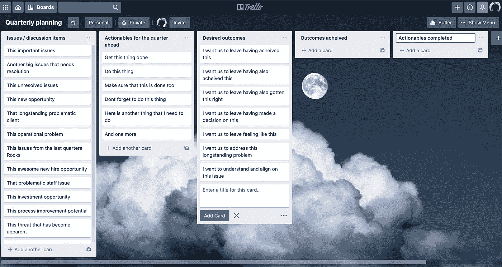

# 如何更好地远程领导？

> 原文：<https://medium.datadriveninvestor.com/remote-work-is-easy-remote-leadership-is-not-98727f9ef2b8?source=collection_archive---------9----------------------->

## 从领导一个来自世界另一端的 30 人的企业中学到的经验。

## 不管你是否在远方，为了成为更好的领导者，你可以从今天开始做的 5 件事。

Photo by [Oscar Keys](https://unsplash.com/@oscartothekeys?utm_source=unsplash&utm_medium=referral&utm_content=creditCopyText) on [Unsplash](https://unsplash.com/s/photos/blind?utm_source=unsplash&utm_medium=referral&utm_content=creditCopyText)

远程工作并不是什么新鲜事。当然，由于 Covid 19 的出现，这一过程大大加快了，但许多企业长期以来一直在不同程度上采用这一方法。

在 Covid19 改变世界之前的一段时间，我们开始尝试远程工作，我们学到了一些真正艰难的教训。我写这篇文章是为了分享一些你可以做的实际的事情，以减少在远离一段时间后很可能出现的痛苦。蜜月期将会过去，当它过去时，这些实践将会很好地服务于你和你的团队，不管你是否留在偏远地区。

我应该预先警告你，这些不是快速解决办法。远程领导需要一致的、有纪律的和深思熟虑的行动。

在我们的远程之旅开始时，我们认为我们真的很聪明。生产力提高了，人们真的很高兴，我们觉得我们解决了一个很多人试图解决但失败了的挑战。

我们错了——我们只是没有给它足够的时间。

我们投入了几乎不合理的时间、精力和资源，在[诺娜建立了一种非常独特和强大的文化。](http://www.nona.digital)这种文化在很大程度上建立在一个美丽的物理空间和高水平的高质量人际交往的基础上。

通过(几乎)完全消除这种物理空间和人类互动，事情开始变得更糟，我们不明白为什么。

生产力水平仍然很高，但文化受到了明显的冲击。人们变得不那么投入，不那么快乐，我们需要为此做些什么。

这个世界不需要我这种不合格的人再做远程工作心理分析了。相反，我只想说，很明显，作为一名领导者，我需要认真对待我的比赛。我需要以新的方式做出有意义的贡献，以保持我们强大的文化和健康的人际关系。

> 但是没人看的时候你怎么领导呢？

我想分享 5 件事，它们在我担任远程领导期间对保持联系产生了显著的积极影响。你可以从今天开始实施这些，如果你坚持不懈，我相信你会在你的团队和业务中看到积极的变化。

作为一个远程领导者，你将会加强你的能力，并进行一项让你与众不同的投资。

## **每 90 天 27 个问题。**

**为什么？**

给你公司里的每一个人一些一对一的时间，完全专注于他们的谈话和你的倾听。这不是为了解决问题，也不是回顾或复古。只是你在问一些没有对错答案的问题。这是关于你积极倾听，这对于大多数企业家来说是非常困难的。

**如何？**

每隔 90 天，安排 45 分钟和你公司的每个成员在一起。

当我写这篇文章时，Nona 目前由 30 人组成，在这个规模上，通过一些计划和努力是可行的。总有一天，这实际上是不可行的，但在那之前，我会做一些“不可扩展”的事情。

问这些问题或修改它们以适应你的环境，然后全神贯注地听:

*   用一个词描述你现在的感受。
*   你对 Covid19 和封锁有什么看法？
*   在过去的 90 天里，你最大的胜利是什么？
*   在过去的 90 天里，最大的障碍或挑战是什么？
*   诺娜能做什么让你更成功？
*   你有多幸福(1-10)，为什么？
*   诺娜身边的人士气如何？
*   诺娜哪里最弱？
*   如果你拥有诺娜，你会改变什么？
*   在过去的 90 天里，诺娜有没有人做过给你留下积极印象的事情？*一旦有了答案，问一问你是否能与被提问的人分享答案，然后照做。*
*   对你来说，我的支持是什么样的？
*   当你工作出色的时候，你觉得自己得到了认可吗？
*   当你不这样做的时候，你会觉得自己有责任吗？
*   你在诺娜感到安全吗——为什么？
*   我们为客户解决什么问题？
*   你在诺娜的目的是什么——你觉得这和诺娜的目的有联系吗？
*   诺娜 10 年后会是什么样子？
*   你是否觉得你每天在这里所做的事情有助于实现这一愿景，并且你是其中的一部分。
*   如果有人在晚宴上问你在诺娜工作感觉如何，你会怎么回答？
*   我怎样才能成为一个更好的领导者？
*   我能多做/少做些什么？
*   什么是你希望有机会失败的机会？
*   你觉得你的声音在诺娜被听到了吗
*   为了变得更好/更快乐/更有联系，我们应该开始/停止做什么？
*   有什么我们可以为客户做得更好的吗？
*   你从中学到了什么或从中获得了什么价值？
*   用一个词描述你现在的感受。

为了更深入地了解这一点，你可能会从我在这里写的关于这个[的文章中获得价值。](https://medium.com/@mikescott88/28-questions-to-ask-your-team-every-90-days-898b7d080216)

# **周一视频**

**为什么？**

*   让你的团队更深入地了解你是如何支配时间的，你关注的是什么，你的决策是如何受到影响的。
*   以提供可预测的通信节奏，但具有变化的内容。
*   帮助你的团队通过你的眼睛来看待这个世界和你的业务，以及你为什么要做你正在做的事情。
*   邀请订婚。
*   集中你自己的思想和行动来迎接下一周。

**如何？**

每周一发送一个 5 分钟(不要更长)的你和你的团队谈话的视频。我把它发送到我们公司的 Whatsapp 和 Slack 'announcements '频道。

从下面的标题开始，但是可以根据您自己的环境的需要随意编辑:

1.  这是我本周关注的焦点。
2.  这些是我本周计划的重要会议。
3.  这些是我上周的观察。
4.  这些是我正在考虑的事情。
5.  这是我正在消费的内容。

要更深入地了解这种做法的细节，请点击这里查看我写的关于这个[的文章。](https://medium.com/@mikescott88/why-i-send-a-video-to-my-team-every-monday-and-what-it-includes-1a62cf8c5872)

 [## 领导力。赢得|数据驱动型投资者需要更广阔的视角

### 不管他们愿不愿意，领导者都是快速运转的机器中的齿轮，这就要求他们夹住自己的爪子…

www.datadriveninvestor.com](https://www.datadriveninvestor.com/2020/02/07/leadership-it-takes-a-wider-perspective-to-win/) 

# **每日挤作一团**

**为什么？**

*   与你的团队保持联系。
*   确保你每一天都在正轨上。
*   给你的一天带来专注。
*   让彼此承担责任。
*   去捕捉你自己可能看不到的盲点。
*   了解团队情绪状态的模式和趋势。

**如何？**

有无穷无尽的方法来管理你的日常会议，我们的方法也在不断发展。我们日常领导团队会议的当前迭代如下

**协议:**

*   永远不要迟到。
*   每天同一时间准时开始。
*   准时结束。
*   如果你真的不能来，通过 Whatsapp 发送你的更新。
*   我们是一个由 5 人组成的领导团队，会议时间从不超过 15 分钟。

**议程。**

*   用一个词来描述我的感受。
*   我今天需要做的一件事是…
*   我今天要做的其他事情是…
*   我今天想关注的是…
*   今天我想庆祝的事情是…
*   在过去的 24 小时里，我想保持的一个行为是…
*   在过去的 24 小时里，我想放弃的一个行为是…

*我们的每日聚会最初是受凡尔纳·哈尼什的书***的启发，我强烈推荐这本书。**

# ***周会***

***为什么是**？*

*   *专注于季度目标(参见季度规划)。如果我们本周进展顺利，那么我们这个季度也会进展顺利。对于大多数人来说，在一个超过 90 天的世界里工作是很困难的，所以我们在这个时间框架内设定了大多数目标。*
*   *生成 7 天待办事项，推动企业实现其 90 天目标。*
*   *提高整个领导团队的责任感。*
*   *增加战略讨论的频率。*
*   *回顾将推动未来一周正确决策的数据。*
*   *保持联系。*
*   *不断改进，无处不在。*

***如何？***

***协议。***

*   *没有干扰——所有窗口关闭，通知关闭。这是非常昂贵的时间，每个人都“拨入”并在场是非常重要的。*
*   *如果你能亲自参加这个会议，那是最好的，但是不能亲自见面并不是错过或跳过这个会议的足够理由。显然，如果你是一个远程领导，这很少会亲自完成，这没关系。*
*   *每个人都为每周的会议做好了准备。*
*   *为你的领导团队安排一个每周一次的约会，确保每个人都优先考虑这个会议。这可以说是每个人每周日程表上最重要的会议。*
*   *每次都在同一时间准时开始。*
*   *准时结束。*

***议程。***

*我们当前的迭代运行了 2 个小时。如果你想产生有意义的结果，很难比这更短。该议程仅显示标题和次要细节。每个标题都有相当多的细节需要解开，但这应该可以让你开始。*

***硬启动和集装箱建造(各 15 分钟-3 分钟)。***

*   *日常会议流程(见上文)。*
*   *过去一周与个人和业务相关的好消息。*

***复习数字(10 分钟)。***

*   *在这里，您正在回顾您每周都在关注的数字列表。你应该尽可能为这些数字设定每周目标。这些数字应该给你一个很好的画面，让你知道在接下来的一周你需要在哪些方面努力，从而为接下来的一周创造对话和行动项目。这些通常应该是推动行动的领先指标。*

**

*Examples of what some numbers might look like.*

*保持零讨论的原则。如果你有什么想讨论的，记下会议中专门讨论和解决问题的部分。这是困难的，但也是必要的。*

***季度目标回顾(5 分钟)***

*   *有许多系统可以设定季度目标。我们现在用的是 OKR 的 T1，但是我们也用了 T2 的岩石 T3。为了简单起见，我将在本文中讨论岩石。*
*   *在这一部分中，您只需检查您的季度目标(Rocks)是否正常。*
*   *这里同样需要零讨论原则。如果你有什么想讨论的，记下来并添加到待办事项列表中，以便在会议中稍后讨论。*

***标题和致谢(5 分钟)。***

*   *这是关于突出员工和客户的重要新闻和观察的标题。如果是正面的标题，只要互相击掌，然后继续前进。如果他们是否定的，把这个问题放到议程的议题和讨论部分。*
*   *这同样需要零讨论原则。如果你想讨论什么，把它放到特雷罗板上的问题和讨论列表中。*

***待办事项(5 分钟)***

*   *回顾过去 7 天的所有待办事项。*
*   *每个人都向团队回顾自己的卡片。*
*   *我们在每张卡上都贴上标签，这样人们可以一眼看出进度。这些标签是:*

> **搞定。**
> 
> *取得了进步，但我想再待一周。*
> 
> *没有进展，但我想继续工作一周。*
> 
> **我想讨论一下这个。**
> 
> *已经播了两个多星期了。*

*   *任何东西都不能停留超过两周。*
*   *你的目标是每周完成 90%的周待办事项。*

***休息(10 分钟)。***

***议题和讨论时间(60 分钟)。***

*现在，我们已经根据本周发生的事情和上面的议程填写了这个列表，我们开始讨论这次会议的主要原因——讨论和解决问题，并制定未来一周的待办事项，我们将相互问责。*

*   *就哪些项目先讨论进行一轮投票。这一点很重要，因为如果你不投票，最重要的问题可能得不到解决，因为它是最后一个添加到列表底部的问题。为此，我们使用了 trello vote 函数，效果很好。每个人有 3 票。我们重复这个过程，直到时间用完。*
*   *本部分的重点是通过制定未来 7 天的行动项目来解决问题。*
*   *这是一个昂贵的时间，所以真正的问题是整个领导团队是否需要参与解决一个特定的问题，或者是否可以离线解决。*
*   *这里没有政治，公开和诚实的交流，把你的自我放在门外。这是关于把团队和业务放在你自己之前，并认识到你是更大利益的一部分。*
*   *在此期间，我们通常会处理 8 到 15 个问题。*

*结束流程(10 分钟)。*

*   *回顾下周的最终任务清单。*
*   *每位团队成员对会议的评分为 1-10 分(不允许 7 分)，分享他们从会议中获得的主要收获，并以一个词概括他们的感受。*

**我们的每周例会受到了吉诺·维克曼十级会议系统的强烈启发，从是他的著作* [*牵引而来。*](https://www.eosworldwide.com/traction-book) *这是一本优秀的读物，也是我极力推荐的一个系统。**

# ***季度规划***

***为什么？***

*   *抽出时间与你的领导团队一起工作，关注更大的图景。*
*   *回顾过去的 90 天。哪些进展顺利，哪些需要注意，你学到了什么等等..*
*   *花时间和你的领导团队交流。*
*   *改善领导团队的文化、信任度和绩效。*
*   *设定未来 90 天的目标。*
*   *以获得对准。*

***如何？***

**我将假设您能够亲自见面。话虽如此，但由于 Covid19，我们实际上已经成功地运行了这些项目。虚拟议程已经展开了 7 天，但基本流程是相同的。一旦旅行成为可能，我会每隔 90 天去见一次我的领导。这是一项巨大的投资，但非常值得。**

**你可以把这个时间缩短到一整天，但我会分享我们的整个日程，这样你就可以挑选最适合你的内容。**

*再次强调，每个标题都需要相当多的细节，但这应该是你的开始。*

*   *至少提前一年做好计划，并在日期上得到认可，这样就不会有最后一刻没有出席的人。领导团队中的每个人都是这一过程的一部分，这一点至关重要。*
*   *重要的是，你在一个不同的环境，因此能够在不同的顶部空间。我们总是在一个美丽的地方挑一栋漂亮的大房子。*

**

*Pick a location that will help you get into a different head space if possible.*

*   *我会提前一个月向领导团队发送准备信息，以便每个人都做好了准备，能够在一起充分利用这段时间。*
*   *我会在一个月前寄出一份表格，让所有人填写，其中包含几个简单但有力的部分:*

> *我们应该从诺娜开始做什么？*
> 
> *在诺娜，我们应该停止做什么？*
> 
> *我们应该继续在诺娜做些什么？*
> 
> **评价您在过去 90 天(1-10 天)的参与度**
> 
> **你会推荐诺娜作为理想的工作场所吗(1-10)**
> 
> **你还要补充什么吗？**

*   *该表格应在季度规划会议前一周提交，我们作为领导将一起阅读答案。这一点是为了确保我们让业务中的每个人都有发言权，这将有助于我们在非现场时间填充许多讨论项目。然后，我们将这些反馈反馈到每个人的季度回顾中，尝试结束这个循环。*

***议程**——显然，如果你在做虚拟的，你可以忽略所有的物理参考。*

*第一天。*

***到达场馆并安顿下来(45 分钟)***

***首席执行官开幕词(15 分钟)***

***音调设置和集装箱建造(60 分钟)***

*   *一个单词开瓶器。*
*   *让这次异地活动感觉成功所需的 3 大成果。*
*   *建立信任练习。*

***回顾上次异地(20 分钟)的待办事项***

*   *如果没有完成，询问是否在下一季度继续使用。*

***上一季度回顾(60 分钟)***

*   *财务表现。*
*   *季度目标(我们做得如何)。*
*   *什么有用，什么没用。*

*午餐休息时间(45 分钟)。*

***讨论项目人群(45 分钟)。***

*   *组织检查回顾并与上一季度进行比较。*

**

*An example of what an Organisational Checkup looks like.*

*这应该由每个人事先完成，并向我们清楚地展示我们在下一季度需要改进的业务领域。*

*   *SWOT 分析。*

***策略回顾(30 分钟)。***

*   *我们使用[Vision Traction Organiser](https://www.eosworldwide.com/vto)(VTO)将我们的战略保持在一个非常简洁的两页纸上，但您也可以查看[一页纸的战略计划](https://blog.growthinstitute.com/scale-up-blueprint/opsp-one-page-strategic-plan) (OPSP)。*

***讨论时间(4 小时)。***

*   *在这里，我们开始处理一天中到目前为止已经出现的问题和讨论项目。*
*   *我们在这方面使用了 [Trello](http://www.trello.com) ，这对我们来说效果很好。*

**

*结束一天的活动(30 分钟)。*

*   *主要从天而降。*
*   *评定第 1-10 天的第 7 个。*
*   *一字之差。*

*正式结束，我们通常一起做饭，同时做一些建立信任的练习。*

***第二天***

*一起晨跑/瑜伽/锻炼/散步。可选但鼓励。*

***回顾前一天(60 分钟)***

*   *做出的决定。*
*   *做好准备。*
*   *问题和讨论列表。*
*   *亮点/要点。*

***开放式战略会议(2 小时)。***

*我们邀请整个公司的人来参加两个小时的讨论，讨论一个(或两个)已经提前投票的问题。这不是强制性的，这里的重点是公开讨论，所以作为领导者，我的工作是促进对话，而不是引导对话。*

***季度目标(摇滚)设定(90 分钟软帽)。***

*这是整个过程中最重要的部分，所以它会一直持续到完成。*

*今天剩余时间的问题和讨论时间。这个时间会有所不同，取决于你有多少时间来设定季度目标。*

***结束一天(30 分钟)***

*   *主要从天而降*
*   *评定第 1-10 天，第 7 天*
*   *一字之差*

*正式结束，我们通常一起做饭，同时做一些建立信任的练习。*

***第三天。***

***复习一切(3 小时)。***

*   *复习所有待办事项。*
*   *审查战略文件(VTO 或 OPSP)。*
*   *回顾每个人的“要实现的前 3 项成果”。*
*   *利用剩余时间完成尚未解决的任何问题或讨论项目。*
*   *90 天后下一次会议的改进建议。*
*   *从整体上给场外评分 1-10 分，第 7 分。*
*   *会议的主要收获。*
*   *一字之差。*

*关闭会话。*

*这 5 件事构成了我在 Nona 的领导实践的基础，我相信它们是我们如何建立我们引以为豪的文化的基石。*

*在这个阶段，你可能会认为这是一个很大的工作量，你是对的，这是一个巨大的工作量。但是，一旦你达到了你的目标，这实际上是非常令人愉快和有益的。领导一家企业，尤其是在偏远地区，并不容易，如果是这样的话，每个人都会去做。它需要持续的、深思熟虑的行动。*

*因此，如果你是一个远程领导者，发现很难保持联系、透明和鼓舞人心，你可能会考虑实施你自己或我们的上述版本。这并不容易，但很少有值得做的事情是容易的。*

*除了领导 Nona，我每年还与一些企业合作，帮助他们在其业务中实施更好的系统和实践，我已经一次又一次地看到了结果——这种东西很有效。*

*也就是说，我祝你在领导之旅中好运，不管它是否遥远，我希望这对你有价值。*

***访问专家视图—** [**订阅 DDI 英特尔**](https://datadriveninvestor.com/ddi-intel)*