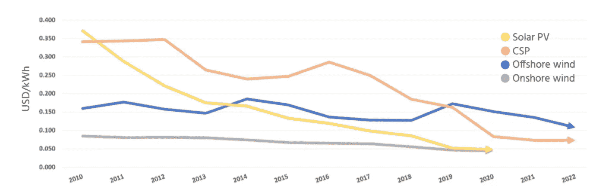

# 区块链技术推动可再生能源市场

> 原文：<https://medium.datadriveninvestor.com/renewable-energy-market-being-boosted-by-blockchain-technology-33362f025320?source=collection_archive---------23----------------------->

Source: International Renewable Energy Association

由于区块链技术能够跟踪绿色可持续能源的生产，因此它有望帮助促进可再生能源的更大利用。

这将被证明是至关重要的，无论是对于当地的对等电力交易，还是允许[公司在特定日期前实现碳中和](https://www.vox.com/the-goods/2020/3/5/21155020/companies-carbon-neutral-climate-positive),

亚马逊的目标是到 2040 年实现碳中和，微软到 2030 年，希思罗机场到 2030 年(不包括着陆飞机的排放)。

英国六大电力供应商都有[绿色能源关税](https://www.t3.com/features/best-green-energy-supplier)。

[Vodaphone](https://www.energydigital.com/renewable-energy/vodafone-business-brings-iot-and-blockchain-energy-sector#:~:text=Vodafone%20Business%20has%20partnered%20with,to%20renewable%20and%20distributed%20energy&text=This%20will%20increase%20security%20across,heat%20pumps%20and%20solar%20panels.) 和 Energy Web 的区块链供电平台非常类似于移动电话与可再生能源发电厂的操作方式，每个发电厂都有各自的身份，使电网能够指示每个电力供应商是否需要向电网提供能源，停止生产能源或将电力储存在电池中。

 [## 数字货币、区块链和货币的未来|数据驱动的投资者

### “区块链”、“加密货币”、“令牌化”，以及现在的“央行数字货币”已经成为…

www.datadriveninvestor.com](https://www.datadriveninvestor.com/2020/02/18/digital-currencies-blockchain-and-the-future-of-money/) 

[Equigy](https://equigy.com/) 正在使用电动汽车[汽车电池](https://www.ledgerinsights.com/blockchain-energy-platform-electricity-grid-tennet-swissgrid-terna/)来储存多余的能量，使用区块链技术帮助“平滑”电网的能源供应。目的是鼓励投资更多的可再生能源，从而保护环境。

总部设在苏格兰北部奥克尼的电子公司历史上从多风的海岸生产的电力比它消耗的多。通过使用区块链技术，多余的能量被跟踪，然后转移到电池中储存，并为电动汽车电池充电。

澳大利亚的 Power Ledger 与珀斯的一家房地产开发商合作，这是 Power Ledger 为西澳大利亚用户推出太阳能交易平台的目标的一部分。

自 2009 年底以来，太阳能发电的成本下降了约 80 %( T2 ),而风力涡轮机的价格下降了 40 %( T4)。

区块链驱动的平台有助于能源生产商和用户采用可再生能源跟踪供应，从而保护环境。

如果你想每周收到数字字节，请发电子邮件:[Jonny.Fry@Teamblockchain.net](mailto:Jonny.Fry@Teamblockchain.net)

**#可再生能源#电力#能源#环境#气候变化#环境#太阳能#风力涡轮机#透明度#信任**