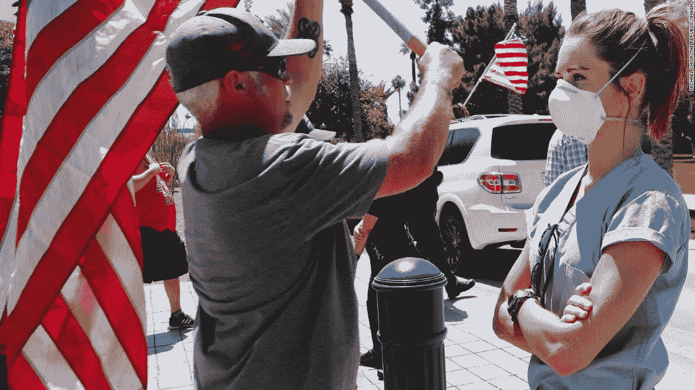
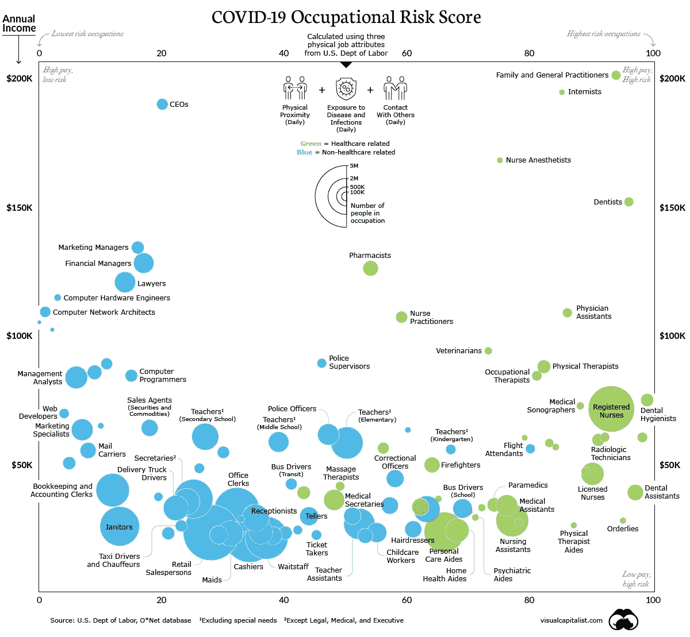
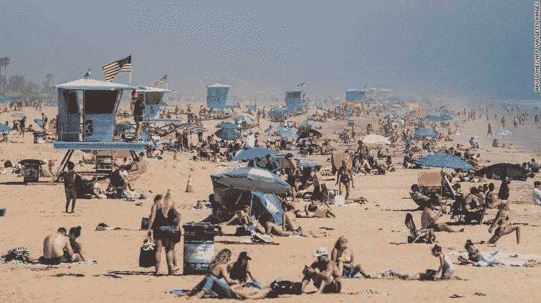

# 新冠肺炎:只有偏执狂才能生存

> 原文：<https://medium.datadriveninvestor.com/reopening-economy-only-the-paranoid-survive-e3ca50840143?source=collection_archive---------12----------------------->

## 从新冠肺炎吸取的教训第三部分。

高度封锁有助于减缓新冠肺炎的传播。但这也让全球经济付出了巨大代价。与经济衰退不同，许多不重要的企业已经关闭，没有重新开业的明确时间表。自 3 月中旬以来，美国首次申请失业救济人数已超过 2600 万。虽然我们看到了一些希望的曙光，但我们还没有脱离险境。企业急于重新开业，但我们也担心与此相关的健康风险。困境是，如果我们重新开放太快，我们可能会引发第二波冠状病毒，这可能会更糟。

为了让每个人对重新开放经济感到安全，我们真正需要的是一种或多种安全且可广泛获得的疫苗。全世界的科学家都在疯狂地寻找对抗冠状病毒的方法。这种情况至少在未来九个月内不会发生。关于美国经济应该保持封闭多久以遏制新冠肺炎的辩论正在激烈进行。一方面，我们有失去工作的商业团体和工人；另一方面，我们有感染新冠肺炎病毒风险最高的医护人员。

Source: CNN

对于许多工作在抗击冠状病毒以拯救生命的第一线的医护人员来说，他们可能会呼应下面一位反对过早重新开放的反抗议者表达的同样情绪。

> “他们只是认为这是一场混战，我冒着生命危险以每小时 16.50 美元的价格参加，”凯利·勒佩奇说，她是一名急诊室技术人员，几周后将从护士学校毕业。莱佩奇说:“*他们不会把尸体带到拖车上。"*他们没有照顾这些不能触摸家人手的人。他们不在那里。他们看不到我们所看到的。很辛苦。我真的希望他们明白我们正在尽最大努力保护美国的安全。"**

 [## 医疗工作者反击州众议院抗议重新开放经济 ABC6

### 罗得岛州普罗维登斯—“别闹了”已经成为州长雷蒙多鼓励人们遵守……

www.abc6.com](https://www.abc6.com/healthcare-workers-silently-counter-protest-those-against-excessive-quarantine-measures/pic/301246/) 

## 医护人员感染新冠肺炎病毒的风险很高

自从冠状病毒爆发以来，不到三分之一的美国劳动力可以在家工作。与其他美国人一样，他们要么因为封锁而失去工作，要么受雇于暴露于病毒风险更高的“基本服务”。下面来自 Visualcapitalist 的信息图使用来自[职业信息网络](https://www.onetcenter.org/overview.html)的数据显示了不同职业的新冠肺炎风险。每种职业的得分都基于与他人的接触、与他人的身体接近以及暴露在危险环境中。

Credit: Visualcapitalist.com

正如我们从上面的信息图中看到的，医疗保健工作者往往有更高的风险，这与现实世界的数据支持是一致的。美国医学会杂志(JAMA)发表的一项新研究发现，在 138 名患者中，57 人(41.3%)被推定为在中南医院(位于中国武汉)感染，其中包括 17 名因其他原因已经住院的患者(12.3%)和 *40 名医护人员(29%)* 。[下载报告](https://jamanetwork.com/journals/jama/fullarticle/2761044)。

除了更高的风险，只要想想不得不戴着口罩，整天卡在护具里，长时间工作，就可以理解他们对经济过早重开的担忧。

## 在不牺牲公众健康的情况下保护经济

说改善公共卫生的唯一方法是关闭经济，改善经济的唯一方法是牺牲公共卫生，这是不对的。除了新加波和台湾之外，许多国家都在追赶新冠肺炎。新加坡和台湾已经向世界证明，他们可以在不牺牲公众健康的情况下改善经济。他们是怎么做到的？他们戴着口罩，虔诚地练习社交距离。

## 保护自己，也保护别人

政策制定者一直在强调成功重开的大规模“测试和追踪”的必要性，以及在短期内大规模实施这些做法的难度。他们忽略了公众是否有足够的个人防护装备来保护自己免受新冠肺炎病毒的侵害。

口罩可能“在减缓香港、新加坡和台湾等亚洲国家的疾病传播方面发挥了积极作用”。这是遏制新冠肺炎疫情的一个重要组成部分，也是一个负责任的公民和支持卫生保健工作者的信号。甚至疾病控制和预防中心也改变了主意，现在推荐使用布面覆盖物来帮助减缓新冠肺炎的传播。戴口罩不仅是为了保护人们不被感染，也是为了防止新冠肺炎病毒感染者传染给他人。

## 保持距离以保持安全

在我们找到疫苗之前，我们仍然需要在可预见的未来继续保持个体之间的距离。需要亲自出席的企业应该为员工提供如何在工作中保持社交距离的明确指导方针。此外，应要求雇主向所有亲自来上班的雇员提供防护装备，例如，每个雇员每天两个面罩。

Social distancing inside a restaurant in Singapore. Source: The Straits Times

对于餐馆等企业来说，如果它们重新开业，它们将不得不遵循同样的社交距离准则，不仅对员工如此，对顾客也是如此。餐馆将不得不减少他们的容量，以满足社会距离的要求，以保护食客。这样一来，做生意的成本会更高。即使顾客回来了，许多公司也可能无法承受长期亏损经营。

## 只有偏执狂才能生存

像香港、新加坡和台湾这些地方的人口密度比美国高得多。然而，他们已经证明，他们能够在保护人民的同时保护经济。除了戴口罩和练习社交距离，他们还禁止大规模人群聚集。他们关闭了酒吧、卡拉 ok 厅、电影院和健身房等娱乐场所。

Huntington Beach, Orange County, California. Source: CNN

鉴于新冠肺炎疫情依然严峻，一些城市重新向公众开放部分海滩的情况尤其令人担忧。见上图。人们似乎并不特别关心在拥挤的大环境中新冠肺炎的危险。

为什么亚洲人和美国人在新冠肺炎问题上表现如此不同？亚洲人对新冠肺炎有妄想症。他们对非典疫情仍然记忆犹新。因此，他们更加警觉。这是我们美国需要的。我们需要害怕新冠肺炎，而不是掉以轻心。

你也可以在[推特](https://twitter.com/desmondyuen1)上找到我。

 [## 技术如何帮助对抗冠状病毒-人工智能、大数据…

### 从新冠肺炎吸取的教训第一部分。

medium.com](https://medium.com/swlh/how-technology-is-helping-in-the-fight-against-coronavirus-1e14eb90ec33)  [## 为什么冠状病毒会改变经济和我们的生活方式？

### 从新冠肺炎吸取的教训第二部分。

medium.com](https://medium.com/datadriveninvestor/social-and-economic-impacts-of-coronavirus-30ef5b97c104)