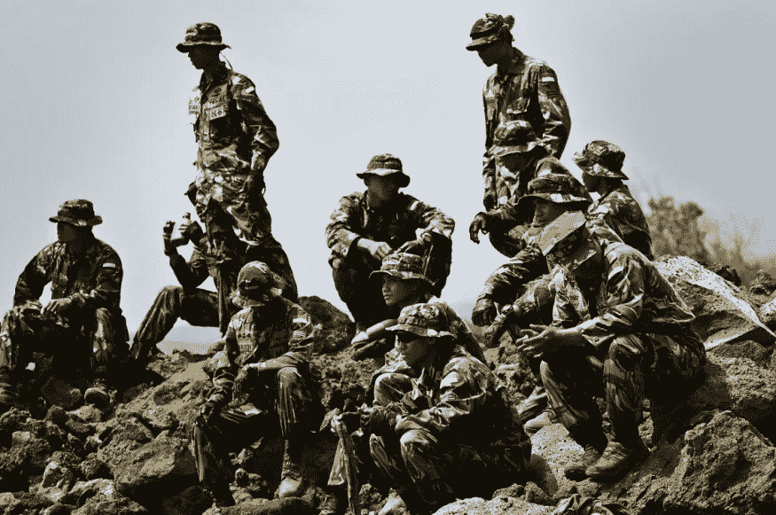

# Raffaella Aghemo 关于国防中负责任地使用人工智能的报告(一)

> 原文：<https://medium.datadriveninvestor.com/report-on-the-responsible-use-of-artificial-intelligence-in-defence-i-ab271f3115c5?source=collection_archive---------37----------------------->

Department of Defense photo by U.S. Air Force Tech. Sgt. Michael R. Holzworth/Released

人工智能领域的一个重要里程碑文件是这份关于其在国防领域应用的文件，题为“ ***”负责任地军事使用人工智能——欧盟能否引领最佳实践的发展？*** “作为‘治理人工智能对国际和平与安全的机遇和风险’研究项目的一部分而开发，它试图在 SIPRI(斯德哥尔摩国际和平研究所)于 9 月 8 日至 9 日举行的在线研讨会之后，就人工智能在军事领域的治理这一主题做出贡献，并于 11 月发表。在芬兰 2019 年担任欧洲联盟理事会主席期间，一些成员国呼吁在国家一级加强监管，并呼吁各国在国防领域加强合作。在这一点上，问题出现了，我们是否可以真正考虑在军事上道德，负责任和合法地使用人工智能。这份报告得出三个结论，归纳如下。

**首先**，欧盟及其成员国无疑将从负责任的军事使用人工智能的原则和标准的发展中获得政治、战略和经济上的好处，尽管这将是一个涉及灵活性、政治专业知识以及各种欧盟行动者(机构和成员国)的敏感性和意愿的艰难过程。从政治角度来看，这将允许他们在人工智能的军事用途及其治理的全球讨论中占据一席之地，并有效地捍卫与他们共同的价值观和利益相一致的愿景。从战略角度来看，这将有助于他们在部署军事技术的意愿和方式方面保持一定的自主权。从经济角度来看，它将有利于人工智能领域的作战能力和欧洲军事工业基地的发展。

其次，人工智能在军事上的应用已经为欧洲的发展奠定了基础。欧洲联盟防务局和欧洲议会以及几个欧盟成员国开展的工作表明，对这一主题的政治兴趣越来越大。这项工作由欧洲可信人工智能委员会发起，为参与关于负责任地军事使用人工智能的对话提供了有用和坚实的基础。在这方面，报告提出了一些具体建议，供欧盟机构和成员国以公开、有条不紊和合作的方式考虑发展一个关于负责任地在军事上使用人工智能的单一视角。具体而言，报告建议将重点放在与以下方面有关的三场专家讨论上:

-法律合规，侧重于法律审查和大赦国际在解释和适用国际法方面提出的挑战；

-伦理学，侧重于为人工智能以人为中心的军事使用制定共同原则；和

-人工智能安全，侧重于人工智能系统的透明度、可解释性和可靠性的标准。

**第三**，欧盟及其成员国有几种方法来进行这些专家讨论，讨论如何在总体上负责任地军事使用人工智能。EDA 已经为成员国国防部长之间的高级别政策讨论以及各国军事人工智能专家之间的技术讨论提供了一个论坛。EDA 在 IA 能力开发方面的工作可以扩展到明确包括法律合规性和道德问题。欧盟理事会筹备机构，如欧盟理事会国际公法工作组、欧盟理事会不扩散工作组、欧盟理事会全球裁军和军备控制工作组和欧盟理事会军事委员会工作组，也提供了论坛，各国可以在论坛上分享观点、协调观点，并可能就遵守国际法和道德的原则和最佳做法达成共识。

最后，欧盟委员会可以利用欧洲防务基金(EDF)资助探索在技术层面满足人工智能安全标准的项目。

从这一介绍性框架中，出现了四项主要建议:

-以更加开放和透明的方式，在国家和欧洲内部各级参与有关人工智能给军方带来的机遇和风险的讨论。例如，编制公开的国家报告和战略文件或其关键内容摘要。

-建立一个由各国专家组成的特设专家组，讨论如何将人工智能高级别专家组的建议应用于军事领域，目的是在欧洲一级提出在国防中负责任地开发和使用人工智能的原则和准则。

-与学术界和工业界接触，并利用欧洲人工智能联盟，就与军事人工智能的开发、使用和控制有关的问题与整个社会、商业部门和民间社会接触。

-资助关于“道德设计”或端到端方法的研究项目，这将使道德问题在整个技术周期中得到考虑；军事人工智能系统的透明性、可解释性和可追溯性:军用人工智能系统测试和评估框架系统的发展:根据基本伦理原则，在欧盟层面设计汇集数据的方法。

还建议就以下问题展开更深入的讨论和特别会议:

-在人工智能的军事用途方面解释和适用国际人道主义法(IHL)标准的问题，这可能包括在 COJUR 范围内对武器、作战手段和方法进行法律审查。

-欧洲武装部队通过欧盟军事行动工作组在军事上使用人工智能的可能的道德原则和安全准则。

*   欧盟关于人的控制的立场，在关于自主和致命武器系统(法律)的辩论中，在日内瓦和其他关于军备控制的论坛上，而人工智能的军事用途可在 CODUN/CONOP 内讨论。

接下来是第二部分。

版权所有

***拉斐尔·阿格莫，律师***

**访问专家视图—** [**订阅 DDI 英特尔**](https://datadriveninvestor.com/ddi-intel)