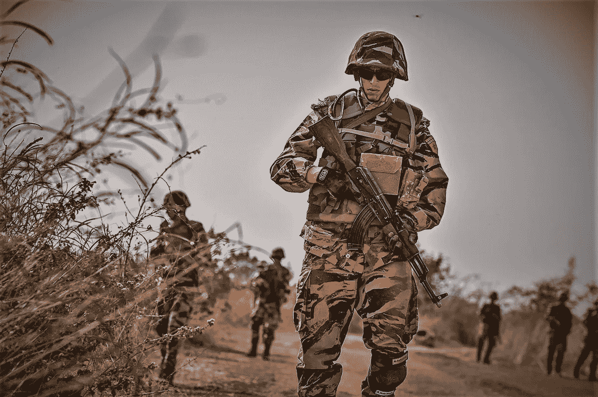

# Raffaella Aghemo 关于国防中负责任地使用人工智能的报告(三)

> 原文：<https://medium.datadriveninvestor.com/report-on-the-responsible-use-of-artificial-intelligence-in-defence-iii-6712d8a03a9?source=collection_archive---------30----------------------->

[USAFRICOM](https://www.flickr.com/people/44606090@N06) from Stuttgart, Germany

这是关于人工智能和防御的长篇报告的第三部分，也是最后一部分

欧盟委员会在 2020 年发布的题为“论人工智能——欧洲实现卓越和信任的方法”的白皮书，为欧盟在三个领域负责任地军事使用人工智能的潜在工作提供了基础:

目标以及与该领域的研究机构、实验室和公司的协调；

原则包括技术应该合法、合乎道德和以人为本，人们应该能够控制它而不受它的伤害，并且在社会环境中的安全性方面是强有力的；

由于该技术在这一精确领域具有双重用途，因此参考了 HLEG 关于“高风险”人工智能应用的技术建议的适用性。

在这一领域的合法遵守意味着遵守国际条例，特别是人道主义领域的条例。法国已经表示遵守国际法是其 AI 军事战略的关键要素。但这还不够，必须使这一要素符合共同的法律法规，培训专业人员，并进行调查，以验证规则的正确适用性。

《日内瓦四公约 1977 年附加议定书》第三十六条规定了对新武器、作战手段和方法进行法律审查的义务。根据第 36 条进行法律审查的重要性得到了欧盟成员国的广泛认可，并随着技术的不断发展而日益受到重视。这是确保各国根据其国际义务开展敌对行动的重要工具。然而，法医检查是国家程序，不受国际监督。对于欧盟成员国应该如何进行司法审查，目前还没有既定的规则。事实上，众所周知，大多数国家都没有永久性的法定审计机制。

欧盟成员国之间在法证审查方面的信息共享与合作——无论是总体上还是与实施信息技术支持的军事能力相关的信息共享与合作——在三个方面都是有用的:

这将向世界表明，欧盟成员国致力于法律，并决心确保其国家审查进程是一个适当的，因此是合法的机制，以确保负责任的发展和军事使用人工智能，至少从法律角度来看是如此；

可以帮助各国相互学习，并协助希望建立或加强法律审查机制的欧盟成员国。目前，根据斯德哥尔摩国际和平研究所的调查，只有 11 个欧盟成员国似乎已将法律审查程序正规化，只有 5 个成员国公布了详细的公开信息。

让欧盟成员国有机会分享关于过去或正在进行的审查进程的敏感信息，并获得关于解释和适用国际法治的讨论的透明信息。随着时间的推移，这可能有助于那些参与法律审查的人积累专业知识。

伦理可接受性:民事和军事领域的一个共同前提是这样一个原则，即人类主体是负责任地使用人工智能的基础和必要条件，人工智能必须仍然是人类做出决策的工具，但不能剥夺人类这样做的义务和能力！但是，尽管人们完全同意在武器的整个寿命周期中必须保持人的控制，但在实践中如何行使人的能动性的问题仍然没有解决。创建欧洲内部的论坛可以激发讨论，并导致共同的设计。

安全性:这是欧盟委员会 2020 年人工智能白皮书已经考虑到的一个因素，建立了一些原则，如“人类机构和监督，技术鲁棒性和安全性，隐私和数据治理，透明度，多样性和非歧视，公平，社会和环境福祉，以及问责制”，作为设计的基础。

人工智能安全对于军事部门来说，与民用部门一样重要，甚至更重要。

军事环境顾名思义是对抗性的:一个聪明的敌人会试图通过攻击或利用其弱点来击败系统。因此，军事系统通常必须满足高标准的安全和安保要求，即使是不直接用于作战的应用(如后勤)；人工智能的最新技术发展提出了安全挑战，这在“生命关键应用”(其使用可能危及人类生命或危及安全的应用)中尤其成问题，因为它们可能导致无意或非法使用武力，从而破坏军事用户以合法和道德方式行事的能力。例如，在情报、监视和侦察(ISR)系统中，算法偏差可能导致军事指挥官选择错误的目标类型，或者不成比例地专注于某些类型的目标。黑盒问题是深度学习系统的特征，它使用户难以理解和预测系统的行为，并且在出现问题时难以调查。总之，无论是从操作、法律还是伦理的角度来看，军事社区在人工智能安全的发展中都有既得利益。

主要调查结果和建议

在本分析的开头，我们已经看到了欧盟及其成员国在创建负责任地在军事上使用人工智能的共同愿景方面的毋庸置疑的优势。几个进程应该并行进行，EDA 论坛，在 COJUR、CONOP、CODUN 和 EUMCWG 等各种机构之间进行讨论，同样重要的是，欧洲议会开设了一个论坛，就军队中使用人工智能提出的基本伦理问题进行公开民主辩论。

欧盟成员国，为了促进对负责任的军事使用人工智能的公开思考，可以效仿美国的榜样，在国家和欧洲内部关于人工智能对军事的机遇和风险的讨论中更加开放和透明。这可能需要:

起草公开发表的国家报告和战略文件或其关键内容摘要。

响应 2019 年芬兰担任欧盟理事会主席期间向成员国发出的邀请，起草一份关于国防领域数字化和人工智能的概念文件。该文件不仅可以解决概念文件中概述的问题，还可以解决会员国关于在使用人工智能使能的军事能力时适用国际人道主义法、道德和安全标准的观点。

通过国防部长指导委员会，使国防管理局能够公布内部商定的关于信息技术的文件和决议，作为提高对国防管理局负责任地使用信息技术工作的认识的一种手段。

授权欧洲防务局创建一个由各国专家组成的特设专家组，讨论如何将人工智能 HLEG 的建议应用于军事领域，目的是提出欧洲在国防领域开发和负责任地使用人工智能的原则和指导方针。

版权所有

***拉斐尔·阿格莫，律师***

**访问专家视图—** [**订阅 DDI 英特尔**](https://datadriveninvestor.com/ddi-intel)