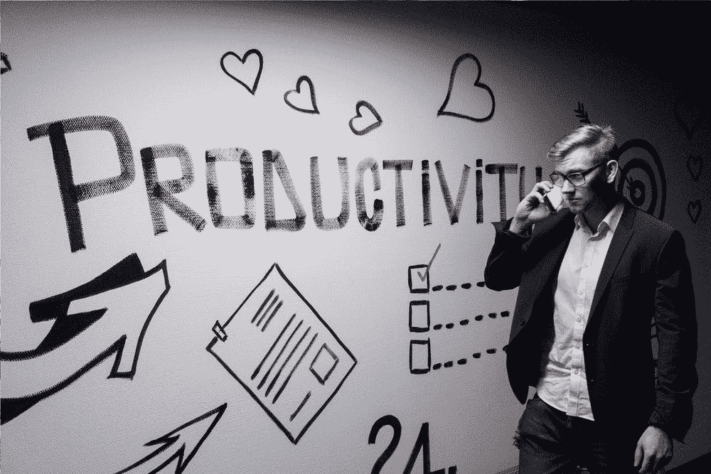

# 重新规划你的思维，变得更有效率

> 原文：<https://medium.datadriveninvestor.com/reprogram-your-mind-to-become-more-productive-5839589c9072?source=collection_archive---------8----------------------->

Andreas Klassen on Unsplash

你有没有过这样的感觉:你有一百万件事情想要完成，但是你甚至不能强迫自己去开始一件？或者你觉得你的思维定势是错误的，你希望你可以按下重启键？从感觉失败到仅仅是失败——这完全取决于你的心态。解决了这个问题，你就解决了一半的问题。

现在，神经语言编程是一种可以帮助将消极行为转变为积极行为的方法。这是一种心理学方法，最初由理查德·班德勒和约翰·葛瑞德提出，目的是帮助成功人士实现个人发展目标。我从未听说过这种类型的心理治疗，但无意中发现了托尼·罗宾斯(Tony Robbins)关于如何将弱点转化为力量并改变消极行为的播客——我很快就成为了一名信徒。

在这篇文章中，我将打破这一概念的操作方法。准备好做笔记——练习、冲洗、重复。

你有没有经历过忘记东西的感觉，无论是有人让你去另一个房间为他们取回东西，还是你自己需要的东西？当你到了那个房间，你的记忆会失效，你不记得你应该得到什么？这是因为那段记忆在你的大脑中已经被分割了，当你进入房间时，你几乎找不到那段记忆。

我为什么要告诉你这些？是的，这很重要，而且与故事相关——这种精神状态被称为“空白”，这是你要努力寻找的那种状态。例如，如果你能以那种方式忘记你的拖延症，那么就没有什么能阻止你继续工作。想象一下想要拖延，但是忘记去做？来自一个世界级的拖延者，最后一分钟做作业/论文的人，这是不可想象的！我，忘记拖延？这就像荷马忘记了他喜欢甜甜圈，或者汤姆忘记了他想抓住杰瑞，就像我的猫忘记了自己是个讨厌鬼。不可想象！但如果不是呢？你可以用这些步骤来改掉任何你想改掉的坏习惯——把它扔进黑洞，用好的东西代替它。

Volodymyr Hryshchenko on Unsplash

步骤:

1)体验负面的感觉/行为

不管那是一种失败的感觉，还是像我一样的拖延症；选择你想改掉的坏习惯，让它包围你几秒钟，(不要让自己陷入消极的遗忘，这只是几秒钟)。你甚至可以试着把相关的记忆带到你脑海的最前面，例如拖延症，我会想象压力和即将到来的厄运的感觉，但仍然不想工作。想起那段记忆，想象我的笔记本电脑打开着，书散落得到处都是，我的心支离破碎地看着一切，然后拿起手机看 YouTube，而不是工作。或者，如果你的消极行为感觉像是失败，那么也许你会想起上一次你有这种感觉的时候，让记忆包围着你，有人告诉你没有它们你将一事无成，或者小时候你做什么都不对的感觉。让消极的记忆滑过你的大脑几秒钟。

2)打断你的负面感觉

你想要停止你想要改变的坏的或不机智的行为。当完成这一步时，你可能会觉得有点傻，但这是一个重要的步骤，如果你坚持到底，你只会怀疑它，并说它不起作用。你要中断这种消极感觉的方法是大喊“停止”，跳起来，深呼吸，摆脱这种消极感觉。这实际上是把你自己从你的感觉中震惊出来，即使你心里知道它即将到来，因为你正在思考下一步。不要想太多，只管去做。

3)用好的行为取代坏的行为

在这一步，你会想到你的不良行为的反面，你想灌输的更机智的行为，如果你是一个拖延者，那么是富有成效的感觉，或者如果你的消极心态是你觉得自己是一个失败者，那么是成功的感觉。如果你曾经有过一段记忆，即使是在孩童时期，那也是与你的不良行为相反的好事情，现在是时候掸去灰尘，让它充实你的头脑。也许是你获得的奖牌，让你有了重要和成功的感觉。也许这一个小时你很有效率，感觉很棒，但这并没有持续下去；想想这种感觉有多棒。如果你从未感受过这种积极的情绪，也许想象一下其他人会有什么感觉，如果你观察到你的朋友非常有组织性、一丝不苟和富有成效，想想她和她的感受。当你在思考这种积极的情绪时，你应该握紧拳头，说‘是！’微笑，皱起你的眼睛；确保它充满你的整个身体，就像你平时经历一些积极的事情一样。

4)庆祝！

你想做一些身体上的事情，以某种方式奖励自己，即使这不是你通常对胜利的反应，因为你正在努力训练你的大脑。跳一支胜利舞(我跳了)，表扬自己，吃块巧克力。这会教会你的神经系统再次这样做。它还将更积极的行为与积极的经历联系起来，如奖励，调节你的思维以寻求再次做积极的行为。

5)重复

你需要连续重复这个过程至少 10 次，你可能不需要这样做，因为几次之后，思考负面行为可能会变得更加困难，但这毕竟是一个过程，所以试着达到 10 次。此外，重复至少 5-6 天，这确保有一个长期的治疗，它不是一个“做和冲刺”类型的过程，为了长期的结果，你需要长期的行动。

就是这样！如果你认为你不想尝试，因为它可能不工作，我的问题是，**但如果它做了**？此外，我在一天之内写了这篇文章，这确实说明了一些问题，因为我自己对托尼·罗宾斯的指导进行了小小的实验，我已经能够更有效地完成我的待办事项列表:我变得更加坚持学习一种语言，我每天花大约 15-30 分钟来学习；阅读一本书，我要么在公共交通工具上，要么在厕所，要么在休息时间阅读，以及学习我报名参加的在线课程。这些都是我日常工作的一部分。对我来说，神经语言程序似乎是成功的。谢谢托尼·罗宾斯！

为了得到一个如何为你想要的生活制定计划的指南，读一读这个小金块吧！

 [## 成功背后的科学

### 你想要的生活是什么样的，让我们用托尼·罗宾斯的方式为它制定一个计划吧！

medium.com](https://medium.com/@xjane_doex/the-science-behind-success-135bf2d1ec3f)