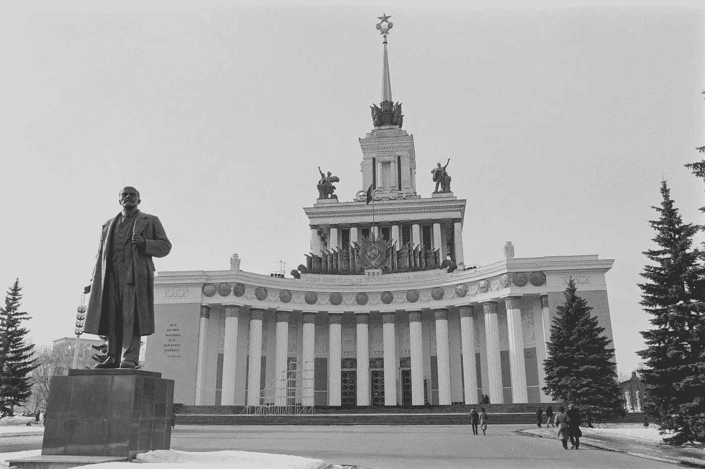

# 共和党对自由市场的攻击

> 原文：<https://medium.datadriveninvestor.com/republican-assault-on-free-markets-91a9c6222dbd?source=collection_archive---------11----------------------->

The Soviet Ministry of Economic Central Control Photo by [Steve Harvey](https://unsplash.com/@trommelkopf?utm_source=unsplash&utm_medium=referral&utm_content=creditCopyText) on [Unsplash](https://unsplash.com/@trommelkopf?utm_source=unsplash&utm_medium=referral&utm_content=creditCopyText)

7 万亿美元的美联储救助是不够的:共和党支持的法案希望财政部注入股本以拯救房地产巨头

每一个共和党人的话题似乎都是从指责任何通过政府安全网支持普通公民的企图都类似于“社会主义”开始的，同时他们继续使用纳税人的钱来支持资本市场的国有化，这使他们的捐赠者更加富有。2009 年，茶党因 1 万亿美元的 TARP 计划而骚动，该计划通过接管抵押贷款债券(CMBS)市场来拯救银行。现在，美联储已经将超过 7 万亿美元的美国债务市场国有化，但这仍然不足以保护共和党的特殊利益。

尽管美联储采取非常措施支持整个债务市场，商业房地产再次徘徊在边缘，因此[共和党提出的法案](https://www.natlawreview.com/article/covid-19-update-draft-legislation-sparks-hope-new-commercial-real-estate-preferred)打算通过使用纳税人的钱向业主的公司注入股权来拯救房地产巨头。为什么是股权？因为自从上一次金融崩溃(由 CMBS 造成)以来，许多商业房地产公司通过发行创纪录数量的债务(CMBS)从其房地产资产中提取了数十亿美元的现金，而这些证券的条款不允许他们承担额外的债务。解决方案——纳税人出资注资。

 [## 对有商业头脑的投资者有用的行为经济学概念|数据驱动的投资者

### 在美国企业界，高斯统计，对我们周围世界的确定性解释，以及理性…

www.datadriveninvestor.com](https://www.datadriveninvestor.com/2020/07/09/helpful-behavioral-economics-concepts-for-the-business-minded/) 

我不反对公司用自己的资产贷款——但当借款对公司、高管、银行和贷方变得“无风险”时，这个体系就崩溃了。美联储已经消除了持有不良债券的负面后果，并打开了继续书写无尽坏账的闸门。然而，对于许多深陷全球疫情之痛的企业来说，仍然存在不利的业务后果。那些即使在好年景下也只能勉强维持合理生活的夫妻店小企业获得的 PPP 贷款限制性很强，效力有限。大型企业收到了国有化公共债务市场的礼物，这引发了资产通胀和几乎无限制的资本准入——但这份礼物只给了最大和最复杂的公司。那么，为什么商业房地产仍然需要美国纳税人的特别施舍才能变得完整。他们的悲伤故事是什么？的确，他们的投资在过去 4 个月里遭受了可怕的损失，越来越少的企业能够支付租金，即使房地产价格和租金居高不下，在一些地区甚至还在上涨。在利率处于创纪录低点、债务市场国有化的情况下，他们难道不应该通过债务市场持有自己的资产吗？如果他们没有在过去十年里从其持有的房地产中提取大量现金，并耗尽大部分股权，情况就会是这样。在过去 5 年中，以 CMBS 形式出现的净“现金流出”约为 500 亿美元。但如果纳税人不通过财政部向现有的房地产公司注资，它们将失去许多这些资产的所有权，许多公司将破产。那么资产会发生什么变化？嗯，其他人或公司购买它们，通常以折扣价——有点像市场……这是共和党人过去津津乐道的。

在我们一生中最严重的公共卫生危机中，我们的政府需要采取许多非常措施。我并不是不切实际地认为，政府应该袖手旁观，让自由市场无情地让整个经济崩溃，让纯粹的市场力量在未来十年解决这个问题。然而，该法案甚至没有接近可疑的道德风险的“底线”，而是首先确保富人和有资格的人保持这种方式，而不会对糟糕的投资决策产生任何不利后果。真实市场刺激复兴。它们带来新的理念、更聪明的投资者、淘汰现任者、对资产进行重新定价，并创造向上流动的机会这是市场经济理应提供的向上流动。像这样的立法显示了真正的议程，这与维护市场或民主无关，而与维护今天拥有财富的人手中的财富有关，并利用国家悲剧将财富更多地集中到这些人手中——即使这些人做出了糟糕的投资决定。同时告诉我们其他人要自力更生。

有关 CMBS 套现的详情，请点击此链接:[https://www . market watch . com/story/the-open-secret-in-commercial-real-estate-is-the-owners-regular-take-cash-out-of-properties-heres-a-look-how-much-2020-07-17](https://www.marketwatch.com/story/the-open-secret-in-commercial-real-estate-is-that-owners-regularly-take-cash-out-of-properties-heres-a-look-at-how-much-2020-07-17)

**访问专家视图—** [**订阅 DDI 英特尔**](https://datadriveninvestor.com/ddi-intel)