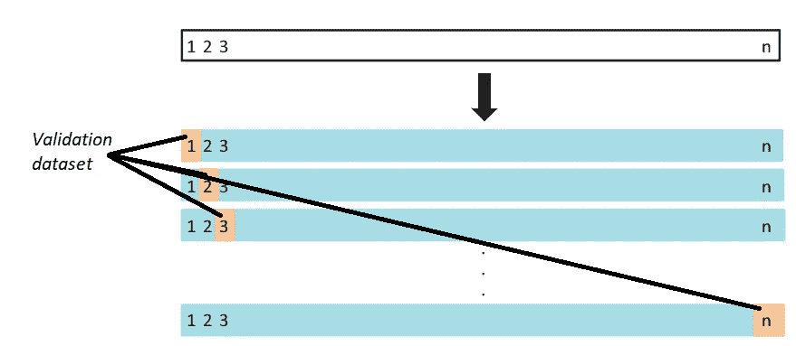
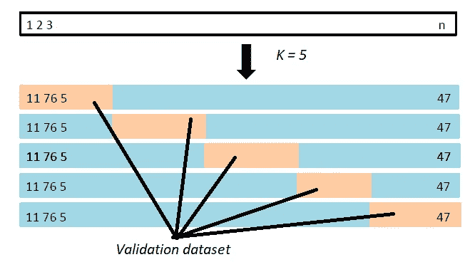
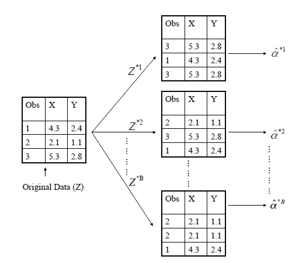

# 重采样方法-小数据集的解决方案

> 原文：<https://medium.datadriveninvestor.com/resampling-methods-the-solution-to-small-datasets-5b9e5c390eb5?source=collection_archive---------3----------------------->

## 介绍 4 种重采样方法——验证集方法、留一交叉验证(LOOCV)、K 折交叉验证和自举

Photo by [Jaden Barton](https://unsplash.com/@woumz?utm_source=medium&utm_medium=referral) on [Unsplash](https://unsplash.com?utm_source=medium&utm_medium=referral)

在数据科学和人工智能的世界中，数据首先被收集起来，并相应地拟合到机器学习算法中，以进行预测或分析有价值的见解。我们放入的数据被称为*训练数据*，从逻辑上讲，我们放入机器学习算法的*训练数据*越多，它的表现就越好。等等，真的这么简单吗？

答案是否定的！通常，我们会需要另一组数据，称为*测试数据*，其目的是帮助我们测试我们的机器学习模型。这个*测试数据*在训练阶段我们的模型是看不到的，一旦我们的模型被允许在商业环境中使用，它可以帮助我们评估它们的性能。

嗯，另一个常见的问题出现了，我们从哪里收集这么多数据？有时，数据科学家收集大量数据来获得*训练*和*测试*数据集，在计算和金钱上都是昂贵的。本文将讨论一种叫做**重采样**的技术，它将利用*训练数据集*本身。

# 验证集方法

第一种方法在概念上是最简单和最容易实现的。它包括将*训练数据*随机分成两个数据子集，*训练*和*确认/保持*集。*训练集*将用于训练机器学习算法，而*验证/保持集*用于测量算法的性能。常见的分流比是 70:30、80:20 甚至 90:10。

Image from An Introduction to Statistical Learning with applications in R

尽管实现起来非常简单，但是这种方法有两个潜在的缺点。

1.  测试误差的估计可能变化很大，因为它取决于训练/验证数据集中包含哪些观察值
2.  只有观察值的子集用于训练模型，这可能会导致高估测试误差，因为统计方法在训练较少的数据观察值时往往表现更差

# 遗漏一项交叉验证(LOOCV)

顾名思义，它包括留下一个数据观察值作为验证集，剩下的数据观察值作为训练集。假设我们有 n 个观察值，我们将重复 n 次，这将产生 n 个测试误差。最终的测试误差将是这 n 个测试误差的平均值。

Image from An Introduction to Statistical Learning with applications in R

与验证集方法相比，LOOCV 有两个优势。

1.  LOOCV 不会过高估计测试误差，因为所有的数据观测都用于训练模型
2.  LOOCV 将总是产生相同的测试误差，因为与验证集方法相比，我们不再随机分割数据集，验证集方法的测试误差将取决于我们如何分割数据集

然而，LOOCV 的最大缺点是，它有可能实现起来计算量很大。如果我们有 10000 个数据观测值，那么必须训练 10000 个模型来获得 10000 个不同的测试误差。

 [## 一瞬间学会数据科学！？数据驱动的投资者

### 在我之前的职业生涯中，我是一名训练有素的古典钢琴家。还记得那些声称你可以…

www.datadriveninvestor.com](https://www.datadriveninvestor.com/2020/07/23/learn-data-science-in-a-flash/) 

# k 倍交叉验证

这种方法是 LOOCV 的一种替代方法，它不是将数据集分成 n-1 个观察值和 1 个观察值分别作为训练集和验证集，而是将数据集随机分成 k 个大小相等的组/折叠。第一个折叠用作验证集，而剩余的 k-1 个折叠用作训练集。这个过程重复 k 次，测试误差是这 k 个模型的平均值。常见的 k 值是 5 或 10。

Image from An Introduction to Statistical Learning with applications in R

与前两种方法相比，K 倍交叉验证在以下方面更好:

1.  测试误差的可变性低于验证集方法和 LOOCV，因为验证数据集更大
2.  与验证集方法相比，所有数据点都在训练模型中使用
3.  计算上比 LOOCV 便宜，因为它只需要训练 K 模型

这种方法的一个缺点是，与 LOOCV 相比，它可能导致更高的训练误差，因为现在在每次迭代中使用更小的训练数据集来训练我们的模型。

# 拔靴带

将介绍的最后一种方法是 Bootstrap，这可能是概念上最复杂的方法。Bootstrap 是一种统计技术，用于通过对多个小数据观测值的估计值进行平均来估计统计数据的分布(例如，均值或方差)。这听起来类似于 LOOCV 和 K-Fold 交叉验证，但是自举的实现方式是非常不同的。

我们首先决定要执行的自举样本的数量(Z ),这在技术上类似于在 K 重交叉验证中选择 K 的想法。接下来，我们将决定每个 bootstrap 样本中的样本大小 n，与前三种方法相比，这是全新的。一旦决定，对于每个 bootstrap 样本，我们将从带有替换的数据集中抽取 n 个观察值。这意味着可以在同一个引导样本中多次得出一个特定的观察值。有了这个包含 n 个观察值的 bootstrap 样本，我们将使用它来训练我们的模型。不在该样本中的剩余数据观察(即，袋外观察)将被用作我们的验证集。然后重复 Z 次，测试误差是这 Z 个模型的平均值。

Image from An Introduction to Statistical Learning with applications in R

与其余 3 种重采样方法相比，自举的两个潜在缺点如下:

1.  由于我们是随机选择数据观察值的，因此并非所有的数据观察值都会被选为训练数据集。尽管这可以通过潜在地增加自举样本的数量来纠正
2.  与之前的 3 种重采样方法相比，实现起来在计算上更加复杂

# **总结**

这是否意味着自举是最好的重采样方法？影响这一点的因素有很多，其中一个我觉得很重要的因素是可用的训练数据量。如果训练数据很少，使用 bootstrapping 方法可以为您提供更多样本来训练您的模型，因为可以在每个样本中重复绘制观察值。

如果数据集的大小在开始时是合适的，强烈建议使用 K-Fold 交叉验证方法，因为它将所有数据观察值作为训练数据拟合到模型中，并且在测试误差中具有最低的方差。

对于哪种重采样方法是最好的，肯定没有正确的答案，这也是为什么说哪种机器学习算法是对某些问题进行预测的最佳方法，也没有正确的答案。需要进行大量的探索才能知道哪一个是最好的，有时，最简单的方法提供了最好的解决方案。

## 获得专家视图— [订阅 DDI 英特尔](https://datadriveninvestor.com/ddi-intel)