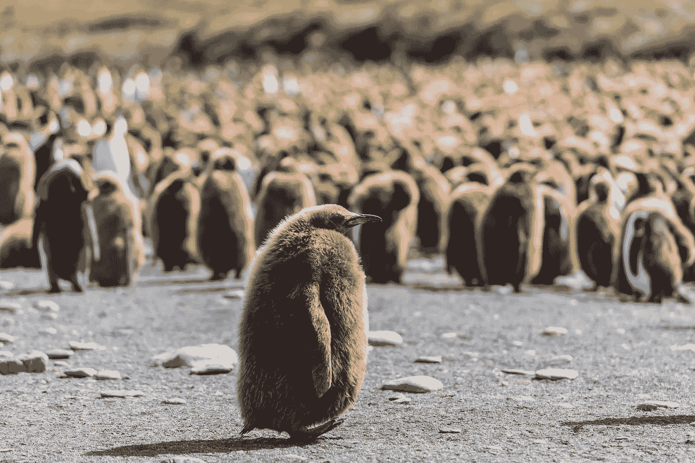
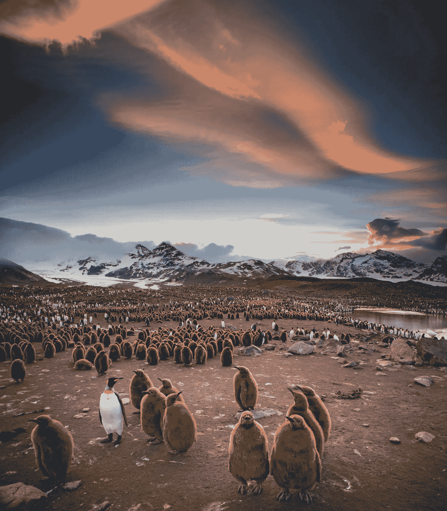

# 研究人员在企鹅粪便周围发现“布谷鸟”

> 原文：<https://medium.datadriveninvestor.com/researchers-get-cuckoo-around-penguins-poop-ed650d07dc45?source=collection_archive---------18----------------------->

帝企鹅释放出如此多的笑气，科学家们得到了…喜剧救济！

King penguin colony in Antarctica — Image: ©Paul Carroll/Unsplash

南极王企鹅不仅以企鹅的第二大物种和熟练的潜水员而闻名，其深度可达 300 米(900 英尺)。现在，这些穿着燕尾服生活在大殖民地的摇摆舞者因为放出如此多的笑气让研究人员发疯而声名鹊起！

我们实际上是怎么知道的？
哥本哈根大学的科学家们有兴趣了解冰川退缩和企鹅活动对温室气体排放的影响。为此，他们决定前往南极洲北部的南乔治亚岛，研究世界上最大的帝企鹅群之一，大约有 15 万对繁殖企鹅。

根据他们在的[研究结果，帝企鹅通过粪便产生极高水平的一氧化二氮(也称为笑气)。](https://www.sciencedirect.com/science/article/pii/S0048969719352477?via%3Dihub)

而这里是*高*——光的故事。在窥探企鹅和它们的粪便(又名便便)几个小时后，野外研究人员开始表现出一些副作用，如感到有点头晕，越来越大…布谷鸟！

考虑到一氧化二氮的效果与牙医诊所使用的镇静笑气非常相似，没什么好惊讶的。一些人还利用这种化学物质的精神作用，诱导欣快、放松和大笑。

所以，吸几个小时足够多的企鹅粪便气味，你就可以了，你正在走向高潮！

King penguin colony at sunset, South Georgia — Image: ©Ian Parker/Unsplash

氮来自企鹅富含磷虾、鱿鱼和鱼的食物。这种物质被释放到它们的粪便中，被土壤细菌转化为温室气体一氧化二氮。考虑到这种气体对环境的污染是二氧化碳的 300 倍，这种气体也没什么好嘲笑的。

幸运的是，帝企鹅的粪便并不足以影响地球的整体能源预算，但它们确实影响了当地的环境。随着这些动物群体的成长和迁移以适应不断变化的气候，这可能会产生后果。正如这项研究指出的:“未来企鹅向新的无冰极地沿海地区的扩张可能会显著增加当地的(温室气体)预算。”

Maddalena Bearzi 研究海洋哺乳动物的生态和保护已超过 25 年。她是海洋保护协会的主席和创始人之一，也是《T2 美丽心灵:类人猿和海豚的平行生活》的作者之一(哈佛大学出版社)。她也是几家出版物的摄影记者和博客作者，包括[国家地理杂志。她的新书是](https://blog.nationalgeographic.org/tag/maddalena-bearzi/)[海豚机密:一位野外生物学家的自白](http://www.amazon.com/Dolphin-Confidential-Confessions-Field-Biologist/dp/0226040151/ref=sr_1_1?s=books&ie=UTF8&qid=1321726449&sr=1-1)(芝加哥大学出版社)。