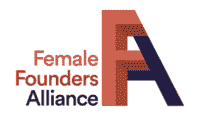

# 支持女性创始人的资源和倡议

> 原文：<https://medium.datadriveninvestor.com/resources-initiatives-supporting-female-founders-7bd3e5e8958d?source=collection_archive---------19----------------------->

[灵感](https://investinginpassion.com/category/inspirations/)[资源](https://investinginpassion.com/category/resources/)[风险投资](https://investinginpassion.com/category/venture-capital/)

女性创业者很难获得资本，也很难获得创业资金。他们得到的全球风投资金不到 10%，在过去几年中略有增加。现在，鉴于新冠肺炎的情况，对他们来说变得更加困难，因为大多数投资者聚集所有力量，专注于支持投资组合公司。很多创始人都会遇到困难，不管他们的性别和所在地如何；全球经济都在放缓。然而，仍然有很多特别支持女性创业者的倡议。他们组织推销会议、办公时间，并且仍然考虑投资机会。令人惊讶的是，困难时期让人们采取相应的行动，并拥抱这种情况，以尽可能保持“正常”的发展周期。以下是女性创始人可能会觉得有帮助的几项举措。它可能会给你想法、指导，鼓励你在参加活动、教练会议、咖啡聊天、天使小组或投球比赛的同时继续工作。社区、交流和支持从未像现在这样重要。

**女性创始人的紧急资助**

掌舵人汇总' [***你的应急资金完全指南***](https://www.thehelm.co/emergency-funding-female-founders/) ': *女性创始人需要知道的一切* *关于:*
1 .全国范围:
-政府资源
-普通基金
-附加信息&资源
2。州/地方相关建议。

所有筹资都将经历几个[事件](https://allraise.org/events)关于:
-*不确定时期的筹资*:是否或如何马上筹资(**企业早期跟踪**)
-*不确定时期的筹资*:是否或如何马上筹资(**企业种子跟踪**)
-*不确定时期的筹资*:是否或如何马上筹资(**消费者种子跟踪**

我们经营着一个全球性的 [**女性创业者俱乐部**](https://www.femalefoundedclub.com/) ，在这里你可以向我们的数据库提交你的商业想法。我们有 700 多名投资者在我们这里注册，我们会尽力为你的创业公司找到最相关的🙂

看看[女性创业者网络年度快速推介大赛](https://www.womenfoundersnetwork.com/about-fast-pitch)**(5 月 1 日至 6 月 30 日开放报名)**

**此外，还有一个很棒的“*资助的，无所畏惧的女性:在低迷时期生存和繁荣”*网络研讨会可用— [观看回放](https://www.crowdcast.io/e/ts_funded_fearless/register)。**

****

**[女性创始人](https://femalefounders.network/)你有很多机会分享你的商业理念，展示你的产品，并与其他创始人和投资者建立联系。**

********

**[womenepowerx](https://womenempowerx.com/pitch-competition)组织了一场女性创始人推介比赛，现在已经开始接受申请。**

****合格:
早期启动:**启动阶段(1-3 年)；创收(无最低限额)；你不需要盈利
**女性所有:**你的公司必须至少有 51%的股份由女性所有
**准备好演示:**你的产品或服务必须可以用一个完整的 MVP 或试播节目来演示
**现场推介:**所有被选中的参与者必须能够在 2 月 29 日星期六在洛杉矶 WEX 现场推介他们的公司**

****

**雅芳举办的女性创业大赛**

********

**查看由 Luminary 组织的 [She4All pitch 竞赛](https://www.eventbrite.com/e/she4all-pitch-competition-tickets-93411850359)的决赛入围者。它支持女性创立的品牌，这些品牌的产品或服务以社区为核心。**

********

**在即将到来的[活动](https://www.womensbusinessleague.com/events)期间举行网络会议和经验分享。**

****

**[Vinetta 项目](https://www.vinettaproject.com/founder)是一个资本平台和交易渠道，旨在支持高成长女性科技创业者。我们寻找具有成熟商业模式的高潜力女性创始人，为她们提供前所未有的接触专有活动、资源、专属网络和来自审查过的投资者的资本的机会。**

****

**iFundWomen 是一个创业融资平台，通过众筹和赠款提供资本，就企业家需要了解的所有主题提供专家业务指导，以及一个激发信心、加速知识和点燃行动的女性企业主网络。**

****

**[FemTech Insinder](https://femtechinsider.com/) 为专注于 FemTech 和女性健康创新的女性创始人带来了大量资源。你可以找到这些活动、Femtech & Healthtech 加速器、投资者名单等等。**

****

**[Women of wear ables](https://medium.com/women-of-wearables)是一家全球可穿戴技术、时尚技术、健康技术、物联网、虚拟现实和增强现实领域的女性组织。**

****

**女性创业者联盟提供为期 6 周的高效辅导，帮助你做好加薪准备。 *Ready Set Raise* 是一个行业不可知的国家创业加速器，由女性和非二进制创始人有意识地创建，并为她们服务。**

****

**[女性创办、女性领导](https://fffl.co/)有助于提高女性创办、女性领导和女性拥有的企业的知名度、数量、收入和资金。**

****

**[妇女领导网络](http://wln.interpublic.com/about/)旨在成为 IPG 性别平等和妇女机会的力量。**

****

**意志常规[全球投球](http://volitionadvisors.com/events/)赛事。**

****

**[女性创始人系列演讲嘉宾](https://vcet.co/event_type/female-founders/)VCET**

****

**[我是 SoGal](https://www.iamsogal.com/) 女性创始人的常规活动和推介比赛。**

****

**专注于女性的天使投资人 Angel 的《T21》。**

****

**[37 天使为女性创业者提供的资源](http://www.37angels.com/female)。**

****

**洛丽塔·陶博的《美国+500 名女性天使投资人》。**