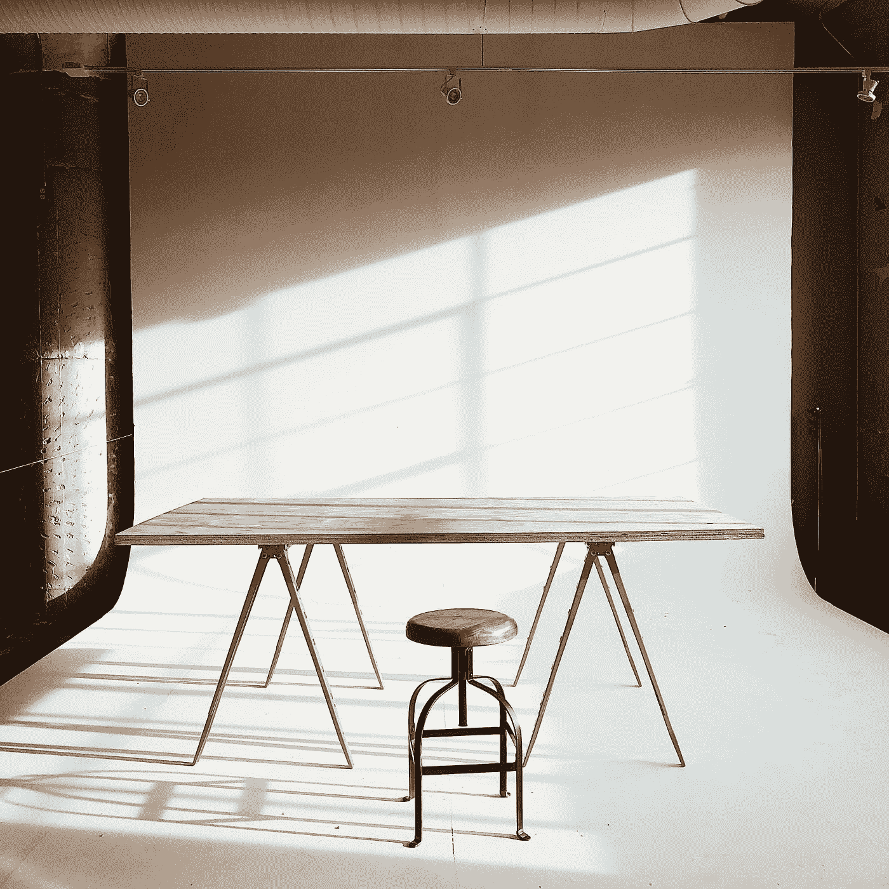

# 在 95 岁时重新启动一个伤痕累累的企业，你能做到吗？

> 原文：<https://medium.datadriveninvestor.com/restarting-a-bruised-business-at-95-could-you-605e18f376d6?source=collection_archive---------17----------------------->

罗斯·布鲁姆金 13 岁时作为一名难民从动荡的俄国来到美国。

Photo by [Toa Heftiba](https://unsplash.com/@heftiba?utm_source=medium&utm_medium=referral) on [Unsplash](https://unsplash.com?utm_source=medium&utm_medium=referral)

她不懂这种语言，在交流上有很大困难。开始以某种方式赚取她的日常面包。

不懂英语，交流困难。从 13 岁开始，她在一家杂货店努力工作了 25 年。将近 40 岁时，她老了；只会说蹩脚的英语，看过甚至不会写。但是她现在已经见过世面了。她知道对那些害怕的人来说这是一个残酷的地方。

她一直挣扎到现在。在杂货店不知疲倦地工作，直到现在，她一生都被非常节俭地对待。成为难民还有其他的问题。

现在她希望拥有自己的东西。她决定用她过去 25-27 年的积蓄开一家家具店。

*她的目标是大规模提供价廉物美的家具。*

当她开了她的第一家店，人们看到这是一家与其他商店相比销售简单、实惠的家具的商店，人们开始来到她的地方。人群开始参观她的商店。

现在任何生意都不容易。她的生意兴隆，这意味着其他的生意都在走下坡路。这些企业与供应商和制造商签订了合同。据说他们可以向州内其他商店供货，也可以向她供货。

 [## 新的健康技术如何让我们活过 100 岁？数据驱动的投资者

### 不久前，我们都在看一台黑色电视，不得不带着天线跑遍整个公寓，以确保…

www.datadriveninvestor.com](https://www.datadriveninvestor.com/2020/08/12/how-new-health-technology-makes-us-live-past-100-years/) 

他们的选择显而易见，内布拉斯加家具公司陷入了大麻烦。

Nebraska Furniture Mart.

# 现在没有补给，怎么会呢？

她从另一个州恢复供货。这意味着更多的运输成本，但她没有其他选择。她做削减成本所需的各种工作，她是会计，她做销售，开账单，确保交货，也做客户支持。

现在，其他商店正在失去顾客。在接下来的 20-30 年里，内布拉斯加家具商场成为了美国最大的家具店。到目前为止，在全国多个城市有多家商店。她甚至赢回了许多供应商。

她现在已经成功了。每个大城市都有多家她的商店。从 40 岁到 90 岁，她全身心地投入到建立这个事业中。90 岁时，她把它传给了她的孙子。她只会去她的商店看看，看看发生了什么。

但残酷的是，在她 95 岁的时候，她的孙子们玩起了法律游戏，把她彻底赶出了这个行业。她一生建立的品牌，在短短的时间里就从她手中消失了，这也是她的孙子们做的。

但她不会很快死去。45 年的历史重演了。她在 95 岁时又开了一家店，与她第一家店完全相反，现在在她的一个孙子名下。

Photo by [Hannah Busing](https://unsplash.com/@hannahbusing?utm_source=medium&utm_medium=referral) on [Unsplash](https://unsplash.com?utm_source=medium&utm_medium=referral)

# 供应？

内布拉斯加州家具商场，“她”自己的公司现在是美国最大的，由于她的孙子的压力，没有一家供应商愿意为她的新店供货。

她进口了家具，并以同样的方式继续。几年后，她回来了。内布拉斯加州家具商场开始失去顾客，在她 100 岁时，她的孙子给了她一份工作。该提议称两家公司将合并到她的名下。直到她 104 岁去世，她都在为她抚养的公司服务，就像她的孩子一样。

很难想象她经历了多少艰辛才到达那里。她的孙子背叛了她，而她又是如何东山再起的，这是一个悲剧故事。

但她是一种激励，这是我从她身上学到的，你也可以；

## 1.年龄只是个他妈的数字。

如果她能在 40 岁开始，95 岁重新开始，你有什么资格在 48 岁，55 岁甚至 60 岁停下来？

## 2.没有人可以信任。

也许你自己的血会背叛你。不要轻易相信人。

## 3.坚持。

我们大多数人都缺乏毅力。而没有的，做大。这就是区别。只要坚持做生活中的事情，每天都在重复和成长。怎么会失败？总有一天它会发光。

## 4.人生就是这么不确定。

你永远不知道明天会发生什么。如果你有一个梦想，今天就开始为之努力，这样你就不会在临死前感到一丝遗憾。

> 1983 年，巴菲特的公司以 6000 万美元收购了内布拉斯加州家具商场 90%的股份。

## 访问专家视图— [订阅 DDI 英特尔](https://datadriveninvestor.com/ddi-intel)