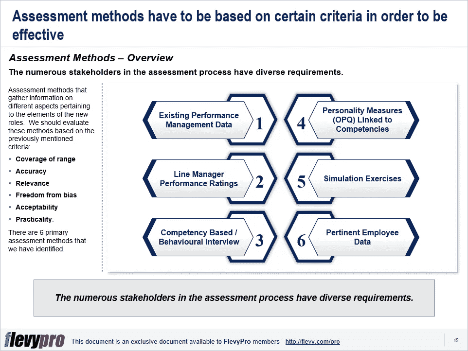

# 重组:重新部署的评估过程和方法

> 原文：<https://medium.datadriveninvestor.com/restructuring-assessment-processes-and-methods-for-redeployment-b35183d4f1ff?source=collection_archive---------19----------------------->

随着时间的推移生存下来的组织不得不随着环境的变化一次又一次地重塑自己。这些[业务转型](https://flevy.com/browse/stream/transformation)几乎总是包括倾向于裁员的成本削减。裁员通常采用两种方法:

1.  **缩编**
2.  **重组**

裁员使这些角色的基本原则保持不变，只有更少的人担任这些角色。鉴于，[重组](https://flevy.com/business-toolkit/restructuring)创造新的角色，以及修改现有的角色，需要新的技能组合或全新的资源来执行它们。

重组提出了一个更具挑战性的任务，因为必须为每个角色确定新的技能组合，必须建立一个评估流程来评估现有员工的新能力，并且在重组(或新招聘)完成后[重新部署。](https://flevy.com/browse/flevypro/redeployment-after-restructuring-5408)

这两种情况下的重要问题是:我们应该淘汰谁，谁应该留下？

这个问题可以通过设计和使用关键标准来评估，然后选择最相关的评估方法来回答。

对员工的评估是裁员和重组的关键。评估过程必须足够有力，以确定哪些员工该留哪些员工该裁。更广泛的评估流程可确保涵盖新职位的更多方面，从而使评估流程更加公平。这方面的措施可包括:

*   在面试过程中涵盖广泛的能力，而不是专注于几个特定的能力。
*   综合使用上一个角色的相关绩效数据以及一些面向未来的评估要素，如角色扮演或 opq。
*   听取直线经理的意见。

将整个评估过程与工作要求联系起来是这一阶段的关键部分。

与任何评估系统一样，内容和设计将通过考虑各种因素来确定，一些实际因素如成本、物流，一些更多的因素如仪器有效性等。在考虑将评估工具纳入流程时，根据以下标准对其进行检查是有益的:

*   范围覆盖
*   准确(性)
*   关联
*   不受偏见的影响
*   可接受性
*   实际

这些工具基于上述标准，有助于采用各种评估方法来收集与新角色要素相关的不同方面的信息。最广泛使用的评估方法包括:

1.  **现有绩效管理数据**
2.  **直线经理绩效评定**
3.  **基于能力/行为的面试**
4.  **与能力相关的个性测量(OPQ)**
5.  **模拟练习**
6.  **相关员工数据**

让我们更详细地检查一下这些方法。

# 现有绩效管理数据

使用这种员工评估方法有多种好处，例如:

*   因为数据已经存在，所以不需要额外的数据收集。
*   这种现有的数据可以快速和毫不费力地获得。
*   现有的性能数据被认为是相关的。

现有的[绩效管理](https://flevy.com/browse/stream/performance-management)数据方法存在一些缺陷，高管应该注意:

*   数据往往不一致，质量也可能不同。
*   不提供人与人之间的明确区别。
*   不能反映行为，因此难以作为决策的依据。
*   有用性取决于与新角色的重叠程度。

这些数据虽然方便容易获得，但必须从其他来源——并通过其他评估方法——得到补充，以形成一个完整的画面，作为员工选择决策的基础。

有兴趣了解更多关于[重新部署评估流程&方法](https://flevy.com/browse/flevypro/restructuring-redeployment-assessment-process-and-methods-5422)的信息吗？你可以在 [Flevy 文档市场](https://flevy.com/browse)上这里[下载一个关于**重组:重新部署评估过程&方法**的可编辑 PowerPoint。](https://flevy.com/browse/flevypro/restructuring-redeployment-assessment-process-and-methods-5422)

# 你在这个框架中找到价值了吗？

你可以从 [FlevyPro 库](https://flevy.com/pro/library)下载关于这个和数百个类似业务框架的深入介绍。成千上万的管理顾问和企业高管信任并使用 FlevyPro。有些人不得不说:

“我的 FlevyPro 订阅为我提供了当今市场上最受欢迎的框架和平台。它们不仅增加了我现有的咨询和辅导产品和服务，还让我跟上了最新的趋势，为我的实践激发了新产品和服务，并以其他解决方案的一小部分时间和金钱教育了我。我强烈推荐 FlevyPro 给任何认真对待成功的顾问。”

*——比尔·布兰森，战略商业建筑师事务所创始人*

> *“作为一家利基战略咨询公司，Flevy 和 FlevyPro 框架和文件是一个持续的参考，帮助我们为客户构建我们的调查结果和建议，并提高他们的清晰度、强度和视觉效果。对我们来说，这是增加我们影响力和价值的宝贵资源。”*

*–Cynertia Consulting 的咨询区域经理 David Coloma*

> *“作为一个小企业主，FlevyPro 提供的资源材料已被证明是非常宝贵的。根据我们的项目事件和客户要求按需搜索材料的能力对我来说很棒，并证明对我的客户非常有益。重要的是，能够针对特定目的轻松编辑和定制材料有助于我们进行演示、知识共享和工具包开发，这是整个计划宣传材料的一部分。虽然 FlevyPro 包含任何咨询、项目或交付公司都必须拥有的资源材料，但它是小公司或独立顾问工具箱中必不可少的一部分。”*

*–迈克尔·达夫，变革战略(英国)董事总经理*

> *“作为一名独立的成长顾问，FlevyPro 为我提供了一个绝佳的资源，让我能够访问庞大的演示知识库，为我与客户的合作提供支持。就投资回报而言，我从下载的第一个演示文稿中获得的价值是我订阅费用的好几倍！这些资料的质量让我能够打出超出自己体重的水平，这就像是用很小一部分开销就能获得四大咨询公司的资源一样。”*

*–罗德里克·卡梅伦，SGFE 有限公司创始合伙人*

> *“我每个月都会浏览几次 FlevyPro，寻找与我面临的工作挑战相关的演示文稿(我是一名顾问)。当主题需要时，我会进一步探索，并从 Flevy 市场购买。在所有场合，我都阅读它们，分析它们。我采纳与我的工作最相关和最适用的想法；当然，所有这些都转化为我和我的客户的利益。”*

*–量子 SFE 首席执行官奥马尔·埃尔南·蒙特斯·帕拉*

在 [**管理与企业咨询**](https://app.ddichat.com/category/management-and-corporate-consulting) **:** 中安排一次 DDIChat 会议

 [## 专家-管理和企业咨询- DDIChat

### DDIChat 允许个人和企业直接与主题专家交流。它使咨询变得快速…

app.ddichat.com](https://app.ddichat.com/category/management-and-corporate-consulting) 

在此申请成为 DDIChat 专家[。
与 DDI 合作:](https://app.ddichat.com/expertsignup)[https://datadriveninvestor.com/collaborate](https://datadriveninvestor.com/collaborate)在此订阅 DDIntel [。](https://ddintel.datadriveninvestor.com/)