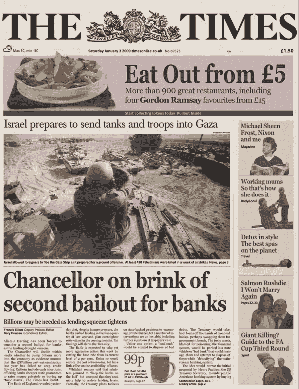

# 散户在自己的游戏中打败了华尔街！你听够了“如何？”。这里是“为什么？”。

> 原文：<https://medium.datadriveninvestor.com/retail-investors-beat-wall-street-in-their-own-game-you-heard-enough-of-how-here-is-why-7109ca4f2b92?source=collection_archive---------4----------------------->

## 这个故事背后不仅仅是 YOLO 赌博、火箭表情符号和登月迷因。

Photo by [Lloyd Blunk](https://unsplash.com/@blunkorama?utm_source=medium&utm_medium=referral) on [Unsplash](https://unsplash.com?utm_source=medium&utm_medium=referral)

本周，社交和主流媒体、报纸上的每个人，甚至是[埃隆·马斯克](https://twitter.com/elonmusk/status/1354174279894642703)和 [AOC](https://twitter.com/AOC/status/1354830697459032066) 都在谈论 Reddit 社区，r/Wallstreetbets，清算价值数十亿美元的对冲基金头寸。

互联网社区通过做空对冲基金在 GameStop(GME)和 AMC Entertainment Holdings(AMC)等小盘股上的空头头寸，购买它们的看涨期权并推高价格，实现了这一目标。

因为这个故事是关于什么的，所以我不会从头给你讲这个故事。

如果你仍然没有读到或听到发生了什么，你可能想在和我一起深入了解这一“运动”背后的动机之前，检查一下这里的、这里的或这里的。

像最近的许多金融故事一样，这个故事也要追溯到 2008 年的金融危机。众所周知，在那个时候，赌徒式的金融机构承担了太多的风险来满足他们的贪婪。一旦他们没有实际的工具来填充他们的口袋，他们就用沙塔为自己制作一些“复杂”的工具，并在这些薄弱的基础上建立高杠杆资产。《出埃及记》[次贷 CDO](https://www.investopedia.com/ask/answers/032315/were-collateralized-debt-obligations-cdo-responsible-2008-financial-crisis.asp)。

当所有这些资产和整个全球经济随着它们一起崩溃时，事实证明“对冲”基金对此类事件没有任何对冲，银行对它们的抵押贷款支付违约率不感兴趣，政府也不关心它给普通人带来的痛苦。

所有的银行都得到了政府用纳税人的钱支付的救助。然后他们分配他们的董事、经理等。丰厚的奖金支票，而不是解雇他们或送他们进监狱。没有人因为他们的行为而遭受损失，除了几个替罪羊交易员。

这是《泰晤士报》2009 年 1 月 3 日的头版，讲述了危机后价值数十亿美元的资金流入这些不负责任的机构的故事。

Image is the front page of [The Times on Jan 3rd, 2009](https://www.thetimes.co.uk/article/chancellor-alistair-darling-on-brink-of-second-bailout-for-banks-n9l382mn62h)

这个封面的头条也可以在比特币的创世纪板块找到。检查一下[区块 0](https://blockchair.com/bitcoin/block/0) 的 coinbase 数据部分，自己看看。

我在这里插入比特币不仅仅是为了宣传这种分散化的资产，也是为了将比特币创造背后的动机与最近发生在股票市场上的事件联系起来。

正如我在开头所说，这一切都要追溯到 2008 年的金融危机。

没有人比 Reddit 用户 u/ssauron 更好地描述了最近事件和危机之间的关系，他在 Reddit 上写了一封给 Melvin Capital、美国消费者新闻与商业频道、Boomers 和 WSB 的公开信。他在这里解释了他的家人和朋友在金融危机后所经历的一切。痛苦是真实的，但普通人必须承担代价，而不是肇事者。

这与 2011 年 9 月[占领华尔街运动](https://www.infoplease.com/business/economy/occupy-wall-street)背后的挫折是一样的，这是对企业贪婪、社会不平等和巨大的贫富差距的实际反应。

今天，所有的问题依然如故，挫败感也是如此。然而，表达它的方式略有改变，从文字到交易，因为技术使类似的金融工具如期权交易也适用于散户投资者。

向前滚动到今天，像 r/Wallstreetbets 这样的社区，所有人都对大型机构感到愤怒，因为他们一直在市场上投机，迫使小企业破产，并在闭门造车的背后密谋反对散户投资者以获取利润。

由于这应该是一个“自由市场”，散户交易者决定扭转局面，在一个没有隐藏议程的公共论坛上决定反对公开宣布自己头寸的大型做空者。

是的，这是一个危险的游戏，是的，过度杠杆化可能会带来严重的金融后果，但没有人会互相欺骗进入这些交易。讨论、评论、赞成和反对这些观点都可以在 Reddit 上公开获得。每个人都准备好承担必要的风险。

总结本次活动中专业投资者和散户投资者之间关系的最佳评论来自彭博金融市场上最著名的人物 Matt Levine，他在他的专栏中写道:

> 在公开场合，Reddit 上的 redditors 在玩一个明显愚蠢的游戏，但对冲基金也在玩一个游戏，他们是成年人，知道自己在玩什么。

# 这一切都是为了复仇吗？

如果你看看新闻，GameStop 最近一次飙升背后的整个案例是关于社区驱动的狂热，没有基本面推动价格上涨。所以，大家很容易把这叫做狂热，泡沫，或者公众歇斯底里。

让我们看看散户押注上涨背后的其他原因。

## 基本面分析

如果你愿意更仔细地观察，你会发现一些优秀的基本面分析，关于为什么 GameStop 实际上拥有未来的潜力。

从风险投资的角度来看，这里有一个例子。你也可以看一下[这个五个月前的视频](https://www.youtube.com/watch?v=alntJzg0Um4&feature=youtu.be)，视频来自 Reddit 用户 u/theroaringgitty，他在所有事件发生之前将 GameStop 作为一个投资理念，完全基于其基本面。他把他的 5 万美元投资变成了大约。他的交易值 2000 万美元。

## 小盘股和廉价股的吸引力

手术背后的另一个原因是，这些投资者通常寻求小盘股和廉价股作为投资可能性。这是因为这类股票突然上涨的潜在乘数要大得多。

市值 500 万美元、价值 5 美元的股票比市值 1 万亿美元、价值 136 美元的苹果股票更容易翻两番。上涨潜力只是让这只股票更有吸引力，即使它本身还不足以成为值得投资的基本面因素。

## 从市场效率到无聊市场假说

吸引投资者投资小盘股的第三个效应完全是出于无聊，马特·莱文在他的一篇时事通讯中称之为“无聊市场假说”。用他的话说:

> 经济越糟糕，投资者就会越感到厌烦。如果股票因为冠状病毒危机比预期的更长、更严重而遭到抛售，娱乐选择将会更少，更多人将在绝望中转向用手机购买股票。

对于这些投资者中的大多数人来说，刺激计划只是一个额外的发薪日，他们并没有将其纳入财务规划。如果你在家里感到无聊，从政府那里得到一些额外的钱，周围没有多少东西能像动荡的股市一样给你带来肾上腺素。

结合以上所有原因，所有这些散户联合起来对抗一个共同的敌人，牛市中的空头，期待企业倒闭赚钱。

不要误解我。在这里，我并不完全否定做空的概念，因为它是防止泡沫、保持市场尽可能理性的必要工具。尽管如此，机构使他们的网络，以确保这些企业失败，通过其广泛的资源，并总是逃脱它是问题。

散户投资者在这里奋起反抗的不仅是对冲基金，还有中央交易所、主流媒体和政治家，他们利用一切可用的工具向这些投资者展示一群不知道自己在做什么的业余爱好者。

互动经纪人、电子交易、罗宾汉等。所有人都停止了他们平台上的交易，以保护对冲基金免受他们陷入的空头挤压。下面的推文来自 Robinhood 的官方账户，宣布停止交易以防止购买股票，只允许平仓以推动价格下跌。

这种反应向所有人表明，游戏受到了操纵。这个系统只允许机构赚钱，它准备以各种可能的方式伤害散户投资者作为代价。

如果这些所谓的专业人士没有被他们的傲慢蒙蔽双眼，并从所有可能的媒介攻击散户投资者，也许他们中的一些人会注意到这些散户投资者如何比他们更好地理解了[伽马射线挤压](https://www.swfinstitute.org/news/83341/what-is-a-gamma-squeeze-in-the-context-of-stock-trading#:~:text=A%20%E2%80%9CGamma%20Squeeze%E2%80%9D%20is%20an,trades%20on%20the%20underlying%20stocks.)的概念。那么也许他们就不会在错误的一方被抓住。

# 外卖食品

是的，GameStop 或 else 的价格不会停留在这些水平，在某个时候会回落，因为基本面还没有强大到足以证明估值的合理性。

尽管如此，这一点是明确的，相关对冲基金[公开宣布](https://www.cnbc.com/2021/01/27/hedge-fund-targeted-by-reddit-board-melvin-capital-closed-out-of-gamestop-short-position-tuesday.html)他们意识到了损失并平仓。所以任务完成了！至少这次任务传达了一个强烈的信息。

今天将被铭记！它将被铭记为:

*   散户投资者在他们自己操纵的游戏中击败华尔街的那一天。
*   这一天，人们以期权交易的形式向腐败的机构表达了他们的不满。
*   有一天，人们根据他们的基本面分析进行交易，瞄准某一组资产以获得更好的乘数，也许只是出于无聊而交易，被禁止进入集中交易市场，受到主流媒体的侮辱，被集中交易市场阻止用自己的钱购买他们想要的资产。

## 解决方案

可惜，这是他们的游戏，他们太强大了，在这个游戏里打不过。因此，唯一的解决方案是利用分散的交易所进行创新，以移动游戏场地，尽可能避免使用他们的资金，并依赖分散的、不可改变的、健全的货币(如比特币)进行交易。

他们会迟迟不采纳，也不会注意到你无法建立一个不变的、分散的、对等的分类账。

在外面注意安全！

[*订阅*](https://furkansaatcioglu.com/bitsandchips) *到我的简讯* [*位&位*](https://furkansaatcioglu.com/bitsandchips) *获取您邮箱里的未来文章！*

*免责声明:本文仅用于信息或教育目的，并非任何形式的个性化建议。使用这些信息需要您自担风险。*