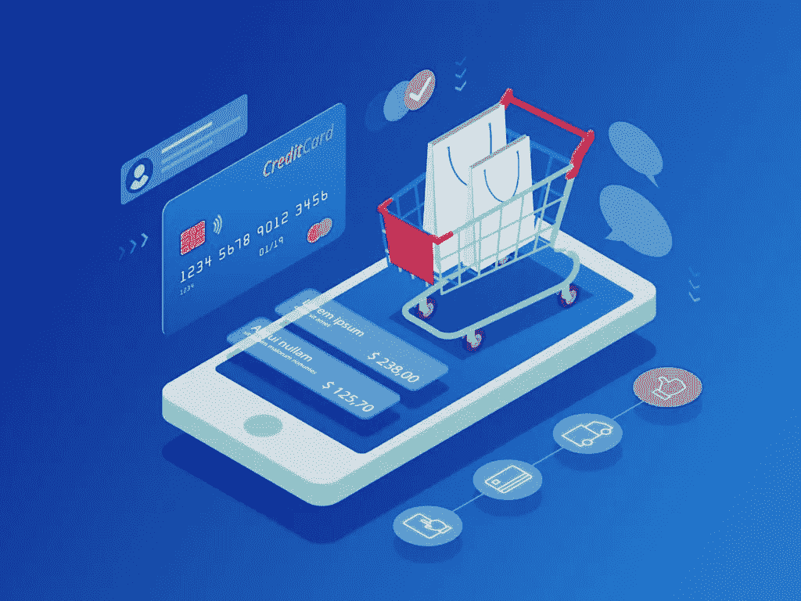

# 零售营销——增加销售的策略和想法

> 原文：<https://medium.datadriveninvestor.com/retail-marketing-strategies-and-ideas-to-increase-sales-bd94853d4344?source=collection_archive---------9----------------------->

虽然大多数人倾向于区分店内销售和电子商务，但事实是，一个可以而且应该用来补充另一个。统计数据证实了这一点。最近的一项研究表明，61%的人更愿意从实体店购物。今天，我们将为您提供出色的零售营销策略和理念，您可以通过实施这些策略和理念来获得竞争优势。首先，我们来了解一下零售营销的定义。

 [## 影响者在聚光灯下表演|数据驱动的投资者

### 影响者营销是一个脱颖而出的游戏。结果是一个令人难忘的-和可信的-连接到一个产品或…

www.datadriveninvestor.com](https://www.datadriveninvestor.com/2020/01/15/influencers-perform-in-the-spotlight/) 

# 什么是零售营销？

零售营销是你采取的任何举措，让你的商品和服务出现在你的目标受众面前。要想成功，你需要掌握零售营销的四个 p:

1.  产品——这只是在你的网站上以一种像样的方式展示你的产品。毕竟，人们需要看到他们正在考虑购买的东西。
2.  价格——无论何时计算价格，你都需要考虑诸如管理费用、竞争对手的收费以及许多其他变量。
3.  place——即使你有世界上最好的产品，如果没人看到，也帮不了你。正确的摆放是零售店营销策略的重要组成部分。
4.  晋升——这是关键时刻。此时，您需要激发客户购买您产品的兴趣。

一旦你有了你的四个 p，是时候确保你的电子商务网站正在帮助你增加实体销售。这将是你零售营销策略的一个重要部分，因此让我们更详细地探讨一下。

# 创造难忘的在线体验，推动店内销售

零售营销就是要与你的客户建立联系，并为他们提供个性化的体验。这是您的客户在购买后很久还会记得的，并且会一遍又一遍地回到您身边。你需要做的最重要的事情之一就是为你的访问者提供相关的产品。一刀切的方法不再奏效，因为你的客户不会觉得你了解他们的需求，甚至根本不关心他们。因此，你要确保你选择了一个像 Magento 这样的平台，或者任何一个允许这种个性化服务的平台。

# 利用视频吸引客户

当你集思广益以增加零售商店的销售时，一定要在你的营销工作中使用视频。最近的一项研究表明，视频内容可以提高 15%的转化率。请记住，这并不一定是什么惊人的图形和演员模型花哨。你可以制作一个视频，解释如何使用特定的产品，展示真实的顾客评论，或者任何你认为可以提高参与度的东西。这比简单地在你的网站上列出所有的推荐给客户阅读要好得多。视频可以让他们更好地联系产品和你的品牌，这就是为什么它是你的零售商营销策略中的一个重要工具。

# 实施忠诚度计划

与您合作多年的忠诚客户希望他们的业务得到回报。这就是为什么你应该有一个忠诚计划，不仅奖励你最好的顾客，也给人们额外的购物动机。忠诚度计划是任何在线零售营销策略中最强有力的工具之一，它能让人们一次又一次地回到你的身边。有很多各种各样的忠诚度计划，但最受欢迎的是游戏形式的计划。它增加了额外的乐趣，因为您的客户可以与他们的朋友竞争解锁新的水平，承担新的角色，以及任何其他使购物更加愉快和有益的事情。

Wizzzi 是游戏形式的忠诚度计划的一个最好的例子。这是一款增强现实游戏，在巫师世界中有可爱的角色。您可以购买游戏卡，并在增强现实或物理现实中与朋友一起玩游戏。

# 利用社交媒体

社交媒体在整个电子商务和零售业中发挥着越来越重要的作用。事实上，根据[最近的一份报告](https://magento.com/sites/default/files/7586_MagentoSocialInfosheet_r2v1_Preview.pdf)，75%的顾客购买产品仅仅是因为他们在社交媒体上看到它。为了充分利用这一增长趋势，你需要确保你的电子商务平台有能力在领先的社交网络上自动创建店面，吸引现有粉丝，吸引新买家和许多其他功能。如果你的品牌目前在社交媒体上有相当多的追随者，你需要开始利用你已经拥有的受众。

# 开始利用在线零售来推动销售

即使是最好的在线零售促销创意也需要一个强大的平台，能够正确执行你的计划，以补充你的店内营销。拥有合适的[零售软件解决方案](https://skywell.software/retail-software-development/)至关重要，因为它们可以增强您的营销力度，推动销售，并让您在竞争中获得优势。如果我们想一想几乎每个行业都有多少在线和实体店，你将需要一些东西来帮助你脱颖而出。你已经完成了艰难的部分，提出了创造性的营销想法和倡议，让你的名字在那里，所以为什么不给它最好的成功机会呢？正确的技术将为您提供最高的投资回报，并让您更快地到达您想要的地方。

*原载于*[*https://sky well . software*](https://skywell.software/blog/retail-marketing-strategies-and-ideas-to-increase-sales/)*。*

**访问专家视图—** [**订阅 DDI 英特尔**](https://datadriveninvestor.com/ddi-intel)