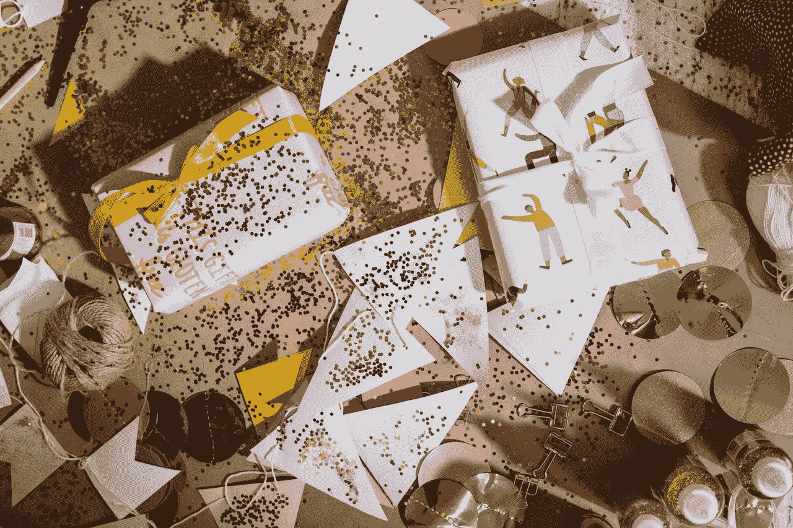

# 零售商发挥创意对抗污染

> 原文：<https://medium.datadriveninvestor.com/retailers-get-creative-to-battle-pollution-19397fabc159?source=collection_archive---------16----------------------->

## 减少闪光消费，营造更安全的环境

Photo by [cottonbro](https://www.pexels.com/@cottonbro?utm_content=attributionCopyText&utm_medium=referral&utm_source=pexels) from [Pexels](https://www.pexels.com/photo/white-pink-and-yellow-floral-gift-box-4690384/?utm_content=attributionCopyText&utm_medium=referral&utm_source=pexels)

英国率先倡导减少亮片的生产以改善环境:三大零售商——连锁杂货店[莫里森](https://www.morrisons-corporate.com/)和[维特罗斯](https://www.waitrose.com/)以及百货公司[约翰·路易斯](https://www.johnlewis.com/)——宣布他们不会在自己的品牌中使用亮片，纽约时报报道。

> 莫里森斯说:“闪光物质是由微小的塑料颗粒制成的，如果分散在陆地、河流和海洋中，会造成生态危害——在那里需要数百年才能降解。”。

一个有趣的电话，因为我见过的每个小女孩，包括我的两个女儿，都喜欢闪光粉。陈词滥调适用于:

> 不要让任何人让你的光芒黯淡。

或者:

> 有些女孩天生就有闪光的血管。

哪里有小女孩，哪里就有闪光。从仙女居住和虚构的地方，到梦幻城堡，公主们穿着闪亮的服装在大厅里漫步。闪光使年轻女孩的生活更加闪亮和明亮。我认识的大多数女孩都在闪光的阴影中做梦。

但是零售商正在努力消除闪光。美国的主要零售商，如沃尔玛、塔吉特、沃尔格林、CVS 和好市多，对是否会加入禁令迟迟不予置评。

俗话说“闪光的不一定都是金子”，意思是不是所有闪闪发光、表面上有吸引力的东西都是有价值的。而且现在 glitter 也不好，至少从生态角度来说是这样的。

贺卡上、派对上和服装上的亮片总要去某个地方。问题是，其中大部分对环境有害，最终流入了我们的海洋。环保局已经努力减少烟雾、煤烟和向空气中的排放。当我们问这个问题时，是时候看看海洋生物了:

我们应该去掉闪光粉吗？

 [## 即使在商业领域，一切都是为了重新站起来|数据驱动的投资者

### 有一种说法是关于焦虑的人。虽然他们认为自己很弱，因为他们在一些决赛中失败了…

www.datadriveninvestor.com](https://www.datadriveninvestor.com/2020/07/01/even-in-business-its-all-about-getting-up-again/) 

# 把地球放在首位

零售商开始意识到闪光对我们环境的危害。澳大利亚的一项研究称，一千四百万吨微塑料最终留在了海底。当你想到微塑料时，你可能会想到一次性水瓶，将汽水罐固定在一起的环，以及在去角质洗面奶和肥皂中发现的微珠。

人们很少想到闪粉，部分原因是它太小了，而且每个人都喜欢闪粉。但是 glitter 是由同样的[聚对苯二甲酸乙二醇酯](https://en.wikipedia.org/wiki/Polyethylene_terephthalate#:~:text=Polyethylene%20terephthalate%20(sometimes%20written%20poly,thermoforming%20for%20manufacturing%2C%20and%20in)，或者 pet，塑料材料制成的。直到最近，glitter 一直没有成为攻击目标，部分原因是它的体积太小。虽然它可能很小，但人们已经注意到了闪光粉及其使用带来的问题。

在这种努力下，对环境的威胁将会减少。但是，还有其他事情要考虑吗？和许多事情一样，我们跟踪资金，以确定它是否会对企业和我们的经济产生影响。

# 企业可能会损失收入

通过淘汰含有亮片的产品，企业会损失很多钱。禁止含有亮片的产品是一个需要仔细考虑的决定，不仅是从生态角度，也是从商业角度。零售商会损失多少钱很难预测，因为我们还没有具体的数据。让我们看看一些闪光产品的真实例子，以及消费者购买闪光产品时企业获得的收入。

[全国零售联盟](https://www.usatoday.com/story/money/retail/2018/10/19/25-cities-spending-most-halloween/38167911/)透露:在每年万圣节花费的 90 亿美元中，32 亿美元将用于服装，27 亿美元用于装饰品，26 亿美元用于糖果，4 亿美元用于贺卡。这只是万圣节的事。

让我们看看圣诞节和我们在节日贺卡上花费的金额。[金钱](https://money.com/christmas-cards-spending-2015/#:~:text=It's%20about%2025%25%20of%20the,numbers%20continue%20to%20hold%20steady.)说:根据[贺卡协会](http://www.greetingcard.org/abouttheindustry/tabid/58/default.aspx)的数据，这大约是年度贺卡销售总额的 25%,即大约 16 亿张贺卡。这相当于每年约 20 亿美元(鉴于年销售额为 80 亿美元，售出 650 万张，平均每张贺卡价值约 1.2 美元——而且大多数贺卡的价格远高于平均估计值)。我们还假设销售数字继续保持稳定。如果你想在节日贺卡上找一个闪闪发光的雪人，那就从没有禁止闪光的零售商那里购买。

只看[万圣节和圣诞节](https://nicoleakers.medium.com/dont-cancel-the-holidays-enjoy-them-differently-to-keep-the-spirit-alive-da1517e844dc)，我们可以看到，在消费者倾向于愉快地为自己购买非必需品并作为礼物的时候，企业在第三季度可能会损失很多钱。但是，如果企业在一年中的其他时间采取这种方法会怎么样呢？

# 寻找创造性的替代方案

虽然禁止闪光粉的零售商只关注一次性节日用品，但我们可以在一年中的其他时间为生日聚会、婚礼庆典和类似场合制作五彩纸屑，以此来保护环境。你可以通过制作自己的五彩纸屑或闪光替代品来获得创意和乐趣。一些建筑纸或剪贴簿纸和打孔机是你所需要的。顺便去你最喜欢的工艺品商店买一个装饰打孔机，在特殊的场合使用。制作五彩纸屑可以成为孩子们喜欢的家庭活动。

如果制作五彩纸屑不是你想要的，可以考虑从像 today glitter[这样的公司购买环保产品，他们生产可生物降解的闪光物。](https://www.todayglitter.com/pages/about)

# 影响底线

尽管我们喜欢闪闪发光的产品，但它们对环境有害。每个小女孩都想打扮自己的浮华对海洋和海洋生物有害。简单的替代品和可生物降解的选择并不一定要消除我们生活中的闪光点。在制作自己闪亮的东西或从环保企业购买亮片时发挥一点创造力，将为子孙后代保护环境。

选择完全消除亮片的企业冒着很大的收入风险。你不必放弃享受这种闪闪发光的物质，但也许你可以心甘情愿地选择为了一个更安全的环境少用或少用它。

致每一个喜欢闪光的小女孩或大女孩:

> “我不知道我是否能一直用同样的精力、同样的方式——所有的服装变化、闪光、发型和化妆——来做这件事。当我 50 多岁的时候，我有点想去花园。”— [泰勒·斯威夫特](https://www.taylorswift.com/)

照耀。

## 获得专家视图— [订阅 DDI 英特尔](https://datadriveninvestor.com/ddi-intel)