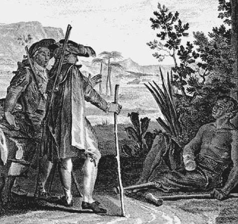
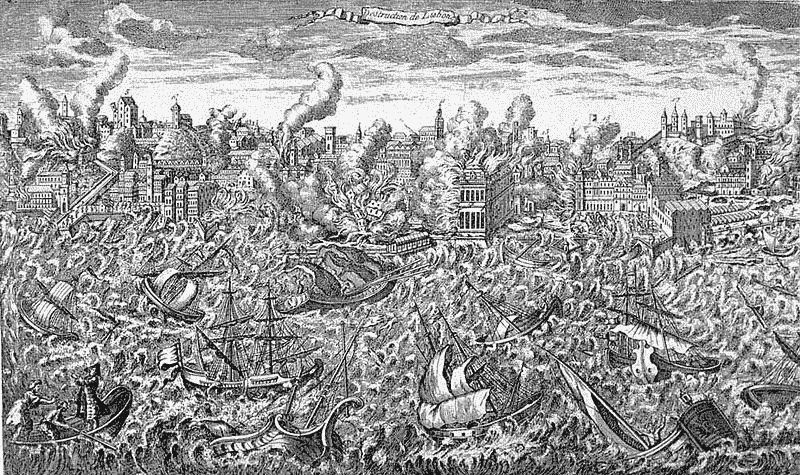
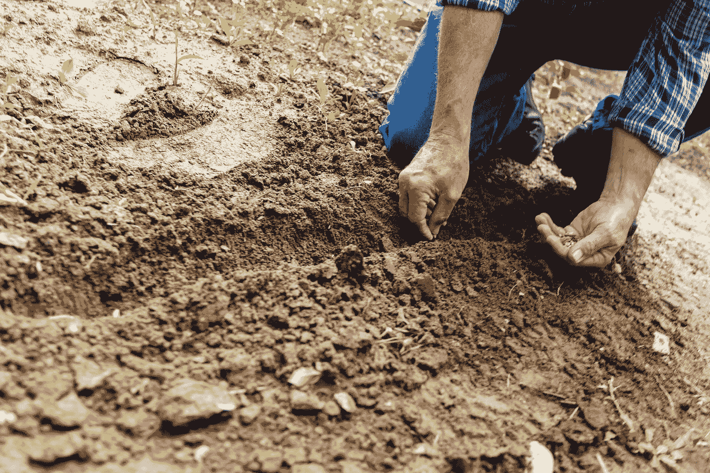

# 伏尔泰的《老实人——心有所属》中的退休教训

> 原文：<https://medium.datadriveninvestor.com/retirement-lessons-from-voltaires-candide-ad-otium-c8ea3fae2f0f?source=collection_archive---------8----------------------->

《老实人》( 1759)是一部中篇小说，记录了一个年轻人在环境和好奇心的驱使下环游世界的哲学旅程和蜕变。与哲学著作带来的沉重感相反， *Candide* 非常容易理解，我向普通读者，而不仅仅是那些对哲学感兴趣的人，充分推荐它。

这个故事不断地把我们带到伏尔泰和当时其他人所实践的启蒙思想。毫无疑问,《老实人》是对欧洲君主制度的腐败和任人唯亲的攻击。但这也是对乐观主义哲学的攻击，比如理性主义者戈特弗里德·威廉·莱布尼茨提出的乐观主义哲学。

在《老实人》中，我们可以学到如何建立正确的心态来克服过去的问题，也可以学到如何理解人类苦难和痛苦的普遍性。

对于那些有长期职业生涯的人来说，退休带来了身份适应问题的风险。我们突然开始用我们*过去的所作所为来描述自己。*我们也倾向于对退休后的生活抱有价值观，但当我们达到目标时，结果会大不相同。

从很多方面来说，这个描述坎迪德一生的故事应该是我们大家都熟悉的。当然，《老实人》遭遇了许多与我们今天所期待的相去甚远的悲剧。但这个人的旅程很好地诠释了现代生活及其包含的所有危险。

# 第一课:建立正确的期望

在第一章中，我们见到了坎迪德，他在雷顿·特龙克男爵的城堡里过着乌托邦式的生活。他的日子里充满了来自庞洛斯博士的哲学课，他教导说，一切都是“它可能是最好的”。

盲目的无知和天真导致了他的第一个悲剧——因为亲吻了他的心上人，男爵的女儿库内·贡德而被赶出城堡。不久之后，城堡遭到保加利亚人的突袭，所有人似乎都被杀死了，除了坎迪德。

接下来，在整个故事中，Candide 毫不动摇地支持 Pangloss 博士的哲学，甚至在 1755 年目睹了里斯本的毁灭。随着地震、海啸和火灾肆虐这座城市，Pangloss 宣布:

> 所有这些都是尽可能好的。因为，如果里斯本有火山，它不可能在其他地方。因为事物不可能不是这样的。因为一切都好。”
> 
> *庞洛斯，第五章*

The Great Earthquake of 1755, Lisbon

在书中，坎迪德一路上遇到的角色遭受残酷折磨的例子数不胜数:

*   他看到他的朋友潘格洛斯博士和男爵被吊死在一辆汽车里。
*   他的朋友雅克[再洗礼者](https://en.wikipedia.org/wiki/Anabaptist)，从私刑中救出了坎迪德，在试图拯救一名水手的生命时死去
*   他的爱人库内·贡德被布加尔士兵强奸并开膛破肚，然后被卖给了军队
*   一个被非洲海盗强奸和奴役的老妇人，她的臀部被切除用来喂养饥饿的禁卫军

这是一个所有社会阶层的生活都是多么残酷的例子。坎迪德乐观的心态让他能够超越这些灾难。

任何事情的发生都是有原因的，他只是把自己归因于一张乘客的车票，不接受事情的本来面目。这意味着他能够处理困难的情况，因为他不允许消极的想法进入。

虽然乐观的哲学让坎迪德保持高昂的情绪，但最终并没有给他带来他从库内贡德那里寻求的快乐。在整本书中，他逐渐质疑自己的信仰，当他最终与库内·贡德重聚时，他被她的不可忍受所摧毁。

# 不要关注结果

这里的一个学习点是，不是在我们职业生涯中发生的所有事情都可以以退休承诺为代价。

人们很容易对退休生活持过于乐观的看法。我们想象拥有三分之一的生命会立刻给我们的生活带来积极的改变，但是残酷的现实是相反的事情会发生。我们的职业**塑造了我们的身份。**

退休可能是一段充满震惊和流离失所的可怕时光，如果没有继续前进的目标，我们可能会受到一阵阵[低个人能动性](https://adotium.co.uk/5-steps-to-develop-your-personal-agency-and-start-something-new/)和抑郁的打击。

在我们的职业生涯中，我们一直在与灾难作斗争，但可能没有坎迪德和书中其他人物的规模大。对许多人来说，工作是痛苦的。但是退休并不是通往幸福的免费门票。

我们许多人把退休视为人生的最后阶段，在这里，幸福与做自己想做的事情的自由息息相关。但实际上这是另一个关注结果而不是接受现实的例子。退休后，世界不会改变，但你对它的期望会改变。

# 第二课:你的财富毫无意义

Photo by [**Dmitry Demidov**](https://www.pexels.com/@dmitry-demidov-515774?utm_content=attributionCopyText&utm_medium=referral&utm_source=pexels) from [**Pexels**](https://www.pexels.com/photo/brown-and-silver-round-coins-3790637/?utm_content=attributionCopyText&utm_medium=referral&utm_source=pexels)

在穿越南美的旅途中，坎迪德和他的朋友卡坎博偶然发现了乌托邦城市黄金国。在这里，孩子们用地上的鹅卵石玩游戏，这些鹅卵石对当地居民来说一文不值，但在世界其他地方的露天市场上却是无价之宝。

生活在黄金国的人们过着与世隔绝的生活，然而他们并不知道他们坐拥的财富。他们宽宏大量，不受嫉妒的困扰。但即使在这个人间天堂，坎迪德也渴望更多。

他认为他永远不会快乐，直到他再次见到库内贡德。就这样，他告别了黄金国的人们，带走了装满黄金和珠宝的袋子，在外界看来，这是一笔深不可测的财富。

 [## 全民或跨州的国营保险私人医疗保险:经济学…

### 我们目前生活在一个所有非医疗行业都痴迷于…

www.datadriveninvestor.com](https://www.datadriveninvestor.com/2020/05/21/state-run-insurance-for-all-or-across-the-state-lines-private-healthcare-coverage-economics-politics-social-mix-up/) 

# 我们真正需要的钱只有这么多。

离开黄金国后不久，坎迪德的大部分财富都被抢劫一空，剩下的钱他会免费送给那些需要的人。

他证明了金钱不会给他或任何人带来幸福。虽然它可以给你带来良好的服务，但它可以在没有任何通知的情况下被夺走。

毫无疑问，当你不再有稳定的收入时，就需要钱来维持你的生活方式。但是你实际需要的就这么多。认为你将退休并在黄金国过得快乐是痴心妄想。像坎迪德一样，你可能最终会向往更充实的生活。

我们不能把自己的身份和金钱联系在一起。用金钱来定义自己，并不比用我们开的车来定义自己好多少。

你或你的钱可以瞬间消失。介意这一点是好的，但金钱是一种冷漠(不好也不坏)。一旦你受够了，它就不再给你额外的个人影响力。想想如果你失去了它，你会怎么做，把保险放在适当的位置，在精神上把自己从它的重要性中分离出来。这就是斯多葛派所说的消极观想。

# 第三课:不要做一个批评家

在第 25 章中，Candide 遇到了一个叫 Pococuranté的威尼斯贵族，他带他参观了他的庄园。Pococuranté拥有他可能想要的一切，从拉斐尔的画作到荷马的华丽装帧的大部头书籍。

上帝蔑视他的每一件财产和任何被认为是艺术的东西。从歌剧到装饰华丽的花园，上帝拥有一切，但蔑视所有的一切(有趣的是，他唯一积极评价的是塞内卡的一页)。

> 嗯，你必须承认他是世界上最幸福的人，因为他超越了他所有的财产
> 
> *……“但是，”坎迪德说，“批评一切，在别人看到美的地方寻找缺点，难道不是一种乐趣吗？”*

当我们变老和退休时，有一种倾向认为我们已经“完成了游戏”。从这个成就的崇高位置，我们可以用轻蔑和批评的眼光看待其他人，导致我们成为守财奴。或者我们可以把时间花在购买越来越多的奢侈品上，最终我们会对此感到厌倦。

如果你不喜欢，拥有大量的财产是没有意义的。仅仅因为你有财富，这并不意味着你应该花时间和精力积累不同形式的财富。如果你只会批评别人，没人想知道你的艺术收藏。

# 第四课:我们必须培育自己的花园

在这本书的结尾，Candide 到达了他心爱的君士坦丁堡的 Cunégonde，在那里他和他的朋友们在一个小农场安顿下来。他们都变得非常无聊，导致他们组的老妇人问以下问题:

> “我想知道哪一种情况更糟:被海盗强奸一百次，被砍掉一个屁股，在保加利亚军团服役时接受挑战，被鞭打并吊死，被解剖，成为苦役奴隶，简而言之，经历我们所遭受的所有苦难，还是坐在这里无所事事？”
> 
> *“这是一个非常好的问题，”坎迪德说。*
> 
> *第三十章*

坎迪德和他的朋友们在经历了所有这些悲惨的经历后，不知道该如何对待他们的生活。他们遇到了一个在一小块土地上耕作的土耳其人，他们都开始了各自的工作。作品诚实而简单，我们带着 Candide 感觉有用并最终对生活满意的心情离开故事。

Photo by [**Binyamin Mellish**](https://www.pexels.com/@binyaminmellish?utm_content=attributionCopyText&utm_medium=referral&utm_source=pexels) from [**Pexels**](https://www.pexels.com/photo/man-planting-plant-169523/?utm_content=attributionCopyText&utm_medium=referral&utm_source=pexels)

在培育我们自己的花园时，我们给了自己一个最终照顾自己的机会。在我们的职业生涯中，我们的思维一直被截止日期和任务所分散。退休后情况会发生变化，我们需要能够适应。

退休后，有用且有意义的“工作”经常被忽视，但它通常是避免在无聊和痛苦之间波动的最佳选择。只要是简单的工作，没有压力，为他人服务会令人难以置信地获得回报，并帮助我们打造一个新的身份。

> 工作可以远离三大罪恶:无聊、堕落和匮乏。

诚实的土耳其人告诉我们，为工作而工作比继承遗产和财富更好。但更重要的是，我们都有责任创造自己的乌托邦。

另一种解释是，我们不应该把自己的思想和信仰建立在他人的身份上(在这种情况下，是我们从工作中继承的身份)。这是一个我们不为雇主着想的时代，但我们必须培养自己的哲学和世界观。

*原载于 2020 年 12 月 12 日 https://adotium.co.uk**的* [*。*](https://adotium.co.uk/retirement-lessons-from-voltaires-candide/)

## 访问专家视图— [订阅 DDI 英特尔](https://datadriveninvestor.com/ddi-intel)