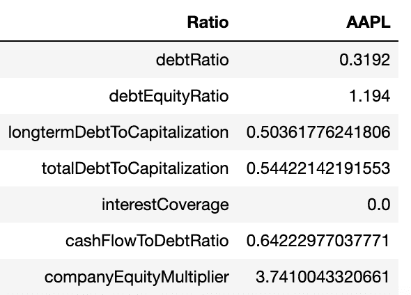
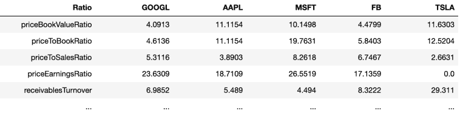

# 使用 Python 检索财务比率

> 原文：<https://medium.datadriveninvestor.com/retrieve-financial-ratios-with-python-e1dc4aba1f92?source=collection_archive---------5----------------------->

*原载于 2020 年 1 月 24 日 https://codingandfun.com*[](https://codingandfun.com/retrieve-financial-ratios-with-python/)**。**

*财务比率是检验上市公司吸引力的非常有用的工具。它帮助投资者在决定是否购买一家公司的股票之前回答关键问题。*

*有**种不同类型的财务比率**。在最常用的类别中，我们发现*营运*、*流动性*、*偿付能力*、*盈利能力*和*估值*比率。每个比率类别都有助于投资者、债权人等。回答不同公司的不同问题。偿付能力和流动性比率将让我们知道一个公司是否有能力履行短期和长期义务。盈利率显示了公司的盈利能力等。*

**

*Financial Ratios with Python*

> *除非我们用财务比率来比较一个行业内的公司，否则财务比率并不能给我们太多的洞察力。*

*获取计算财务比率的数据并不困难。我们只需要去任何一家公司的公开财务报表，就可以得到想要的数据。然而，由于我们需要提取大量数据，这可能是一项耗时的工作。最重要的是，理想情况下，我们需要一些公司的数据来进行适当的比较。*

***好消息，也是我想在这篇文章中与你分享的，就是我们可以使用 Python** 和免费的[Financialmodelingprep](https://financialmodelingprep.com/)API 来获取数据，从而完全自动化财务比率的计算。正如你现在看到的，这是非常容易和快捷的。*

*请注意，我在 Youtube 上也有一个视频教程，一步一步地解释代码在做什么。我建议您浏览视频，理解剧本中使用的每一句台词:*

*Python for Finance*

***开始编码吧**。首先，我们导入所有需要的模块，并开始向[*FinancialModellingPrep*](https://financialmodelingprep.com/developer/docs/)API 发出 API 请求，以检索我们传递给*财务比率*函数的任何公司的所有财务比率。我们将使用 *Pandas* 、 *Requests* 和 J *son* 库来处理数据。*

```
*import pandas as pd 
import requests 
import jsondef financialratios(quote):fr =  requests.get(f"[https://financialmodelingprep.com/api/v3/financial- ratios/{quote](https://financialmodelingprep.com/api/v3/financial-ratios/%7Bquote)}")fr = fr.json()*
```

*我们将 API 响应存储在一个变量调用 *fr* 中，该变量调用将被转换为 json，以便我们可以在 Python 中使用它。*

*接下来，我们存储从 API 端点返回的列表的第一个元素。注意，我们只保留数组的第一个元素，因为它包含最新的可用数据。然后，我们将每个财务比率类别存储在一个变量中，以便稍后将其转换为 Pandas 数据框架:*

```
*valuation = fr['ratios'][0]['investmentValuationRatios']profitability = fr['ratios'][0]['profitabilityIndicatorRatios']operating = fr['ratios'][0]['operatingPerformanceRatios']liquidity = fr['ratios'][0]['liquidityMeasurementRatios']debt = fr['ratios'][0]['debtRatios']valuation = pd.DataFrame(list(valuation.items()),columns=['Ratio', quote])profitability = pd.DataFrame(list(profitability.items()),columns=['Ratio', quote])operating = pd.DataFrame(list(operating.items()),columns=['Ratio', quote])liquidity = pd.DataFrame(list(liquidity.items()),columns=['Ratio', quote])debt = pd.DataFrame(list(debt.items()),columns=['Ratio', quote])*
```

*结果，我们有五个熊猫数据框。每个财务比率类别一个熊猫数据框架。例如，在变量*债务*中，我们有传递给我们函数的任何公司的所有债务财务比率。当我们经过“AAPL”(即苹果公司的股票代码)时，请参见下面的债务内容示例:*

**

*Debt Ratios Python*

*下一步，让我们将所有财务比率类别连接成一个单一的 Pandas 数据框架。我们可以首先创建一个包含每个熊猫数据帧的列表，通过使用 *pd.concat* 函数，我们将它们合并成一个数据帧，存储在一个名为 *result* 的变量中。然后，作为我们函数的一部分，我们返回连接的*结果* **，这是我们合并的熊猫数据帧**。*

```
*frames = [valuation,profitability,operating,liquidity,debt]result = pd.concat(frames)return result*
```

*很好，现在我们把所有的比率都放在一个熊猫数据框里了。但是，如前所述，我们不能通过查看单个公司的比率来得出任何结论。我们需要在同一个行业的不同公司之间进行比较。*

*如果我们要比较*脸书*、*苹果*和*微软*，我们可以只对每家公司运行三次我们的代码，然后一个比一个比地进行比较。但是，有一种更好、更有效的方法可以做到这一点。*

*让我们将不同公司的所有财务比率放在一个数据框架中，以便更好地进行比较。我们可以简单地通过循环遍历我们的股票列表，并将列表中的每家公司合并到初始的 Pandas 数据框架中。这就是我们在下面几行代码中所做的。请随意添加您感兴趣的任何其他公司！*

```
*listofstocks = ['AAPL','MSFT','FB','TSLA']x = financialratios('GOOGL')for item in listofstocks: y = financialratios(item)x = x.merge(y,on='Ratio')*
```

*然后在我们的 x 变量中，我们有一个包含 5 个不同公司的财务比率的熊猫数据框架。现在，我们可以开始寻找并对这些公司做出一些好的结论。*

*希望这个脚本对您的分析有用！*

## *查看下图我们的财务比率熊猫数据框。非常有用的脚本来比较不同公司的财务比率。*

**

*Financial Ratios by company with Python*

*如果有不清楚的地方，我推荐你看上面的 Youtube 视频，视频中所有代码都是逐行解释的！*