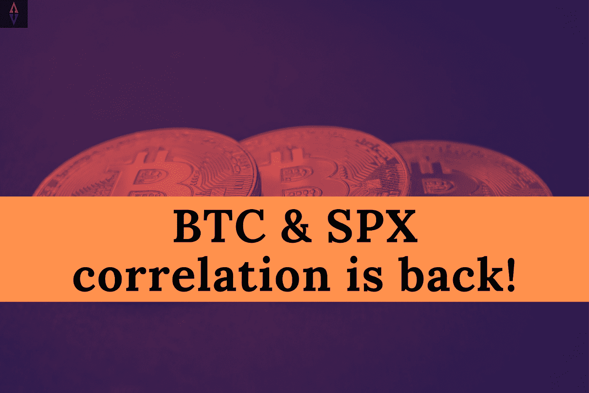
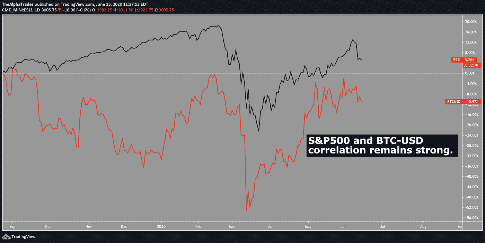
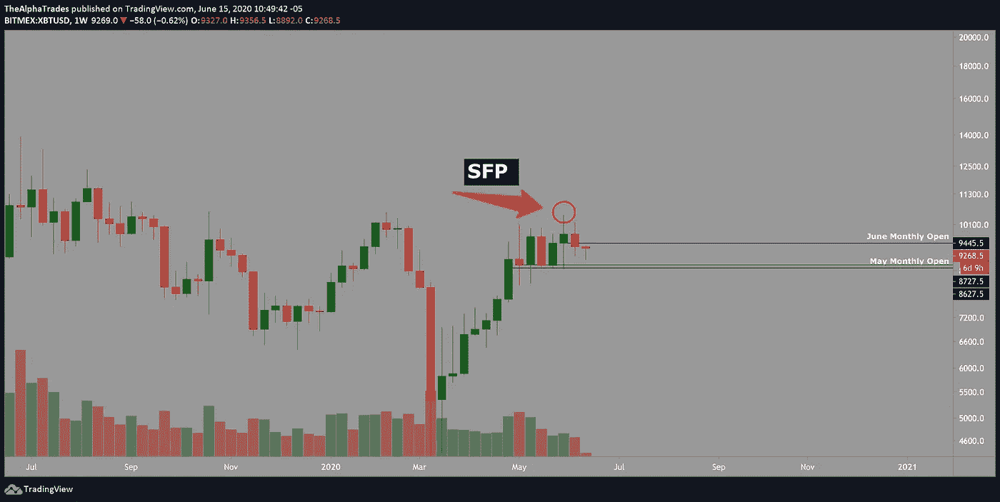
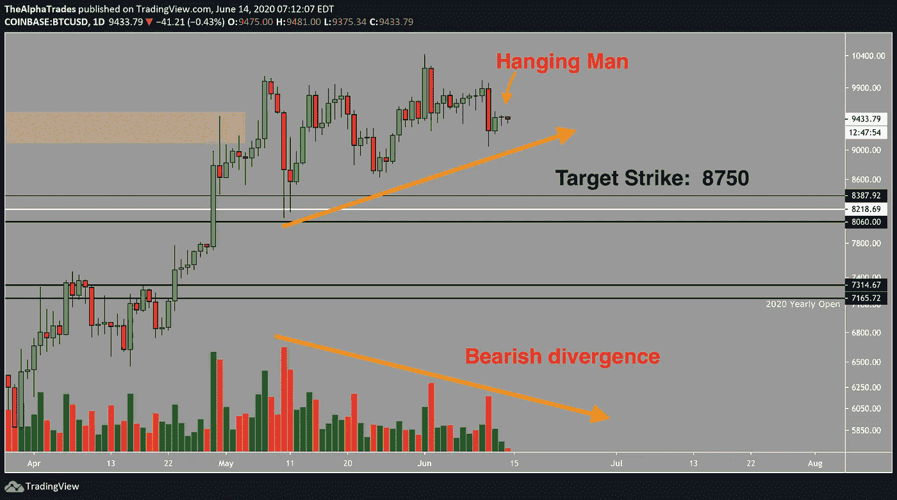

# 比特币与 SPX 相关性的回归？

> 原文：<https://medium.datadriveninvestor.com/return-of-the-bitcoin-and-spx-correlation-c2f8c843cf3e?source=collection_archive---------10----------------------->

## 比特币的下一站可能是 8800 美元

BTC and SPX correlation; Source: Alpha Trades

大家早上好。周一快乐。

*我们正在寻找客人，所以如果你想顺便聊聊市场和经济，我们邀请你到* [*加入不和*](https://bit.ly/AlphaTradesDiscord) *并给任何一位管理员发送消息。*

让我们开始今天的密码分析。我在 6 月初下单的 BTC 空头，平均进场 9775，目前表现不错。

我不能告诉你买还是卖。我不能给你理财建议。但是我可以告诉你们我在市场上到底在做什么。在过去的几个星期里，我已经证明了几个星期，BTC 在它开始滚动之前处于一个分配阶段。

如果股市继续下跌，我看不出比特币有任何理由不会跌至至少 7600 点或我更高的目标 6900 点。

近来，比特币与标准普尔 500 的联系非常紧密。下图用橙色描绘了 BTC-美元(比特币基地)和标准普尔 500 E-mini 期货(ES1！)从日常来看。机芯的形状几乎一模一样。

S&P500 and BTCUSD correlation on daily chart; Source: Alpha Trades

一旦 BTC 跌破 2020 年 6 月开盘的 8750 点，才会测试 2020 年 5 月的月度开盘。随着 BTC 翻身，蜡烛的尺寸随着体积的增加而增加。这意味着看跌者对这个市场的兴趣正在上升。周线收盘基本上不是熊市，尽管如此，我认为这是一个确认的 SFP，因为灯芯未能收于更高的高点。我仍然认为，BTC 可以达到前一周的低点(3000 点)，但这是另一个时间的分析。你可以阅读我们的[到 2025 年的路线图文章](https://medium.com/datadriveninvestor/bitcoin-roadmap-to-2025-e49c5da26966)来获得关于这个主题的分解。

Bitcoin SFP on a weekly chart; Source: Alpha Trades

# 比特币期权交易更新

随着收盘日线蜡烛线的下跌，我进入了一个高风险的 BTC 期权。这是一个非常短暂的选择，更深的打击 8750。交易时，BTC 的交易价格是 9432。如果期权在接下来的两天内下跌到执行价的一半，我预计它的价值会翻倍。如果 BTC 达到执行价或在未来三天下跌，我将获得可观的收益。*免责声明:这些是使用高风险工具的高风险交易*，但我希望对我的社区保持透明，并向公众提供免费赠品。记住，在交易或投资时，一定要尽职尽责。

我还在为这笔交易制定止损和目标利润。

Bitcoin options trade update; Source: Alpha Trades

# 在 7 月 8 日以 296 美元公开我的间谍看跌期权

优势会员在 12 日得到了关于这笔交易的提示，今天早上，我的目标是正确的。我相信，在到期日之前，这将是一个价内期权的可能性很高。同样，不要试图复制我的交易。向他们学习吧，伙计们。

今天的分析就到这里。我们在 Discord 服务器上有很多事情要做，所以今天我的注意力主要在那里。如果您认为这篇文章太短，并且想要更多，请访问服务器并向社区介绍您自己。我们可以回答问题。

# 优势会员获得更多

[订阅 Discord 服务器](https://bit.ly/2KJ1oor)学习技术分析以及如何投资获利。不要错过，因为我们的**统治着我们通常免费提供的内容**，专注于为我们的优势群体提供更高质量的数据、新闻和分析。

Return of the Bitcoin and SPX correlation? Source: Alpha Trades

# 放弃

Alpha Trades，LLC 提供的信息不用于制定任何财务决策，也不是购买、持有和/或销售特定产品、数字资产或 ICO 的请求或建议。

访问我们的完整服务条款:【https://bit.ly/3faVeeV 