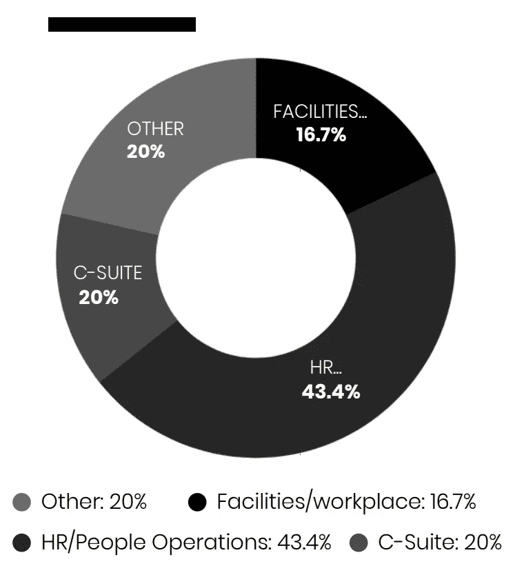

# 复工调查读数—湾区公司

> 原文：<https://medium.datadriveninvestor.com/return-to-work-survey-readout-bay-area-companies-224fee55d792?source=collection_archive---------17----------------------->

我很高兴与大家分享我们的“复工调查”的初步结果，这是由[柿子营销](https://www.persimmonmarketing.com/)(我的公司)和 [CMC OnDemand](https://cmcondemand.com/) 合作完成的。我们注意到，没有太多关于湾区公司如何规划其复工(RTW)战略的公开信息。因此，我们在 5 月中旬发起了这项调查，发现它对高管、运营、设施和人力资源主管等都有深刻的见解。

继续阅读一些精彩内容，您可以访问免费的读出报告( [**此处**](https://cdn2.hubspot.net/hubfs/5151038/Return%20to%20Work%20Survey%20Readout%206.13.20.pdf) )。

**我们的湾区读数报告的亮点示例:**

*   不同部门的调查参与者各不相同，43%是人力资源/人员运营，20%是其他部门——财务/支持/营销，17%是设施/工作场所/运营，20%是高管。
*   73%的公司正在制定复工计划，只有 13%的公司将复工计划推迟到今年晚些时候或 2021 年。另有 10%的公司没有改变目前的计划，4%的公司没有重新开业。
*   59%的公司计划保持办公空间面积的现状，而 30%的公司计划在 2020 年或 2021 年缩小其占地面积。只有 11%的公司计划在 2020 年或 2021 年增加面积。

**以下是未加闸的免费报告 PDF:**[https://CD N2 . hubspot . net/hub fs/5071869/Return % 20 to % 20 work % 20 survey % 20 readout . PDF](https://cdn2.hubspot.net/hubfs/5151038/Return%20to%20Work%20Survey%20Readout%206.13.20.pdf)

***我们将让调查持续到 2020 年 6 月 30 日，如果你是一家湾区公司，并且愿意做出贡献，你可以在这里*** ***点击*** [***。***](https://www.surveymonkey.com/r/3LKMPV6)

让我知道你是如何应对重返工作岗位这一艰难挑战的。请留言或联系我们:[https://www.persimmonmarketing.com/](https://www.persimmonmarketing.com/contact)。

 [## 释放结果的简单哲学|数据驱动的投资者

### 这是我们播客中帕迪·布鲁斯南的一段话。帕迪是一个正念和冥想老师，一个…

www.datadriveninvestor.com](https://www.datadriveninvestor.com/2020/03/16/a-simple-philosophy-to-unlock-results/)