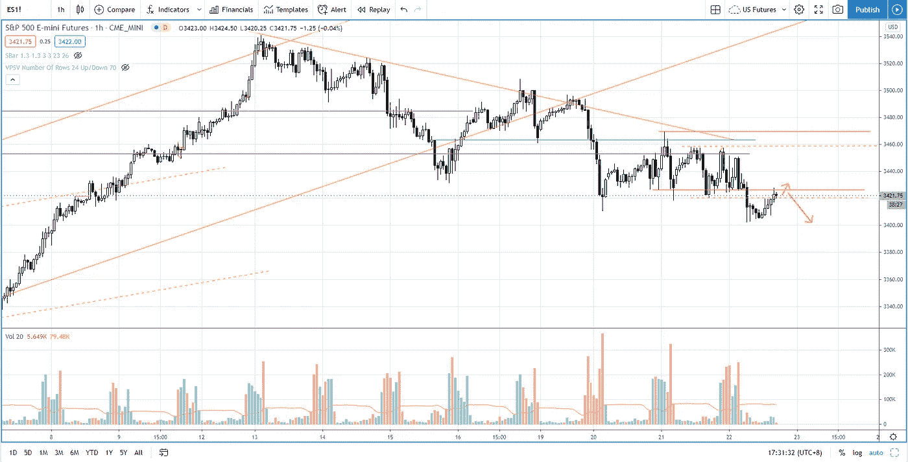
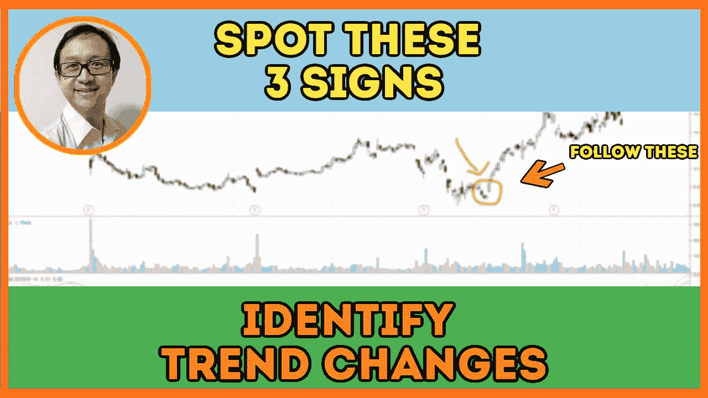

# 反转交易——用这三个信号来发现趋势变化(95%的交易者忽略了这些)

> 原文：<https://medium.datadriveninvestor.com/reversal-trading-detect-trend-changes-with-these-signs-19d0e1b56281?source=collection_archive---------14----------------------->

在交易回顾部分，你会发现如何用这三个经常被交易者忽略的信号进行反转交易和发现趋势变化。

观看视频，了解 2020 年 10 月 22 日交易时段标准普尔 500 指数期货的**每日市场分析。在这个视频中，我向你展示了上一个交易日的市场回顾和三分钟内的交易回顾(包括进场、出场和背后的原理)。展望未来，我将涵盖偏见，要注意的关键水平，我稍后的交易计划。**

## 时间戳

*   [1:07](https://www.youtube.com/watch?v=lzqOnbsWfmc&t=67s) 市场回顾
*   [4:35](https://www.youtube.com/watch?v=lzqOnbsWfmc&t=275s) 贸易回顾
*   [7:00](https://www.youtube.com/watch?v=lzqOnbsWfmc&t=420s) 检测趋势变化
*   供应的增加
*   [14:15](https://www.youtube.com/watch?v=lzqOnbsWfmc&t=855s) 当前市场前景
*   [14:15](https://www.youtube.com/watch?v=lzqOnbsWfmc&t=855s) 量差分析找出供应量

如果你还没有看我在上一期的[每日市场分析视频](https://priceactiontrading.medium.com/the-one-thing-every-trader-should-do-when-trading-false-breakout-s-p-500-day-trading-5f13ef146403)，以便更好地了解市场回顾和交易回顾。

**偏向** —中性(日内交易)；看涨(长期)

**关键点位** —阻力:3490–3500，3460，3430；支持:3380–3400

**潜在设置** —在关键级别寻找潜在反转。

# 资源

**每周市场展望&最佳交易建议**直达您的收件箱:[https://www.tradeprecise.com/](https://www.tradeprecise.com/)

**职业免费**制图平台:创建账户→[www.TradingView.com](https://bit.ly/2U2Femd)

**非美国居民？** ( **、新加波**、澳洲、纽西兰、欧洲等……):[点击此处，存款 2000 新币](https://ji.hn/sgtiger)即可获得**免费股票(价值 100++ &美元)老虎经纪公司的欢迎礼物**

美国居民？[点击此处，当您存入 1500 美元](https://ji.hn/ustradeup)时，就有机会在 TradeUP 上获得一份**免费的 AMZN 股票(价值 3000++美元** ) & **欢迎礼物**

**无限制访问媒体文章** —加入以下:[https://priceactiontrading.medium.com/membership](https://priceactiontrading.medium.com/membership)

# 进一步阅读

 [## 摇摆交易的顶级仙股——HNRG、QEP、SNDL，告诉[巨大的上涨潜力]

### 找出这 4 只最便宜的股票——HNRG、QEP、SNDL，告诉他们基于回调可以进行摇摆交易…

medium.com](https://medium.com/datadriveninvestor/top-penny-stocks-for-swing-trading-hnrg-qep-sndl-tell-huge-upside-potential-b4937a3ce955)  [## DDOG、MDB、净价行为分析——大规模行动即将到来？[内部关键级别]

### 了解为什么会有潜在的大规模迁移，以及 DDOG、MDB 和 NET 的关键扩展级别。

medium.com](https://medium.com/datadriveninvestor/ddog-mdb-net-price-action-analysis-massive-move-coming-key-levels-inside-b229d18e65ec)  [## 市场修正，泡沫还是崩盘？标准普尔 500 价格行为分析

### 标准普尔 500 期货(es)昨日因供应激增下跌 2.5%，跌破上行通道。这是正常的…

medium.com](https://medium.com/datadriveninvestor/market-correction-bubble-or-crash-s-p-500-price-action-analysis-6f26e6698dbc) 

Photo by Author — Ming Jong Tey

Photo by Author — Ming Jong Tey

披露:如果您点击本文中的链接进行购买或开立账户，并将所需金额存入推荐的经纪人账户，我们将免费为您赚取佣金。

免责声明:本演示中的信息仅用于教育目的，不应作为投资建议。