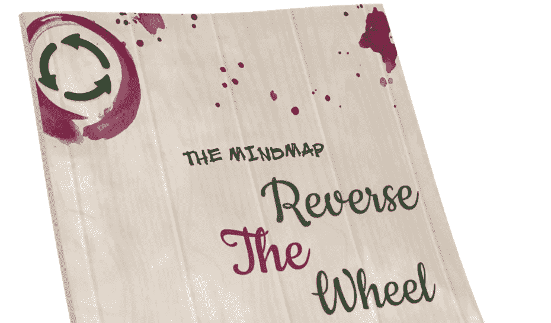
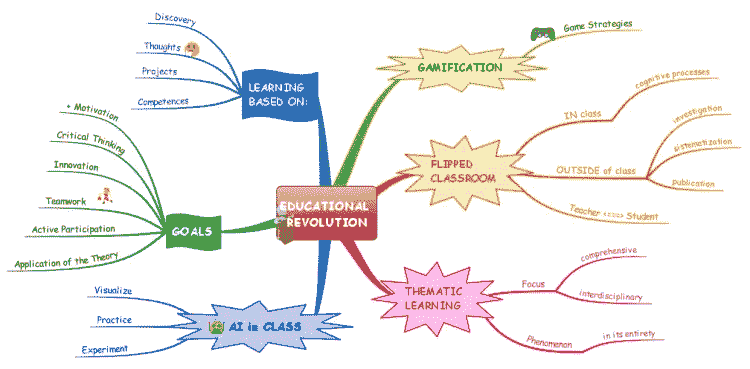
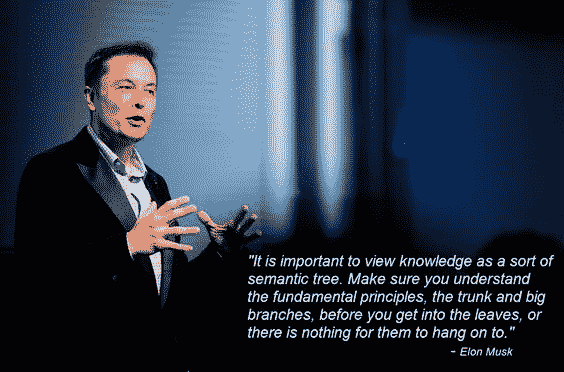
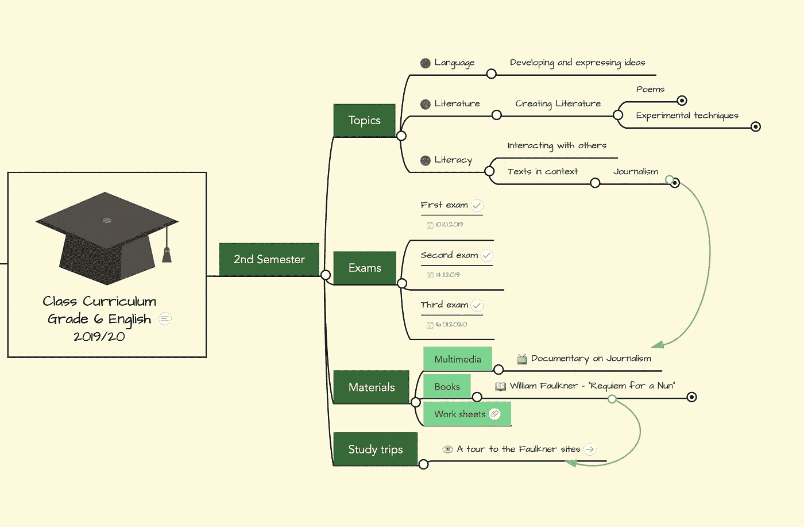

# 逆向思维导图，识别你的躯干，让教育有意义！

> 原文：<https://medium.datadriveninvestor.com/reverse-mind-map-identify-your-trunk-make-education-meaningful-2538f8c19c70?source=collection_archive---------6----------------------->

picture courtesy: reversethewheel.com

**什么是思维导图？**

它是一个层次图，直观地组织信息，并显示整体各部分之间的关系。与你在一张纸上或电脑上的 word 文档中做的传统笔记相比，思维导图让你在空白画布上捕捉思想、想法和关键词，以一种视觉上吸引人的方式在你的大脑中记录得更快更久。

**如何绘制思维导图？**

*   从空白页的中间开始，写下或画出你想要发展的想法。我建议你横向使用这个页面。
*   围绕这个中心主题展开相关的副主题，用一条线将每个副主题连接到中心。
*   对副主题重复相同的过程，生成您认为合适的较低级别的副主题，将每个副主题连接到相应的副主题。

建议你通过尽可能丰富地使用颜色、图画和符号，使你的思维导图尽可能地可视化。不是一个好的艺术家并不是你不创建自己的思维导图的借口。思维导图对你大脑的积极影响是令人兴奋的。此外，保持标签尽可能短。你总是会被诱惑，至少在开始的时候，去写一个合适的句子或者至少一个短语，但是试着抵制这种诱惑。这样你的思维导图会更有效。使用不同的厚度和长度来强调一点相对于另一点的优先性。每一点都有助于更好地开发你的大脑。

今天，思维导图已经被世界各地的教师作为一种有效的教学技术。它被认为有助于学生更好地记笔记，提高理解能力和培养创造力。思维导图在课堂上有多种应用方式。对于学生来说，这可以帮助他们计划和组织他们的工作，如论文，故事，报告，演示和考试复习工具。另一方面，教师可以使用它来计划会议、组织课程计划、向学生提供反馈、制作资源来帮助他们的教学，以及为他们的班级制作复习辅助工具。

下面是一个如何为论文写作创建**思维导图的例子。**

思维导图对学生和教师来说是一个非常独特的工具，因为它带有许多基本元素，可以轻松有效地表达概念，并更好地掌握内容。思维导图采用一种概念性的教学方法，帮助学生将一个主题形象化，并理解各种想法在理论和实践意义上是如何相互联系的。正如**在 BBC once** 节目中提到的，思维导图是“*高效的视觉辅助工具，可以让学生将各种想法组合在一起，也可以让教师直观地呈现想法。*“这也有助于教师评估学生的概念发展和理解。

现在，让我提醒你注意**埃隆·马斯克**曾经说过的话。在 Reddit AMA 网站上，有一次他的一个粉丝想知道他是用什么方法以如此惊人的速度学习了这么多不同的东西。这是他的回答:

给你一点建议:将知识视为一棵语义树是很重要的——在你进入树叶/细节之前，确保你理解了基本原则，即主干和大树枝，否则就没有什么可以依靠的了。”

马斯克的这些话太有道理了。想象一下，试图建造一座没有坚实地基的房子。他想说的正是，不要把房子建在不稳固的地基上。在确定基础知识之前，试图掌握一个主题的高级细节会使事情变得困难，因为你会进一步深入该主题，从而导致达不到最佳效果。基本上，他的意思是，不要急于进入一个更高级的话题，即使这可能是在你掌握核心原则之前首先吸引你的话题。

**什么是逆向思维导图？**

因此，正如马斯克所说，让我们确定主干，并清楚地了解核心基本面。教师和学生可以使用思维导图以最有效的方式获取相关内容。那么什么是逆向思维导图，为什么它很重要？

我们教育制度的问题一直是学生被迫学习他们不感兴趣的科目。很多时候，他们缺乏兴趣，原因很简单，他们不明白学习某一特定科目的必要性。反之则更糟。不管出于什么原因，学生们只是开始喜欢上一门特定的学科，并把所有的注意力都集中在这门学科上。现在几年过去了，他们意识到在现实世界中没有什么让他们感兴趣的东西，在那里他们可以使用他们曾经如此热爱的特定主题。从我的个人经历来看，我曾经热爱物理，但随着年龄的增长，我意识到现实生活中没有我喜欢并使用物理的职业选择。

picture courtesy: mindmeister.com

逆向思维导图将帮助我们解决这个问题。让我们考虑上面的思维导图，六级英语处于思维导图的中心。对于一个六年级的学生来说，很难像那样爱上这门学科。但是，有了如上所述的精心绘制的思维导图，学生就会知道，为了更好地发展和表达自己的想法，她需要很好地掌握“英语语言”，这是六年级英语将要涉及的主题之一。同样，如果她想写诗或从事新闻业，她需要在六年级英语上取得好成绩。因此，偷偷瞥一眼思维导图的末端节点(马斯克语言中的树叶)将有助于孩子分层次地将地图反转到思维导图的中心，并让她明白，为了清晰地表达自己的想法或写诗，或者以后在她的生活中从事新闻职业，她需要更多地专注于地图的中心部分(马斯克语言中的树干)。这给了她必要的注意力和兴趣去额外关注她的六年级英语。

我真的希望像思维导图这样的东西在我的学生时代流行，那时我可以专注于对我真正重要的主题。但是，正如他们所说的，迟做总比不做好，我打算在我的大儿子(目前上五年级)中学快结束的时候使用这种方法，从而与他一起，尝试并确定未来可能对他有价值和感兴趣的主题。我并不主张这种方法一定会帮助他识别那些在未来会给他带来价值的科目，但我相信这一定会帮助他识别一两个不会给他带来价值的科目。