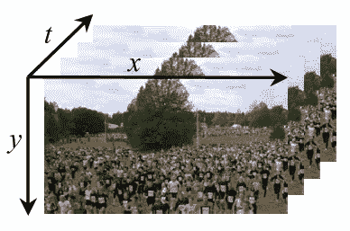
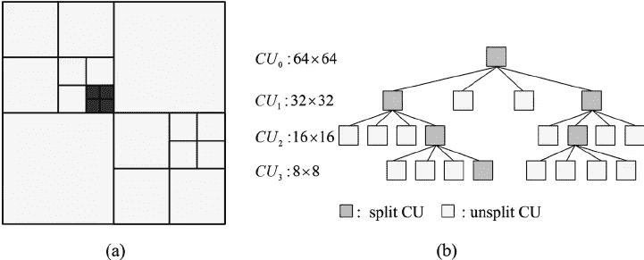
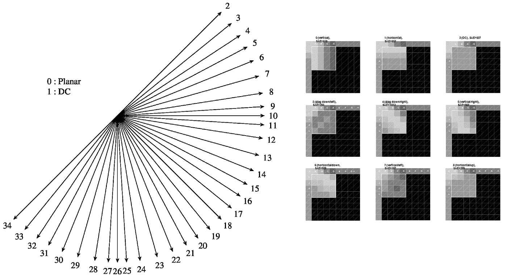
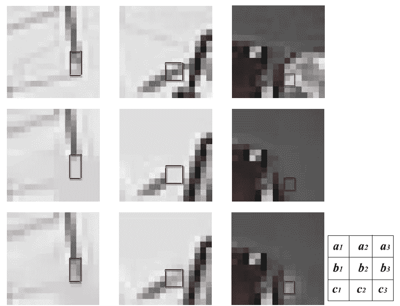

# 综述:IPCNN —帧内预测卷积神经网络(HEVC 帧内预测)

> 原文：<https://medium.datadriveninvestor.com/review-ipcnn-intra-prediction-convolutional-neural-network-hevc-intra-prediction-a8d00409156?source=collection_archive---------7----------------------->

## 与 HEVC 参考软件 HM-14.0 相比，比特率降低了 0.70%

在这篇报道中，简要回顾了哈尔滨工业大学的**基于卷积神经网络的 HEVC 帧内预测(IPCNN)** 。作者提到这是第一篇将 CNN 直接应用于 HEVC 的帧内预测的论文。我回顾这一点是因为我从事视频编码研究。这是一篇发表在 **2017 DCC** 的论文。( [Sik-Ho Tsang](https://medium.com/u/aff72a0c1243?source=post_page-----a8d00409156--------------------------------) @ Medium)

# 概述

1.  **视频编码的重要性**
2.  **传统 HEVC 帧内编码**
3.  **IPCNN 网络**
4.  **实验结果**

# **1。视频编码的重要性**



**A video is composed of a sequence of frames**

*   视频编码/压缩是将原始视频编码成压缩的比特流以便存储，或者在通过互联网发送到解码器端之前。
*   **视频由一系列帧组成**
*   在没有视频编码的情况下，假设有一个小时(t)的 30FPS 1920(W)×1080 (H) RGB (C)视频，每个颜色分量(C)一个字节，则 raw 文件大小为:

```
W×H×C×FPS×t=1920×1080×3×30×(60×60)=625GB
```

*   对于普通用户来说，不可能存储如此大文件。
*   或者如果发送出去，需要的时间长，数据计划将是昂贵的。
*   通过视频编码，这个一小时的视频可能只有 1GB，视频质量已经很好了。
*   我们在 YouTube/Twitch/Instagram 上观看的每一个视频都已经被压缩了。
*   当我们在互联网上观看时，图像通常是压缩的，例如 PNG/JPG,除非我们正在对照片进行专业的照片编辑。
*   深度学习的数据集通常是压缩的。
*   因此，视频编码/压缩至关重要，它每天都在我们身边出现。

# 2.传统 HEVC 帧内编码

## 2.1.HEVC 视频编码


**A video is composed of a sequence of frames**

*   在 H.264、HEVC 和 VVC 等视频编码标准中，本文采用并改进了 HEVC(高效视频编码)。
*   在 HEVC，帧被分成不重叠的块，称为编码树单元(CTU)。每个 CTU 的大小为 64×64。使用光栅扫描顺序从左上到右下对 CTU 进行编码。



**Quad-Tree Coding**

*   对于每个 CTU，应用四叉树编码将 CTU 分成 4 个更小的正方形编码单元(Cu ),从 64×64，32×32，16×16 到 8×8。通过比较每个 CU 级别的 CU 的成本，选择不同大小的 CU 来编码每个 CTU。
*   (8×8 Cu 可以分成 4 个 4×4 预测单元(pu)，但这不是这个故事的重点。)
*   每个 CU 通过不同的方法编码，例如帧内预测和帧间预测。
*   在本文中，作者只关注帧内预测。
*   (还有帧间预测，其中在帧中找到相似的块，以更有效的方式压缩帧，这也称为运动估计。)

[](https://www.datadriveninvestor.com/2019/01/28/ai-creativity-deep-dream-comes-true/) [## 人工智能与创造力:梦想成真|数据驱动的投资者

### 人工智能总是让我着迷。不仅作为一套有用的工具，不断发展，而且作为一个…

www.datadriveninvestor.com](https://www.datadriveninvestor.com/2019/01/28/ai-creativity-deep-dream-comes-true/) 

## 2.2.HEVC 的 35 个帧内预测



**35 Intra Predictions in HEVC (Left), Some Examples (Right)**

*   对于帧内预测中的每个 CU，如上所示有 35 个预测。
*   **邻居参考样本用于预测当前 CU。**
*   **0:平面**，预测 CU 内平滑渐变。
*   **1: DC** ，用平均值填入 CU 作为预测。
*   **2–34:角度**，用不同的角度预测当前 CU。
*   一些例子显示在图的右边。

# **3。IPCNN 网络**


**IPCNN Network (Left: Training, Right: Testing)**

## 3.1.培养

*   通过 HEVC 帧内编码收集训练样本，该编码包括最佳 8×8 帧内预测块(粉红色)及其三个最近的 8×8 重构块(绿色)。
*   IPCNN 的输出是通过从输入块中减去原始块而产生的剩余块。
*   然而，作者在论文中没有提供网络体系结构的细节。

## 3.2.测试(帧内预测)

*   包括当前块及其三个最近的 8×8 重构块的 16×16 上下文块被馈送到网络中。
*   网络的输出是剩余块。
*   同时，这三个最近的 8×8 重构块也可以被细化。

# **4。实验结果**



**Visual Quality**

*   **(ai)** :原始图像
*   **(bi)** :原 HEVC 预测块
*   **(ci)**:IPCNN 预测的块
*   IPCNN 预测的区块优于 HEVC 预测的区块。
*   最后，**与 HEVC 参考软件 HM-14.0 相比，比特率降低了 0.70%。**
*   减少 0.7%已经是视频编码的一大成就。

# 参考

【2017 DCC】【IPCNN】
[基于卷积神经网络的 HEVC 帧内预测](https://ieeexplore.ieee.org/document/7923719)

# 编解码器预测

[[IPCNN](https://medium.com/@sh.tsang/review-ipcnn-intra-prediction-convolutional-neural-network-hevc-intra-prediction-a8d00409156)][[IPFCN](https://medium.com/@sh.tsang/review-ipfcn-intra-prediction-using-fully-connected-network-hevc-intra-prediction-28de33dff3a5)][[NNIP](https://medium.com/@sh.tsang/review-nnip-neural-network-based-inter-prediction-for-hevc-hevc-inter-prediction-e11b43a15385)][[李 TCSVT'18](https://medium.com/@sh.tsang/review-li-tcsvt18-cnn-upsampling-for-hevc-intra-coding-hevc-intra-prediction-a3263c2be0d5) ]

# [我之前的其他评论](https://medium.com/@sh.tsang/overview-my-reviewed-paper-lists-tutorials-946ce59fbf9e)