# 快速递归神经网络综述

> 原文：<https://medium.datadriveninvestor.com/review-on-fast-rcnn-202c9eadd23b?source=collection_archive---------0----------------------->

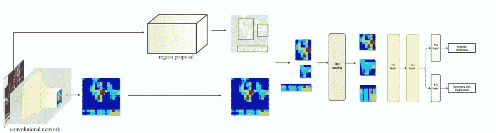

深度卷积网络显著提高了图像分类和目标检测的准确性。与图像分类相比，目标检测是一项更具挑战性的任务，需要更复杂的方法来解决。在快速 R-CNN 到来之前，大多数方法在多级管道中训练模型，速度慢且不美观。在这篇文章中，我将对 Ross Girshick 的论文作一个详细的评论。我们将回顾分为 7 个部分:

1.  **现有技术(R-CNN 和 SPP-Net)的缺点**
2.  **快速 RCNN 架构**
3.  **训练**
4.  **检测**
5.  **一些进一步的观察和评估**
6.  **与现有技术结果的比较**
7.  **主要结果**

# 1.现有技术的缺点(R-CNN 和 SPP-Net)

快速 R-CNN 提出了一种单阶段训练算法，该算法联合学习对对象提议进行分类，并细化它们的空间位置。它是对 R-CNN 和 SPP-Net 的改进。

R-CNN 的一些缺点是:

*   **训练是多级流水线:**在 R-CNN 中，首先使用 log loss 对 Convnet 进行对象提议的微调。然后，它通过替换 Soft Max 使 SVM 适应 Convnet 功能。在第三阶段，训练回归变量。
*   训练在空间和时间上都是昂贵的。
*   **检测也很慢。**

R-CNN 的主要缺点是速度慢。这主要是因为 Convnet 向前传递每个对象的建议。每幅图像大约有 2000 个物体像。SPP-Net 解决了这个问题，因为它计算整个图像的特征图，然后通过 **ROI 投影将 ROI 建议嵌入到这些特征图中。** SPP-Net 在测试时间将 R-CNN 加速 10 到 100 倍。由于更快的建议特征提取，训练时间也减少了 3 倍。即便如此，SPP-Net 也有几个缺点。主要缺点是:

*   **训练是多级流水线。**
*   **中提出的微调算法无法更新空间金字塔池之前的卷积图层。(但在 R-CNN 中可能)**

快速 R-CNN 是针对 R-CNN 和 SPPnet 的缺点而提出的一种新的训练算法。一些显著的特征是:

*   单级管道培训。
*   比 R-CNN、SPPnet 更高的检测质量(mAP)
*   训练可以更新所有层。
*   特征捕捉不需要磁盘空间。

 [## 为什么加密对日常生活至关重要？数据驱动的投资者

### 你几乎每天都要输入密码，这是你生活中最基本的加密方式。然而问题是…

www.datadriveninvestor.com](https://www.datadriveninvestor.com/2020/02/10/why-encryption-is-critical-to-everyday-life/) 

# 2.快速 RCNN 体系结构

快速 R-CNN 采用一组对象提议和图像作为输入。网络将该图像通过几个卷积层和最大汇集层，并形成特征图。使用 ROI 投影将目标方案映射到特征图上。ROI 投影就是在特征图上找到与原始图像中的坐标相对应的区域建议的坐标。我稍后会解释。

对于每个对象提议，感兴趣区域(ROI)池层将提取固定长度的特征向量，并将其通过完全连接的层。这些完全连接的层分为两个输出层:

*   产生 K+1 个类别(K 个类别和 1 个背景类别)的软最大概率的函数
*   另一个为 K 个类提供边界框坐标。

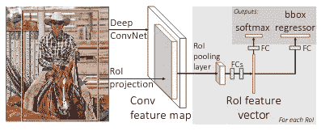

在进一步解释之前，最好先解释一些你需要理解的概念。

## **2.1 ROI 投影**

在快速 RCNN 方法中，原始图像中的区域建议被投影到最终卷积特征图的输出上。这是投资回报池稍后使用。

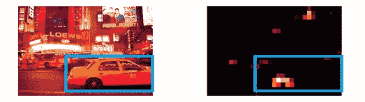

您可能认为输入图像和生成的特征图是不同的维度。那么如何将 ROI 建议书从图像转化为特征图呢？

别担心，我会用一个例子来解释。

首先你需要知道**子采样率**。

假设我们有一个 18x18 的图像。在经过一些卷积和最大池后，假设我们得到一个 1x1 的特征图。那么我们会说，我们将有一个 1/18 的子采样比。它是输出特征图与输入图像的比例。

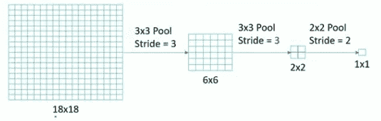

我再解释一个例子。在下图中，我们的输入大小为 18x18，输出特征映射大小为 3x3。那么我们将得到 3/18 = 1/6 的子采样率

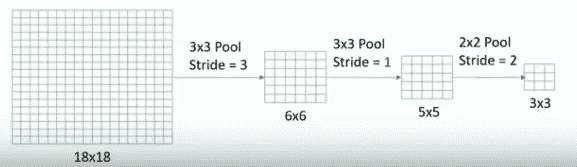

现在我们了解了子采样率。接下来，我们将了解这如何有助于 ROI 预测。假设我们的输入图像大小为 688x920，特征图大小为 43x58。我们有一个大小为 320x128 的区域提案。

子采样率= 58/920 = 1/16

新边界框坐标= (320/16，128/16) = (20，8)

新边界框中心= (340/16，450/16) = (21，28)

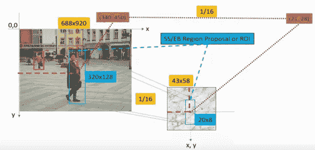

这就是我们如何对区域提案进行投资回报预测，我想现在你已经清楚这个概念了。接下来，我们将了解投资回报池是如何实现的。

## **2.2 投资回报池**

通常在提案阶段，我们会生成许多区域。这是因为一旦物体在第一阶段没有被检测到，它在任何阶段都不会被分类。我们不能在召回问题上妥协。我们的网络应该具有高召回率。因此必须产生大量的建议，但它也有一些缺点。

*   生成大量感兴趣区域会导致性能问题。这将使得实时对象检测难以实现。
*   我们不能一次训练完系统的所有组件。

投资回报池作为一种解决方案应运而生。RoI 图层只是 SPP 网络中使用的空间金字塔池图层的特例，其中只有一个金字塔等级。它还加快了培训和测试过程。它需要两个输入。

1.  由深度卷积网络产生的固定大小的特征图。
2.  表示感兴趣区域列表的 N×5 矩阵，其中 N 是感兴趣区域的数量。第一列表示图像索引，其余四列是该区域左上角和右下角的坐标

对于输入列表中的每个感兴趣区域，它从输入要素地图中提取相应的区域，并将其缩放到某个预定义的大小(例如 7x7)。缩放通过以下方式完成:

1.  将区域建议划分为大小相等的部分(其数量与输出的维度相同)
2.  找出每一部分的最大值
3.  将这些最大值复制到输出缓冲器

我通过一个例子来说明。让我们的特征图如下，ROI 是特征图内的黑色方块。这里，我们将把 roi 缩小到 2x2 的大小。

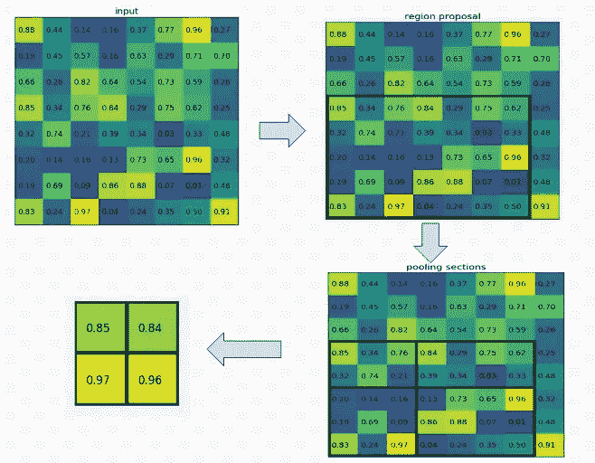

*注意:感兴趣区域的大小不必被汇集部分的数量整除(在这种情况下，我们的 RoI 是 7×5，我们有 2×2 个汇集部分)。*

# 3.培养

用反向传播训练所有网络权值是 Fast-RCNN 的一个重要功能。在开始之前，最好知道，

***为什么 SPP 网无法更新空间金字塔池层以下的权重？***

根本原因是当每个训练样本(即 RoI)来自不同的图像时，通过 SPPlayer 的反向传播是非常低效的，这正是 R-CNN 和 SPP 网络被训练的方式。

在 Fast-RCNN 中，我们提出了一种更有效的方法，在训练中，随机梯度下降(SGD)小批量被分层采样，首先通过采样 N 个图像，然后通过从每个图像采样 R/N 个 ROI。例如，当使用 N= 2 和 R= 128 时，所提出的训练方案比从 128 个不同图像中采样一个 RoI 大约快 64 倍(即，R-CNN 和 SPP 网络策略)。

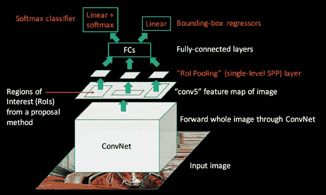

## 3.1 多任务损失:

快速 Rcnn 体系结构具有两个输出层:一层预测 K+1 个类概率，另一层输出包围盒回归偏移，

tk = (tk-x，tk-y，tk-h，tk-w)

其中 tk 指定相对于对象提议的不变平移和对数空间高度/宽度移动。

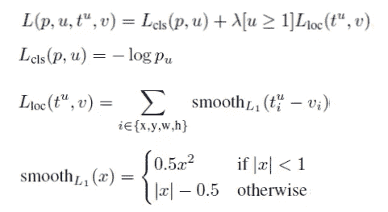

*Lcls* 是真实等级 *u* 的对数损失。
Llos 是边界框的损失**。**我们使用平滑 L1 损耗，而不是 R-CNN 和 SPP-Net【u≥1】中使用的 L2 损耗，当 u≥1 时等于 1。(u=0 是背景类)

# 4.侦查

一旦训练了网络，检测就只是向前传递(假设对象提议是预先计算的)。该网络采用输入图像(或图像金字塔，编码为图像列表)和 R 对象提议列表来评分。r 通常在 2000 左右。当使用图像金字塔时，每个 RoI 被分配给比例，使得缩放后的 RoI 最接近 224 像素。

现在，图像被向前传递，并且获得类别概率和包围盒预测。然后，我们对每个类独立地执行非最大值抑制，并获得最佳包围盒。

# 5.一些进一步的观察和评价

## 5.1 多任务损失评估

评估了 3 个模型:

## S = AlexNet 或 CaffeNet
M =类似 VGG 的更宽版本 S
L = VGG-16

*注意:我们稍后也将使用 S、M、L 符号*

在多任务丢失的情况下，与阶段式训练相比，获得更高的 mAP，

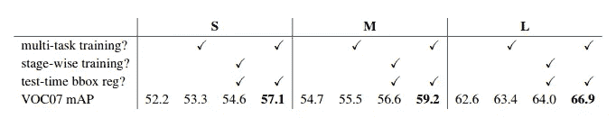

multi task training.Obtained mAP greater than stage wise training

## 5.2 SVM 与软最大分类

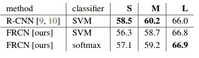

软马克斯比 SVM 表现更好。

## 5.3 截断奇异值分解，检测速度更快

对于整幅图像分类，与 conv 图层相比，计算全连通图层所花费的时间较少。相反，对于检测来说，要处理的 ROI 的数量很大，并且将近一半的前向通过时间花费在计算完全连接的层上。通过用截短的 SVD 压缩它们，大的完全连接的层很容易被加速。

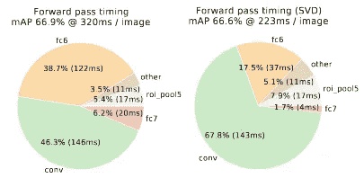

Timing for VGG16 before and after truncated SVD.

## 5.4 不同规模的培训

我们使用了两种方法:暴力方法和图像金字塔。

在强力方法中，在训练和测试期间，每个图像都以预定的像素大小进行处理。网络必须从训练数据中直接学习尺度不变对象检测。

在多尺度训练期间，每次对图像进行采样时，都会对金字塔尺度进行随机采样，这是一种数据扩充形式。由于 GPU 内存限制，我们仅对较小的网络进行多尺度训练实验。

在测试期间，用 5 种不同的标度测试输入图像，并获得 VOC07 的以下结果。

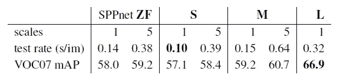

1 scale vs 5 scale

## 5.5 精细车削层

对于 SPP-Net 和 R-CNN 微调，只有完全连接的层似乎足以获得良好的精度。但是在快速 RCNN 的情况下，使用另一种方法。十三个卷积层被冻结，只允许完全连接的层学习。但它使平均动脉压从 66.9%下降到 61.4%。

***这是否意味着所有卷积层都要微调？***

简而言之，没有。在较小的网络(S 和 M)中，我们发现 conv1 是通用的，并且与任务无关。这意味着，无论我们是否微调 conv1，它的性能都是一样的。对于 VGG16，他们发现只需要更新 conv31 及以上的层(13 层 conv 中的 9 层)。这改进了地图。

## 5.6 区域提案

提议越多越好吗？

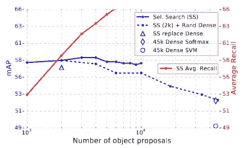

VOC07 test mAP and avg recall

我们发现，随着提案数量的增加，mAP 先上升，然后略有下降。我们可以看到越来越多的建议并不总是增加地图。

# **6。与最先进结果的比较**

## 6.1 VOC2007

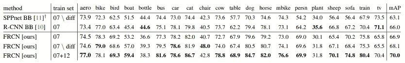

*快速 R-CNN: 66.9% mAP
快速 R-CNN 在训练过程中移除了困难示例:68.1% mAP
快速 R-CNN 带外部 VOC 2012 训练:70.0% mA* ***P***

## 6.2 VOC2010

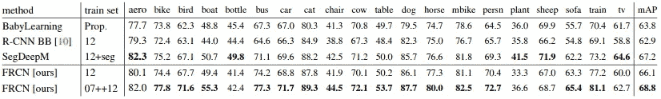

## 6.3 VOC2012

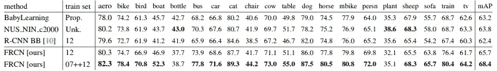

# 7.主要结果

三个主要结果支持了本文的贡献:

**1。VOC07、2010 和 2012 年的最新地图**

**2。与 R-CNN、SPPnet3 相比，训练和测试速度更快。**

**3。在 VGG16 中微调卷积层可以改善贴图。**

# 参考

*   [https://deep sense . ai/WP-content/uploads/2017/02/1504.08083 . pdf](https://deepsense.ai/wp-content/uploads/2017/02/1504.08083.pdf)
*   [https://deepsense.ai/region-of-interest-pooling-explained/](https://deepsense.ai/region-of-interest-pooling-explained/)
*   [https://medium . com/coin monks/review-fast-r-CNN-object-detection-a82e 172 e 87 ba](https://medium.com/coinmonks/review-fast-r-cnn-object-detection-a82e172e87ba)
*   [https://www.youtube.com/watch?v=wGa6ddEXg7w&list = pl 1 gqavho 4 f _ jlxookw7 cs 5ky _ j 1 t1 t 17s&index = 72](https://www.youtube.com/watch?v=wGa6ddEXg7w&list=PL1GQaVhO4f_jLxOokW7CS5kY_J1t1T17S&index=72)