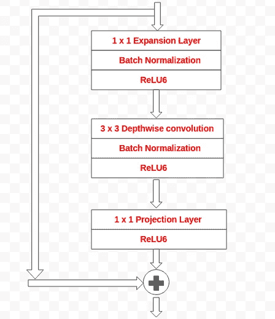
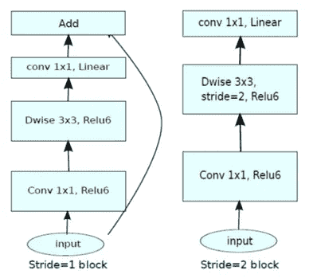
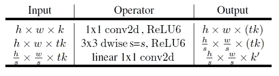
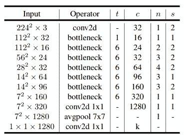
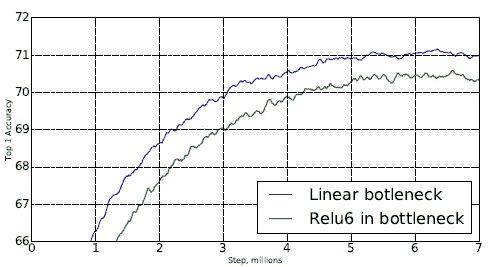
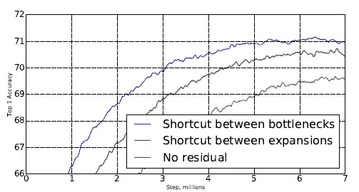
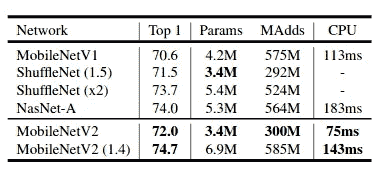
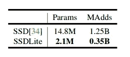
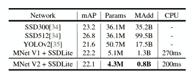
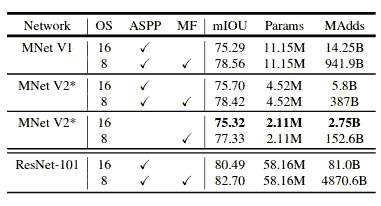

# 移动网络 v2 综述

> 原文：<https://medium.datadriveninvestor.com/review-on-mobile-net-v2-ec5cb7946784?source=collection_archive---------0----------------------->

在本文中，我们将浏览来自 google 的 MobileNetv2 论文。移动网络 v1 背后的基本想法是用更便宜的卷积替换昂贵的卷积。这是一个巨大的成功。v2 架构的主要变化是使用了反向瓶颈块和剩余连接。

## 内容

1.  **倒瓶颈块**
2.  **了解管道**
3.  **建筑**
4.  **实验和结果**

# 1.倒置瓶颈块

*   MobileNetv2 仍然使用深度可分离卷积。但是现在它有一个瓶颈残差块，而不仅仅是一个深度可分离卷积块。

Bottleneck residual block

*   瓶颈残差块中有 **3 个卷积层**。我们知道移动网络 v1 中的最后两层。它们是**深度方向卷积层**，后面是 **1 x 1 点对点卷积层**。
*   在 MobileNetv1 中，逐点卷积要么保持通道数量不变，要么将通道数量增加一倍。但这里 1 x 1 卷积使得通道数更少。它被称为**投影层**。这一层也称为瓶颈层，因为它减少了通过它的数据流量。
*   第一层是 1×1**扩展层**。它扩展了流经它的数据(增加了通道的数量)。它的作用与投影层相反。数据根据**扩展因子**进行扩展。这是一个可以从不同的架构权衡中找到的超参数。默认的扩展因子是 **6。**
*   第二层是我们已经知道的深度卷积层(在我对 MobileNetv1 的**评论中讨论过)。**
*   瓶颈剩余块中另一个重要的东西是一个**剩余连接。它的工作原理和 ResNet 中的一样。**
*   ReLU6 用作激活功能。无非就是 **min(max( *x* ，0)，6)。**
*   除了项目层，每个层都有一个批处理规范化层和激活函数(ReLU6)。投影层只有批量归一化，因为投影层的输出是低维的，作者发现使用 ReLU6 引入非线性会降低性能。

stride =1 and stride = 2 block

**注意:如果步幅=2 用于深度方向卷积，则反向瓶颈块不会有剩余连接。**

# 2.了解管道

通常低维张量是减少计算量的关键。但是，单独使用效果不会很好。对这个低维张量应用卷积运算不会产生好的结果。所以我们应该对更大的张量应用卷积运算。这里，数据以压缩的方式在网络中流动。每当数据到达瓶颈块时，它就会被扩展。此外，还会应用过滤器并进行压缩。

# 3.体系结构

*   主要有两种类型的块，一种是步长为 1 的瓶颈块，另一种是步长为 2 的瓶颈块。如上所述，每个块有 3 层。如果跨距=2 用于深度方向卷积，瓶颈块将没有剩余连接。

*   在大多数层中，使用的膨胀系数是 6。如果输入有 64 个通道，则输出有 64×6=384 个通道。

这里 **t** 是扩展因子， **c** 是输出通道数， **n** 是重复数， **s** 是步幅。

## 线性瓶颈的影响

Impact of linear bottleneck

*   无需 Relu6 激活，性能更佳

## 快捷连接的影响

*   当捷径在瓶颈之间时会得到更好的结果。

# 4.实验和结果

## ImageNet 分类

Performance on ImageNet

*   在模型大小和计算成本相当的情况下，MobileNetV2 优于 MobileNetV1 和 ShuffleNet(1.5)。
*   使用 1.4 的宽度乘数，MobileNetV2 (1.4)比 ShuffleNet (×2)和 NASNet 具有更快的推理时间。

## MS-COCO 上的目标检测

SSD + mobile net performance

*   **SSD** **Lite** 通过用深度方向可分离卷积(MobileNetV1)代替普通卷积而引入。它减少了参数数量和计算成本。
*   **MobileNetV2**+**SSD Lite**以明显更少的参数和更小的计算复杂度实现了具有竞争力的精度。而且推理时间也比 MobileNetV1 快。

## 语义分割

*   MobileNetv2 与 **DeepLabv3** 一起用作特征提取器。

performance segmentation deeplabv3 + mobile net

***注:可以查看我的***[***py torch***](https://github.com/arunm8489/Paper-Model-Implementation-From-Scratch/tree/master/MobileNet-v2)***实现来进一步了解架构。***

 [## AI 将军是否已经超过了人类的智力容量？数据驱动的投资者

### 不仅在游戏中，而且在劳动力市场上，机器都比人类聪明。在今天的许多领域，使用…

www.datadriveninvestor.com](https://www.datadriveninvestor.com/2020/02/12/has-general-ai-exceeded-the-intellectual-capacity-of-humans/) 

# 参考

*   [https://arxiv.org/pdf/1801.04381.pdf](https://arxiv.org/pdf/1801.04381.pdf)
*   [https://machinethink.net/blog/mobilenet-v2/](https://machinethink.net/blog/mobilenet-v2/)

**访问专家视图—** [**订阅 DDI 英特尔**](https://datadriveninvestor.com/ddi-intel)