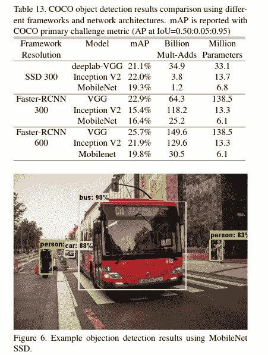

# MobileNet v1 综述

> 原文：<https://medium.datadriveninvestor.com/review-on-mobilenet-v1-abec7888f438?source=collection_archive---------1----------------------->

在这篇文章中，我将解释关于 [**MobileNets:用于移动视觉应用的高效卷积神经网络**](https://arxiv.org/pdf/1704.04861.pdf) 论文来自**谷歌**。他们开发了一类称为 MobileNets 的高效模型，主要关注移动和嵌入式视觉应用。一句话，他们模型的主要焦点是通过在不牺牲性能的情况下减少参数数量来提高网络的效率。

# **主题**

1.  **深度方向可分离卷积**
2.  **网络架构**
3.  **宽度乘数**
4.  **分辨率乘数**
5.  **性能对比**

# 1.深度方向可分卷积

这是 MobileNet 纸的核心基础。这是一个**深度方向卷积**，后面是一个**点方向卷积**。在开始深度方向卷积和点方向卷积之前，让我们了解一下普通卷积是如何工作的。

## **正常卷积是怎么做的？**

Normal convolution

这里我们有一个输入图像大小为 12x12x3。如果我们使用步幅=1 的 5x5x3 内核进行卷积，我们将得到 8x8x1 的输出大小。通常，在卷积运算中，我们指定输出中需要 N 个通道。在这段时间里，相同的操作用不同的内核重复了 N 次。假设 N = 10。那么总的计算成本就变成了**8**8×5×5×3×10 = 48000

Normal convolution

我们可以说，标准卷积图层输入将输入作为一个 **Df x Df x M** 特征地图，并生成 **Df x Df x N** 输出特征地图，其中 Df 是方形输入特征地图的空间宽度和高度。m 是输入通道的数量，N 是输出通道的数量。标准卷积层由大小为 Dk×Dk×M×N 的卷积核 K 参数化，因此总计算成本变为**Dk×Dk×M×N×Df×Df。**

computational cost standard convolution

## 深度方向可分卷积

如果我们能够根据深度来划分这个卷积过程。深度方向可分离卷积由两部分组成:

*   **深度方向卷积**
*   **逐点卷积**

Depthwise convolution

这里我们有 3 个输入通道。假设我们有 3 5 x 5 x 1 个内核。这里发生的是 5x5x1 内核迭代输入图像的第一个通道以产生 8x8x1 输出。每个 5×5×1 内核对输入图像中相应的通道进行操作。现在，我们将所有三个这样的输出堆叠起来，得到 8×8×3 的输出。这就是深度卷积的工作原理。

下一个是**逐点卷积**。我们将使用 1 x 1 x 3 内核对获得的 8 x 8 x 3 图像进行卷积。这将产生一个特征图。我们将使用 10 个不同的 1 x 1 x 3 内核重复这一过程，以产生 10 个特征图，并将它们堆叠在一起。

pointwise convolution

这里计算的总数是 8**x 8x 5 x 5 x 3+8 x 8 x 10 x 3 = 4800+1920 = 6720**

总计算成本为

computational cost depth separable convolution

因此，计算量减少为

**注意:通过使用 3x3 内核，可以减少大约 7 到 8 倍的计算量(4 *8000/6720 =~ 7.14* )。**

# **2。网络架构**

*   该网络由 28 个卷积层和 1 个全连接层组成，后面是 softmax 层。
*   注意，在卷积之后应用批量归一化和 ReLU

# **3。宽度乘数**

引入宽度乘数αα以进一步降低计算成本。所以 M 变成αM。所以深度方向可分离的计算成本变成

computational cost with width multiplier.

其中α在 0 到 1 之间。α的典型值为 1、0.75、0.5 和 0.25。当α = 1 时，我们有基线 MobileNet。

performance with different α values

# 4.分辨率乘数

引入分辨率乘数ρ来控制网络的图像分辨率。用ρ计算成本变成

computational cost with resolution multiplier

其中ρ在 0 到 1 之间。相应的分辨率为 224、192、160 和 128。当ρ=1 时，为基线 MobileNet。

# 5.性能比较

*   MobileNet-224 的性能优于 GoogLeNet(2014 年 ILSVRC 冠军)和 VGGNet(2014 年 ILSVRC 亚军),而且参数也更低。

*   当使用更小的 MobileNet(**0.50 MobileNet-160**)时，它以更少的 add 和参数胜过 AlexNet 和 Squuezenet。

*   对于使用移动网络作为主干的对象检测任务，性能如下

***你可以查看我的*** [***笔记本***](https://github.com/arunm8489/Paper-Model-Implementation-From-Scratch) ***对于 PyTorch 实现的 MobileNet v1。***

 [## 修复摄影|数据驱动的投资者

### 汤姆·津伯洛夫在转向摄影之前曾在南加州大学学习音乐。作为一个…

www.datadriveninvestor.com](https://www.datadriveninvestor.com/2019/03/22/fixing-photography/) 

# **参考**

*   [https://arxiv.org/pdf/1704.04861.pdf](https://arxiv.org/pdf/1704.04861.pdf)
*   [https://towards data science . com/review-mobilenetv1-depth wise-separable-convolution-light-weight-model-a 382 df 364 b 69](https://towardsdatascience.com/review-mobilenetv1-depthwise-separable-convolution-light-weight-model-a382df364b69)
*   [https://towards data science . com/a-basic-introduction-to-separable-convolutions-b99ec 3102728](https://towardsdatascience.com/a-basic-introduction-to-separable-convolutions-b99ec3102728)

## 获得专家视图— [订阅 DDI 英特尔](https://datadriveninvestor.com/ddi-intel)