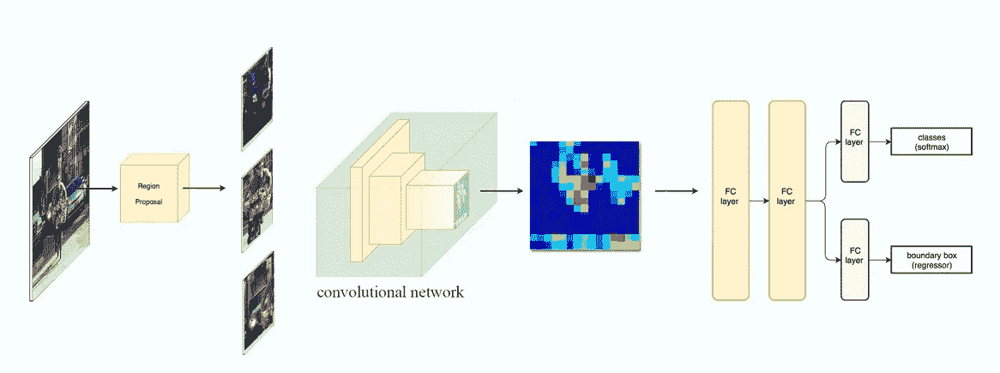
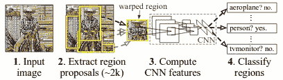
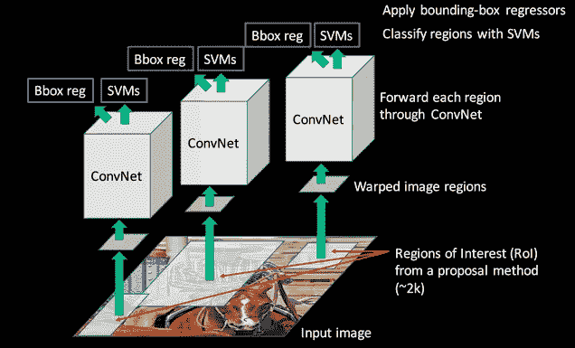
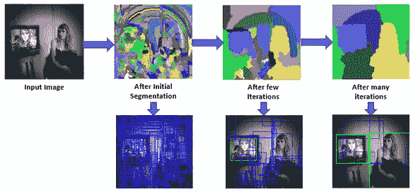
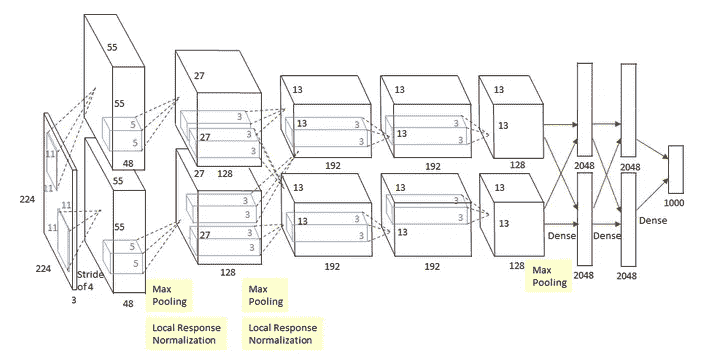
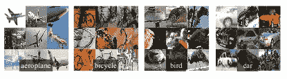
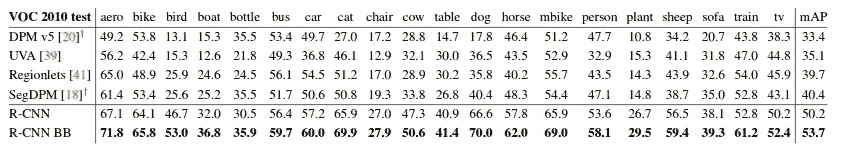
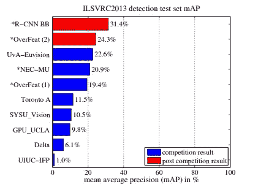

# RCNN 综述

> 原文：<https://medium.datadriveninvestor.com/review-on-rcnn-c079fc269a7d?source=collection_archive---------4----------------------->

深度卷积网络显著提高了图像分类和目标检测的准确性。当进行目标检测时，与图像分类相比，它是具有挑战性的，因为我们需要定位目标。为了进行对象检测，我们需要知道对象的类别以及边界框的大小和位置**。**

区域 CNN (R-CNN)是最先进的基于 CNN 的深度学习对象检测方法之一。基于此，有**快速 R-CNN** 和**更快 R-CNN** 用于更快速度的对象检测，以及**掩模 R-CNN** 用于对象实例分割。我觉得对于从物体检测开始的人来说，理解快速 RCNN 是不可避免的。

该论文首次表明，与基于更简单的 HOG-like 特征的系统相比，CNN 可以在 PASCAL VOC 上导致显著更高的对象检测性能。

 [## AI 将军是否已经超过了人类的智力容量？数据驱动的投资者

### 不仅在游戏中，而且在劳动力市场上，机器都比人类聪明。在今天的许多领域，使用…

www.datadriveninvestor.com](https://www.datadriveninvestor.com/2020/02/12/has-general-ai-exceeded-the-intellectual-capacity-of-humans/) 

本地化对象的基本思想是使用滑动窗口方法。这是一个简单的解决方案。然而，不同的对象或相同的对象可以有不同的长宽比和大小，这取决于图像和离相机的距离。所以我们可以建议使用图像金字塔。但即使这样，计算也将非常缓慢。RCNN 通过使用选择性搜索算法从图像中产生区域建议来解决这个问题。我们将文章分为 4 个部分:

1.  **建筑**
2.  **选择性搜索**
3.  **特征提取和输出**
4.  **结果**

# 1.体系结构

由三个模块组成。

1.  **首先生成与类别无关的区域建议。**
2.  **第二个模块是大型卷积神经网络，从每个区域提取固定长度的特征向量。**
3.  第三个模块是一组特定于类的线性支持向量机。

# 2.选择性搜索

算法:

1.  **使用有效的基于图的分割对输入图像进行初始子分割。将对应于分割部分的所有边界框添加到区域提议列表中。**
2.  **现在基于相似性递归地将较小的区域合并成较大的区域。**
3.  **在多次迭代中重复步骤 2，并且在每次迭代中，对应于通过组合较小区域形成的较大段的 bbox 坐标被添加到区域提议列表中。最后我们将得到大约 2000 个地区提案。**

注意:选择性搜索使用 4 种相似性度量:颜色相似性、纹理相似性、尺寸相似性和形状紧密性。总相似性被认为是这些的线性组合

# 3.特征提取和输出

AlexNet 用于从区域提议中提取特征。对于每个区域提议，我们获得 4096 维向量。通过将均值相减的 227×227RGB 图像向前传播通过五个卷积层和两个全连接层来计算特征。

AlexNet

该架构要求输入像素大小为 227x227。因此，无论候选区域的大小或纵横比如何，我们都将它周围的紧密边界框中的所有像素扭曲到所需的大小。在扭曲之前，他们扩大了紧密边界框，使得在扭曲尺寸下，在原始框周围正好有 p 个像素的扭曲图像上下文(他们使用 p= 16)。

wrapped training samples

特征向量由为每一类训练的 SVM 评分。对于每个类，高 IoU(交集/并集)重叠边界框被拒绝，因为它们包围相同的对象。预测的边界框可以由另一个边界框回归器进一步微调。即，除了预测区域提议内对象的存在，该算法还预测四个偏移值，以增加边界框的精度。例如，给定一个区域提议，该算法将预测到一个人的存在，但是该区域提议中的那个人的脸可能已经被切成两半。因此，偏移值有助于调整区域提议的边界框。

# 4.结果

## 4.1 2010 年挥发性有机化合物

RCNN 和 RCNN 边界框都产生最高的 mAP(平均平均预测)

## 4.2 ILSVR 2013

RCNN 的表现优于 2013 年 ILSVR 竞赛的获胜者 overfeat。

ILSVR 2013 detections

# 参考

*   [https://www . learnopencv . com/selective-search-for-object-detection-CPP-python/](https://www.learnopencv.com/selective-search-for-object-detection-cpp-python/)
*   https://arxiv.org/pdf/1311.2524.pdf
*   [https://medium . com/coin monks/review-r-CNN-object-detection-b 476 ABA 290d 1](https://medium.com/coinmonks/review-r-cnn-object-detection-b476aba290d1)
*   [https://medium . com/@ Jonathan _ hui/what-do-we-learn-from-region-based-object-detectors-faster-r-CNN-r-fcn-fpn-7e 354377 a7c 9](https://medium.com/@jonathan_hui/what-do-we-learn-from-region-based-object-detectors-faster-r-cnn-r-fcn-fpn-7e354377a7c9)