# YOLOv1 综述

> 原文：<https://medium.datadriveninvestor.com/review-on-yolov1-3c85304b617d?source=collection_archive---------1----------------------->

YOLO 代表你只看一眼。顾名思义，网络只看图像一次，以检测多个对象。在这张[纸上](https://arxiv.org/pdf/1506.02640.pdf)的主要改进是检测速度**(使用 YOLO 45 fps**，使用快速 YOLO**155 fps**)。这是另一种最先进的深度学习对象检测方法，已由 **Joseph Redmon，Santosh Divvala，Ross Girshick，Ali 法尔哈迪在 **2016 CVPR** 发表。**

我们将文章分成几个小类:

1.  **统一检测**
2.  **网络设计**
3.  **训练、损失函数和推断。**
4.  **YOLO 的局限性**
5.  **结果**

# 1.统一检测

在现有技术的 RCNN 中，首先我们生成区域提议，然后使用该区域提议来检测对象。这是一个两步的过程，因此速度较慢。YOLO 通过引入统一的检测网络解决了这一问题。在 YOLO，网络使用从整个图像创建的特征来预测包围盒。同时预测所有的类和包围盒。

 [## 修复摄影|数据驱动的投资者

### 汤姆·津伯洛夫在转向摄影之前曾在南加州大学学习音乐。作为一个…

www.datadriveninvestor.com](https://www.datadriveninvestor.com/2019/03/22/fixing-photography/) 

在所有的目标检测算法中，传统的方法是使用滑动窗口方法。但是计算量很大。YOLO 通过使用网格单元的概念克服了这个问题。

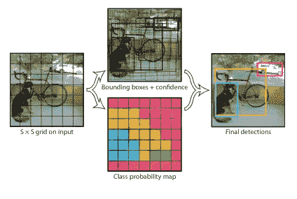

*   YOLO 使用一个 SxS 网格单元(这里 S=7)。如果对象的中心落在网格单元上，则该网格单元负责检测对象。
*   每个网格单元产生 B (B = 2)个边界框和这些框的置信度得分/客观性得分。置信度得分表示对盒子包含对象的置信度。

***信心得分= Pr(obj)∫IoU pred truth***

***IOU predtruth*** 表示预测框与地面真相框的 IOU

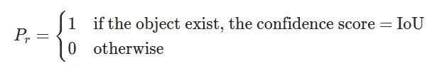

*   每个边界框预测由 x，y，w，h 坐标和置信度得分组成。(x，y)坐标表示相对于网格单元边界的盒子中心。(w，h)坐标表示相对于图像的宽度和高度。

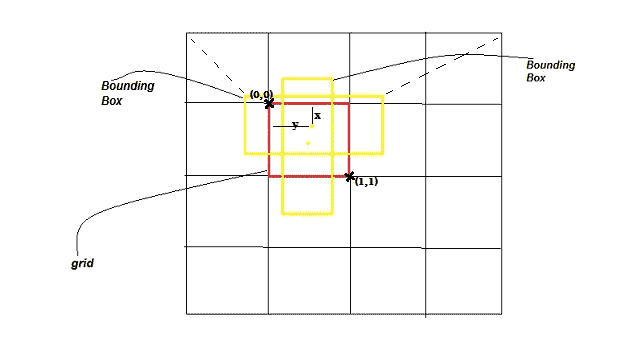

*   每个网格单元还产生每个类 Pr(Class_i|Object)的条件概率。这里的班级总数是 20

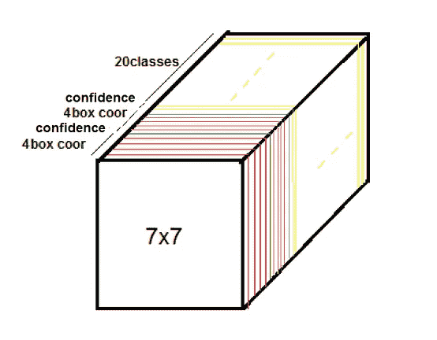

output tensor

因此，我们总共有 **7×7×(2×5+20)=1470 个预测。**

*   在训练时，我们只希望一个边界框预测器负责每个对象。我们分配一个预测器来“负责”预测一个对象，基于哪个预测具有与地面实况的最高当前 IOU
*   在测试期间，通过将条件类概率与置信度得分相乘来获得每个盒子的类特定置信度。

***pr(class _ I)∣object)×pr(object)×iou pred truth = pr(class _ I)***

***×借据***

# **2。网络设计**

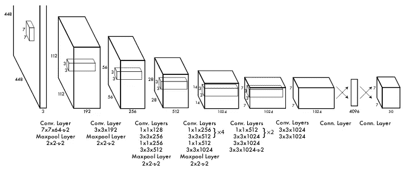

YOLO 网络架构的灵感来自谷歌网络架构。该网络有 24 个卷积层，后面是 2 个全连接层。代替 GoogLeNet 使用的初始模块，我们简单地使用 1×1 缩减层，然后是 3×3 卷积层。

快速 YOLO 使用较少的卷积层(9 层而不是 24 层)以及这些层中较少的滤波器。除了网络的规模之外，YOLO 和 Fast YOLO 之间的所有培训和测试参数都是相同的。

# 3.训练、损失函数和推理

## 3.1 培训

卷积层在 ImageNet 1000 类数据集上进行预训练。他们使用前面描述的网络的前 20 个卷积层，然后是一个平均池层和一个全连接层(1x1000)。

在此之后进行检测训练，他们删除了 1x1000 全连接层，并添加了四个卷积层和两个随机初始化权重的全连接层。他们还将输入分辨率从 224x224 改为 448x448，因为这有助于检测更小的物体。

最后一层预测类别概率和包围盒。边界框的(x，y)坐标被参数化，因此它们的值相对于网格单元在 0 和 1 之间。高度和宽度坐标相对于图像的高度和宽度被标准化。

他们在最终层使用线性激活，在其他层使用泄漏 relu。

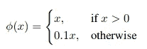

leaky relu

## 3.2 损失函数

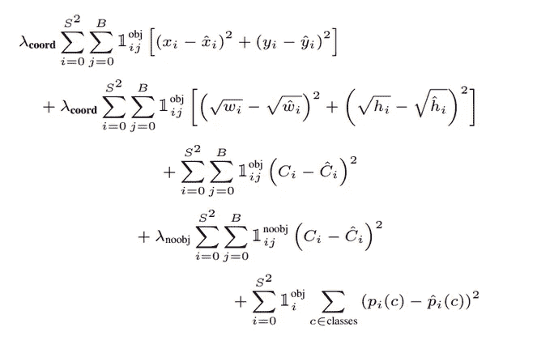

loss function

*注:1obj_ij 有对象时为 1，无对象时为 0，同理 1noob_ij 无对象时为 1，有对象时为 0。*

*λcoord= 5，λnoobj=0.5。*

损失函数中有 5 项:

*   **第一项:**x，y 坐标由网格单元的偏移量参数化，其值在 0 和 1 之间。因此使用误差平方和。
*   **第二项:**宽度和高度是相对于整个图像的。因此，我们不能直接使用平方误差，因为一个小的差异可以产生巨大的影响。所以这是通过求平方根，然后求平方误差部分解决的。
*   **第三项和第四项:**这是地面真值和预测包围盒之间的 IOU。在许多网格单元中，将没有对象。这会让他们的信心指数降到零。这可能会在反向传播期间压倒梯度，并可能导致模型不稳定。这可以通过λnoobj =0.5 来部分解决。
*   **第 5 项:**有对象时的类概率。

## 3.3 推理

YOLO 在测试时非常快，因为它只需要一个单一的网络评估，不像基于分类器的方法。在检测过程中，通常可以对同一物体进行多次检测。他们通过**非最大抑制**克服了这个问题。

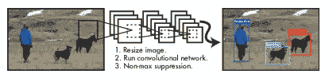

detection system

## 非最大抑制是如何工作的？

假设 N 是阈值，我们有两个列表 A 和 B，其中 A 是输入建议，B 是输出。然后对于图像中检测到的每个类别，

1.  根据置信度得分按降序对提案进行排序。
2.  选择具有最高置信度得分的提议，将其从 A 中移除，并将其添加到最终提议列表 B 中(最初 B 为空)。
3.  现在，通过计算此建议与所有其他建议的 IOU(交集/并集),将此建议与所有建议进行比较。如果 IOU 大于阈值 N，则从 a 中删除该建议。
4.  现在，根据置信度得分，以降序对剩余提案进行排序。现在，从 A 中的剩余提议中选择可信度最高的提议，将其从 A 中移除并添加到 b 中。现在，与步骤 3 中一样，比较这些提议，并根据需要进行操作。

*   重复这个过程(步骤 1、2 和 3 ),直到 a 中不再有建议。

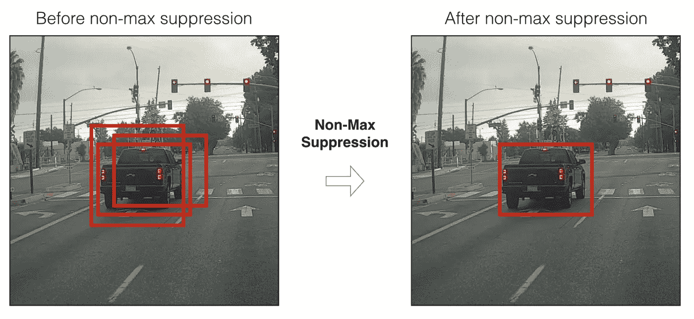

然后，在来自 PASCAL VOC 2007 和 2012 的训练和验证数据集上对网络进行大约 135 个时期的训练。在 2012 年进行测试时，他们还包括用于培训的 VOC 2007 测试数据

# 4.YOLO 的局限性

*   模型努力探测更小的物体
*   模型努力检测附近的对象(如果它们也重叠)。
*   小边框的小误差对 iou 的影响更大。

# 5.结果

## 【2007 年 5.1 VOC

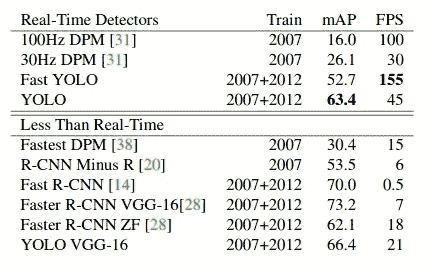

*   **YOLO** 在实时检测上表现非常出色。当我们考虑速度和 mAp 之间的权衡时，它优于快速 RCNN。
*   **快速 YOLO** 在 52.7%贴图和 155 fps 的情况下也表现不错
*   **YOLO VGG16** 在 mAp 方面比 YOLO 表现更好，但速度较慢，因为没有 1x1 卷积来减小模型大小。

## 5.2 比较快速 RCNN 和 YOLO

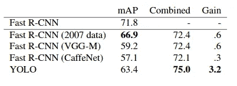

YOLO 犯的背景错误比 Fasr RCNN 少。但是与快速 RCNN 相比，YOLO 很难定位物体。

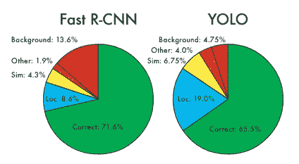

error rates

## 5.3 VOC 2012

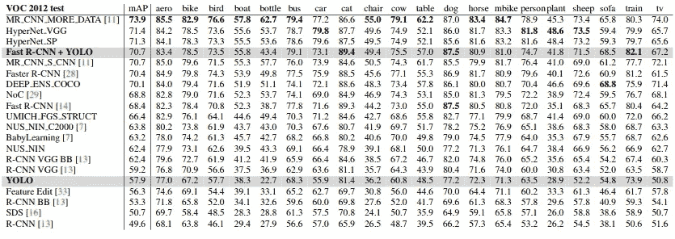

YOLO + Fast RCNN

在 VOC 2012 测试集上，YOLO 的 mAP 得分为 57.9%。这低于当前的技术水平。但快速 R-CNN + YOLO 具有 **70.7%的 mAP** ，这是性能最高的检测方法之一。

## 5.4 模型精度与召回率

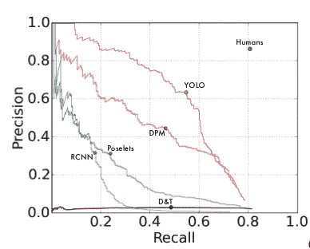

Picasso Dataset precision-recall curves

当绘制精确召回曲线时，我们可以看到 YOLO 执行其他对象检测。这是基于 Picasso 数据集的检测。

## 5.5 一些可视化

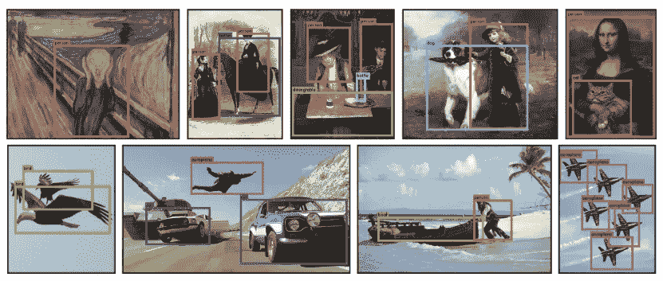

# **参考文献**

*   [https://arxiv.org/pdf/1506.02640.pdf](https://arxiv.org/pdf/1506.02640.pdf)
*   [https://towards data science . com/yolov 1-you-only-look-once-object-detection-E1 F3 ffec 8 a 89](https://towardsdatascience.com/yolov1-you-only-look-once-object-detection-e1f3ffec8a89)
*   [https://medium . com/@ amrokamal _ 47691/yolo-yolov 2-and-yolov 3-all-you-want-to-know-7e 3 e 92 DC 4899](https://medium.com/@amrokamal_47691/yolo-yolov2-and-yolov3-all-you-want-to-know-7e3e92dc4899)