# YOLOv2 综述

> 原文：<https://medium.datadriveninvestor.com/review-on-yolov2-11e93c5ea3f1?source=collection_archive---------0----------------------->

在这篇文章中，我将对约瑟夫·雷德蒙和阿里·法尔哈迪发表的 YOLO9000 论文写一篇简短的评论。他们推出了 YOLOv2 和 YOLO9000 实时检测系统。YOLO9000 可以检测 9000 多种物体类别。在 67 FPS 时，YOLOv2 在 VOC 2007 上获得了 76.8 的 mAP。在 40 FPS 的情况下，YOLOv2 获得了 78.6mAP，超过了更快的 R-CNN 和 ResNet 以及 SSD 等最先进的方法，同时运行速度也明显更快。我建议在阅读这篇文章之前先阅读我在 YOLOv1 上的评论。

我将文章分为三个部分

1.  **优于 YOLOv1 的改进**
2.  **暗网-19**
3.  **YOLO9000**

# **1。对 YOLO v1 的改进**

## **1.1。批量标准化:**

*   YOLOv2 中的所有卷积层都使用了批标准化。
*   这使地图提高了 2%。

## **1.2。高分辨率分类器:**

原始 YOLO 训练如下。

在 224 x 224 上训练分类器。然后他们将分辨率提高到 448 用于**检测。**

而对于 YOLOv2，

他们最初在 224×224 的图像上训练模型，然后在为**检测**进行训练之前，他们在图像网上以全 448×448 分辨率对分类网络进行了 10 个时期的微调。因此，网络有时间调整滤波器，以便更好地处理更高分辨率的输入。这提高了 4%的地图。

## **1.3。与锚定框卷积:**

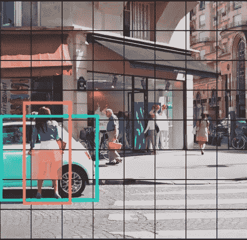

YOLO v1 试图将对象分配到包含对象中间的网格单元。在上面的图像中，我们可以看到黄色网格单元包含汽车和女孩的中点。但是由于网格单元只能检测一个物体，问题就出现了。为了解决这个问题，作者尝试使用 k 边界框(在 YOLO v2 中)允许网格单元检测多个对象。

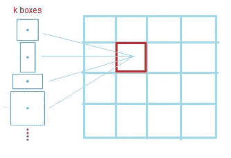

为了预测 k 边界框，YOLO v2 使用了**锚框的思想。**

*   YOLO 使用卷积特征提取器上的全连接层直接预测边界框的坐标。在 YOLO v2 中，所有完全连接的层被移除，并且使用锚定框来预测边界框。
*   移除一个池层以提高输出的分辨率
*   使用 416×416 的图像来训练检测网络，并且获得 13×13 的特征图，即，它们被下采样 32 倍。
*   因此，我们对每个锚盒进行坐标和置信度得分(客观性预测)预测。在 YOLO 之后，对象性预测仍然预测地面真实的 IOU，并且假设存在对象，所提出的框和类预测预测该类的条件概率
*   使用锚箱时，精确度会略有下降。在没有锚盒的情况下，我们的中间模型得到 69.5 个 mAP，召回率为 81%。使用锚盒，我们的模型得到了 69.2 个 mAP，召回率为 88%。

## **1.4。如何选择锚箱数量？(**维星团 **)**

他们针对不同的 k 值在所有边界框上运行 k 均值聚类，并绘制出质心最近的平均 IOU。重要的是，他们没有使用欧几里德距离，而是在包围盒和质心之间使用 iou。使用基于标准欧几里德距离的 k-means 聚类不够好，因为较大的盒子比较小的盒子产生更多的误差。

他们在 k=5 时得到最好的结果。他们使用以下公式计算边界框和质心之间的距离:

***d(方框，形心)= 1iou(方框，形心)***

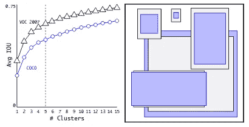

左图显示平均 iou，右图显示 VOC 和 COCO 的相对坐标。

## **1.5。位置预测**

*   YOLO v1 对位置预测没有限制。这使得模型在早期迭代中不稳定。
*   YOLO v2 使用逻辑激活σ来限定位置，这使得该值落在 0 到 1 之间。
*   网络为每个单元预测 5 个边界框。它为每个边界框 **tx，ty，tw，th** 和 **to 预测 5 个坐标。**如果单元格从图像的左上角偏移 **(cx，cy)** 并且锚定框具有宽度和高度 **pw，ph，**则预测对应于:

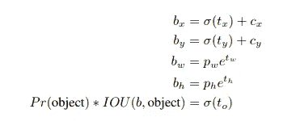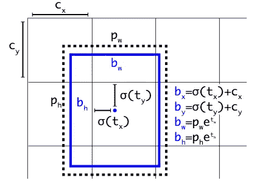

例如，如果我们在一个特定的网格单元上使用两个定位框，它将输出两个框(假设一个是蓝色的，一个是红色的)。现在以蓝盒子为例。我们不仅将这个框分配给网格单元，还分配给具有最大 iou 的锚框(上图中的虚线框)。

## 1.6.细粒度特征

*   13×13 特征图足以检测较大的物体。
*   但是为了检测更小的目标，来自前一层的 26×26×512 特征图被映射成 13×13×2048 特征图，然后与原始的 13×13 特征图连接用于检测。
*   这提高了 1%的地图。

## 1.7 多尺度训练

*   YOLOv1 使用 448x448 的输入分辨率进行检测训练。
*   然而，在 YOLOv2 中，由于我们的模型只使用卷积层和池层，因此可以动态调整大小。
*   对于每 10 个批次，随机选择新的图像尺寸。图像尺寸从{320，352，…，608}中选择。

## 1.8.增量改进总结

# **2。暗网 19**

为了克服复杂性和准确性的问题，作者提出了一种称为 **Darknet-19** 的新分类模型，用作 YOLOv2 的主干。

 [## 人工智能和监督资本主义|数据驱动的投资者

### 大科技，总是现在:人工智能推动的大科技，已经使购物，搜索，在你的…

www.datadriveninvestor.com](https://www.datadriveninvestor.com/2020/03/04/on-artificial-intelligence-and-surveillance-capitalism/) 

Darknet-19 有 19 个卷积层和 5 个最大池层。在 ImageNet 上取得了 91.2%的 top-5 准确率，优于 VGG (90%)和 YOLO 网络(88%)。

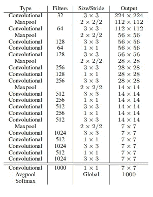

Darknet 19

YOLOv2 输出形状为 13x13x(kx(1+4+20))其中 k 是锚盒的数量，20 是类的数量。我们有 k=5。所以输出形状会是 **13x13x125。**

## 2.1 培训

该模型首先被训练用于分类，然后用于检测。

**分类训练:**

*   首先，他们使用随机梯度下降和权重衰减在 ImageNet 1000 类数据集中训练 Darknet-19 网络 160 个时期。
*   在训练过程中，作者使用了标准的数据增强技巧，包括随机裁剪、旋转、色调、饱和度和曝光偏移。
*   在我们对 224×224 的图像进行初步训练后，他们使用更大尺寸的图像 448×448 对 darkenet 网络进行了 10 个时期的微调

**检测训练:**

*   在用于分类的训练之后，darknet-19 的最后一层被移除，并且被替换为具有 1024 个滤波器的 3×3 卷积，随后是具有我们检测所需的输出数量的 1×1 卷积(13×13×125)。还添加了一个**通过**层，这样我们的模型就可以使用之前层的精细纹理特征。
*   然后，他们在检测数据集(VOC 和 COCO 数据集)上训练网络 160 个时期

## **2.2 与其他车型的对比**

YOLOv2 比其他对象检测算法更快。此外，它可以运行在不同大小的图像上，以提供速度和准确性之间的平滑权衡。

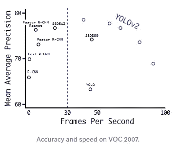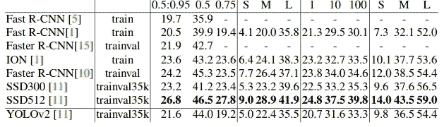

# 3.YOLO9000 使用单词树(更强)

*   提出了一种分类和检测数据联合训练的机制。也就是说，在训练过程中，他们混合了来自检测和分类数据集的图像。当网络看到用于检测的图像时，全部 YOLO2 损失被反向传播，而当网络看到分类图像时，只有分类部分损失被反向传播。

## 挑战:

*   我们知道，检测数据集通常有狗、猫、船等类别，而分类数据集中有“诺福克梗”、“约克夏梗”等类别。如果我们需要训练两个数据集，我们需要找到一种方法。
*   通常我们在所有的类中直接使用 softmax。但在这里我们不能这样做，因为 softmax 采取互斥事件，但在这里“狗”和“诺福克梗”并不互斥。所以我们不能直接使用 softmax。
*   解决方法是使用**分级分类**进行标注。

## 层次分类

*   这里的图像网络标签是从 WordNet 中提取的。在 WordNet 中，“诺福克梗”和“约克夏梗”都是“梗”的下位词，梗是“猎狗”的一种，梗是“狗”的一种，梗是“犬科动物”，等等
*   他们使用 Imagenet 标签和 WordNet 建立一个单词树。

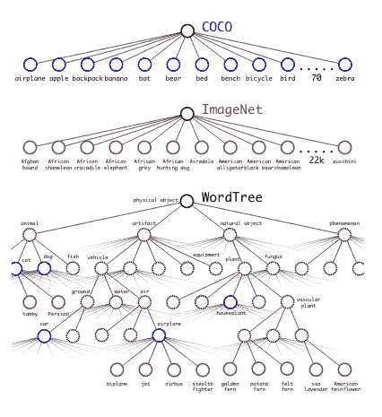

**他们结合以下数据集进行训练:**

**i)微软 COCO** :包含 100k 图片，80 个类，检测标签，类比较笼统像“狗”或者“船”。

**ii)ImageNet**:1300 万张图像，22k 个类别，分类标签，类别更具体，如“诺福克梗”、“约克夏梗”，或“贝德灵顿梗”。

*   他们使用 COCO 数据集和来自 Image net 的 top 9000 类创建了一个组合数据集。相应的单词树由 **9418** 类组成。额外的类是通过用树中的 synsets 映射原始类而形成的。
*   在训练期间，地面真相标签被传播。也就是说，如果一张图片被标记为“诺福克梗”,它也会被标记为“狗”。利用这个数据集，他们训练了 YOLO9000。他们使用了 3 个锚箱，而不是 5 个锚箱。

为了计算条件概率，我们的模型预测了 9418 个值的向量，并且我们计算了作为相同概念的下位词的所有子集的 softmax。输出条件概率如下:

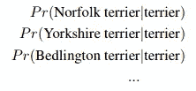

假设我们需要找到绝对概率，我们找到它如下:

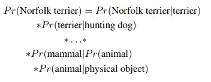

为了分类的目的，我们假设图像包含一个对象:Pr(物理对象)= 1

*   当它看到分类图像时，我们只反向传播分类损失。要做到这一点，我们只需找到预测该类最高概率的边界框，并计算其预测树上的损失。
*   当它看到检测图像时，整个 yolo2 损失被反向传播。我们还假设预测的框与地面真实标签重叠至少 0.3 IOU，并且我们基于该假设反向传播物体损失。

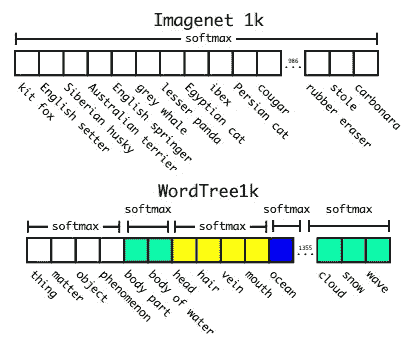

experiment prediction using 1369 classes(1000 + 369)

*   因此，使用这种联合训练，YOLO9000 学习使用 COCO 中的检测数据在图像中找到对象，并学习使用 ImageNet 中的数据对各种各样的对象进行分类。

## 3.1 YOLO 9000 结果

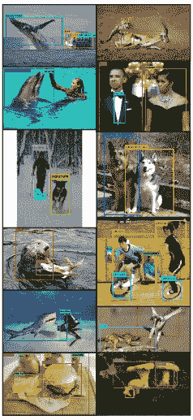

# 参考

*   [https://arxiv.org/pdf/1612.08242.pdf](https://arxiv.org/pdf/1612.08242.pdf)
*   [https://towards data science . com/review-yolo v2-yolo 9000-you-only-look-once-object-detection-7883 D2 b02a 65](https://towardsdatascience.com/review-yolov2-yolo9000-you-only-look-once-object-detection-7883d2b02a65)
*   [https://medium . com/@ amrokamal _ 47691/yolo-yolov 2-and-yolov 3-all-you-want-to-know-7 E3 e 92 DC 4899](https://medium.com/@amrokamal_47691/yolo-yolov2-and-yolov3-all-you-want-to-know-7e3e92dc4899)