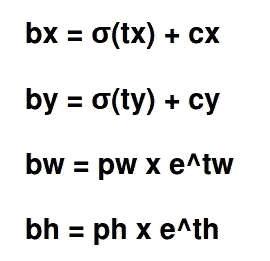
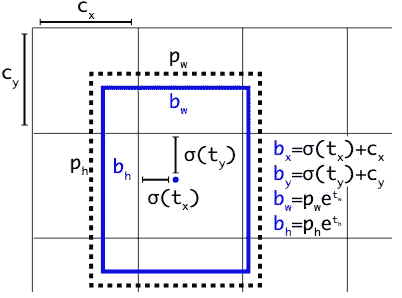
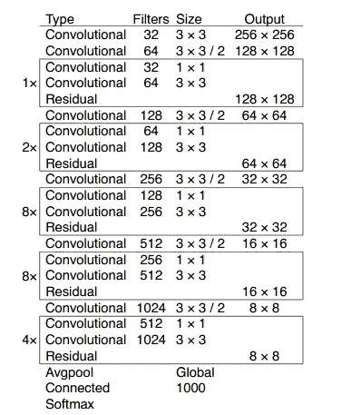
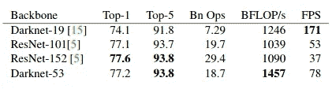
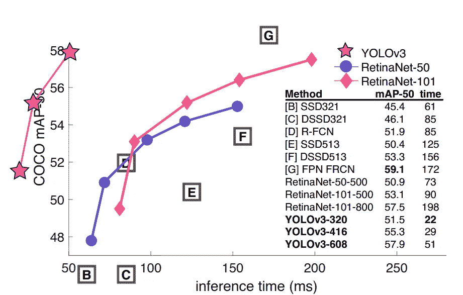
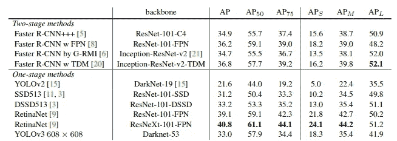

# YOLOv3 综述

> 原文：<https://medium.datadriveninvestor.com/review-on-yolov3-faae0dd59425?source=collection_archive---------3----------------------->

在本文中，我们将浏览约瑟夫·雷德蒙和阿里·法尔哈迪的论文。在阅读这篇文章之前，我建议你先看一下我对 [**【约洛夫 1】**](https://medium.com/datadriveninvestor/review-on-yolov1-3c85304b617d)和 [**约洛夫 2**](https://medium.com/datadriveninvestor/review-on-yolov2-11e93c5ea3f1) 的评论。

 [## 深度学习用 7 个步骤解释-更新|数据驱动的投资者

### 在深度学习的帮助下，自动驾驶汽车、Alexa、医学成像-小工具正在我们周围变得超级智能…

www.datadriveninvestor.com](https://www.datadriveninvestor.com/2019/01/23/deep-learning-explained-in-7-steps/) 

YOLOv3 的发布对 YOLOv2 的改进很少。主要的两项改进是。

*   **开始使用 Darknet-53 代替 Darknet19 作为主干**
*   **特征映射上采样和拼接**

我们将文章分为 5 个部分:

1.  **包围盒预测**
2.  **班级预测**
3.  **跨尺度预测**
4.  **暗网-53**
5.  **性能**

现在我们将进入更深的层次。首先我们将讨论包围盒预测

# 1.包围盒预测

这个和 YOLOv2 差不多。如果网络预测 4 个坐标 **tx，ty，tw** 和 **th** ，并且从图像左上角的单元偏移是 **(cx，cy)** ，并且如果锚框宽度和高度是 **pw，ph.** ，则预测对应于

*   在训练中，他们使用了误差损失平方和
*   YOLOv3 使用逻辑回归预测每个边界框的客观性分数。如果锚定框与地面真实框的重叠比任何其他锚定框都多，则为 1。如果锚定框与地面真实框重叠，但不是最好的，那些锚定框将被忽略。他们设定的最低门槛是 0.5。因此，只有一个锚定框将被分配给边界框。
*   **k 表示聚类被**用来寻找锚盒

# **2。班级预测**

*   对于类别预测，他们没有使用 **softmax** 分类器。相反，他们使用独立的**逻辑分类器**和**二元交叉熵损失**。

# **3。跨不同尺度的预测**

*   他们从 **3 种不同的尺度**中提取预测，并将它们串联起来。为此，他们使用了**特征金字塔网络的概念。**
*   在他们对 COCO 的实验中，他们预测每种规模有 3 个盒子。因此，对于 4 个边界框偏移、1 个对象预测和 80 个类别预测，张量是**n×n×[3∫(4+1+80)】**。
*   我们从之前 2 层中提取特征，对其进行采样，并将其与之前某层中特征图关联起来。我们添加更多的卷积层来处理这个组合的特征图，并且获得类似的输出张量。
*   我们再次执行相同的设计来预测最终规模的盒子。因此，我们有三种不同规模的预测。
*   在 COCO 数据集上，通过 k 均值聚类，他们使用了这些锚盒:在 COCO 数据集上，9 个聚类是: **(10×13)、(16×30)、(33×23)、(30×61)、(62×45)、(59×119)、(116×90)、(156×198)、(373×326)。**

# 4.黑暗网络 53

Darknet-53

*   在 YOLOv3 中，**他们使用了更深的网络 Darknet-53** 被使用，即 53 个卷积层。它也有快捷连接

performace comparison

*   Darknet-53 比 ResNet-101 好，快 1.5 倍。Darknet-53 的性能与 ResNet-152 相似，但速度快 2 倍。

# 5.表演

*   对于整体地图，yolo3 表现稍差。
*   yolov 3–608 在 51 毫秒的推理时间内获得了大约 33.0%的 mAP，而 retina net-101–50–500 在 73 毫秒的推理时间内仅获得了 32.5%的 mAP。

# **参考**

*   [https://pjreddie.com/media/files/papers/YOLOv3.pdf](https://pjreddie.com/media/files/papers/YOLOv3.pdf)