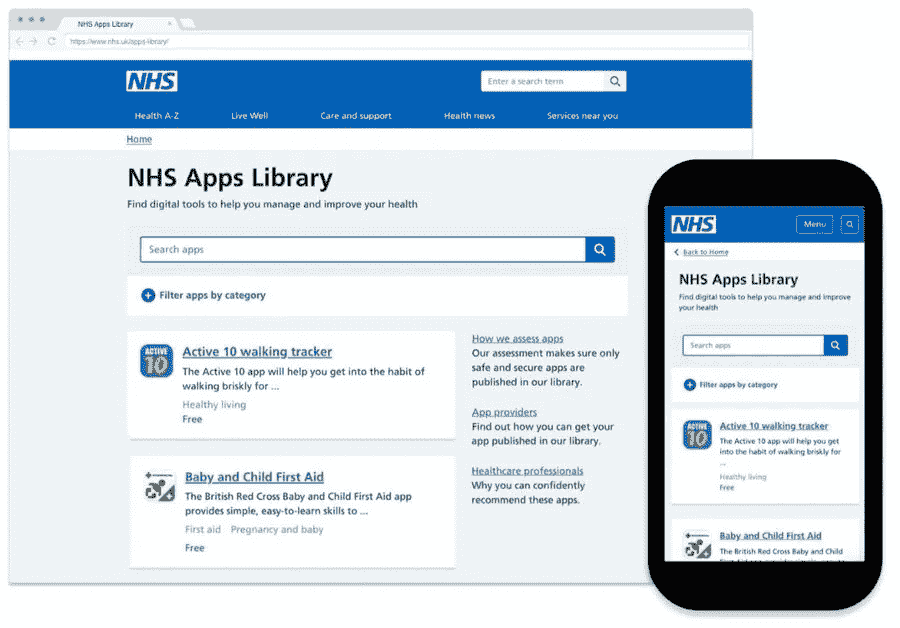
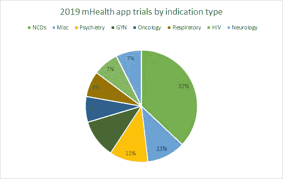

# 回顾移动医疗应用对患者行为和结果的影响:第一部分

> 原文：<https://medium.datadriveninvestor.com/reviewing-impact-of-mhealth-apps-on-patient-behaviours-and-outcomes-part-i-a12e18ae203a?source=collection_archive---------17----------------------->

智能手机的普及和渗透被认为是医疗保健领域几个看似棘手问题的福音。移动医疗应用(mHealth)的理念已经试图触及医疗保健需求的方方面面，包括**预防、诊断、治疗、姑息治疗、**等等。有成千上万的移动健康应用程序可供任何人下载和使用，特别是因为它们中的大多数目前并不完全符合医疗保健的监管框架。监管机构以及医疗保健行业的其他参与者已经尝试为这些应用的使用提供指导和可用证据。值得注意的举措包括 [***NHS App 库***](https://digital.nhs.uk/services/nhs-apps-library)*[***排名健康***](http://www.rankedhealth.com/) ，以及[***Xcertia***](https://www.xcertia.org/)*。**

**

*Screenshot of the NHS App Library homepage*

*一个关键的缺失是，这些和其他类似的倡议都没有一个通用的验证和评估框架，可以帮助医疗从业者在“开处方”应用程序之前审查证据。*

*虽然与诊断和治疗相关的方面只是在过去 1-2 年才获得关注，但一直以来都在推动使用基于智能手机的干预来帮助患者旅程的各个方面。原因非常清楚-*

*   *大多数患者现在使用智能手机；他们还使用**移动连接**来提高活动的层次和复杂性。*
*   *在患者访问诊所/医疗机构之前和之后，一些医疗保健问题需要通过**各种接触点**采取**个性化方法**。智能手机似乎是提供这种工具的一个简单工具。*
*   *基于智能手机的解决方案还提供了一种从患者那里收集额外数据的**简便方法**，这些数据传统上是通过手动方式收集的，不可靠。*
*   *最后，由于技术进步和资源的可用性，开发一个应用程序已经变得**简单和经济**。*

*由于这些原因，基于应用程序的干预措施在增强患者对疾病、治疗和治疗过程中的一般支持的知识方面尤为著名。*

* [## 认知计算——一套被广泛认为是……

### 作为它的用户，我们已经习惯了科技。这些天几乎没有什么是司空见惯的…

www.datadriveninvestor.com](https://www.datadriveninvestor.com/2020/02/19/cognitive-computing-a-skill-set-widely-considered-to-be-the-most-vital-manifestation-of-artificial-intelligence/) 

这项工作越来越多地通过使用被称为*的行为研究得到支持，这是一个总括术语，用于表示理解患者行为背后的“为什么”,并使用这一知识为患者提供激励/推动/刺激，以某种方式采取行动来提高治疗的结果和/或有效性。*

*如上所述，尽管有这种程度的兴趣和几个这样的应用程序的扩散，但很少有人关注收集这些干预措施的有效性的证据。结合其他因素，如不断发展的监管途径和隐私/数据共享问题，此类产品在临床上的发展道路仍不明朗。** 

**为了衡量此类应用的现状，我回顾了 2019 年发表的原始研究文章。在本文的第一部分，我将列出我的发现，在下一部分，我将尝试在这些发现的基础上寻找可能的前进方向。**

*   **大约 **450 篇文章**在 2019 年发表，使用了某种移动健康干预措施。**
*   **在排除了基于文本的解决方案(功能手机而不是智能手机)、可行性/设计类研究和定性研究之后，我能够列出一个列表，其中有 30 个应用/干预，据报道它们使用了行为组件，并在科学期刊上发表了它们的结果。**
*   ****一般特征** -大多数试验在慢性病领域进行，包括肥胖、高血压、精神病学等。**

****

*   ****试验特征**:近 65%的试验在**单一医院/机构**进行；这意味着这类研究的结果在单一试验点之外的广泛适用性受到严重限制。大多数研究使用护理标准比较器，并遵循**随机试验设计**。试验的一个小样本使用了有趣的三臂设计，其中研究人员试图研究除了人类协助之外的 mHealth 应用对护理标准的影响；因此，这些试验试图测试应用程序单独相对于“引导应用程序”干预的有效性。大多数研究**不是盲法**(使用者和研究者都知道他们的干预任务)，很少有研究考虑在数据收集/审查/评估层面引入盲法。**
*   ****试验设计**-约 60%的试验选择了**明确定义的“直接”终点**-例如，计划用于糖尿病治疗依从性的应用程序选择了血糖水平作为主要终点。然而，超过 60%的试验的**干预持续时间**太小，无法在更长的时间尺度上给出有意义的有效性指标，限制了证据的效用，尤其是针对慢性疾病/问题设计的应用程序。**
*   ****数据审查考虑事项**:这个领域有一些限制，我将讨论 2 个关键问题。似乎很少有试验考虑测量**对应用程序干预的遵守/使用**-因此在大多数出版物中，没有提到任何应用程序使用的定量测量。在缺乏对坚持性的衡量和对观察到的效果的映射的情况下，不清楚报告的结果是否可以与应用程序的使用公平地相关联。同样，很少有试验在查看结果和提供解释时没有考虑重要的**混杂因素**。许多研究人员在查看他们收集的数据时，没有考虑到诸如共病、合并用药和同时使用其他干预措施等重要因素。**
*   ****统计考虑** : 40%的试验不包括选择**样本量**的任何统计考虑。即使是那些对样本量进行了统计学考虑的试验，也没有统一遵守要求，在许多情况下，导致最终审查的样本比计划的少得多。其他统计问题包括输入缺失数据的可变方法、不报告置信区间等。**
*   ****关于医疗保健系统的考虑**:这些文章中只有 40%在某种程度上提到了他们在现实世界医疗保健系统中干预的可能作用。这意味着，即使该应用在受控的实验环境中被证明是有用的，也没有考虑过在用户的日常生活中实施这样的干预。**

**总之，从研究人员的角度来看，将应用程序开发外推至药物开发途径，似乎大多数应用程序都试图进行初步的 II 期试验，试图提供一个标题性的概念验证结果，尽管在数据和统计方面有一些限制。**

**在本次讨论的第二部分，我将尝试提出一个**综合框架**，用于收集移动健康干预的临床证据，并提供一些来自现有文献的良好实践范例。**

**我将很高兴听到你的想法和反馈。如果你喜欢我的作品，你也可以留下一些“掌声”！**