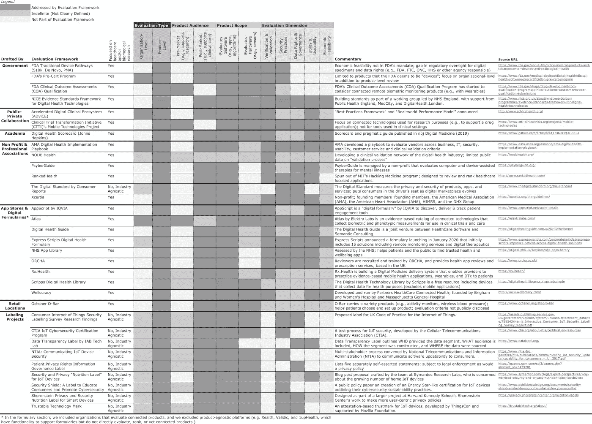

# 回顾移动医疗应用对患者行为和结果的影响:第二部分

> 原文：<https://medium.datadriveninvestor.com/reviewing-impact-of-mhealth-apps-on-patient-behaviours-and-outcomes-part-ii-9a04d22d65f5?source=collection_archive---------17----------------------->

移动医疗应用(mHealth)理念试图触及医疗保健需求的所有方面，包括**预防、诊断、治疗、姑息治疗**，这在一定程度上扭曲了 mHealth 解决方案作为解决所有医疗保健问题的最佳策略的形象。这对于基于移动医疗的应用程序来说尤其如此，这些应用程序主要由患者直接使用，试图通过使用/声称使用行为研究来影响潜在的健康状况。我在 [***第一部分***](https://medium.com/datadriveninvestor/reviewing-impact-of-mhealth-apps-on-patient-behaviours-and-outcomes-part-i-a12e18ae203a) ***开始复习这个领域；*** 这里有一个快速总结——

*   与其他几个移动健康干预相比，移动健康应用正在获得更多的吸引力，这是由于各种因素，包括智能手机的渗透、个性化患者旅程的能力、收集额外数据的简单方法等等。
*   为了评估目前的状况，我查阅了同行评审期刊中的可用出版物，并重点关注了使用基于行为干预的**移动健康应用**。
*   这些应用中的大多数都是在患者人数有限的**单站点环境中进行研究的**。虽然研究人员为大多数应用程序选择了明确的终点，但大多数研究的**持续时间太短**无法给出应用程序使用的真实影响的真实指示。
*   最重要的是，对于使用应用程序生成的数据来说，数据旅程中有几个缺口；这些包括没有考虑应用程序的遵守/使用数据，没有考虑混杂因素。

在第二部分中，我们将会看到有什么可能的方法来弥补这些差距，以便为这些策略生成正确的证据，从而帮助它们在患者的旅程中得到正确的实施。

有几个来源描述了应伴随移动健康干预的开发和实施的验证水平的全部范围。从监管的角度来看，最全面的框架来自于 ***国际医疗器械监管者论坛*** (IMDRF)(1)。虽然目前适用于声称是医疗设备(SaMD)软件的产品，但这些定义和细节同样可以用于移动健康应用程序。

Clinical Evaluation framework by IMDRF

类似地，其他几个研究人员和组织已经审查并提供了框架，为这些产品的验证和评估提供了见解。Coravos 等人在最近发表于《自然数字医学》的一篇综述中提供了这些框架的一个特别翔实的概述(2)。

Overview of Evaluation Frameworks by Coravos et al, Nature Digital Medicine 2020

在我的评论中，我将关注一些在设计和评估移动医疗应用时经常被忽视的利基问题。正如第一部分提到的，虽然我们可能无法应用药物开发中常用的更严格的标准，但我们可以很容易地使用简单和基本的研究方法实践来取得巨大的效果。

## app 到底会迎合谁？在哪里可以看到最大的影响？

虽然每个人都知道将患者视为最终用户是至关重要的，但大多数研究人员/开发人员没有注意到任何给定疾病领域的患者特征的巨大差异。

 [## 大笔资金和尖端技术:人工智能/人工智能投资将如何革新医疗保健…

### 在过去几年人工智能(AI)和机器学习(ML)的显著发展中…

www.datadriveninvestor.com](https://www.datadriveninvestor.com/2018/03/22/big-money-and-cutting-edge-technology-how-investment-in-ai-ml-will-revolutionize-the-healthcare-industry/) 

让我们举个例子——我们正在为肥胖人士开发一个教育/信息共享应用程序，帮助他们跟踪自己的饮食、锻炼、提供指导和知识共享等。现在，**与新诊断的肥胖患者相比，患有另一种共存疾病 10 年的肥胖患者对该应用程序的期望将有很大不同**，这些期望反过来将决定他们是否会参与并有动机使用该应用程序。

因此，在开发应用程序并考虑对其进行评估时，选择用于评估的患者样本将取决于您为哪个患者群体设计了应用程序；当然，你可以考虑所有主要的患者类别，并尝试以分层的方式满足所有需求，但这完全是另一回事。无论哪种方式，如果你开发一个狭窄焦点的应用程序，并在广泛的患者中进行评估，你的评估试验将显示糟糕的结果，反之亦然。

## 这个患者群体是什么样子的？我们如何设计干预措施来迎合这一特定群体？

当你定义了你的目标患者群体后，自然的下一步就是不要把这些患者看作独立的用户，而是要把他们嵌入到现有的医疗保健生态系统中。许多研究人员/开发人员未能注意到复杂的相互关系，尤其是典型的医疗保健系统，因此最终设计了糟糕的评估试验，从而导致混乱的输出。

Agarwal 等人在发表于《MHealth/Uhealth 杂志》的一项研究中注意到了这样一个重要的观察结果(3)。他们研究了一款针对 II 型糖尿病患者的移动健康应用，假设该应用将改善患者的自我管理，从而改善 HbA1c。在他们的评估试验中，他们为医护人员开发了全面的实施协议，用于患者在应用程序上的登录。最终，他们仍然发现在临床评估地点之间，花费在培训临床医生的时间、培训患者的时间以及与患者的持续接触方面存在显著的差异。这种可变性对应用程序的有效性产生了重大影响。

## 如何才能显示干预的效果真的与 app 有关联？

这是大多数研究人员/开发人员真正努力展示实际影响的地方。两个通常被忽略或没有被充分解决的关键部分包括**伴随因素**和**坚持干预**。让我们一个一个地考虑它们。

几个伴随的因素可能会对应用程序的有效性产生错误的印象，对结果产生积极或消极的影响。如果我们继续我们的肥胖教育应用程序的例子，也可以进入有教练的健身房的患者和不使用健身房的患者使用该应用程序的方式将对终点产生重大影响。对于使用直接减肥干预(药物治疗/手术)的患者，将会看到类似的效果。许多研究人员/开发人员在评估应用程序干预时未能考虑这些重要方面。

我对 2019 年出版物的审查中最突出的一个问题是，几乎没有任何试验报告数据显示**在应用使用和参与方面坚持干预**。如果你想展示你的应用程序对患者行为的影响，你需要展示患者实际上在定期使用你的应用程序，以它应该被使用的方式！在最基本的层面上，这种参与度可以通过日常使用统计数据来显示，在肥胖应用程序示例中，**患者仅仅每天打开应用程序就会显示高参与度，但可能不会给出应用程序有效性的任何指示**。因此，需要使用其他参与度指标使用特征(如最常访问的内容、最少访问的内容等)来进一步丰富这一使用统计数据。最后，患者对应用程序有用性的简单评估**反馈**将提供关于患者认为有用的应用程序功能的重要定性信息，因此可作为重要的反馈指针。

## 研究成功后，我们下一步去哪里？

在考虑到所有这些方面后，开发一个良好的评估试验，重要的是要记住这仍然是一个实验设置，旨在评估应用程序在受控环境下的有效性。虽然很少有健康相关的应用程序和设备报告了长期使用特征，但那些报告了长期使用特征的应用程序和设备表明，绝大多数用户——90%或更多——会迅速减少。例如，在 MyHeart Counts 心血管研究中，使用苹果 ResearchKit 应用程序通过智能手机跟踪 40，000 名参与者的活动，**不到 50%的受试者提供了连续两天的活动数据，不到 10%的受试者完成了所有 7 天的活动(4)** 。因此，如果我们真的想获得长期可衡量的收益，那么狭义的试验目的的参与可能没有任何意义。处理这个问题的最好方法是继续研究应用程序在现实世界中的影响。

在这两部分系列中，我回顾了 2019 年使用行为元素进行移动健康干预的出版物，指出了所做研究的一些局限性，然后阐述了一些重要的考虑因素，以设计这种干预的正确评估试验。我的结论是，即使使用个性化方法来改善患者行为的想法听起来很强大，但在这种干预真正显示出这种影响之前，我们还有很长的路要走。

参考/链接

1.  IMDRF 网站-【http://www.imdrf.org/ 
2.  Coravos，a .、Doerr，m .、Goldsack，J. *等*为医疗中的互联传感器技术设计现代化评估框架。 *npj 数字。医学。* 3 **，** 37 (2020)。[https://doi.org/10.1038/s41746-020-0237-3](https://doi.org/10.1038/s41746-020-0237-3)
3.  Agarwal P，*等*；改善二型糖尿病自我管理的移动应用:多中心实用随机对照试验。*JMIR Mhealth Uhealth*2019；7(1):e 10321 DOI:[10.2196/10321](https://doi.org/10.2196/10321)
4.  Hershman，S.G .，Bot，B.M .，Shcherbina，A. *等人*my heart Counts 研究中 50，000 人的身体活动、睡眠和心血管健康数据。 *Sci 数据* 6 **，** 24 (2019)。[https://doi.org/10.1038/s41597-019-0016-7](https://doi.org/10.1038/s41597-019-0016-7)

一如既往，我将很高兴听到你的想法和反馈。

## 访问专家视图— [订阅 DDI 英特尔](https://datadriveninvestor.com/ddi-intel)