# 用 Python 中的黑客统计数据重温哈勃定律

> 原文：<https://medium.datadriveninvestor.com/revisiting-hubbles-law-with-hacker-stats-in-python-9b56604916c1?source=collection_archive---------1----------------------->

使用 OLS 回归、配对自助重采样和假设检验观察哈勃定律的效果。

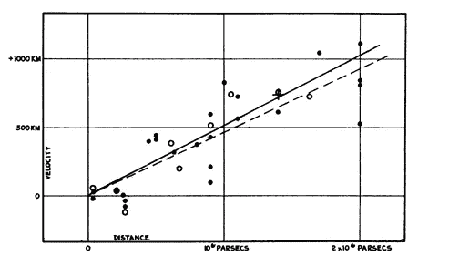

Hubble’s diagram of galactic recessional velocity versus distance. (Hubble, Proceedings of the National Academy of Sciences, 1929, 15, 168)

埃德温·哈勃是历史上最著名的天文学家之一。哈勃在证明以前被认为是尘埃和气体云并被归类为“星云”的物体实际上是银河系以外的星系方面发挥了关键作用。(1)

我们将重新访问和分析埃德温·哈勃使用的原始数据集，并对哈勃的 24 次星系距离和衰退速度测量进行普通最小二乘线性回归。然后，我们将使用对自助重采样，并对银河距离对后退速度的测量结果进行假设检验，看看哈勃定律是否仍然准确。

> 根据假设检验的结果，我们可以得出高度统计显著性的结论:距离影响星系的后退速度，这支持了哈勃定律，即我们周围的宇宙在不断膨胀。

但首先，让我们熟悉一下哈勃定律。

# 哈勃定律

在埃德温·哈勃的著名的 PNAS 文章“银河系外星云之间的距离和径向速度的关系”(2)中，哈勃为科学最伟大的发现之一:膨胀的宇宙提供了证据。哈勃证明了星系正以与它们离地球的距离相关的后退速度远离地球。换句话说，远离地球的星系比附近的星系移动得更快。这通常被称为哈勃定律。上面展示的哈勃观测到的邻近星系的速度与距离的经典图表形象化了这一现象。这种数据可视化显示了星系消退速度(v)和距地球距离(d)之间的线性关系:

> *V = Ho x D*

这里 *V* 是星系的后退速度 *D* 是星系离地球的距离。Ho 是一个由经验确定的常数，称为哈勃常数。尽管在任何给定的时间，膨胀速率在所有方向上都是持续的，但它在宇宙的整个生命周期中都是变化的。目前校准好的膨胀速率，Ho，约为每秒 70 公里/百万帕秒(注意这里使用的单位:后退速度以公里/秒为单位，距离以百万帕秒为单位，1 百万帕秒= 1 米秒，1 秒= 3.26 光年)。(3)

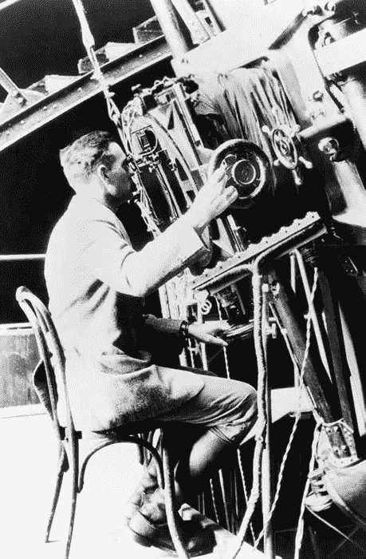

Hubble used the Hooker Telescope at Mount Wilson Observatory for some of his most important discoveries. © Emilio Segrè Visual Archives / American Institute of Physics / Photo Researchers, Inc.

哈勃的非凡壮举是通过对 24 个附近星系的速度和距离的一个非常小的测量样本获得的。当时，根据恒星的可见亮度，对这些星系的距离测量不准确。除了绘制图表中所有的 24 个星系，哈勃还根据它们在方向上的接近程度和距离上的接近程度将它们分成 9 个集群(哈勃图表上的空心圆)。哈勃的实验成功地让科学界相信了宇宙膨胀的现象。(3)

Hubble’s diagram of galactic recessional velocity versus distance. (Hubble, Proceedings of the National Academy of Sciences, 1929, 15, 168)

哈伯的图表显示了退缩速度和距离之间有很强的线性关系。观察到的趋势的含义相当广泛:我们生活在一个巨大的、动态发展的宇宙中，这个宇宙正在向我们周围的所有方向扩展。这不是阿尔伯特·爱因斯坦在 1917 年假设的宇宙类型。事实上，爱因斯坦在他的方程中加入了一个宇宙常数，以保持宇宙静止，正如当时人们所认为的那样。与爱因斯坦的信念相反，哈勃的结果表明，从“大爆炸”开始到现在，宇宙已经膨胀了数十亿年。(3)

虽然哈勃在 1929 年成功地在他的图表中绘制了线性关系，但是哈勃的距离值太小了，只有大约 7 倍。由于同样的原因，膨胀率也太大了。然而，尽管有如此大的不精确性，哈勃对膨胀宇宙的发现并没有受到影响。*v∞d*的基本线性方程仍然成立！(3)

注意，爱因斯坦的相对论预测了对哈勃定律的线性解释的偏差。偏差的大小取决于宇宙的总质量。更好地理解哈勃定律可以告诉我们宇宙中物质的总量。它也可能提供更多关于暗物质的信息。(4)

哈勃定律是支持大爆炸理论的主要观测证据。哈勃以他的发现而闻名，1990 年美国宇航局以他的名字命名了哈勃太空望远镜。(5)

现在，我们将使用我们的黑客统计工具箱更深入地研究哈勃的数据，该工具箱具有自助重采样和普通最小二乘(OLS)线性回归的功能！

 [## 用 Python |数据驱动投资者进行股票价格时间序列预测简介

### 在这个简单的教程中，我们将看看如何将时间序列模型应用于股票价格。更具体地说，一个…

www.datadriveninvestor.com](https://www.datadriveninvestor.com/2020/07/07/introduction-to-time-series-forecasting-of-stock-prices-with-python/) 

# 实验设计(方法论)

1.  探索性数据分析(EDA)。
2.  将银河距离调整 7 倍。
3.  OLS 使用原始哈勃数据集的 24 个银河距离和衰退速度的测量。
4.  24 次测量的配对自助重采样。
5.  假设检验→测量距离对衰退速度的影响。

## 关于数据

资料来源:埃德温·哈勃的《银河系外星云间距离和径向速度的关系》。(2)

*   **天体名称:**星系名称。
*   **距离【Mpc】(r):**距离地球的距离，单位为兆帕秒。1 兆帕秒= 1M 秒差距，1 秒差距= 3.26 光年。
*   **速度【千米/秒】(v):** 隐退速度，一个星系远离地球的速度。消退速度以千米每秒来记录。

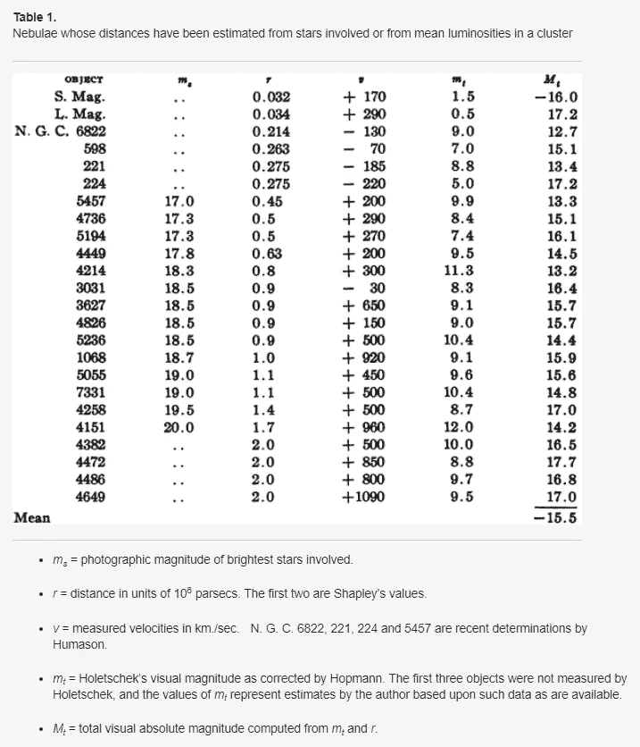

Hubble’s 24 measurements of galactic distances and recession velocities. (Hubble, Proceedings of the National Academy of Sciences, 1929, 15, 168)

** *技术受众注意:如果您对用于生成绘图、计算等的 Python 代码感兴趣。可以随意查看* [*GitHub 回购*](https://github.com/scarnyc/Revisiting-Hubbles-Law-with-OLS-and-Hacker-Stats) *。***

## 电子设计自动化(Electronic Design Automation)

首先，让我们看看距离和后退速度的归一化偏差，以检验它们之间的关系。平均值描述了数据的中心。标准差描述了数据的分布。为了进行公平的比较，将两个变量标准化是很方便的。

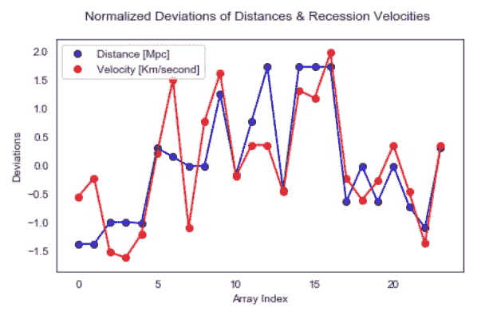

除了第一对测量值之外，在视觉上观察两个银河距离偏差的标准化阵列和它们的后退速度，看起来它们高度相关。这两个归一化的偏差数组看起来像是在同一个方向上一起移动。让我们调整距离值并生成数据的汇总统计。

**用系数 7 调节距离**

距离值乘以系数 7。

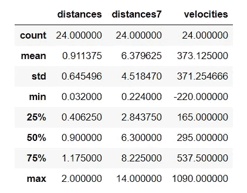

Descriptive Statistics of Hubble’s 24 observations of galactic distances and recession velocities, including adjusted distances ie. distances7

尽管距离增加了 7 倍，这并不奇怪，退缩速度和银河距离似乎仍然高度相关。为了测试这一点，我们将计算皮尔逊相关系数，并通过散点图显示与调整后的距离变量的相关性。

**相关性**

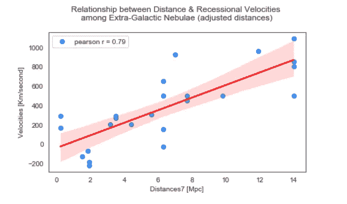

除了 x 轴的调整，这张图看起来和哈勃创建的图没有太大的不同。该数据显示出很强的线性关系，皮尔逊相关系数约为 0.8。让我们执行一个普通的最小二乘回归来进一步理解这种作为线性函数的结果的关系。

## 内源性阿片样物质

下面的回归结果是通过 python 中的 statsmodels ols() API 生成的。

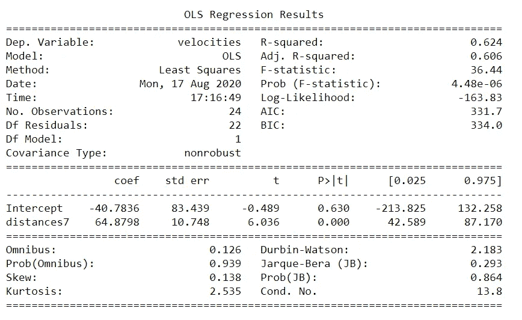

statsmodels ols() results: velocities ~ distances7

距离每增加一个单位，后退速度每秒增加 64.88 公里。

根据 r 平方值，62%的后退速度方差是由距离解释的。

我们检查了相关性，并有足够的信心得出结论，大部分方差可以用模型来解释。现在我们将进一步理解残差。

**残差、RSS 和 RMSE**

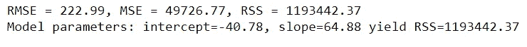

r 平方是可以用我们的 OLS 模型解释的方差，残差平方和(RSS)表示模型不能解释的误差数量。

OLS 回归的解是 RSS 最小的一组系数值。我们将在下一节讨论 bootstrap 重采样时再次讨论这个主题。

这里我们有一个大约 223 的均方根误差(RMSE ),它可以解释为预测误差的分布，或者数据在最佳拟合线周围的集中程度。让我们看一个概率图来形象化残差的分布。

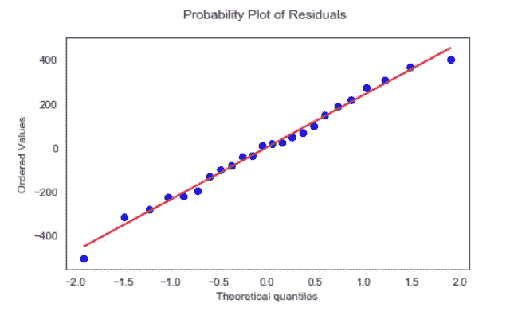

残差的概率图近似为线性，支持误差项呈正态分布的假设。

现在是有趣的事情！让我们生成一些 bootstrap 复制来验证我们从 OLS 得到的结论，并发现一些新的结论。

## 使用 Pairs Bootstraps 重新采样

配对引导重采样包括使用替换对数据对进行重采样。每个配对集合都符合一个回归模型。我们将重复进行 *N* 次，从解释变量和因变量中生成 bootstrap *N* 样本统计量，此外还有运行 OLS 模型 *N* 次后的模型参数估计。我们还将使用 bootstrap 重采样来计算 RSS 最小值，以确定最佳的最小化误差的线性方程。

目标是使用 bootstrap 重采样为每个样本计算一个平均值，并创建样本平均值的分布。然后，我们将计算标准误差来量化样本统计中的不确定性，作为总体平均值和标准偏差的估计量。这非常方便，因为我们不知道总体平均值或标准差的真实值。相反，我们将使用 bootstrap 重采样进行推断。

根据中心极限定理，如果我们产生足够多的重复，重采样分布将遵循正态分布，这是假设检验的假设之一。下一节将详细介绍这一点。现在，让我们为每个变量生成 1000 个配对的重复。

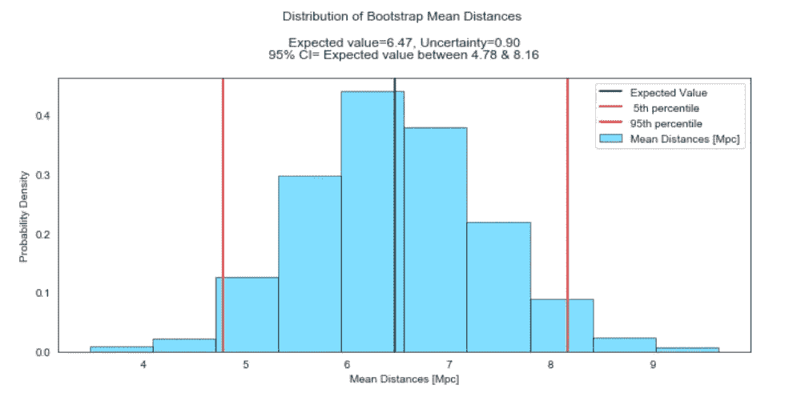

通过 bootstrap 采样，我们推断银河系距离的预期平均值为 6.47 Mpc，不确定性约为 1 Mpc。这非常接近我们使用 OLS 生成的样本均值和标准差。此外，根据所提供的数据，我们可以以 95%的置信度推断出真实的人口平均值介于 4.78 和 8.16 Mpc 之间。

注意我们在中间有一条黑线来标记期望值。这里的不确定性只是样本均值分布范围的一种度量。此外，注意我们计算的不确定性也在置信区间内。你可以把不确定性想象成一西格马置信区间。

此外，垂直红线标记第 5(左)和第 95(右)百分位数，表示置信区间的范围或包含样本平均值内部 95%的值的范围。

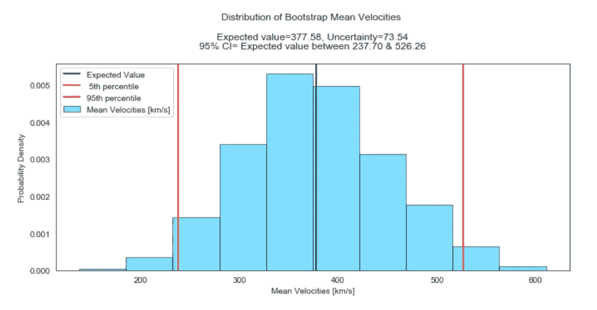

同样，对于速度，我们推断速度的预期平均值约为每秒 378 千米，不确定性约为每秒 74 千米。此外，根据所提供的数据，我们可以以 95%的把握推断，真实的人口平均速度在每秒 238 到 526 公里之间。

现在，我们将进行类似的练习，这一次使用模型斜率和截距参数。没错！您还可以使用 bootstrap 重采样来计算 OLS 模型参数的估计值、标准误差和置信区间，这都要归功于中心极限定理。我们基本上将使用每对自助复制作为我们的 OLS 模型的输入，以生成自助斜率和截距估计。让我们试一试！

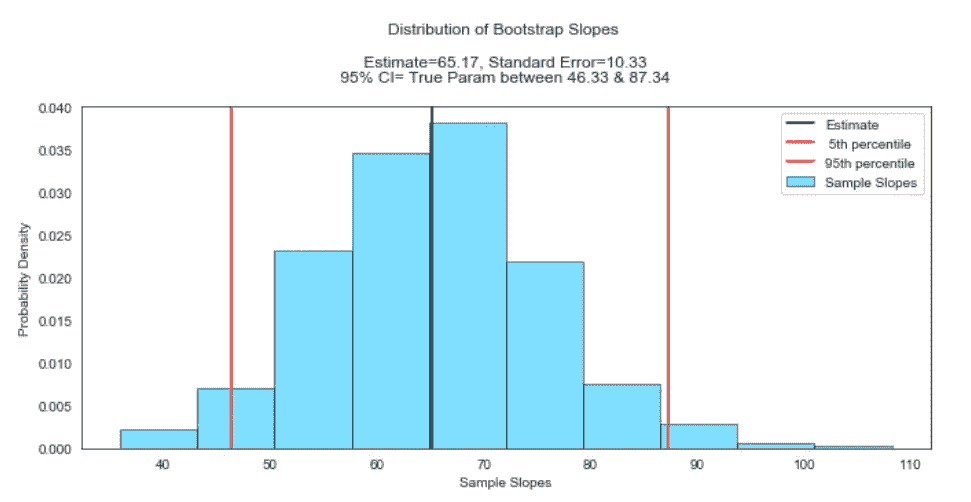

运行模型后，我们推断斜率的估计值为 65.17 千米每秒/Mpc，标准误差为 10.33 千米每秒/Mpc。根据所提供的数据，我们有 95%的把握认为真实的斜率在 46.33 到 87.34 千米/秒/Mpc 之间。

请注意，这与之前显示的 statsmodels ols()模型的汇总输出非常接近。

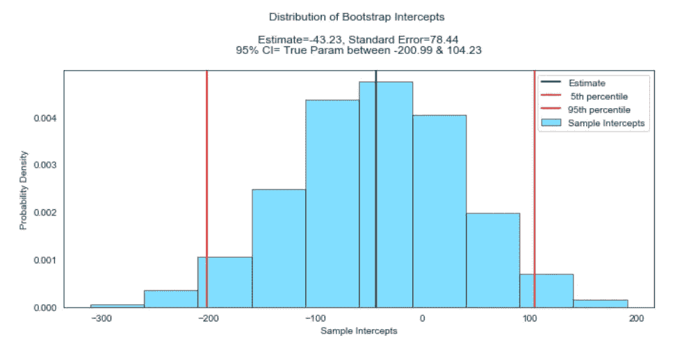

我们还推断截距的估计值为-43.23 千米每秒，标准误差为 78.44 千米每秒。根据提供的数据，我们有 95%的把握认为真实截距在每秒-200.99 到 104.23 公里之间。

现在，我们将通过 pairs bootstrap 重采样来生成 RSS 最小值。

**可视化 RSS 最小值**

回想一下，当我们看 RSS 时，OLS 的解是 RSS 最小的一组系数值。现在，我们将使用我们生成的相同复制来可视化 RSS 最小值。然后，我们将检索生成 RSS 最小值的模型参数(斜率和截距)。

太神奇了！最佳斜率和截距值是产生最小 RSS 值的斜率和截距数组中的值。请注意，我们的斜率值几乎相当于目前校准好的膨胀率(*何*)。

在幕后，我们使用为斜率和截距估计值生成的 95%置信区间来过滤掉不在范围内的模型参数值。

现在我们有了 RSS 最小值和产生它的模型参数，我们可以用散点图来可视化新模型。

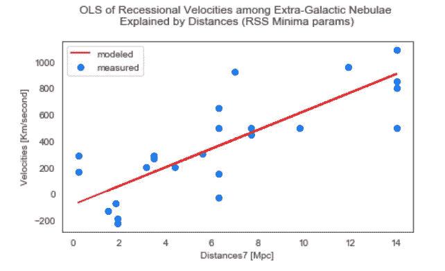

如果我们将这个散点图与我们之前在 EDA 过程中生成的散点图进行比较，就会发现略有不同，因为红线更陡一些。它并没有穿过图表右上角 14 Mpc 处的第二个星系，而是稍微在它的上方。我们可以认为这是模型整体拟合度的提高！

在最后一节，我们将进行一项假设检验，以检验银河系距离地球的长度对银河系的后退速度有重大影响的理论。我们已经在黑客统计工具箱中使用了许多工具来观察哈勃定律。让我们为这个实验画龙点睛吧！

## 假设检验→银河星云的距离对它们的后退速度有观测到的影响吗？

回想一下，我们使用中心极限定理的假设来产生足够多的 bootstrap 复制，以获得银河距离和退缩速度的成对重采样正态分布。正态分布的数据是假设检验所需的假设之一。

现在我们将测试银河距离的长度是否对后退速度有显著的影响。我们将定义星系离地球的短距离和长距离。然后，我们将对速度进行重采样和重排，并将重采样平均值的差值作为我们的测试统计量。换句话说，如果测试统计分布确实表现出显著的效果差异(即平均速度差> 0)，那么我们可以拒绝零假设，并且可以用足够的能力得出结论，结果在统计上是显著的。

参见下面的无效假设和替代假设:

**零假设**

*   *距离的长短对星系的后退速度没有影响。*

**另类假设**

*   距离的长短对星系的后退速度有很大的影响。

**假设**

对于我们的实验，我们将使用 95%的显著性水平，这将使我们的 alpha 值为 0.05。我们将短距离定义为小于 7 Mpc 的距离；相反，我们将长距离定义为大于或等于 7 Mpc 的距离→请注意，这将通过我们调整后的距离值来实现。

对于假设检验，我们将使用 T 检验，因为我们不知道总体的真实标准差；我们还将使用 1000 个银河系衰退速度的自举复制。

检验统计量是从较短距离得出的后退速度和从较长距离得出的后退速度之差。差值的分布是通过将较短范围内的每个点减去较长范围内的一个点来建立的，以查看平均差值是否大于零，也称为效应大小。

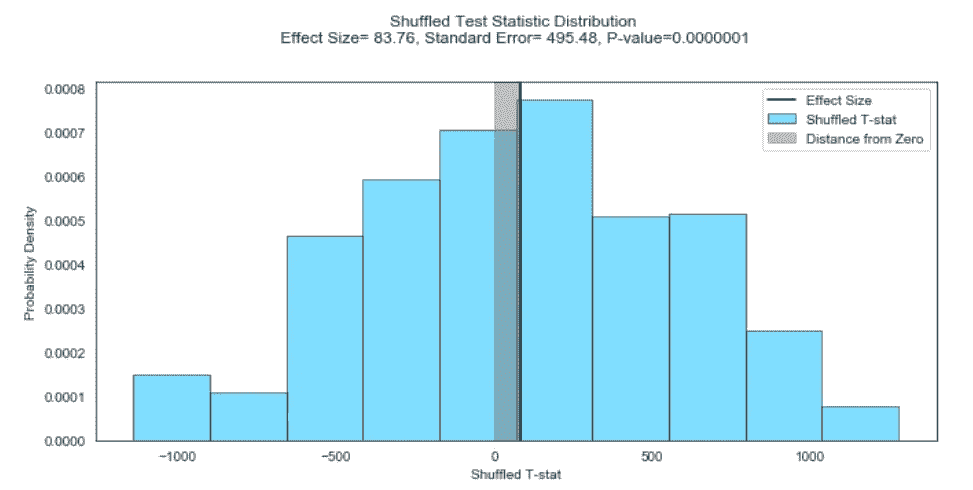

我们做到了！测试统计的平均值不为零(由灰色阴影区域表示)，这告诉我们，在比较短银河距离和长银河距离时，平均每秒钟有 83.76 公里的速度差异。同样，我们称之为我们的效果尺寸。换句话说，离地球较近的星系远离地球的速度比离地球较远的星系慢得多。银河与地球距离的增加对后退速度有一个观察到的影响。检验统计分布的标准误差也不为零，因此影响的大小存在不确定性。

还值得一提的是，改变重新采样的数据点对我们实验的随机性有影响。我们打乱了数据，以确保每个样本由随机和独立的数据点组成，这是假设检验所需的其他假设。如果我们不打乱数据，那么由于时间顺序对平均值的影响，影响大小会大得多。

> 最后，我们的 P 值极小→ 0.0000001
> 
> 因此，我们可以从高度的统计学意义上得出结论，星系与地球的距离对它们的后退速度有影响，这是哈勃定律的观测证据。宇宙在我们周围不断膨胀！

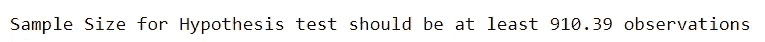

请注意，我们没有使用功效分析来预先确定假设检验的样本量，因为我们在实验开始时并不知道标准效应量。根据传统的统计学教科书，人们应该在进行假设检验之前确定所需的样本量；这通常是利用功耗分析来避免第二类错误。相反，我们选择了黑客方法:我们用 1，000 个样本进行了假设检验，检索了效应大小和效应的标准误差，并将这些值插入到功效估计器中。结果大约是 910 次观察，多亏了黑客统计，这对我们非常有利！

# 后续步骤

*   为 T 检验添加 22 个估计距离。
*   用 k 均值识别星云团。
*   使用其他银河系外距离和衰退速度的数据来源…

我们也可以使用 22 个估计距离进行 T 检验，使观察总数达到 46。

哈勃将 24 个星系分成 9 个星系团。这将是一个有趣的练习，看看我们是否用 KMeans 或凝聚聚类得到相同的聚类质心。

最后，我们还可以使用来自哈勃望远镜的数据来检验哈勃定律。

正如哈勃在他的 PNAS 论文中总结的那样，“这些结果建立了速度和星云间距离的大致线性关系，这些速度以前已经发表过，而且这种关系似乎支配着速度的分布……..在不久的将来，新的数据可能会改变目前调查的意义，或者，如果得到证实，将会导致一个数倍于此的解决方案。”(2)

# 参考

1.  哈勃 E (1926)。河外星云。天体物理学杂志
2.  哈勃 E (1929)河外星云之间的距离和径向速度的关系。美国科学院院刊| [免费全文](https://www.pnas.org/content/15/3/168)
3.  Bahcall N (2015)哈勃定律和膨胀的宇宙。美国科学院院刊| [免费全文](https://www.pnas.org/content/112/11/3173)
4.  Starchild NASA 团队(2018)红移和哈勃定律| [网页](https://starchild.gsfc.nasa.gov/docs/StarChild/questions/redshift.html)
5.  埃德温·哈勃:星云的水手。芝加哥大学出版社

**访问专家视图—** [**订阅 DDI 英特尔**](https://datadriveninvestor.com/ddi-intel)