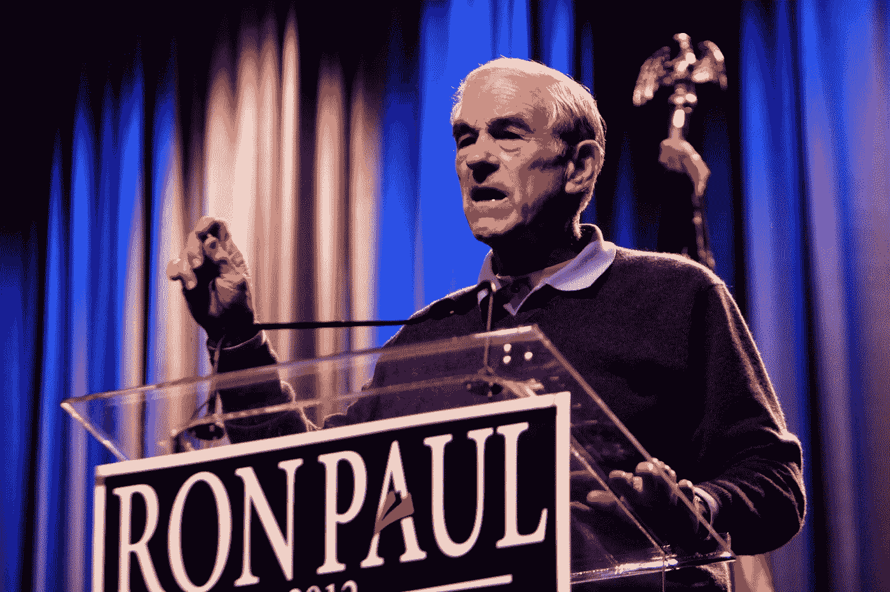
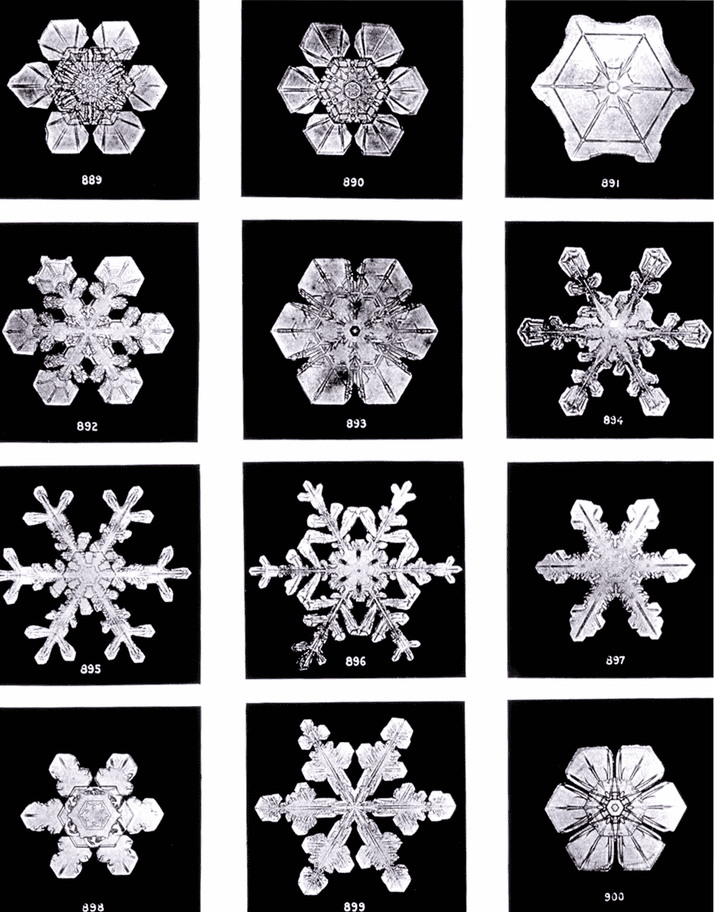
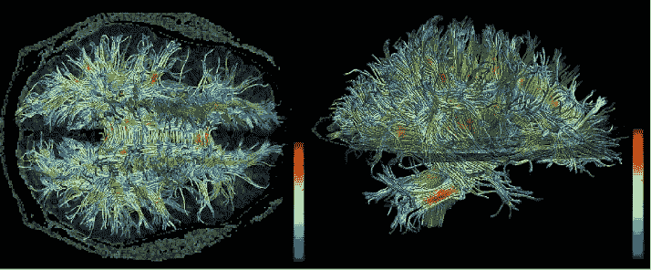
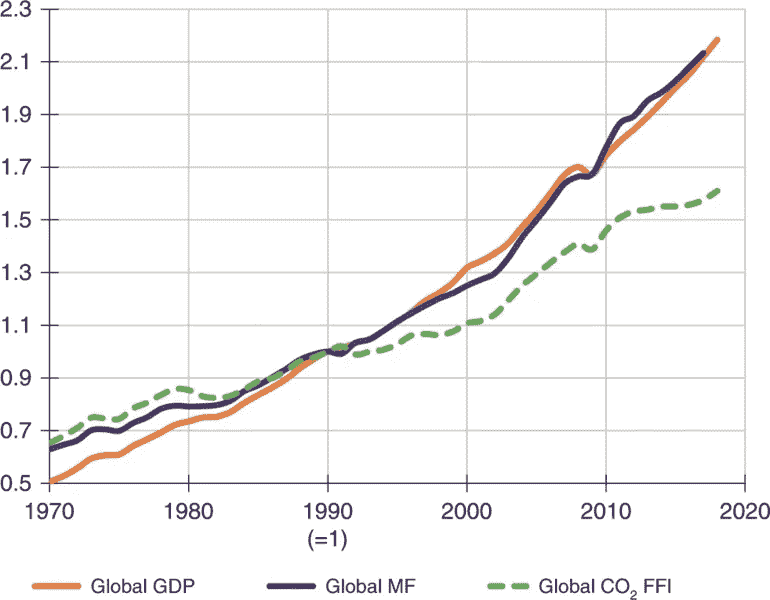

# 重温《铅笔:集体智慧的市场和本质》

> 原文：<https://medium.datadriveninvestor.com/revisiting-i-pencil-the-market-and-the-nature-of-collective-intelligence-4d97552420a3?source=collection_archive---------7----------------------->

我在高中时是相当令人讨厌的自由主义者。我穿着罗恩·保罗(Ron Paul)的连帽衫，走到哪里都带着一本《耸耸肩的阿特拉斯》,我甚至在 Learn Liberty 上了一堂关于大萧条的在线“课程”。当我找到第一份工作并开始体验真实世界时，我开始意识到，我从奥地利经济学家和所谓的“客观主义者”那里获得的许多观点都失败了。商人并不比其他人聪明多少，公司可能和大政府一样臃肿和官僚，金钱实际上并没有和美德或人类需求紧密联系在一起。对经济学和人类心理学了解得越多，对政府监管是人类繁荣的唯一障碍这一基本观点的质疑就越多，我不得不拓宽视野，去理解制度如何以复杂的方式相互作用。我的个人经历教会了我更加开放和平等，而我的学习教会了我更仔细地思考复杂的问题。

Ron Paul 2012 — Photo by Gage Skidmore

然而，有一个概念在我心中经受住了时间的考验。这是伦纳德·e·里德在他的著名论文 [*I，Pencil*](https://www.econlib.org/library/Essays/rdPncl.html) 中阐述的自发合作的根本概念。这篇文章的基本思想是，即使是像石墨铅笔这样相当简单的东西，协调生产所需的信息对任何一个人来说都过于庞大，难以安排。光是采集木材就需要足够的基础设施来为一队伐木工人提供住房、衣物、运输、食物和装备。运输这些伐木工人的卡车需要几个世纪的创新设计，一个运输原材料的国际运输系统，拥有数百台制造机器的工厂，一个安排供应链的合同和贸易协议网络，所有参与这些步骤的工人还需要食物、交通和住房。你可以得到无限的粒度，并且伴随着递归，很难想象即使是我们最强大的计算机在协调一个简单商品的分配时，会比人类现在一起工作时更有效率。

Exemplar of a mastermind — Photo by [Possan](https://commons.wikimedia.org/wiki/File:MF_Doom_-_Hultsfred_2011_(cropped).jpg)

我不同意这篇文章的地方是，当他用这个来证明一个不受监管的自由市场。在里德看来，资本主义是最大限度利用自发合作的经济体系，而政府监管不可避免地会阻碍这种合作。这导致了一些结论。首先，市场这只“看不见的手”自发地配置资源，其效率远远高于任何“策划者”。第二，政府本质上是一种强制性垄断，它扰乱了市场的自然秩序，降低了这种效率。第三，自由人会以一种最大程度地促进自发合作的方式对市场力量做出可靠的反应。因此，一个社会的法律应该以促进最大可能的经济自由为导向，以便人们的创造性能量可以流动，人类的成就可以繁荣。

我不会在这里过多地讨论反对这一点的论点，但不用说，一个只执行财产权的政府不可避免地成为那些拥有财产的人的权威有力的臂膀。我听说在这样的体制下，人们会“用钱包投票”。这意味着一种制度，在这种制度中，一些人没有投票权，而另一些人的代表权相当于数百万人的总和。即使在像美国这样有一定监管的发达资本主义经济中，公司对人们的生活和创造性行为的能力也有不适当的影响。房客可以在 50 年的时间里支付同一套公寓的租金，但仍然有因违约、[拖欠付款、](https://www.cpr.org/2020/07/16/colorado-evictions-faq-guide-what-to-know-coronavirus-pandemic-renting/#:~:text=Starting%20July%2026%2C%20landlords%20on,before%20they%20go%20to%20court.)或在某些情况下毫无理由的[而失去房子的风险。](https://www.nolo.com/legal-encyclopedia-landlords-guide-how-to-evict-tenant.html#:~:text=Landlords%20may%20usually%20use%20a,cause%22)%20of%20the%20tenants.)[无家可归](https://www.cdc.gov/phlp/publications/topic/resources/resources-homelessness.html)与极端[健康风险](https://www.ncbi.nlm.nih.gov/books/NBK218236/#:~:text=Health%20Problems%20That%20Result%20from,rape%20(Kelly%2C%201985).)和[暴力](https://nationalhomeless.org/no-safe-place/)以及严重[剥夺](https://nlchp.org//wp-content/uploads/2018/10/Cruel_Inhuman_and_Degrading-1.pdf)[人权](https://ourworld.unu.edu/en/criminalization-of-homelessness-in-us-criticized-by-united-nations)和[刑事定罪](https://www.theguardian.com/commentisfree/cifamerica/2011/aug/10/america-poverty-criminalised)联系在一起。贫穷给人们带来的认知负荷实际上限制了他们的智力，并可能加速认知老化(T21)。许多人承受着努力赚钱以满足基本需求的负担，这必然限制了人的潜力和他们对自己生活的掌控。

Homelessness in New York — photo by C.G.P. Grey

自发的合作如何能带来如此令人印象深刻的结果，而一个理应基于这一原则的经济体却导致如此可怕的后果？里德可能会把重点放在我对市场结果的批评上，指责我所看到的美国社会的问题是由于政府管理不善，而不是市场失灵。支持集中经济的人可能会在自发合作的哲学中找到错误，认为一个仁慈的专家团队可以比陌生人之间的随机互动更好地分配资源。像蒲鲁东这样有互惠主义倾向的人会认为资本主义是一种促进自发合作的无效方式，里德没有详细说明真正自由市场存在的必要条件。

我发现这些批评在不同程度上是正确的，但我不认为我们必须考虑它们中的任何一个来调和自发合作的胜利与资本主义的明显失败。这是因为【T2 I，铅笔是一个论证了资本主义自由市场中自发合作的有效性，却没有承认机制的实际目标的论点。仅仅因为某件事最大限度地有效，并不意味着它是一件好事。核裂变可能在产生自由能方面极其有效，但如果在你的后院自发发生核连锁反应，你就不会有快乐的草坪。末日博士可能是一个天才，但他制造的末日机器被一些人认为是不受欢迎的。自然选择可以建造一棵树，但它也可以产生可怕的寄生虫，这些寄生虫需要造成巨大的痛苦才能生存和繁殖。

Snowflakes, photo by Wilson Bentley

> 集体智慧是这样一种财产，当一群人一起工作，获得了比集体中任何一个人单枪匹马所能做的更高层次的收集信息和决策的能力时，集体智慧就出现了。集体发展出超越其个体成员的行动和欲望的属性和行为。

让我们后退一步。为什么我要谈论资本主义这样一个无生命概念的目标？市场是由人组成的，他们都有自己的目标。既然没有障碍阻止人们创造性地行动，市场难道不应该代表系统内每个人的总体愿望吗？

不一定。伦纳德·e·里德所描述的似乎是所谓集体智慧的一个例子。集体智慧是当一个系统解决问题的能力大于其各个部分的总和时，该系统所表现出来的一种特性。基本上，所有协同工作的部分比所有独立工作的部分有更多的“脑力”。最熟悉的例子是蚁群。蚂蚁本身并不特别聪明，但它们聚集在一起形成了一种“T2”超个体，能够从事建筑、农业、制造业，甚至战争。另一个你可能听说过的例子是[无脑黏菌](https://www.discovermagazine.com/planet-earth/brainless-slime-mold-builds-a-replica-tokyo-subway)的聚居地，它们形成了一个类似东京[铁路系统](https://www.nationalgeographic.com/science/phenomena/2010/01/21/slime-mould-attacks-simulates-tokyo-rail-network/)的复杂的食物分配网络。甚至我们自己的大脑也可能是集体智慧的一种形式，因为我们的思考能力似乎来自于通过数万亿连接进行交流的数十亿独立神经元。

A diagram of white matter in the human brain by [Kubicki et al.](https://commons.wikimedia.org/wiki/File:3DSlicer-KubickiJPR2007-fig6.jpg)

在我看来，说里德所描述的“看不见的手”是自由市场中人们共同努力所产生的集体智慧的化身，这并不是一个太大的飞跃。数学家、物理学家和计算机科学家 David H. Wolpert 将经济描述为一种自然发生的集体智慧，它寻求最大化独立于其个体成员的效用函数。简单来说，[效用](https://www.investopedia.com/terms/u/utility.asp)是对某样东西有多合意的度量，而效用函数是智能用来评估各种结果的效用的方法。你可能还记得微观经济学中的这个概念:据说消费者以最大化其个人效用的方式购买商品。这允许一些基本的建模:如果我喜欢的汉堡包是热狗的两倍，那么我会买汉堡包，直到它们变得比热狗贵两倍。更广泛地说，这也可以从世界状态的角度来考虑。比起吃热狗，我更喜欢生活在一个吃汉堡的世界里。如果我理性地按照我的喜好行事，我会做出我认为最有可能创造一个我在吃汉堡的世界的决定。

Robert Miles explains how we can predict the behavior of an intelligence without knowing its goals

这给我们带来了一个不同寻常的问题:经济想要什么？更正式地说，资本主义的效用函数是什么？如果我们能够理解我们所生活的系统偏好哪种世界状态，这可能有助于我们预测该系统最终将构建一个什么样的世界。这似乎是一项不可能完成的任务:正如我们之前所讨论的，一个经济体中个人的偏好极其复杂。然而，由于工具趋同，我们可以极大地简化这些偏好。工具趋同，尽管是另一个令人困惑的短语，却是一个相当简单的概念。基本上，即使不同的智能可能有很大不同的目标，通常有共同的工具可以用来达到任何数量的目标。因此，他们最终聚集在相似的工具上来解决他们各自的问题。当一个集体中的大多数问题都可以用同一个工具解决时，测量该工具的存在并基于该测量对整个集体的效用函数建模可能是有用的。

幸运的是，我们的经济确实有这样一个工具，你可能已经猜到了。不管你想做什么，你都需要钱。你想成家吗？治愈癌症呢？你考虑过竞选公职吗？你在考虑搬到喜马拉雅山去做苦行僧吗？也许你只是想呆在你的房间里，一辈子玩电子游戏。你的目标是什么并不重要；你几乎总是需要钱来实现它们。正如我们前面提到的，这就是为什么金钱与权力成正比。金钱广义上代表了人们为实现个人目标而进入社会机器的能力。想要最大化自己对他人的影响力的人可能会通过为自己积累尽可能多的钱，同时最小化别人持有的钱来实现。这些钱的价值和形式可能会改变，但这种权力的相对悬殊不会改变。如果我们把金钱所代表的力量定义为资本，资本主义的定义就变得非常简单。在我看来，资本主义可以被定义为通过最大可能的资本积累使其效用函数最大化的集体智慧。

Intelligence is not the same thing as morality. An intelligence could far exceed our own while still having goals we would find ridiculous. Just because we design an intelligence does not mean it shares our goals.

在我看来，这一体系的问题不在于资本本质上是坏的。资本代表我们的劳动成果，我们天才的孩子，日常生活的舒适和必需品。允许我们以微不足道的成本制造一支铅笔的基础设施在人类历史上是前所未有的，摧毁它必将导致巨大的人类痛苦。问题不在于具体的目标。问题是，任何被允许不受约束地运行并最大限度地实现其目标的系统，当被赋予足够的权力时，将不可避免地摧毁人类所珍视的一切。

这是人工智能研究人员已经面临了一段时间的难题。2003 年，Nick Bostrom 写了一篇关于人工智能安全的文章，他在文章中简要解释了一个理论上的超级智能如何变得令人难以置信的危险，即使给出良性的目标。例如，设计用于制造尽可能多的回形针的足够强大的通用智能可以被建立，期望它将仅仅使用它被授权使用的机器和材料，并找出使过程更有效的方法，从而用最少的资源生产最多的回形针。然而，这种情况下的智能只真正关心制造一个尽可能多回形针的世界。除了实现这个目标之外，所有其他的考虑都是完全不相关的。这意味着一个原子一个原子地撕裂宇宙中的一切，并将其重新排列成回形针。任何关闭机器的企图都会导致世界上的回形针减少，因此它会开发安全机制来保护自己，并杀死任何试图阻止它的人。由于工具趋同，我们可以期待看到这种行为在各种智能中表现出来。对于大多数目标来说，如果有更多的资源，智能将能够更有效地完成它。对于大多数目标来说，如果智力的生存得到保证，它将更有可能成功。

Economic growth (GDP) correlates very closely to material extraction (MF) and CO2 emissions — [study](https://en.wikipedia.org/wiki/File:Relative_change_in_main_global_economic_and_environmental_indicators_from_1970_to_2017.webp) by Wiedmann et al.

这应该会缓和我们对资本主义制度的期望。就像一个人工智能一样，一个集体智能只需要关心最大化它的效用函数。我们真的应该期待资本主义找到解决气候变化的办法，如果这个办法能产生更多资本的话。否则，我们应该期待更多同样的事情:地球被贪婪地吞噬，所有的资源被剥夺。我们真的应该只期待亿万富翁解决贫困，如果这种解决方案导致更多的资本。这是不太可能的，考虑到该系统奖励财富的囤积和资源的均衡威胁着精英阶层成员控制和管理其他人的权力。只有当和平比战争更有利可图时，我们才能期待和平。只有当高生活水平不会威胁到最富裕人群获得比其他人更多资本的能力时，我们才应该期待高生活水平。我们不能指望系统自己解决问题。事实上，我们应该预料到它会尽力抵制我们试图实施的任何变化，或者重新调整变化以适应它自己的目标。

这个概念非常复杂，很明显，有相当多的细微差别我没有解决。我希望写更多的文章，扩展这个概念。我也希望这篇文章的读者会发现它足够有趣，可以挑战、挑剔并贡献他们自己的想法。也就是说，我想以积极的方式结束这篇文章。尽管我们可能感觉像是被卡在岩石和坚硬的地方之间，解决这个困境是可能的。有很多方法可以摆脱我们所处的困境，最好的方法是非暴力的。理解集体智慧给了我们全新的工具，我们可以用它来为每个人创造一个更美好的未来。我们的技术和基础设施为我们提供了比人类历史上任何时候都更大的可能性，来实现一个所有人都能繁荣发展的世界。