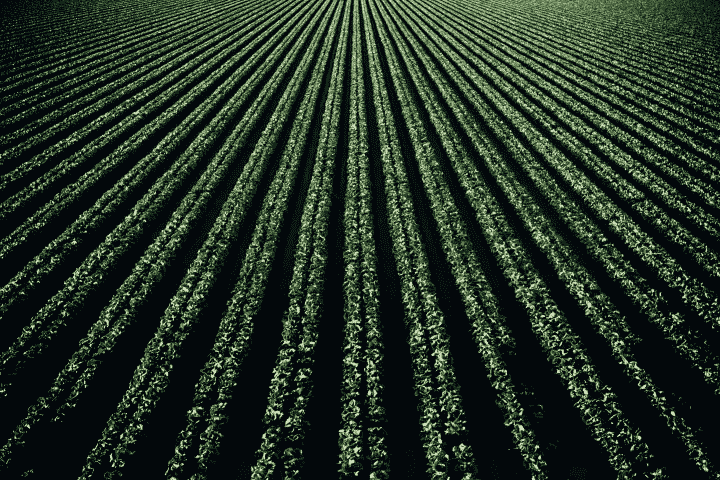
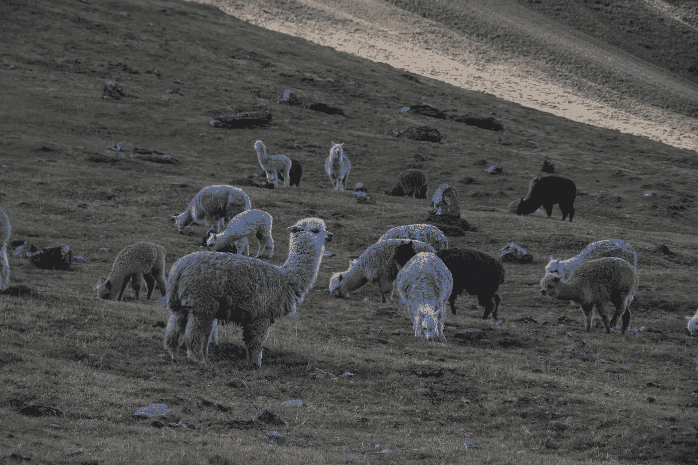
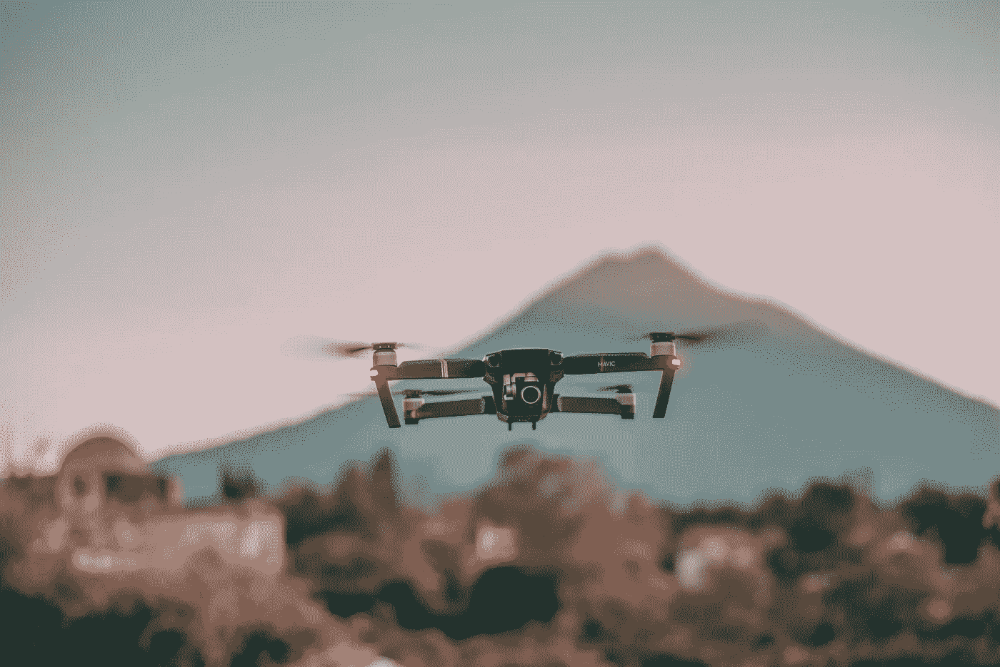

# 农业革命:技术趋势如何让农业变得更聪明

> 原文：<https://medium.datadriveninvestor.com/revolutionizing-agriculture-how-tech-trends-make-farming-smarter-e56ae29dd7fd?source=collection_archive---------4----------------------->

农业科技作为一个行业正在兴起，吸引着越来越多的投资者。它旨在让农业变得更简单，更数据化，更生态，更有利可图。 [BIS Research 预测](https://www.marketresearch.com/BIS-Research-v4011/Global-Smart-Farming-Focus-Solution-11775724/?progid=90956)到 2022 年，全球智能农业市场将达到约 230 亿美元，并从 2017 年到 2022 年以近 20%的复合年增长率(CAGR)增长。这种加速发展是由对同样资源的作物产量和粮食生产的需求增加所引发的。技术帮助农业商人重塑农业战略，并通过机器学习、物联网、大数据分析和计算机视觉增强农民在农业方面的能力。

# 作为行业驱动力的智能农业技术

也被称为第三次绿色革命，智能农业是通过采用智能技术来创新农业部门的方式。在未来几年，它有望弥合最新技术解决方案和农业部门之间的差距——农业部门习惯于依赖更传统的方法。

第三次绿色革命随着精准农业发展、物联网解决方案、卫星、传感器、地理定位系统、无人机和基于位置的服务涌入该行业。对于农民来说，AgriTech 为更容易的操作管理、更有效的资源开发和可持续的作物产量铺平了道路。物联网、高级机器人和自动化机械使农民能够优化他们的流程，而他们从传感器接收的数据可以帮助农民制定和改变他们的策略。

当与软件公司合作时，农业企业应该寻找在**人工智能、机器学习、大数据和物联网**方面拥有先进专业知识的供应商。这些技术领域可以帮助农民应对日常挑战和痛点，如果没有软件解决方案，这些挑战和痛点很难解决。例如:

*   **物联网农业传感器**和基于位置的服务解决方案可以记录天气状况，监控田地，观察和跟踪牲畜，并从田地收集数据。收到的信息将有助于改善作物管理和测量田间效率。
*   **大数据分析**可以对改善决策产生巨大影响。它将帮助农民自动化建议和推荐，计算必要的作物订单，计算植物，并预测产量。
*   智能农业中的机器学习意味着更好的作物管理。在种子繁殖、健康监测和收获方面，人工智能有很大的帮助。

# 智能农业发展的主要载体

农业技术是一个庞大的行业，结合了不同的方法和技术，但事实证明最有效的是精准畜牧业、智能绿色住宅、精准农业，以及在农场使用无人机和卫星。

## 精确畜牧业

精确畜牧业(PLF)是由先进的技术推动的，可以跟踪每只动物。通过这种方法，农民可以优化他们对每头牲畜的贡献，并改善牲畜管理。PLF 还提供质量和数量方面的成果，促进可持续发展。

精准畜牧业汇集了关于 AgriTech 动物健康、营养和位置的实时数据。基于从传感器、摄像头和图像识别软件收集的结果，农民可以监控牲畜福利并提高牲畜效率。可穿戴设备和信标都为如何通过气候、设施通风或喂食来改善动物福祉提供了宝贵的见解。

Source: [Unsplash](https://unsplash.com/)

**人工智能、物联网、云计算、大数据分析和平台解决方案**推动了智能畜牧业的兴起。

*   **当你必须处理几十或几百只动物的数据并快速准确地生成结果时，人工智能**就派上了用场。
*   **物联网技术**和互联设备为实时交流和合作创造了一个独特的网络。无线物联网农业传感器和应用对于去中心化和自动化决策非常有价值
*   [**平台**](http://bit.ly/3aF0i91) 允许通过简化的供应链和分销促进牲畜管理。它们还处理实时动物分类或动物种群中的偏差。

## 智能绿色住宅

智能温室农业用自动化传感器和监控系统取代了直接的人工监管。像这样的系统可以帮助农民监测环境并减轻变化，从而更好地种植作物、蔬菜和水果。嵌入式系统和机器人有助于控制土壤湿度水平、光照水平和湿度水平，以促进植物生长。

## 精准农业

由于设备、工具和耕作方法经常过时，该部门的生产率和利润都很低。技术可以帮助农业解决多年来阻碍其发展的问题。精准农业确保植物和动物得到它们需要的精确治疗。通过为精准农业实施计算机视觉和人工智能解决方案，企业可以管理种植园，消除植物健康状况的异常，并[将生产率提高 40%](http://bit.ly/2kutbzF) 。

通过结合传感器、GPS、机器人和云计算，精准农业技术可以帮助战略决策、生产优化和作物可持续性。与监控整个田地的传统方法相比，智能农业可以观察、诊断和确定涉及单平方米种植园或单个植物的行动。

这种针对植物的行动有助于农民通过调整每种植物的土壤水分、光照和湿度水平来选择处理方法。最重要的是，该系统可以评估治疗是否真的有效。

[自动化增长跟踪解决方案](http://bit.ly/2uMqlv7)允许企业实现流程现代化和自动化，从而提高运营效率和成本效益。

# 无人机和卫星

农民可以在农业中利用卫星和无人机的能力，更好、更便宜、更快地收集和处理数据。基于无人机和卫星的农业使得农场管理更加精确和高效。

作为农民天空中的“眼睛”，[无人机和卫星](http://bit.ly/2P3CQsY)可以帮助农场面积测量和管理、产量估计、植物健康监测以及疾病、异常和杂草识别。看看无人机和卫星可以解决的问题，以及它们的功能有何不同。

Source: [Unsplash](https://unsplash.com/)

## 卫星监控

基于卫星图像，卫星给农业带来了更高的精确度。卫星在特定的地域上运行，拍摄农田或农业区的高分辨率照片。农业卫星数据存储在数据库或云中，因此农民可以轻松地跟踪植物福利，比较生长动态，并预测作物产量。这些信息提供了对最高产量和最低产量的农田面积、作物轮作和植被状况的深入了解。

用于农业的卫星帮助商业自动化数据收集和处理。卫星给农民带来的好处还包括对整块田地和单个作物的预测分析。然而，基于卫星的农业也有缺点，包括高度的天气依赖性，低拍照频率(每 5-8 天)，以及与无人机相比照片的低分辨率。

## 无人机监控

无人机农业地图软件也帮助农民收集数据——它快速、精确，最重要的是，它是移动的。现代无人机可以拍摄分辨率为每像素厘米的照片。AgriTech 使用不同类型的无人机，但最强大的无人机每天可以拍摄和处理超过 2000 公顷的农田。最重要的是，大多数型号不受天气影响，甚至可以在多云或有雾的条件下拍照。唯一阻碍无人机工作的是禁止在特定区域飞行，即所谓的“禁飞区”。但是如果无人机只覆盖你农场的区域，你就可以去了。

# 走向农业的未来

未来本身是由技术驱动的，农业的未来也是如此。技术是解决全球粮食系统中尖锐问题的关键。数字化世界为农民提供了巨大的机会，他们可以利用从卫星、传感器、无人机收集的数据做出更明智的决策，并利用精密技术完美地执行每一项决策。通过采用最新的技术和资源节约型解决方案，agritech 将能够达到一个新的水平，降低成本，提高产量，并更加环保。