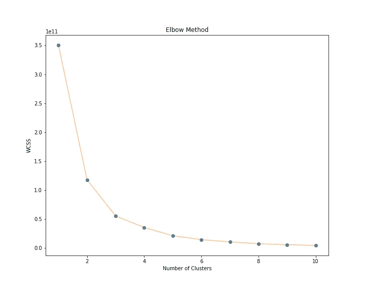
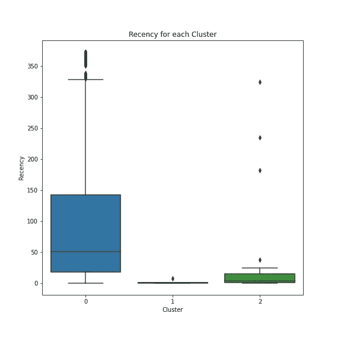
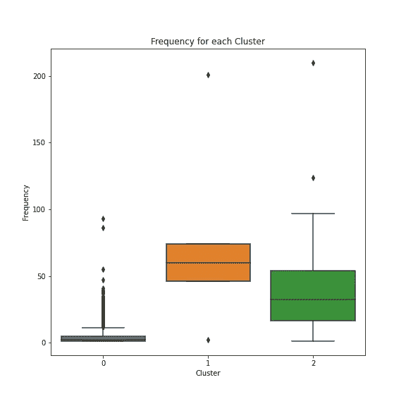
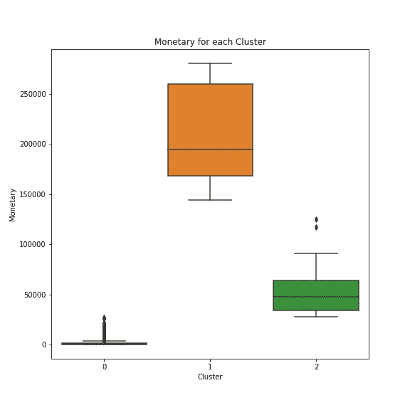
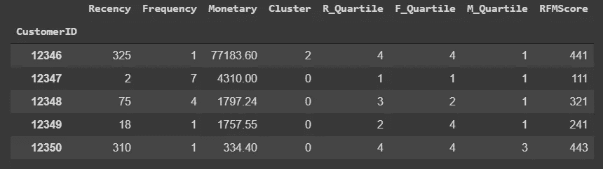
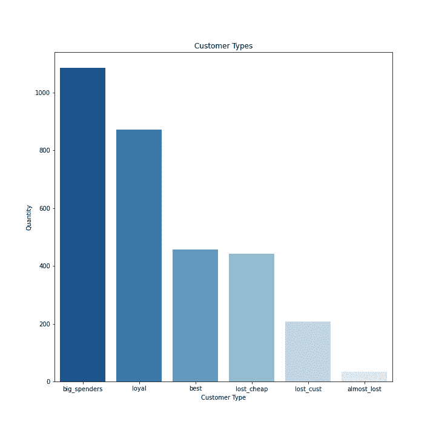

# 基于 K-Means 的 RFM 客户细分

> 原文：<https://medium.datadriveninvestor.com/rfm-customer-segmentation-using-k-means-6fa5f72604c?source=collection_archive---------2----------------------->

## 利用数据科学更好地了解您的客户。

作为一家企业，理解并照顾好你的客户是取得好成绩的关键之一。为此，我们可以使用**数据科学**工具来帮助深入挖掘我们的数据，了解更多关于我们客户的信息。

# RFM 客户细分

对于我们的**客户细分**，我们将做一个 **RFM** 分析。

根据****，** **RFM** 代表**新近度**，**频率**，**货币**值，每一个都对应着某个关键的客户特质。这些 RFM 指标是客户行为**的重要**指标**，因为频率和货币价值影响客户的**终身价值**，最近影响**保持**，这是对**参与度**的衡量。****

# **为什么重要？我们能从中得到什么？**

**这种分析可以帮助我们回答重要的问题，帮助董事们把公司引向正确的方向。其中一些是:**

*   **谁是你最好的客户？**
*   **你的哪些客户会增加你的流失率？**
*   **谁有潜力成为有价值的客户？**
*   **你的哪些客户可以留住？**
*   **您的哪些客户最有可能响应敬业度活动？**

**这些是我们可以通过分析回答的关键问题。让我们开始吧。**

**这是一个由三部分组成的项目，包括:**

*   **[**销售预测同**](https://medium.com/@rafaelnduarte/sales-forecast-using-prophet-99bf9ad93fbc)**
*   **[**用 NLP 了解你的客户**](https://medium.com/@rafaelnduarte/understanding-your-customers-with-nlp-929771ae2d0b)**

**你也可以在这里 找到带有这个项目 [**代码的完整版。**](https://colab.research.google.com/drive/1NEpuPYEtRo2rV80NU-DhgQ4OBbP4aAic)**

# **数据**

****

**本项目使用的数据可以在 [**Kaggle**](https://kaggle.com/) 上找到。它由一家英国零售商的销售记录组成。我们有关于 **3877 种不同产品**和 **4339 个客户**的数据。**

# **细分和评估**

**为了对我们的客户进行适当的细分，我们将使用 **K 均值聚类**来创建客户聚类，我们将其命名为:**

*   ****黄金** —频繁并产生大量收入。**
*   ****白银**——频繁但产生的收益较少。**
*   ****铜牌** —频率较低，收入较低。**

# **肘法**

**对于 **K-Means** ，我们必须为要划分的数据设置多个**簇**。由于这首先是一个完全随意的任务，我们必须寻找尽可能精确的选项。**

**最流行的方法之一是肘法。基本上，我们为不同数量的集群计算不同的场景，然后将它们绘制成一条线。**

> ***我们要寻找的数字是线条开始变平的位置，使它看起来像绘图的一个弯头。经过一些测试，我发现 3 个集群会产生更好的结果。***

****

**在确定了适当数量的聚类之后，我们将数据放入模型中，将数据分成不同的聚类。由于我们的数据是独立的，因此了解每个集群中的客户非常重要。为此，我创建了一个列，将集群分配给客户。**

**太好了！现在，让我们分析每个集群的近期、频率和货币价值。**

**先说新近。**

# **崭新**

*   **集群 0 具有**高新近率**，这意味着它是任何集群中最后一次购买日期最长的。**
*   **群组 1 和 2 具有低新近率**，这是好的。他们可以成为我们的金牌和银牌客户。****

****让我们潜入更深的地方。****

********

# ****频率****

*   ****集群 0 具有**低频率**，这意味着该集群中的消费者不是很频繁。****
*   ****第 1 类和第 2 类拥有**高频率**，这让它们在争夺金牌的竞争中更进一步。****

********

# ****货币的****

*   ****集群 0 有一个**货币汇率**，这表明集群 0 是我们的**青铜**客户所在的位置。****
*   ****群组 2 具有中等水平的货币汇率，这使其成为我们的白银客户群组。****
*   ****集群 1 具有最高货币利率，使其成为我们的**黄金**客户的集群。****

********

# ****结论****

********

*   ******金牌客户**属于第 1 类客户****
*   ******银牌**客户属于第 2 类****
*   ******青铜级**客户属于第 0 类****

# ****进一步分析****

****当然，我们可以更深入地了解并识别其他模式和类型的客户。****

****为此，在给客户分配“等级”时，我们需要做得更好。****

****为此，让我们创建一些其他功能。****

# ****RFM 得分****

****为了进一步了解我们的客户，让我们为每个类别创建分数，然后根据这些分数对它们进行分析。为了创建它们，我们必须理解我们数据的分位数。****

******分位数**是将频率分布分成相等组的变量的任何一组值，每组包含总人口的相同部分。****

********

****Identifying each client in quartiles of the data, and then, attributing the score.****

# ****总分****

****还有一个我们可以使用的度量标准，那就是**将分数**相加，而不是仅仅将它们放在一起。****

****这种方法的**优势**是每个分数都有**相同的重要程度**。然而，它可能**不太暴露**并为**不确定性**留下更多空间。****

****例如，一个值为 **413** 和 **431** 的消费者在这个量表上的得分**是相同的**，但也许对公司来说，**频率**比**货币**比率更重要，对他们来说，这两个值并不相同。****

****这就是为什么保留和分析这两个指标并使用更适合您的业务模型的指标非常重要。****

# ****分析分数****

****让我们来看看这些分数能告诉我们关于我们客户的一些事情。****

********

****Big Spenders, Loyal Customers, Best Customers, Lost Cheap Customers, Lost Customers, Almost Lost Customers.****

# ****可视化集群****

****最后，但并非最不重要的，让我们看看我们的集群绘制成一个**三维散点图**，使用 **Plotly** 。****

# ****谢谢大家！****

****感谢您的时间和关注。我希望这是一个信息丰富和有趣的项目。如果您有任何问题或任何类型的反馈，请随时在 [**LinkedIn**](https://www.linkedin.com/in/rafael-n-duarte/) 上联系我，并在 [**GitHub**](https://github.com/rafaelnduarte/portfolio) 上查看我的其他项目。****

********