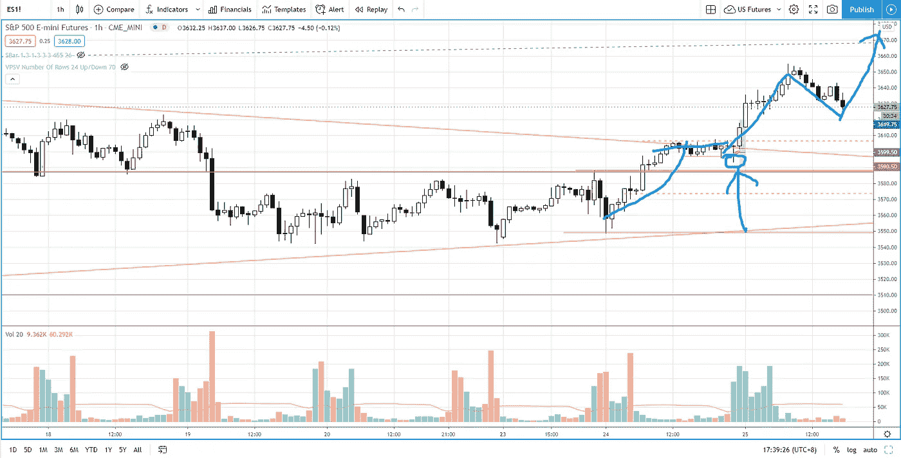
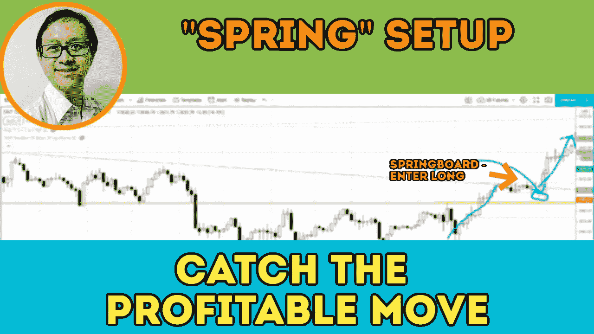

# 用这个“威科夫之春”的进场设置交易爆炸性的移动

> 原文：<https://medium.datadriveninvestor.com/ride-on-the-uptrend-with-this-spring-entry-setup-s-p-500-day-trading-b3a65607aafb?source=collection_archive---------12----------------------->

你在用这个“春季”交易进场系统来驾驭趋势和潜在的爆炸性走势吗？在趋势做出最大变动之前，找出你如何抓住它。

观看视频，了解 2020 年 11 月 25 日交易时段标准普尔 500 指数期货的**每日市场分析。在这个视频中，你将看到上一个交易日的市场回顾和三分钟的交易回顾(包括进场、出场和背后的原理)。展望未来，我将涵盖偏见，要注意的关键水平，我稍后的交易计划。**

## 时间戳

*   [1:18](https://www.youtube.com/watch?v=wJaXeby-gsw&t=78s) 市场回顾
*   [4:00](https://www.youtube.com/watch?v=wJaXeby-gsw&t=240s) 贸易回顾
*   [7:00](https://www.youtube.com/watch?v=wJaXeby-gsw&t=420s) 错误分线或弹簧设置
*   [14:18](https://www.youtube.com/watch?v=wJaXeby-gsw&t=858s) 当前股市展望

如果你还没有看我的[每日市场分析视频](https://www.youtube.com/watch?v=x4jMfxd626Y)，为了更好地了解市场回顾和交易回顾。

**偏向** —中性(日内交易)；看涨(长期)

**关键水平** —阻力:3660；支持:3630，3600，3587

**潜在设置** —在关键级别寻找潜在反转。

# 资源

**每周市场展望&最佳交易建议**直达您的收件箱:[https://www.tradeprecise.com/](https://www.tradeprecise.com/)

**职业免费**制图平台:创建账户→[www.TradingView.com](https://bit.ly/2U2Femd)

**非美国居民？** ( **马来西亚、新加坡**、澳大利亚、新西兰、欧洲等……):[点击此处，当您存入新币 2000 元](https://ji.hn/sgtiger)时，即可获得**免费股票(价值 100++ &美元)老虎经纪**的欢迎礼物

美国居民？[点击此处，当您存入 1500 美元](https://ji.hn/ustradeup)时，就有机会在 TradeUP 上获得一份**免费的 AMZN 股票(价值 3000++美元** ) & **欢迎礼物**

**无限制访问媒体文章** —加入以下:【https://priceactiontrading.medium.com/membership】T2

# 进一步阅读

 [## 阿里巴巴崩溃——马云失踪了吗？—购买或销售

### 自 2020 年 10 月以来，阿里巴巴股价暴跌 34%，负面消息不断。巴巴触底了吗还是…

medium.com](https://medium.com/datadriveninvestor/alibaba-baba-crashes-is-jack-ma-missing-buy-or-sell-90c20dd6ba21)  [## 用异常的交易量和价格确定市场方向——标准普尔 500 日交易

### 了解如何确定日交易标准普尔 500 时异常的成交量和价格趋势的市场方向…

medium.com](https://medium.com/datadriveninvestor/identifying-market-direction-with-unusual-volume-and-price-s-p-500-day-trading-eec9fb9854b5)  [## 凯西·伍德警告市场即将调整——标准普尔 500 价格走势分析

### 在 2020 年 12 月 18 日对彭博的采访中，方舟投资公司的首席执行官兼首席信息官凯西·伍德警告说…

medium.com](https://medium.com/datadriveninvestor/cathie-wood-warns-market-correction-soon-price-action-analysis-on-s-p-500-7e621e013310) 

Photo by Author — Ming Jong Tey

Photo by Author — Ming Jong Tey

披露:如果您点击本文中的链接进行购买或开立账户，并将所需金额存入推荐的经纪人账户，我们将免费为您赚取佣金。

免责声明:本演示中的信息仅用于教育目的，不应作为投资建议。