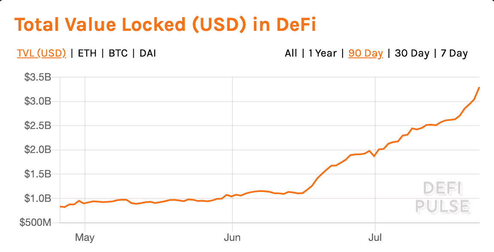
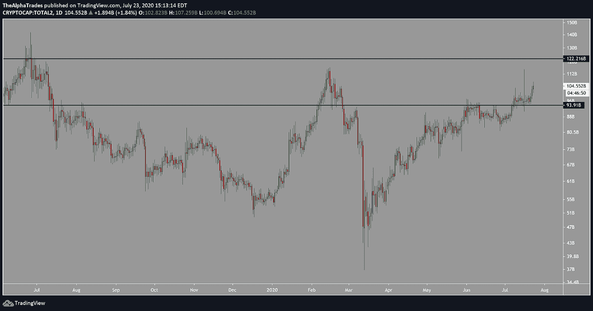
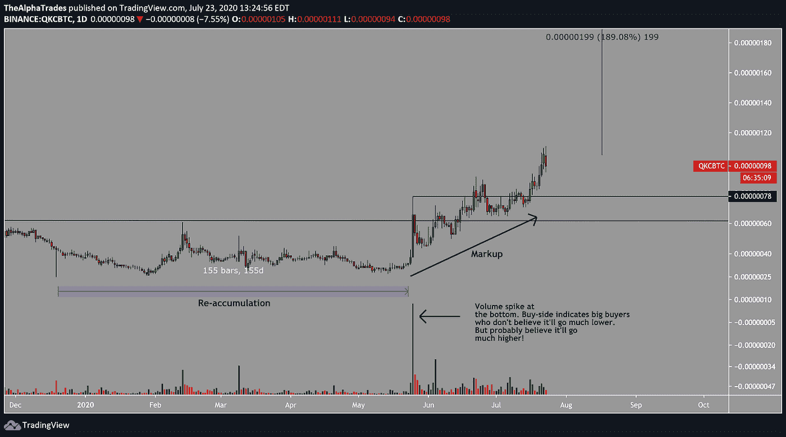
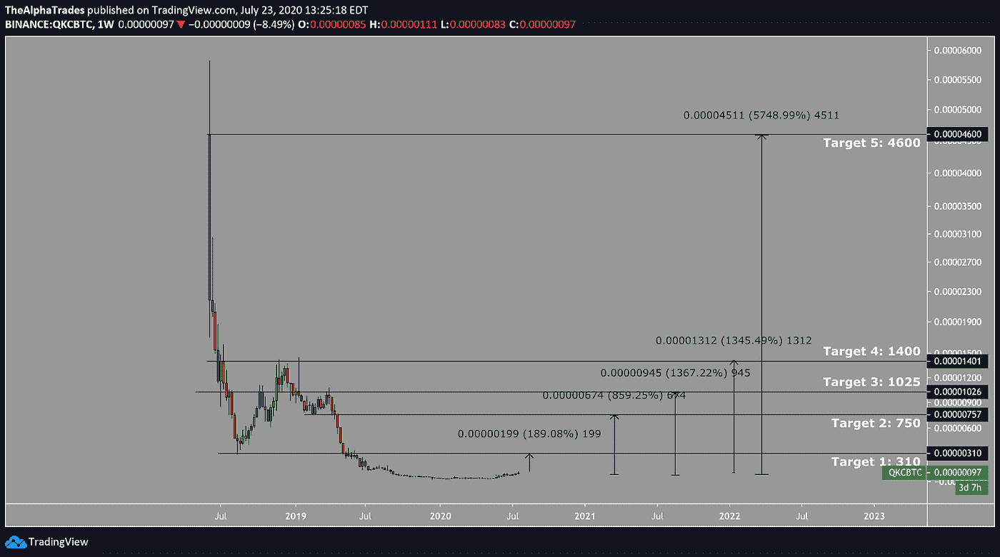

# 乘着 DeFi 浪潮——我们要去哪里？

> 原文：<https://medium.datadriveninvestor.com/riding-the-defi-wave-where-are-we-headed-405c5593ec92?source=collection_archive---------8----------------------->

## 7 月 24 日当周的加密简讯| Alpha 交易

*被困在 Medium 的付费墙后面？* [*注册我们的 Discord 服务器*](https://discord.gg/a97qq2s) *查看#公告免费获取全文:*[*https://discord.gg/a97qq2s*](https://discord.gg/a97qq2s)

结束一周，这样你就不必。这是最新一期的阿尔法交易通讯。阅读上一期我们的加密货币简讯 [***【此处】***](https://medium.com/datadriveninvestor/bitcoin-and-equities-reveal-a-line-in-the-sand-1ac6126d2b23) *以及所有关于股票和经济的* [***【此处】***](https://medium.com/datadriveninvestor/tech-leaders-slip-amid-covid-resurgence-economy-set-for-a-decisive-turn-aec14d426abb) *。*

# 让您的生活更轻松:

*   [**每周击败**](#5057)
*   [**意见**](#d2ad)
*   [**没错，是泡沫。**](#7b71)
*   [**DeFi 设置的月份**](#f0e6)
*   [**洞察一周**](#11ad)
*   [**编辑台**](#9248)
*   [**观看演出**](#a735)

[【复制我们的比特币主图，设置警报！】](https://www.tradingview.com/chart/vxxXy5t0/)

# 每周节拍

**一千万绿灯|** 美国一家主要银行监管机构[本周宣布](https://www.theblockcrypto.com/amp/post/72628/us-bank-regulator-crypto-custody)国家储蓄银行和联邦储蓄协会可以向其客户提供加密货币托管服务。

加密的环境一周比一周强大。日本银行[最近成立了](https://decrypt.co/36090/bank-of-japan-sets-up-digital-yen-division-to-expedite-cbdc-research)数字日元部门，以加速日本央行数字货币(CBDC)的发展。中国还继续推动其国家支持的基于区块链的服务网络(BSN)，整合了六个公共链(T3)。后者可能是 DeFi 硬币开始出现总体需求激增的原因之一。

**担心灰度买断所有的比特币？|** 不要害怕，灰度公司的首席执行官迈克尔·索南申[在 Pomp 播客上澄清了谣言](https://youtu.be/ZQpHFgaeN6Q?t=1875)。灰度很可能买不到所有的供应，这只是糟糕的数学。此外，他们的快速投资对整个行业来说是个好兆头。好奇灰度如何获取比特币和其他资产来满足客户需求？[我们也为你打上了时间戳](https://youtu.be/ZQpHFgaeN6Q?t=2064)。

 [## 为什么参与正确的加密交换至关重要|数据驱动型投资者

### 到目前为止，与黄金和美元相比，加密货币，尤其是比特币，已经显示出巨大的增长

www.datadriveninvestor.com](https://www.datadriveninvestor.com/2020/07/16/why-engaging-with-right-crypto-exchange-matters/) 

**ChainLink FUD |** 总部位于英国的 FCA 监管资产公司 Zeus Capital Limited[发布了一份声明](https://zeuscapital.co.uk/news/zeus-capital-limited/)，否认与一份关于 ChainLink (LINK)项目各种缺陷的长达 59 页的严厉报告有任何牵连。比特币最大化主义者从此支持了这张纸的真正创造者，一个可疑的名字宙斯首都 LLP。对一些人来说，指出项目中的潜在缺陷就足以证明欺诈是正当的，即使损害会直接有利于犯罪者。

**wire fraud |**Oof——Wirecard 的前首席运营官[带着一批比特币在俄罗斯逃亡](https://decrypt.co/36083/wirecards-ex-coo-turns-up-in-russia-with-bitcoin-cache-says-report)。这起 21 亿美元的国际规模的丑闻让情节变得更加复杂。读一本关于导致这一切的审计的入门书。

Twitter 黑客更新| Twitter [发布了一份声明](https://blog.twitter.com/en_us/topics/company/2020/an-update-on-our-security-incident.html)披露了黑客访问的内容以及他们是如何做到的。该黑客被称为“社会工程”计划，其中犯罪者操纵 Twitter 员工发布敏感信息。受害者在一个下午失去[超过 13 个 BTC](https://blog.chainalysis.com/reports/twitter-hack-july-2020-update) 。

# 意见

在 DeFi 领域，这开始看起来很像 2017 年。这应该会让任何熟悉历史的人既兴奋又震惊。人们认为这些项目中的一些没有任何实际价值，但传统市场上的许多股票也没有任何实际价值，然而它们却在疯狂上涨。

[https://defipulse.com/](https://www.google.com/url?q=https://defipulse.com/&sa=D&ust=1595535236194000&usg=AFQjCNEiX3mZZFJeiBFgH84RyGM-m94DWQ)

与 2017 年的股市牛市相比，我们现在处于一个无限印钞的环境，对传统金融系统的信任比以往任何时候都少。这是一个奇怪的景象，股票只涨不跌，亿万富翁明星得到政府救助，而其余的人却在餐馆只有一半容量的城市里苦苦寻找工作。

不管怎样，美国和世界的人们都没有保留他们的刺激计划，而是将他们的应急资金投入到股票和神奇的网络货币中。公司将会加入 DeFi 的行列，重塑他们在上次登月时对 crypto 和区块链的品牌形象。甚至[Elon pumping dog coin](https://twitter.com/elonmusk/status/1284291528328790016?s=20)也让人想起几年前迈克菲[对比特币做的同样的事情](https://thenextweb.com/hardfork/2020/01/07/john-mcafee-reneges-on-promise-to-eat-his-dick-if-bitcoin-fails-to-hit-1m/)。许多硬币在技术上是过度膨胀的，但是如果传统市场是可靠的，有时多愁善感的人会把技术和基本面都扔出窗外。

也就是说，有理由相信这只是一个开始，即使是由于真正的主街衰退和刺激资金在地下赌场和股票市场的最终枯竭。DeFi 已经存在了几年，但围绕该主题的谷歌搜索词汇才刚刚开始急剧上升。人们刚刚开始对市场上的各种 DeFi 协议有一个合理的理解，但 Twitter 上的讨论开始升温。

如果你要去 YOLO，在合理的范围内去吧。这就把我们带到了今天的主要话题 DeFi 泡泡以及如何在不输掉你的衬衫的情况下玩它。

> "当我看到泡沫正在形成时，我会赶紧买入，火上浇油."乔治·索罗斯

这整个分析基于一个租户，即替代币的价格行为很大程度上取决于比特币。此外，只要这是一个主要的投机部门，当股票说“跳”时，加密市场就会问，“多高？”

在过去几个月里，美国股市不断走高，拉动黄金、白银和石油。无情的政府印刷、刺激检查和全球放松隔离措施，加上相当大的不确定性，为比特币的进一步上涨制造了一场完美风暴。

随着波动性逐渐减弱，比特币在过去两个半月里一直在 8 到 10，000 之间波动。比特币较低的波动性意味着算法和专业人士在另类领域寻求更高的回报。这可能不是替代硬币兴起的唯一原因，但它是其中一个重要且基本的部分。但本月的问题是这是否是一个泡沫，对吗？

# 没错，是泡沫。这就是为什么这对投机者来说是件好事。

如果你参考这张市场周期图，加密领域可能会迎来新市场泡沫的首次抛售，但我怀疑这是否接近市场周期的顶部。[媒体关注](https://www.forbes.com/sites/cryptoconfidential/2020/07/19/massive-twitter-hack-attempts-bitcoin-scam-does-defi-make-ether-a-better-bet/#76ab59a27f2b)似乎正在慢慢进入 DeFi 空间，所以我们可能已经超过了熊市陷阱阶段。

不包括比特币的总加密市值处于上升趋势。市值已经超过了关键的阻力位，达到了 930 亿美元。下一个控制点是 1220 亿美元左右。我们将希望看到比特币保持在 9450 至 9500 的临界高点。

Total crypto market capitalization excluding Bitcoin; Source: Alpha Trades

# 每月设置:夸克链(QKC-BTC)

记住，永远要做自己的研究，你在这里读到的都不是财务建议。完整免责声明；我们的分析师 [*阿莫尔加特*](https://www.linkedin.com/in/amolgharte/) *在 QKC-BTC 有职位。*

直到去年 5 月，这个项目的流入量非常少，我们可以看到大约 27.5 亿的流入量大幅增加。成交量的飙升为即将到来的看涨势头奠定了基础，因为有人在经过长期的重新积累阶段后开始买入。我们现在看到的是一个标记。传统资产遵循三个不同的市场阶段，即加价、分销和降价阶段。

在 2017 年加密泡沫之前，QKC-BTC 享受了大幅加价，随后是分销和降价。经过长时间的再积累，资产似乎进入了一个新的涨价阶段，在提供的图表中列出了一些潜在的标记。交易风险自担，我们最雄心勃勃的目标是目前水平的近 5000%，我们的头寸有 50%到 60%的损失风险。

QuarkChain, first key target (not investment advice); Source: Alpha Trades

QuarkChain, all key targets (not investment advice); Source: Alpha Trades

# 本周洞察

在之前的视频中，我们的分析师 Amol Gharte 给出了一些改善你交易游戏的建议。点击学习[如何使用布林线](https://youtu.be/s3oLm04LC8I?t=516)、[交易周线开盘价](https://youtu.be/s3oLm04LC8I?t=75)和[捕捉回撤](https://youtu.be/s3oLm04LC8I?t=1235)以进入有利可图的交易(链接重定向到视频中的相关时间戳)。

# 编辑桌

我们正在回答你关于 Quora.com 的问题！

[比特币到 2030 年会达到 100k 吗？](https://qr.ae/pNs4vb)

开始网上外汇交易的最佳方式是什么？

**罗宾汉家族会喜欢这个|** 在来自我们社区的巨大压力下，我们最终跳回了替代硬币和 [DeFi](https://defipulse.com/#__next:~:text=What%20is%20DeFi%3F) 空间的最深处，为您提供一些杀手交易设置。观看节目，深入了解本周的最佳选择。

# 观看表演

**时间戳:**

*   [DeFi 正在谷歌和推特上流行](https://youtu.be/kzvBZR5yYWI?t=324)
*   [不包括 BTC 的市值](https://youtu.be/kzvBZR5yYWI?t=410)
*   [如何搭建篮子](https://youtu.be/kzvBZR5yYWI?t=591)
*   [Aave(LEND)——压榨近 1100%](https://youtu.be/kzvBZR5yYWI?t=667)
*   [夸克链(QKC-BTC)](https://youtu.be/kzvBZR5yYWI?t=772)
*   像风险投资基金一样投资

# 找到你的优势

[订阅 Discord 服务器](https://bit.ly/2KJ1oor)学习技术分析以及如何投资获利。询问优势会员的 2 天试用期。

# 放弃

Alpha Trades，LLC 提供的信息不用于制定任何财务决策，也不是购买、持有或出售特定产品、数字资产或 ICO 的请求或建议。

访问我们的完整服务条款:[https://bit.ly/3faVeeV](https://bit.ly/3faVeeV)

**访问专家视图—** [**订阅 DDI 英特尔**](https://datadriveninvestor.com/ddi-intel)