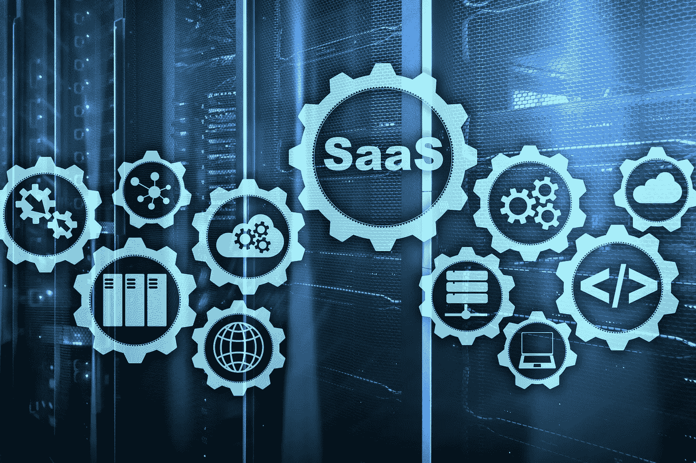
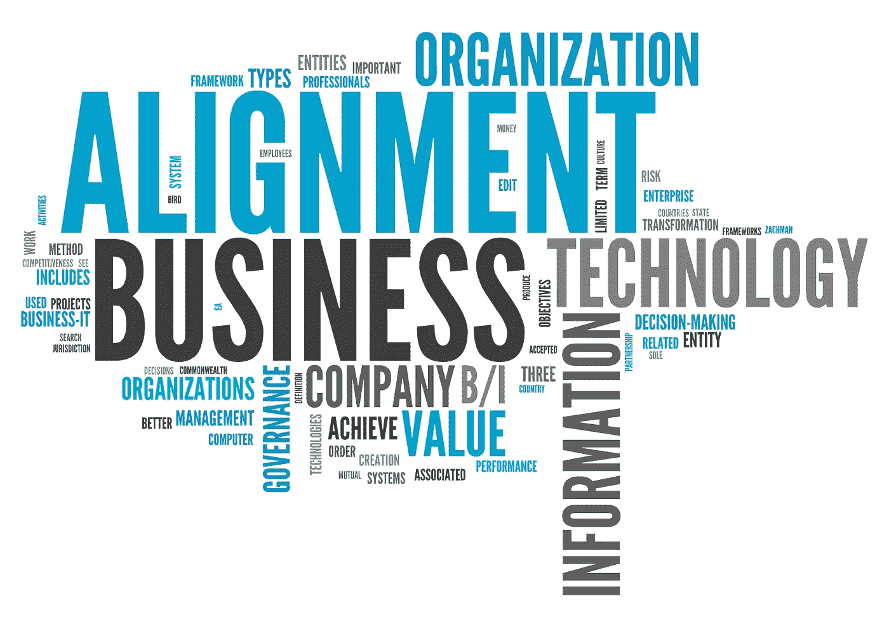

# 现在是解决影子 IT 问题的时候了——避免分散的工作模式

> 原文：<https://medium.datadriveninvestor.com/right-now-is-the-time-to-tackle-shadow-it-head-avoid-a-dispersed-working-model-24e5b6d63684?source=collection_archive---------10----------------------->

影子 IT 是工作场所技术民主化最两极分化的结果之一。

一方面，这对 it 团队来说是一个持续的问题，因为他们必须跟踪、监视和控制治理策略之外的技术使用。但 shadow IT 赋予基层员工权力也是事实。他们可以选择自己喜欢的技术，根据需要扩大或缩小规模，让流程运行起来，没有复杂的审批或延迟。因此，最大的问题是，我们如何继续提供影子 IT 的便利，同时确保可见性和整合？

影子 IT 的秘密性:影子 IT 的秘密性导致了它的扩散，据统计，扩散率在 30- 60%之间。这意味着没有人或只有少数人知道内部部门在做什么。当意识到缺乏透明度时，就会在 it 部门和试图绕过它的个人之间产生不信任。

**影子 IT 带来风险:**这是一条快速便捷的途径导致敏感的企业或客户数据泄露，然而并不是每个设备、软件和网络都容易出现风险。这可能很简单，就像在 Google Doc 中与您组织的官方协作空间(比如 OneDrive)就新产品需求进行协作一样。不幸的是，Covid19 加剧了这种情况，远程工作的员工希望完成他们的工作，因此在紧急情况下会出错。据说大多数员工没有意识到他们把敏感数据放在了外面。

**影子 it 难以审计:**解决组织因影子 IT 而面临的挑战至关重要。识别审计线索[需要时间和金钱](https://compuware.com/application-audit/)来发现发生了什么或谁参与了。缺乏 DevSecOps 实现和 cleat 技术指导方针导致项目变慢，人们采取捷径导致影子 IT 的产生。

**影子 IT 是一种变通方法:**虽然影子 IT 可能会让事情进展得更快，但因为这种速度超出了正常的 IT 流程，它实际上会让事情变慢。如今，组织已经建立了一个内部 IT 审计团队，定期检查所有应用程序和访问它的用户，因此今天正常工作的应用程序明天可能会被列入黑名单，导致不可用，并且缺少组织发起人来恢复无投诉系统。

在当今分散的工作模式中，我们如何监控在家工作的员工的数字活动？

CIO 们首先要回头看看当初为什么会产生 shadow IT，在起源的源头寻找答案。

# 你的主要挑战在于为什么影子会存在

影子 IT 作为一种实践(如果不是用那些确切的话)已经存在了几十年，但传统上，它将被限制在一个硬件扩展或计算外围设备上。正是云让影子 It 变得如此普遍，让员工和个人部门/业务部门更容易购买 SaaS 技术。五年前，Gartner 指出影子 IT 是首席信息官面临的一个问题，并将很快占据所有企业 IT 支出的 35%。

这一趋势既有推动因素，也有拉动因素:

1.  传统的 **IT 组织无法跟上**快速变化的工作场所技术需求。新冠肺炎危机是这种情况的一个很好的例子，因为几个 IT 部门在适应方面不够敏捷，加剧了影子 IT 的利用。
2.  与此同时，**软件即服务(SaaS)市场已经爆发**。随着员工在个人生活中订阅健康监测器或财务健康计算器应用程序，几乎没有什么可以阻止他们将这种“特别增长”的心态带到工作场所。

因此，首席信息官们面临着一个双重问题:一个不完善的流程蓝图和一个动态的工作场所/商业环境。

你真的准备好放弃生产率的提高了吗？

影子 IT 经常被掩盖的一个方面是其带来的生产力提升。毫无疑问，您正在为这些收益牺牲可见性、长期可持续性和预算/流程合规性，这可能会增加您企业的长期复杂性债务。但你是[也是](https://www.zdnet.com/article/maybe-shadow-it-isnt-so-bad-after-all-study-suggests/):

● **提高员工的工作效率** —将近一半的 IT 团队认为，当员工可以选择他们喜欢的技术时，他们的工作效率会更高。45%的人说这让他们更加投入。

● **提高内部合规性** —这听起来可能有悖常理，但选择影子 IT 的员工更有可能遵守 It 安全要求。对于 40%的员工来说都是如此，这可能是因为他们不必为内部应用程序寻找变通办法来完成工作。

● **提高员工保留率** —技术使用与员工参与度和保留率密切相关。一个沮丧的员工，经历复杂的审批过程，降低了他们的工作效率(甚至在疫情期间冒着个人健康的风险，要求亲自到场)，将永远是一个逃跑的风险。40%的 IT 团队同意影子 IT 使他们的员工更有可能长期留在公司。

显然，影子 IT 无法通过大爆炸式的方法消除。首席信息官在规划如何处理影子 IT 时，必须注意员工授权、日常业务活动、IT 治理协议和长期路线图之间的无数关联。

# 2020 年首席信息官的 3 大战略

在为影子 IT 缓解(而不是消除)概述职能计划时，有三个要素需要考虑。这些是:

# 1.应对影子 IT 带来的风险

通常，影子 IT 会导致两种风险:网络安全风险和预算超支风险。第一步是完成对一个人的应用程序和技术环境的端到端审核，找出阴影区域、未解决的相关性以及随着时间推移可能出现的不可预见的增长。

2020 年，网络安全风险成为一个主要问题，自疫情开始以来，71% [的受访者称](https://www.infosecurity-magazine.com/news/shadow-it-covid19-home-working/)安全威胁/攻击有所增加。值得注意的是，前三大威胁—网络钓鱼(55%)、恶意网站(32%)和恶意软件(28%)都可以通过影子应用程序进入您的系统。CISOs 必须投资于网络安全技术，以应对影子 IT 带来的风险。

# 2.为简单性转变现有的 IT 组织

这种策略有助于减少员工对不明应用程序的依赖，为他们提供了一个简单的内部替代方案。CISOs 必须重新审视企业中最常用的系统，如人力资源自助服务、质量管理系统(QMS)、IT 支持门户等。以及特定于业务的应用程序。如果与第三方提供商合作实现业务活动，实施流程必须尽可能简化。

众所周知，今年，数字化转型获得了全新的动力，将长期推迟的项目推到了前台。it 现代化也应该是这个列表的一部分，包括 IT 的应用程序实现和支持服务方面。

# 3.实施强大的治理协议

即使您管理风险并提供低风险的替代方案，也必须有一个详细的治理系统，阻止员工选择影子 IT，并提高对其风险的认识。该协议必须涵盖三个方面:合规指导方针、员工培训以及对任何违规行为的处罚。IT 必须与业务活动经理和其他核心运营利益相关方合作，定期提供必要的培训并检查意识/合规性。

这里需要考虑的一个重要问题是，即使员工在家工作，也需要远程 IT 能力和学习解决方案来让他们跟上时代的步伐。请记住，分散的工作人员在计划外的数字行为方面存在很高的风险，因此最好不要将培训课程推迟到办公室工作恢复之后。

# 利用新发现的业务/IT 一致性

即使不受管理的技术在企业中变得越来越普遍，IT 部门也比以往任何时候都更有能力解决这个问题。疫情将 IT 所扮演的整体角色展现出来，从而增加了他们从企业获得的尊重(如 [31%](https://devops.com/survey-shows-most-it-teams-adapting-to-covid-19-normal/) 所示)。近一半的 IT 专业人士感觉更有权力，40%的人希望更多地参与业务层面的会议。

这意味着首席信息官(以及一般的 IT 团队)在企业的未来中拥有越来越多的利益，并直接干预结果的关联。

几年来，我们一直在谈论影子 IT，2020 年必须解决这个问题(就像其他几个长期存在的系统性问题一样)。幸运的是，SaaS 订阅管理、影子 IT 映射和类似市场的 IT 目录等新兴解决方案为 IT 从业者提供了构建精简、低负债技术环境所需的工具。

*收听第二部分，我将更详细地探索这些过程和工具。要讨论这些想法并与我分享您的想法，请发电子邮件至 Arvind@am-pmassociates.com。*