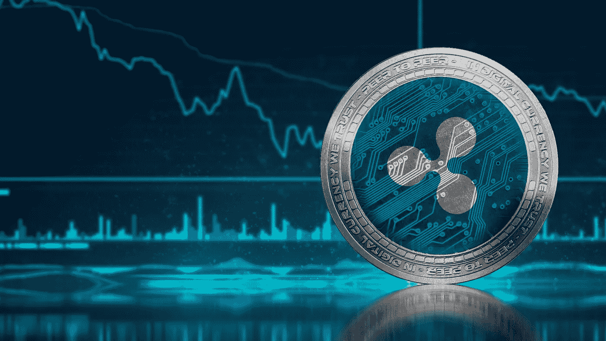

# 价格波动风险？— SEC 准备起诉书

> 原文：<https://medium.datadriveninvestor.com/ripple-price-at-risk-sec-prepares-the-indictment-f589d36733d8?source=collection_archive---------28----------------------->

代理主席杰伊·克莱顿即将卸任。作为他在办公室的最后行动之一，克莱顿现在正在与布拉德·加林豪斯，克里斯·拉森和关联公司 Ripple Labs 合作。起诉书集中在本土资产 XRP 及其通过销售创收的常见做法。

由于宣布起诉，涟漪价格暴跌了两位数。另一次修正即将到来吗？起诉书是关于什么的？

# Ripple price 的危险:SEC 的起诉

据《华尔街日报》报道，美国证券交易委员会(SEC)正准备起诉总部位于旧金山的 Ripple Labs。起诉书集中在非法销售本地加密货币 XRP。

虽然在撰写本文时，SEC 尚未做出最终确认，但 Ripple 首席执行官布拉德·加林豪斯(Brad Garlinghouse)已经在 Twitter 上对此事做出了回应。

在一系列推文中，加林豪斯将 SEC 的努力称为“对加密的攻击”。因此，在他看来，这个案例显然不仅仅是关于 Ripple，而是关于整个生态系统以及美国希望在开发加密货币领域的创新技术方面发挥什么作用。

此外，加林豪斯还报复了美国证券交易委员会主席克莱顿，他已经在介绍中引用，谁将在今年年底离职，因此仍然积极地启动球。

# XRP 对 SEC 的指控反应消极

在过去的 24 小时内下跌了 17%，XRP 可能是顶级加密货币中的输家。

 [## 出土加密宝石蓄势待发|数据驱动的投资者

### 你并不总是有第二次早期发现的机会。无论是股票，加密货币，还是收藏…

www.datadriveninvestor.com](https://www.datadriveninvestor.com/2020/12/17/unearthed-crypto-gem-poised-for-resurgence/) 

# 五大加密货币和涟漪价格

这一声明无疑不会让涟漪价格不受影响。尽管 RippleNet 和 ODL 公司 90%的客户都不是美国人，但目前围绕起诉的消息并不乐观。

我们已经多次报道过 Ripple Labs 考虑将公司总部从美国迁走。考虑到目前的形势以及 Ripple 与 SBI 控股公司在亚洲拥有强大的合作伙伴这一事实，这一考虑可能很快就会成为现实。顺便提一下，就 XRP 而言，日本的监管也很清晰。

我们可以说，Ripple 的股价在短期内肯定会受到 SEC 起诉的影响。然而，该公司的中期搬迁以及相关的监管清晰度也可能恢复投资者的信心。

如果火花空投是在证券交易委员会提起诉讼之前为 XRP 的最后一搏而精心策划的呢？布拉德知道这种事多久了？

我只是说 RIP(请)！

我在每月的[时事通讯中分享了更多私密的想法，你可以在这里查看](https://mailchi.mp/bf8f8e8ed697/keep-in-touch-with-lukas)。请在评论中告诉我，并在各种社交媒体平台上加入我:

[推特](https://twitter.com/WiesfleckerL) ● [Instagram](https://www.instagram.com/lukaswiesflecker/) ● [脸书](https://www.facebook.com/lukaswiesfleckerr)●[Snapchat](https://www.snapchat.com/add/luggooo)●[LinkedIn](https://www.linkedin.com/in/lukas-wiesflecker-1b11251a5/)

无论你做什么，都要带着爱和激情去做！

## 访问专家视图— [订阅 DDI 英特尔](https://datadriveninvestor.com/ddi-intel)