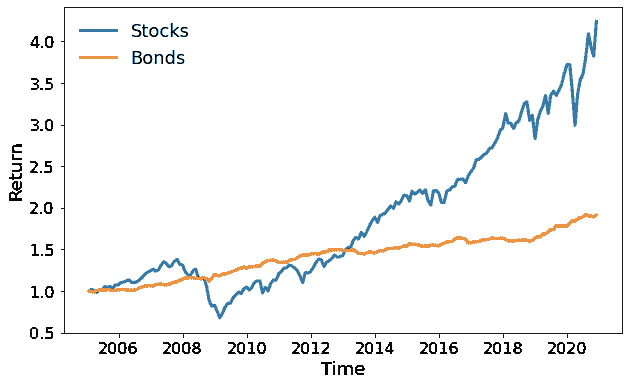
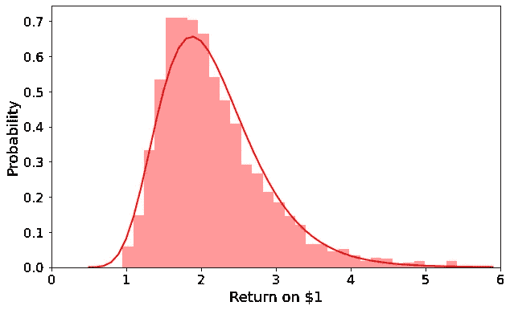
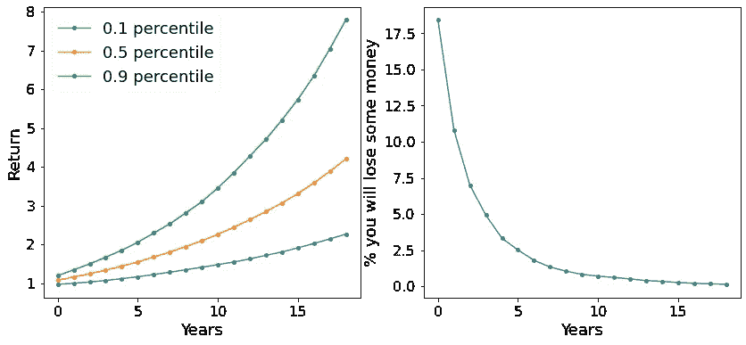

# 一段时间内的风险和回报

> 原文：<https://medium.datadriveninvestor.com/risk-and-return-over-time-e92ea93f5684?source=collection_archive---------4----------------------->

## 使用 Python 执行蒙特卡罗模拟来预测被动投资的可能结果。


Photo by [Loic Leray](https://unsplash.com/@loicleray?utm_source=medium&utm_medium=referral) on [Unsplash](https://unsplash.com?utm_source=medium&utm_medium=referral)

## **要旨**

我们将对一个由 50%债券和 50%股票组成的投资组合进行多次蒙特卡洛模拟。通过模拟，我们将计算作为投资时间的函数的可能的回报和赔钱的机会。我们将会看到，坚持投资更长的时间将会减少我们失败的机会，从而降低我们的风险。

## **基础知识**

股市没有免费的午餐。投资一只预期回报(即利润)较高的股票应该伴随着较高的风险。或者从另一个角度来看，我们可以说*高风险应该得到高预期回报*。风险较高的资产可以被视为价格波动较大的资产，这意味着它的价值可能会大幅上升，也可能会暴跌。但是，如果我们将长期坚持投资，我们应该较少受到这种波动的影响。

## **那个什么**

我们将选择一个由 50%的股票(由遵循标准普尔 500 的 ETF 执行)和 50%的债券(同样由遵循债券指数的 ETF 执行)组成的投资组合。查看历史数据，我们将通过随机获取两种资产的多个月变化来构建一个实现。这样，我们可以创建多个模拟的“历史”(或未来)，同时保持我们的资产之间的相关性(或缺乏相关性)。对于给定的时间跨度(即 1 年到 15 年)，我们将看到可能的回报，以及我们最终将比开始时赚得更少的可能性。

## **跳水**

让我们从加载所有需要的库开始:

```
**# inviting our friends to the party:** import pandas as pd
import pandas_datareader.data as web
import datetime
import matplotlib
import matplotlib.pyplot as plt
import seaborn as sns
import numpy as np
import scipyplt.style.use('seaborn-paper')
matplotlib.rc('xtick', labelsize=16)
matplotlib.rc('ytick', labelsize=16)
```

现在我们可以编写一个函数，从 Yahoo Finances 导入 ETF 的历史数据。我们将只查看调整后的收盘价(标记为“Adj Close”)。我们还希望只查看月度数据，最后我们将把价格标准化为我们时间历史开始时的价值，这样我们就可以直接看到我们的回报。

```
def **importasset**(name,start_date,end_date,freq='BM'): 
  **""" 
  Imports a ticker from Yahoo, normalizes is and down samples it to   every month 
  """** asset=web.DataReader(name, 'yahoo', start_date, end_date)
  asset_close= asset.drop(asset.columns[0:5], axis=1).asfreq(freq)
  asset_normlized=asset_close['Adj Close']/asset_close['Adj Close'][0]
  asset_normlized.fillna(method='ffill', inplace=True)
  return(asset_normlized)
```

我们还将编写一个函数，多次调用" ***importasset*** "函数，从而构建一个包含我们感兴趣的股票的价格历史的表:

```
def **makestockmarket**(list,start_date,end_date,freq='BM'): 
  **""" 
  Function that takes a list of imported assets and builds a single table. 
  example symbols_list = ['VTSAX', 'VBTLX']
  "freq" is the import frequency and we will use "Business Month (BM)
  """**
  d = {}
  for ticker in list:
    d[ticker] = importasset(ticker, start_date,end_date,freq)
  pan = pd.DataFrame.from_dict(d)
  return(pan)
```

现在，让我们使用我们的新函数加载 VFIAX(股票)和 VBTLX(债券)ETF 的数据，并绘制它们从 2005 年到 2020 年底的曲线。

```
tick=['VFIAX','VBTLX']
stocks=makestockmarket(tick,datetime.datetime(2005, 1, 1),datetime.datetime(2020, 12, 30)) 
plt.figure(figsize=(10,6))
plt.plot(stocks,linewidth=3)
plt.xlabel('Time',fontsize=18)
plt.ylabel('Return',fontsize=18)
plt.legend(['Stocks','Bonds'],fontsize=18) 
plt.show
```



Stock (VFIAX) and bonds (VBTLX) return from 2005 to 2020

接下来，我们将编写模拟“新”市场历史的函数。我们将使用通常所说的“*引导法*”，从我们的市场数据中随机选择每月的变化。从模拟市场中，我们将通过股票和债券的配置生成一个投资组合。

```
def **simulateportfolio**(stock,days,aloc):
 **"""
  Takes a stock market history data and simulates a new portfolio with "aloc" allocation over "days" time steps
  """** pct=stocks.pct_change(1)
  newpct=pct.iloc[1:].sample(n=days,replace='True')
  allocation=np.array(aloc)/np.array(aloc).sum()
  total=np.ndarray([1,len(allocation)])
  total[0,:]=allocation
  for i in range(len(newpct)-1):
    thisday=total[-1,:]*(1+newpct.iloc[i+1])
    total=np.vstack([total,thisday])
  sumall=np.sum(total,axis=1)
  return(sumall)
```

现在我们都准备好得到一些结果了。首先，我们想看看在 10 年的时间里我们能期望得到什么样的回报。让我们导入 2005 年至 2020 年的资产历史:

```
tick=['VFIAX','VBTLX'] **# VFIAX is a stocks ETF and VBTLX is a bond based ETF** stocks=makestockmarket(tick,datetime.datetime(2005, 12, 1),datetime.datetime(2020, 12, 1))
```

我们将模拟 2000 个不同的市场，并绘制 10 年后 1 美元回报率的直方图。我们在这个测试案例中的投资组合将由 50%的股票和 50%的债券组成。我应该指出，我们在整个投资过程中都保持这个比例。如果股票价格上涨，我们将卖出一些，购买一些债券。如果股票下跌，我们将卖出一些债券，以更低的价格买入更多股票。再平衡是维持风险/回报比的基本概念。

```
ret=[]
std=[]
iterations=2000 # it may take a minute or so to run
years=10
allocation=[0.5,0.5]
output=np.empty([iterations,]).reshape(-1,1)
endret=[]
for i in range(iterations):
  sims=simulateportfolio(stocks,12*years,allocation)
  endret.append(sims[-1])
output=np.hstack((output,np.array(endret).reshape(-1,1)))
output=output[0:,1:]
```

现在，我们可以绘制 2000 年模拟的预期回报直方图，以及符合结果的*对数正态*:

```
f, ax = plt.subplots(1, sharex='col', figsize=(10, 6))
risk=[]
profit=[]
weights = np.ones_like(output)/float(len(output))
fitting_params_lognormal = scipy.stats.lognorm.fit(output, floc=0)
lognorm_dist_fitted = scipy.stats.lognorm(*fitting_params_lognormal)
t = np.arange(0.5, 6, 0.1) **# bins return from 0.5 to 6 with steps of 0.1****# Now let plot** ax=sns.distplot(output,norm_hist=True, kde=False,color='r')
ax.plot(t, lognorm_dist_fitted.pdf(t), lw=2,c='r')
plt.xlim((0, 6))
plt.xlabel('Return on $1',fontsize=18)
plt.ylabel('Probability',fontsize=18)
plt.show()
```



Histogram of the expected return over 10 years for a 50/50 portfolio

我们看到，我们有最大的机会获得大约 2 倍的投资资金，但在曲线的左侧，我们也有可能获得少于 1 美元的资金，这意味着我们会损失一些钱。这将是我们对风险的定义——收回较少投资的机会。

现在，我们可以在 20 年的时间内进行模拟，并计算 0.5%的回报率以及我们定义的风险。

```
ret=[]
std=[]
iterations=2000
years=20
allocation=[0.5,0.5]
output=np.empty([12*years,]).reshape(-1,1)
endret=[]
for i in range(iterations):
  sims=simulateportfolio(stocks,12*years,allocation)
  output=np.hstack((output,np.array(sims).reshape(-1,1)))
**# downsample to year rows** yearsreturn=output[12::12,1:].transpose()
```

现在我们画出结果:

```
data=pd.DataFrame(yearsreturn)
risk=[]
profit=[[],[],[]]
profit=np.empty([3,]).reshape(-1,1)
for (columnName, columnData) in data.iteritems():
  fitting_params_lognormal=scipy.stats.lognorm.fit(columnData, floc=0)
  lognorm_dist_fitted=scipy.stats.lognorm(*fitting_params_lognormal)
  risk.append(lognorm_dist_fitted.cdf(1))
  profit = np.hstack((profit,lognorm_dist_fitted.ppf([0.10,0.5,0.90]).reshape(-1,1)))plt.rcParams['figure.figsize'] = (14, 6)
fig, (ax1, ax2) = plt.subplots(1, 2)
ax1.plot(profit[0:,1:].transpose(),'-', marker='o', markersize=5)
ax2.plot(np.array(risk)*100,'-', marker='o', markersize=5)
ax1.set_xlabel('Years',fontsize=18)
ax2.set_xlabel('Years',fontsize=18)
ax1.set_ylabel('Return',fontsize=18)
ax2.set_ylabel('% you will lose some money',fontsize=18)
ax1.legend([x + ' percentile' for x in ['0.1','0.5','0.9']],fontsize=18)
plt.show()
```



Expected return and “risk” from a 50/50 stock/bonds portfolio as a function of investment length

从上一张图中我们可以看到，对于一年期的投资，我们有大约 18%的机会会损失一些钱。对于更长的投资期，没有任何收益的可能性非常小。实际上，我们可以看到，有 90%的可能性(0.1 个百分点)我们会收回至少 2 美元(每投资 1 美元)，有 50%的可能性我们会得到 4 美元或更多。

我们无法预测未来(或者至少我不能)，但我们可以利用过去的数据做更充分的准备。使用蒙特卡罗模拟和引导法可以帮助我们获得更多的洞察力。我们可以开始用概率而不仅仅是确定性的值来理解风险和回报。在股市中，风险、回报和时间都是相互联系的。我希望您能研究一下上面的代码，获得一些更有趣的观察和见解。

明智地投资，不要只是在网上看一些东西，然后用你的钱进行“全押”。其他的我不建议也不奉劝。