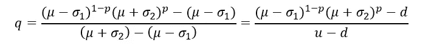

# 风险厌恶在非遍历系统中进化出现

> 原文：<https://medium.datadriveninvestor.com/risk-aversion-emerges-evolutionary-in-non-ergodic-systems-401a3e0b37c1?source=collection_archive---------2----------------------->

Ole Peters 在他的文章“[经济学中的遍历性问题](https://www.nature.com/articles/s41567-019-0732-0)”中描述了一个著名的游戏，这个游戏简单明了地展示了总体平均值(也称为期望值)如何成为随机过程可能结果的误导指标。

仅仅通过承认一些(或许多)经济系统是非遍历的这一事实，我们就能够理解我们在不确定性下的许多行为特征，并推导出作为特例的经济学和金融理论的基本定律。现在在这个领域发生的工作只是彻底改变了经济学，我不会告诉更多关于这个概念本身及其对赌博回报预测的基本含义，因为它已经在许多文章和模拟中聪明而巧妙地完成了，仅举几个例子:[经济学中的遍历性问题](https://www.nature.com/articles/s41567-019-0732-0)，[使用动力学评估赌博](https://aip.scitation.org/doi/10.1063/1.4940236)。

如果你不熟悉遍历性和时间平均的概念，请至少阅读[经济学中的遍历性问题](https://www.nature.com/articles/s41567-019-0732-0)来更好地理解下面发生的事情。

如果是的话，我们开始吧。

首先，我们需要回忆一下遍历性假设:

或者，更简单地说，

时间平均=总体平均

如果系统是遍历的，那么总体平均值就是赌博预期回报的恰当度量。如果不是，使用时间平均值更合适。简而言之就是这个想法。

然后，我们的经典游戏如下:

关于公式的详细解释，再次参见[经济学中的遍历性问题](https://www.nature.com/articles/s41567-019-0732-0)。

这个游戏确实是金融理论的果蝇，因为它使我们能够研究金融市场动态和投资者行为的大量真实世界方面，并且在它的帮助下，我们能够对许多经验法则、特征和关于不确定性下决策的证据进行深入的理论理解。

 [## 为什么包容性财富指数比 GDP 更能衡量社会进步？|数据驱动…

### 你不需要成为一个经济奇才或金融大师就能知道 GDP 的定义。即使你从未拿过 ECON 奖…

www.datadriveninvestor.com](https://www.datadriveninvestor.com/2019/03/08/why-inclusive-wealth-index-is-a-better-measure-of-societal-progress-than-gdp/) 

在这篇文章中，我将展示在非遍历博弈中，那些以成功预测博弈结果为生存条件的代理人，自然会成为现代经济理论中所谓的“风险厌恶”。

首先，让我们找出游戏的时间平均值，也就是几何平均值:

在我们的特殊情况下，我们可以将其改写为

如果代理人使用时间平均来预测游戏的结果，风险中性概率将是:

q—H 的概率，1—q—t 的概率。

对于我们的游戏:

当考虑人们对赌博结果的估计时，我们可能会发现他们倾向于对 q 概率“非理性地”悲观，但是当我们发现这些概率是如何推导和构造的时，这种“非理性”就消失了。代理修改 q-概率，使他们能够充分利用系综平均的概念。期望值在“主观的”q 概率下，而不是在“真实的”p 概率下，通过乘法动力学起作用。

这个想法是用自然选择来展示这一点。

在这个特殊的例子中，我模拟了 1000 个试图预测游戏结果的繁殖代理的进化。

该过程如下:

1.  创建了 1000 个代理。他们的 H 和 T 的“主观概率”(见赌局描述)等于客观概率，分别为 0，5 和 0，5。
2.  每个代理都受到“突变”的影响，它通过将从正态分布中随机生成的值添加到先前的概率估计中来随机改变他的概率估计。
3.  模拟赌博的 1000 步。该模拟 X 的结果被保存。一个时期的平均增长率计算为 X ^(1/1000)并保存为 x
4.  每个代理基于他的“主观概率”为赌博取总体平均值。将每个系综平均值与 x 进行比较。x 和系综平均值之间的差异最小的 10 个试剂“存活”。其他代理“死亡”。对于 10 个幸存的代理，计算平均“主观概率”，并创建一个具有这些平均“主观概率”的代理。他现在被传播到一千个代理人。
5.  步骤 2、3、4 重复多次(100、1000 或更多)。

简而言之，这种模拟“杀死”了那些无法通过整体平均预测赌博结果的人，并“培育”了那些可以预测的人。

为什么要进行自然选择？

1.  它使我们能够理解风险规避是否可以自然出现，而不需要人们有意识地理解遍历性的概念。
2.  对非常大的代理样本模拟的成功自然选择表明，即使样本很大(就现实生活的大小而言)，总体平均也不会成为倍增动态下结果的适当度量。
3.  对于任何有疑虑的人来说，这是一个很好的例证。
4.  选择表明“风险厌恶”是代理人在非遍历世界中生存的必要条件。“风险中性”的个人将无法生存。风险不是品味的问题。

现在让我们转向模拟本身。

为了显示演变的动态，我在图上按演变的每个时期绘制了(1-q)/q 比率。它总是从 1 开始，因为初始的“主观概率”等于客观概率，即 0，5 和 0，5。

比率(1-q)/q 上升，然后稳定在值 1，59，该值大致等于 0.641/0.359。

这与我们之前计算的风险中性概率值非常接近。

*图一。(1-q)/q 比率与进化周期的关系*

在一个更复杂的游戏中，当我们有 100 个不同的数字时，情况是相似的，每个数字出现的概率是 1%。但是现在我们比较“最坏”事件的概率 W(最小数的概率)和“最好”事件的概率 B(最大数的概率)。正如预测的那样，p(W)/p(B)比率在增长。代理商变得更加“悲观”。

*图二。p(W)/p(B)比率与进化周期的关系*

你可能会问:*好吧，你证明了什么？我们一直都知道我们应该关心几何平均数，而不是算术平均数。*

首先，在这种情况和类似情况下，几何平均值是相关的，只要它提供时间平均值，而不是相反。你可以使用几何平均，这很酷，但是遍历经济学为你提供了当几何平均确实是一个好主意时的标准，以及为了估计非遍历过程中的时间平均还可以做什么。

第二，如果我们有更多的同时赌博，几何平均将变得不那么相关，尽管乘法也是如此，并且“如果我们看到一些乘法动态，我们只需要使用几何平均”的陈述并不比“只使用期望值来评估赌博的结果”的陈述更真实。关键是，在一般情况下，总体平均值和时间平均值都不是赌博结果的“最佳”度量，为了了解哪一个可以在何种程度上使用，我们需要研究遍历性过程。

第三，重要的是要看看自然选择本身是否会导致这样一种风险规避模式，这在人们能够直观地区分遍历和非遍历系统的情况下尤其有趣。

但是，如果我们在游戏中加入“死亡”的可能性，换句话说，如果你的财富有可能增加 0，厌恶风险的个体会变得更加厌恶风险。当然，在这种情况下，从零恢复是不可能的，因为动力学是乘法的。因此，它等同于死亡。

*图 3。p(W)/p(B)比率与进化周期的关系*

我们看到，在这种情况下，平衡 q/(1-q)比增加了一个数量级。

现在我们可以切换到连续概率分布。在这种情况下，避险情绪也会随之产生。

例如，让我们考虑正态分布的一个非常一般的情况。

在模拟中，也有某种类型的自然选择，但是代理人没有配备概率，而是配备了正态分布的参数。这些参数现在会发生变化。

因此，在 Y 轴上现在有另一个变量，即“主观正态分布”的参数 m。

*图四。参数 m 与进化周期*

显然，对于每一个 m，都有一个小于 m 的“主观 m”。很久以前(伊托，K. (1944))就已经证明，“主观 m”等于:

现在，我称 q 概率为“风险中性”并不是巧合。事实上，它们不仅“包含”了自身的风险，而且还与金融理论中风险中性概率的常见定义密切相关。要了解更多信息，请参见，例如，Hull，J. (2009)。

根据金融理论，我们知道风险中性概率可以这样计算:

让 u>1，d <1, and u-(up+d(1-p))=(up+d(1-p))-d (symmetry). Then, we can rewrite

as

Which is surprisingly similar to the expression from finance theory for q-probability. There is a correspondence between both q-probabilities. Incredible!

And

is thus equal to the risk-free gross rate of return which also makes sense. Time average is equal to the risk-free gross rate of return. It reflects the fact that there is no risk premium if we consider time average returns and not ensemble average returns.

*人们只关心预期收益，不关心风险，如果预期收益是按时间平均计算的。*

*或者，如果人们只关心时间平均，那么本文中得到的 q-概率等于金融中的 q-概率，因为收益率中不应该有任何风险溢价*

我发现这两个源自不同假设、模型和思维方式的公式之间的联系非常鼓舞人心，但在某种程度上也很神秘。但是，从完全不同的角度来看，得出类似的结果是多么令人高兴啊！在这样的时刻，你肯定这不是巧合。请注意，金融中的 q 概率公式是以完全不同的方式导出的，通过使用所谓的无套利定价，它与时间平均的估计无关。

这是我第一篇关于在非遍历环境中模拟经济主体行为的文章。我试图在完整性和简单性之间保持平衡，以便没有重要数学或编程背景的人也能理解它。然而，概率可能会很棘手，统计数据作为一个整体可能会很棘手，所以请记住，我写的东西可能会有一些不准确的地方，尽管我尽了最大努力来避免它们。

不管你是谁，我希望你喜欢这篇文章并提到了文学，但我认为经济学家最应该对遍历经济学感到惊讶和敬畏，因为它不仅以非常自然的方式与经济学中大量的经验数据(包括观察和实验)保持一致，而且对经济学家在几个世纪中建立的许多模型进行了深入和全面的解释。它没有指出目前的经济模型是不正确的，但它告诉了*为什么*和*当*它们是正确的。这正是我们从广义理论中所期待的，比如相对论对于牛顿物理学的意义。同样令人鼓舞的是，遍历经济学通过解释为什么行为经济学的模式可能是理性的，调和了行为经济学和新古典主义的方法。

这仅仅是开始。很快，我将完成这个系列的下一篇文章。即会有这样的题目:

*   *合奏平均还是时间平均？真实世界在中间的某个地方。*
*   赌博中的“死亡”概率及其对风险厌恶的影响。
*   *风险厌恶是如何出现的，即使是在具有加性动态的赌博中。*
*   *托勒密和哥白尼:为什么遍历性经济学可能是一个更好的理论，即使它的预测能力与主流经济学相同？*

保持最新状态！

**参考文献**

经济学中的遍历性问题。纳特。物理 15，1216–1221(2019)。[https://doi.org/10.1038/s41567-019-0732-0](https://doi.org/10.1038/s41567-019-0732-0)

用动力学评估赌博。*乱* **26** 、23103 (2016)。

时间贴现和时间偏好:一个批判性的回顾。经济学博士。真实的 **40** ，351–401(2002)。

遍历性打破揭示了人类的时间最优经济行为。https://arxiv.org/abs/1906.04652(2019)预印本。

Lee，M. D. & Wagenmakers，E.-J. *贝叶斯认知建模*(剑桥大学出版社，2013 年)。

预期效用理论的时间解释。预印本于[https://arxiv.org/abs/1801.03680](https://arxiv.org/abs/1801.03680)(2018)。

课堂讲稿。*遍历经济学*【https://ergodicityeconomics.com/lecture-notes/】T4(2018)。

O.彼得斯，“圣彼得堡悖论的时间解析”，菲洛斯。反式。R. Soc。伦敦爵士。A 369，4913–4931(2011 年)。[https://doi.org/10.1098/rsta.2011.0065](https://doi.org/10.1098/rsta.2011.0065)

米（meter 的缩写））布坎南，“与时间赌博”，纳特。物理杂志第 9 卷第 3 期(2013 年)。[https://doi.org/10.1038/nphys2520](https://doi.org/10.1038/nphys2520)

J.l .柯立芝，《数学概率导论》(牛津大学出版社，1925 年)。

K.在期望效用最大化中使用无界效用函数:反应。88, 136–138 (1974).

赫尔，J. (2009 年)。期权、期货和其他衍生品/约翰·C·赫尔。新泽西州上马鞍河:普伦蒂斯霍尔。

伊托，K. (1944)。109.随机积分。帝国学院学报，20(8)，519–524。