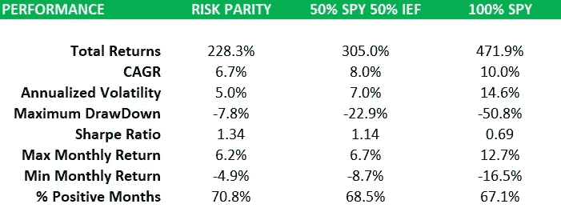
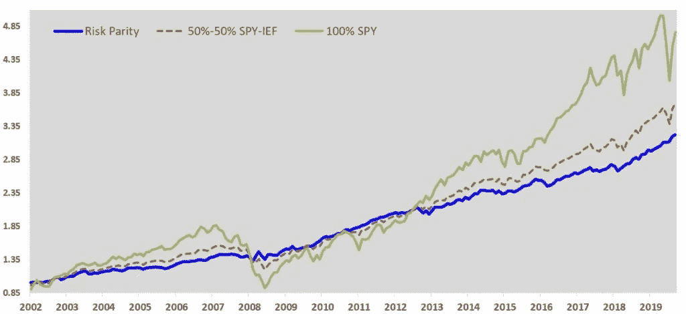
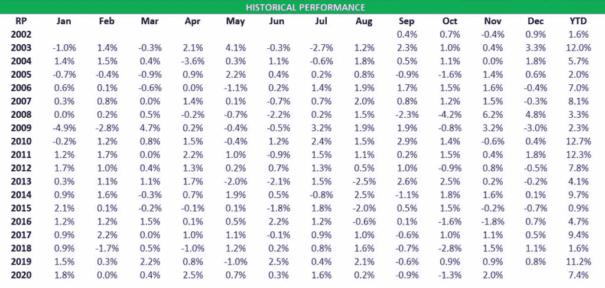
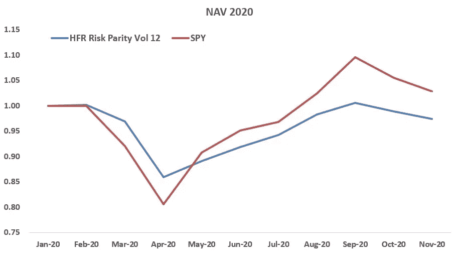
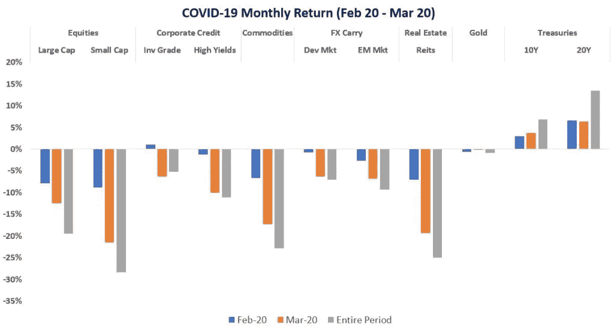
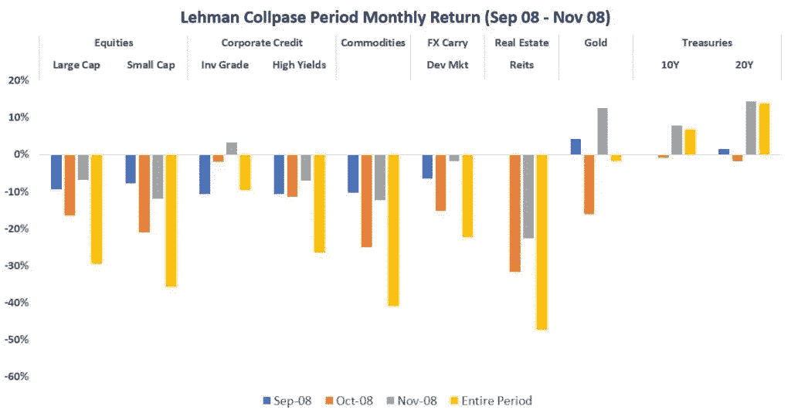

# 作为全天候策略的风险平价

> 原文：<https://medium.datadriveninvestor.com/risk-parity-as-an-all-weather-strategy-ade79021c34d?source=collection_archive---------18----------------------->

雷伊·达里奥流行的投资策略“风险平价”已经取得了长足的进步。对于那些不熟悉专业术语的人来说，也许“全天候”这个名字听起来耳熟。这是雷伊·达里奥运用风险对等原则管理的基金的名字。它们是相关的，但不是完全一样的东西。简单来说，风险对等是策略，“全天候”是目标结果。但公平地说，许多其他策略也有同样的目标。因此，“全天候”并不是风险平价独有的东西。然而，对于那些通常更关心结果而不是过程的外行人来说，这听起来更有吸引力，更直观。

在我继续之前，我想强调风险平价只是一种资产配置方法的通称。说到执行，每个基金都不一样。在这篇文章中，我要谈的不是雷伊·达里奥的风险平价，而是更一般的策略。

# 这是一种基于风险的分配形式

对冲基金行业以外的世界，大部分仍围绕着传统的基于资本的配置。这意味着你根据现金来分配。常见的是你的 50/50 或 60/40 股票/债券投资组合。它们之所以受欢迎，是因为它们简单易懂，易于实现。你可以告诉某人你将把他们一半的钱投资股票，另一半投资债券。相信我，他们会立刻明白你的意思。但相反，如果你说你会将一半风险投资于股票，另一半风险投资于债券，那就准备好面对一脸茫然吧。

我们称之为基于风险的分配，风险平价就是其中之一。这不是一种新颖的方法，提出这一理论的人也不是雷伊·达里奥。它以现代投资组合理论为中心，该理论是由哈里·马科维茨在 20 世纪 50 年代提出的。然而，雷伊·达里奥是第一个在 1996 年推出 T2 风险平价对冲基金的人。自从它取得成功后，现在有许多其他基金以这样或那样的方式采用同样的方法。风险平价基金曾经只对机构和高净值个人开放，现在散户可以通过机器人顾问甚至交易所交易基金购买。首只[风险平价 ETF(股票代码:RPAR)](https://rparetf.com/rpar) 于 2019 年 12 月推出，仅 6 个月，其资产就突破 5 亿。

事实上，随着资产交易所交易基金、越来越低的经纪费和部分股票交易服务的出现，希望获得更多控制权的散户投资者甚至可以构建自己的风险平价投资组合。

# 风险对等就是平衡

我知道“风险对等”这个名字听起来很酷也很复杂。但事实上，这是一个基于良好常识的简单概念。一个简单的词“”概括了这一切。这也是这种方法的美妙之处。那么，这样的策略如何能够产生全天候的投资组合呢？基本上，它归结为两件事。

1.  **平衡的资产组合**——每种资产在不同的市场条件下表现不同。
2.  **均衡配置**——每种资产都拥有相同的风险水平，并平等地推动投资组合。

为什么平衡很重要？因为这种方法背后的一个关键的基本前提是认识到我们不能可靠地预测未来。这是个大问题吗？不全是。如果我们不能预测，那就不要做。在这种情况下，我们不知道市场走向，也不知道哪些资产会表现出色或表现不佳，我们最好的选择是保持投资组合中风险相等的资产的平衡组合。

事实上，这与一些人选择 50/50 股票/债券投资组合的理由没有太大区别。他们想要的也是达到平衡。不幸的是，他们可能没有意识到他们实际上远远没有达到平衡。因为股票的风险远高于债券。因此，这种投资组合的风险仍然严重偏向股票。为了平衡风险，你需要的是加大对债券的资本配置，而不是股票。

# 真的是全天候吗？

首先，用一些常识来调节你的期望，不要把事情看得太重。全天候并不意味着无论每年、每月或每天风雨无阻都能赚钱。但它确实让你的投资组合在严酷的市场环境下更加稳定和稳健。为了有一个更清晰的画面，我们可以看到风险平价如何与传统的 100%股票和 50%股票 50%债券投资组合相比较。为了便于说明，让我们用 SPY(标准普尔 500 交易所交易基金)和 IEF(7-10 年期美国国债)分别对股票和债券进行 2002 年到 2020 年的回溯测试。

*注意:没有杠杆作用，每月在 SPY 和 IEF 之间重新平衡风险平价组合，使其风险贡献达到相同水平。*

大多数人只会放大年化回报率，然后得出结论，风险平价的表现令人失望。即使是五五开也更好。但是这里没有惊喜。风险平价通常持有较大比例的长期回报较低的债券。

然而，人们忽略了等式的另一半——风险或波动性。风险对等是三者中风险最低的。在最糟糕的时期，它只损失了 7.8%，而 SPY 和 50-50 分别损失了 50.8%和 22.9%。根据风险进行调整后，风险平价提供了最佳的性价比，根据夏普比率，每单位风险的回报率为 1.34%。

以对数标度绘制的图表向你展示了预期的情况。风险平价在最后有最低的 NAV，但有最稳定的轮廓。

从逐月的表现来看，它看起来也不算太差。是的，我们在这里没有看到那些惊人的两位数或三位数的回报。但也没有任何伤脑筋的时刻。

# 当风险较低时，杠杆可以成为你的朋友

这意味着我们有足够的安全缓冲来通过[杠杆](https://investmentcache.com/investing-with-leverage-what-you-need-to-know/)扩大这个投资组合。当然，前提是你能从借来的现金中获得比你需要支付的更多的资金。考虑到利率处于历史低点，6.7%的回报率相当不错。

谨慎使用，杠杆可以使我们的回报更接近纯粹的股票投资组合，同时仍然保持低得多的风险。杠杆化的低风险产品不一定比高风险的非杠杆化产品风险更大。因此，如果你想知道一些对冲基金如何能够带来难以置信的回报，那么你已经有了答案。杠杆通常是关键因素之一。但话虽如此，杠杆的使用需要仔细研究，并针对每个案例进行校准。不考虑[黑天鹅](https://investmentcache.com/dancing-with-the-swans/)的风险和可能性而不加选择地使用杠杆通常是杀死交易者和对冲基金的原因。

# 风险管理的波动目标

为了管理风险，许多风险平价对冲基金使用波动率目标方法，而不是固定他们的杠杆。在这种情况下，杠杆水平取决于其投资组合的波动性。如果低于他们的目标，他们将估计他们的位置，并在必要时采取更多的杠杆。如果高于他们的目标，那么他们会削减头寸，甚至持有现金。这就是为什么在波动性飙升的市场崩溃期间，你可以期待更多的抛售。几乎总是有人将矛头指向风险平价基金，指责它们的平仓加剧了抛售。

逻辑很简单。当市场看起来稳定和平静时，我们承担更多的风险。而当市场动荡不定时，我们拿得就少。从风险管理的角度来看，这是明智的。它在长时间的剧烈波动中限制了损失。但是当然，它也不是没有缺点。如果市场呈 V 型快速波动，比如今年的新冠肺炎疫情，你可能会被鞭打。因为在去杠杆化之前，大量的损失就已经发生了。此后，你可能会落后于复苏，因为波动需要时间来稳定。

## 2020 年的风险平价表现

作为说明，下面的图表显示了 HFR 风险平价 Vol 12 指数在 2020 年对 SPY 的表现。这是一个由管理资产超过 5 亿的机构风险平价基金组成的指数。这些基金以 10-15%的目标波动率运行其投资组合。

冠状病毒在 2020 年 2 月和 2020 年 3 月期间引发了大规模恐慌。它打击了许多资产类别——股票、信贷、商品、房地产投资信托基金等。国债可能是唯一逃脱的，但由于流动性问题，也不是没有一些月内恐慌。正如你从图表中看到的，当疫情来袭时，风险平价急剧下降，在复苏期间上升较慢。为什么？因为由于波动性激增，他们将在 3 月底之前大幅去杠杆化，当情况好转时，他们将无法充分参与复苏。如果这让你认为这种风险管理是不必要的，那么问问自己，如果事情进一步恶化会怎样？因此，就像我们周围的许多事情和我们做出的每个决定一样，都有权衡。

# 对风险平价的担忧

随着其规模的增长，人们越来越担心风险平价作为一种策略的有效性。它们不是没有根据的，但我必须说，没有人知道它们的答案。说到超越已发生的事情，你的猜测和我的一样好。让我们来看看其中的一些问题。

## 债券没有进一步上涨的空间，因为利率已经到了最低点

风险平价在受利率驱动的债券等避险资产中占有很大比重。2008 年后的自由量化宽松政策推动利率大幅下降。这导致了各地资产价格的上涨。因此，我们目睹了高杠杆风险平价基金的一些令人瞠目的表现。但随着利率达到下限，人们开始怀疑这场派对还能持续多久。如果债券的上涨空间受到限制，那确实会对这一策略产生严重影响。

但是我们真的到达地板了吗？负收益率并不新鲜。日本、瑞士、瑞典、欧洲都去过。只要收益率持续走低，债券价格就会上涨。这种关系仍然成立。只要收益率曲线向上倾斜，投资者仍然可以从滚动中赚钱。

## 债券崩盘怎么办？

如果每个人都恐慌并卖掉他们所有的债券会怎么样？如果这种情况真的发生，我可以向你保证，债券不是唯一陷入困境的资产类别。将会出现大范围的恐慌和全面抛售。你不能指望所有资产类别之母独自倒下，而不拖累其他人。尤其是美国国债，它是金融体系中太重要的一部分。到目前为止，每当它面临严重威胁时，美国政府都会出手收拾残局，救助陷入困境的人。

## 如果资产的相关性达到 1 呢？

相关性风险是风险平价的致命弱点。再说一遍，这并不新鲜。它一直都在那里。纵观历史，我们观察到几乎所有(如果不是全部的话)资产相互关联并一起崩溃的时期。我们看到了今年 2020 年 3 月冠状病毒疫情的情况。我们也看到同样的事情发生在 2008 年雷曼兄弟倒闭后。看看下面的条形图。

还会发生吗？我相信会的。这就是游戏的本质。但是，虽然我们无法根除风险，但我们可以管理它，例如，通过使用保守杠杆、波动目标或其他技术。

# 结论

正如你现在所知，对于风险平价是否会失效，我没有具体的答案。因为我不知道未来会怎样。这些年来，我学会了不要想太多，也不要去干涉你无法控制、无法看到或无法回溯测试的事情。就我而言，风险平价仍在发挥作用。

好了，年底就要到了，所以在这里祝所有读者圣诞快乐，新年快乐！

*原载于 2020 年 12 月 21 日*[*【https://investmentcache.com】*](https://investmentcache.com/risk-parity-as-an-all-weather-strategy/)*。*