# 风险对等——在多样化中运用常识

> 原文：<https://medium.datadriveninvestor.com/risk-parity-using-common-sense-in-diversification-b82fb427034e?source=collection_archive---------30----------------------->

说到多元化，投资者的意见也是一样……多元化。热情的支持者认为这是唯一可持续的赚钱方式。敌对阵营中的极端分子认为，这证明你不知道自己在做什么。

真相介于两者之间。如果你没有合适的策略就分散投资，你就有稀释回报的风险。同样，如果你集中下注，你很容易成为市场黑天鹅的目标。

多样化是有效的。但关键是你要做对。这并不困难。这个谜题的奥秘在于回答两个简单的问题:

1.  我应该把什么资产放在我的投资组合里？
2.  我如何在这些资产中分配我的资本？

# 为多样化选择合适的资产

这个不难回答。我举个例子。假设你是一家投资公司的首席交易员，你希望建立一个无论晴雨都能一起赚钱的交易员团队。那么你会雇佣那些和你交易方式完全一样的人吗？**常识告诉你没有**。除非你是完美的，否则雇佣别人做和你一样的事情是没有意义的。为什么？因为当你陷入困境时，其他人也一样。如果你在交易方面已经无可挑剔，为什么还要雇佣别人呢？

你需要的是别人在你失意时支持你。当别人情绪低落的时候，你应该支持他们。所以理想的组合是盈利的交易者，他们以不同的方式交易。各有各的优缺点。他们可能不是自己班上最好的。但是作为一个团队，他们成为一股不可忽视的力量。

## 许多人的投资组合都集中在股票上

同样的概念也适用于选择多样化的资产。大多数人主要投资于股票。为什么？因为它最有吸引力。熟悉，容易接近，良好的历史，有吸引力的回报…

但是当熊拜访他们时，会导致失眠、食欲不振和情绪波动。如果他们多年来通过投入积蓄，煞费苦心地建立起投资组合，情况就更是如此。我们都知道在一场重大危机中，股票会跌得多快多深。这种对亏损的恐惧让人们做出非理性的事情，比如选择市场时机，这比什么都不做更糟糕。

## 增加库存不是解决办法

分散投资越来越多的股票也不是解决办法。更多同样的东西在这里对你没有帮助。以下是不同行业和国家的股票在互联网泡沫破裂(2000-2002)和金融大危机(2007-2009)期间的表现。

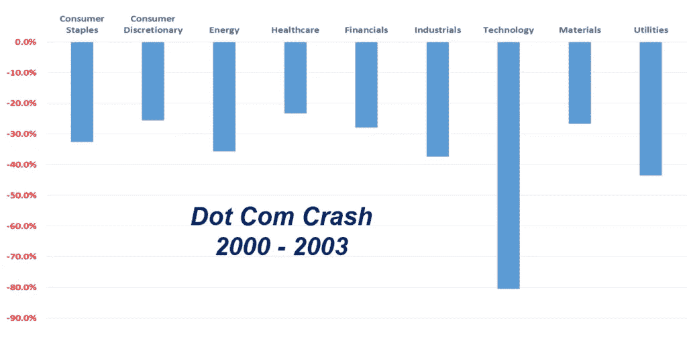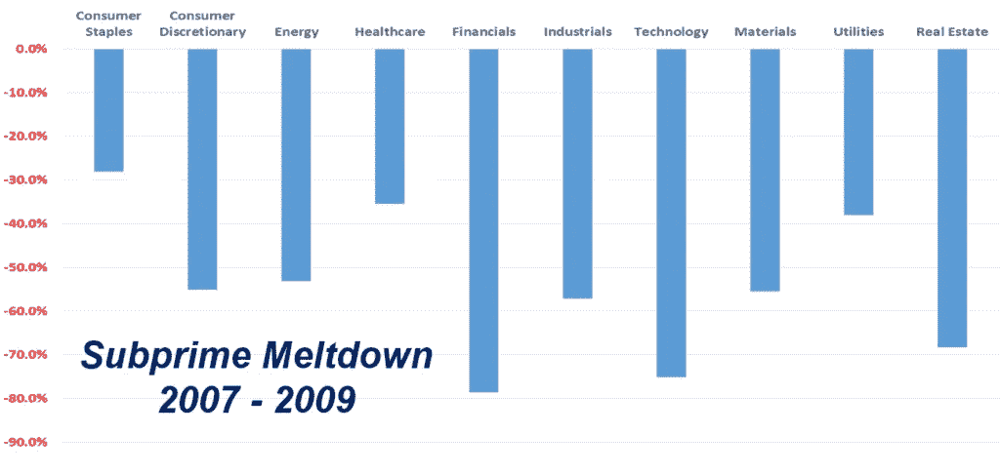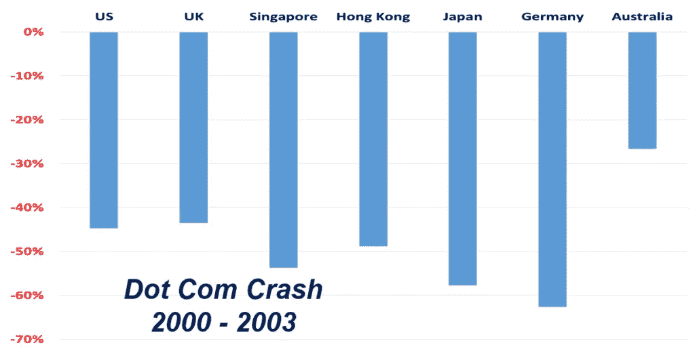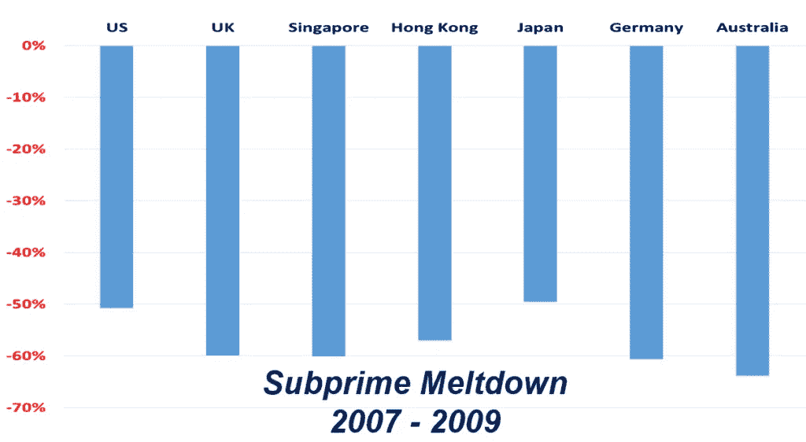

也不是每个人都能安然度过危机。你不知道这要花多长时间，也不知道这对你未来的计划意味着什么。尽管美国股市在上次熊市后表现出色，但它并不代表整个世界。10 多年后，亚洲仍未从 2007-2009 年的大金融危机(GFC)中完全复苏。如果你认为 10+年很长，那么看看日本。

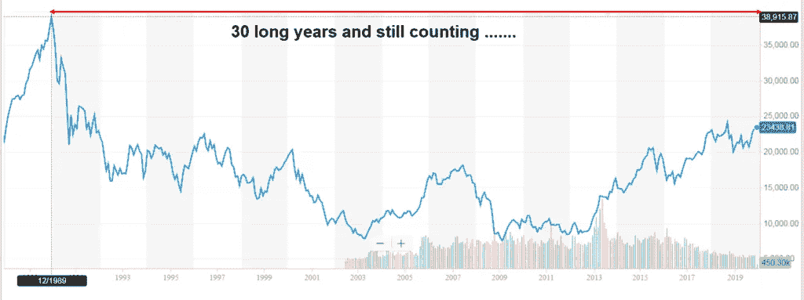

1989 年，日本经历了以通货紧缩和经济增长缓慢为标志的长期低迷。人们将 1989 年至 1999 年这段时间称为“失去的十年”。那是在他们知道它会再持续十年之前。即使是今天，日经 225 指数也远未达到 1989 年的峰值。所以漫长的 30 年过去了，我们仍然在计算。虽然这可能不会发生在你身上，但这是一个可能发生的例子。

如果股票不是答案，那么我们必须考虑其他资产类别。债券，商品，房地产。

为了说明我的观点，我仅举一个例子。

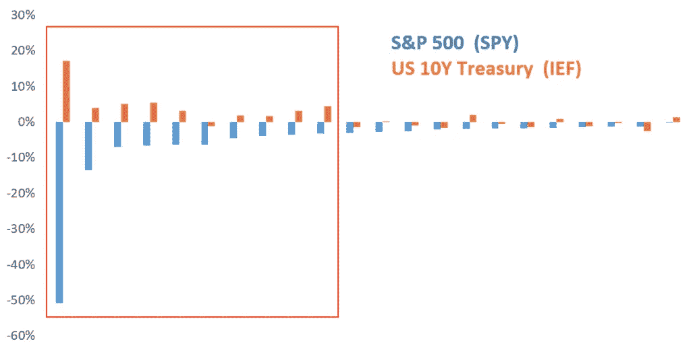

让我们看看像美国国债这样的优质主权债券(以 IEF ETF 为代表)相对于美国股票(以间谍 ETF 为代表)的表现如何。

这张瀑布图显示了 2004 年以来标准普尔 500 经历危机或回调时的表现，以及美国国债的相应表现。红框代表了所有主要的危机或回调时期。如果你投资于美国股票，这将是你需要帮助的关键时刻。在此期间，美国国债的表现如何？它正好满足了您的需求！因此，如果你将美国国债加入你的股票投资组合，它们可以发挥神奇的作用，在你面临压力时起到缓冲作用。

从数学上来说，我们可以用一种叫做相关性的方法来过滤掉彼此之间有这种行为的资产。相关性是一个从-1 到 1 的统计指标，它告诉我们一项资产如何相对于另一项资产移动。所以如果两种资产趋向于相反的方向，那么它们就是负相关的。如果它们倾向于一前一后地移动，那么它们就是正相关的。美国国债与美股负相关。

这种关系不是偶然发生的。当股票经历危机时，资金从股票中撤出，进入避险资产，如国债，导致其价格上涨。当美国美联储在经济低迷时期降息时，也会推高债券价格。

现在你已经知道我们应该挑选什么样的资产了，剩下的问题是如何在它们之间分配资本？

# 在资产中分配资本

大多数人采取简单的资产配置方法。最受欢迎的方法是平均分配。这意味着，如果我有 1 万美元，并且必须决定在标准普尔 500 和美国国债之间投资多少，我会各投资 5000 美元。

但是如果你问他们为什么这样做？您可能会因为以下原因而结束:

*   我不想想那么多。
*   很容易实现。
*   我没有更好的方法来做这件事。
*   平衡方法？光明正大？

除了最后一点，其余的都有点道理。然而，最后一个原因源于误解。虽然构建一个平衡的投资组合的目标是合理的，但将等量资本分配给每项资产的传统方法实际上远非平衡。

## 视角转变——从美元到风险

要理解我的意思，你必须从风险的角度看问题。计算风险的方法有很多种，风险也有很多种。但是我们现在关心是一个叫做波动性的指标。这里不打算深究数学。只是想给你一个背后的直觉。

看看股票和债券的走势。

即使你不理解风险背后的数学概念，你也能直观地理解它是什么。从图表中，我们可以看到股票比债券波动更剧烈。它们有以更大幅度上下摆动的趋势。这种趋势可以用一种叫做波动性的风险度量来捕捉。

为什么这被认为是风险？因为波动越大，我们实现目标回报的不确定性就越大。在此期间，此类资产会经历更大的减值和亏损。在 2006 年至 2019 年期间，股票在最糟糕的时候损失了超过 50%的价值。另一方面，债券只损失了 8%左右。

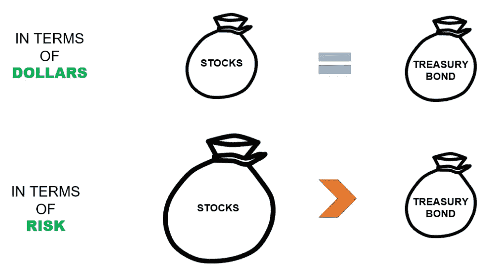

那么现在，如果你有一个一半股票一半债券的投资组合，你认为哪个会推动投资组合的表现？答案很清楚。股票。而**风险是收益**的驱动力。那么，现在你觉得这个投资组合还平衡吗？不，虽然从美元的角度来看是平衡的，但从风险的角度来看是严重不平衡的(T2)。

## 风险平价资产分配——利用常识进行分配

因此，我们真正想要的平衡投资组合是风险的**均等分配**，而不是美元资本。为什么？

1.  我们能控制市场吗？**否**
2.  我们能预测市场或哪种资产会有所表现吗？**否**

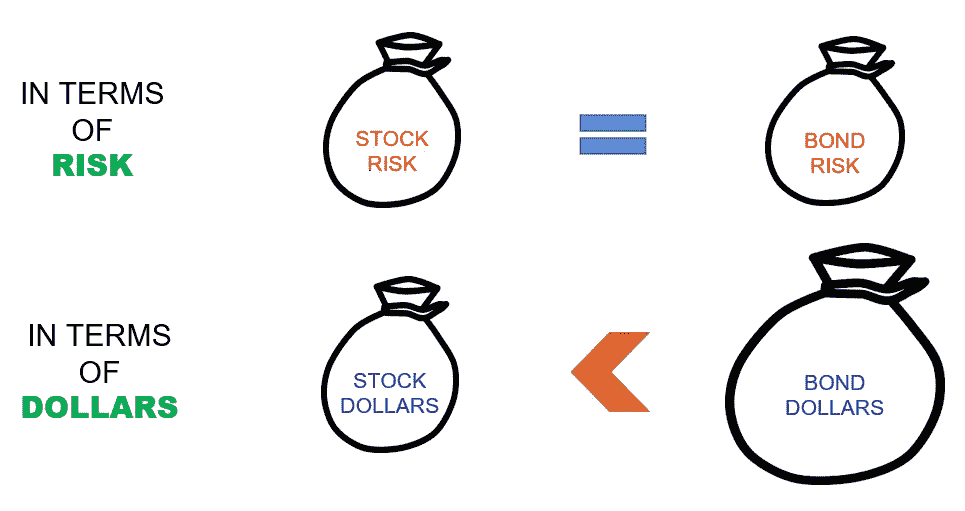

但我们知道的是，每种资产都有自己的优势和劣势，它们在不同的市场状态下表现不同。因此，如果是这样的话，那么常识告诉我们，我们能做的最好的事情就是评估资产，使它们平等地驱动投资组合。不要碰你力所不及的东西。剩下的就交给市场吧。

如果投资组合很好地代表了每个市场状态的资产，你就没有必要去预测市场会怎么做。这大大降低了风险，使你的投资组合更加稳健。如果你想要的是高回报，那么你总是可以选择利用杠杆来放大它。

这种分配方法被称为**风险平价**。风险平价背后的基础可以追溯到 20 世纪 50 年代，当时[哈里·马科维茨](https://en.wikipedia.org/wiki/Harry_Markowitz)提出了现代投资组合理论(MPT)。[最大对冲基金 BridgeWater Associates 的创始人雷伊·达里奥](https://en.wikipedia.org/wiki/Ray_Dalio)，随后在 1976 年推出了第一只基于风险平价原则的对冲基金。他把它命名为“全天候基金”，直到今天，它仍然很强劲。

# 风险平价绩效——度过危机

我曾在一只多策略对冲基金中负责风险平价。在我离开这个基金后，我把它改编成了一个更实用的小版本，让个人用最少的支出来实现。该投资组合包含多种资产:股票、债券、大宗商品和房地产，杠杆比率为 1.7 倍。自去年年底上线以来，它的表现符合预期。

## 自 2005 年以来的历史表现

以下是自 2005 年初至 2020 年 2 月 24 日该战略的回溯测试绩效。让我们与代表美国标准普尔 500 的间谍 ETF 做一个比较。

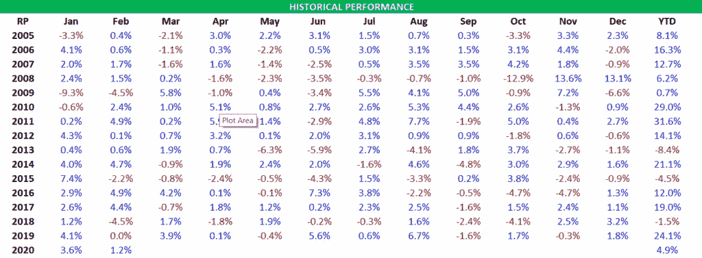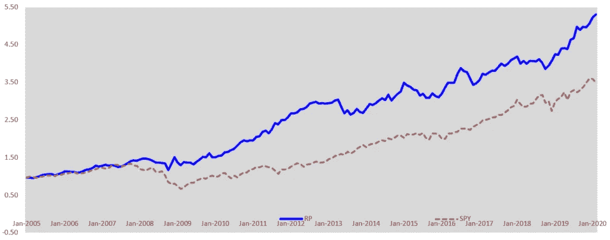

## 风险对等与间谍

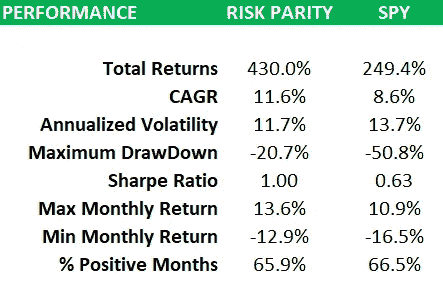

风险平价投资组合在 CAGR 和风险调整指标方面都优于 SPY ETF(标准普尔 500)。它的年回报率接近 12%，而 SPY 的年回报率为 9%。尽管它以 1.7 倍的杠杆运行，但就波动性而言，其风险仍低于 SPY。它还设法以低得多的约 20%的降幅渡过了这一时期，而间谍的降幅为 50%。因此，如果你有更大的风险偏好，仍有提高杠杆率的空间。

## 股市危机期间的风险平价(截至 2020 年 2 月 24 日)

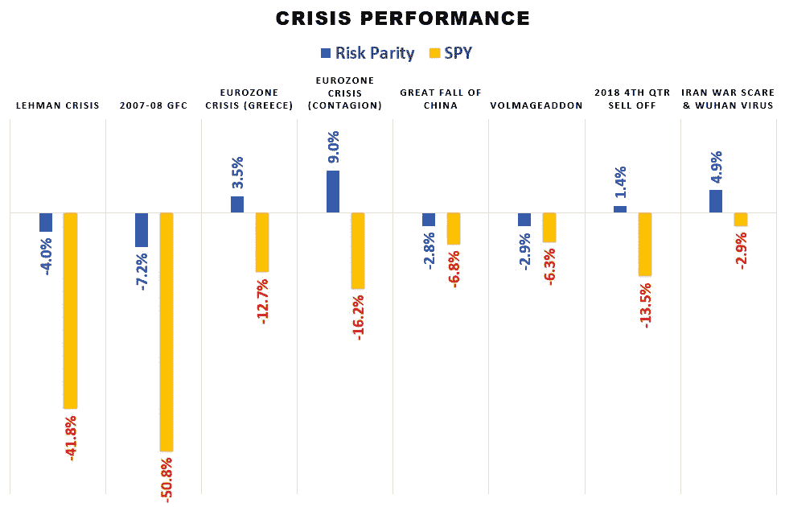

在这里，你可以更清楚地看到多元化在起作用。在股市危机期间，风险平价通常表现出色。事实上，在某些情况下，风险平价成功带来了正回报。

# 结论

这就是了。多元化在概念上没那么难吧？事实上，在我看来，这比四处挑选股票、在电脑前做日内交易或把握市场时机要容易得多。有时候，简单的事情是有效的，并且会持续很长时间。

*原载于 2020 年 2 月 26 日 https://investmentcache.com**[*。*](https://investmentcache.com/risk-parity-common-sense-in-diversification/)*