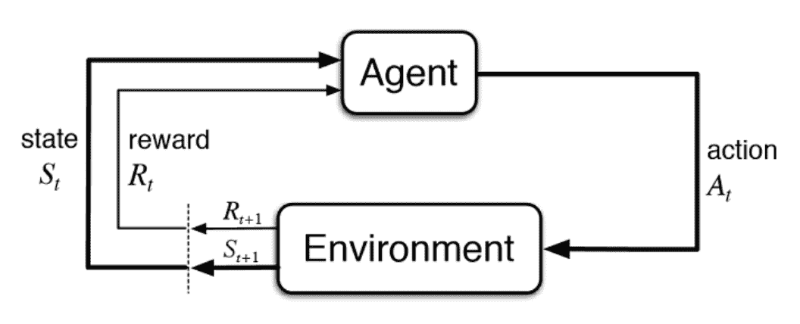
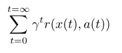
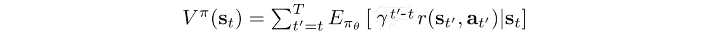
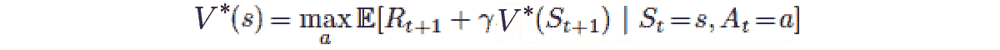
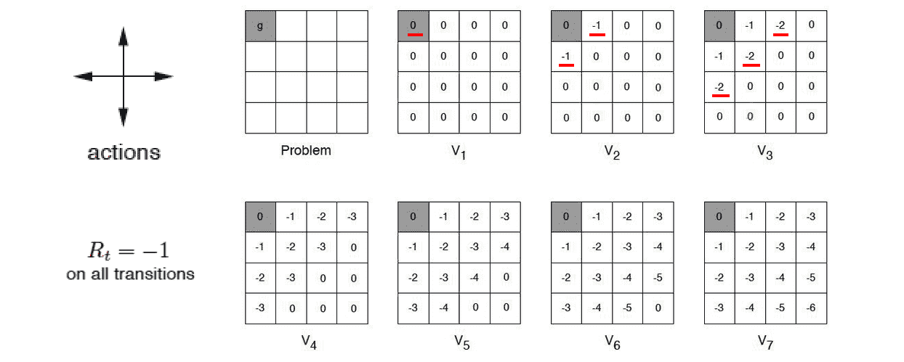
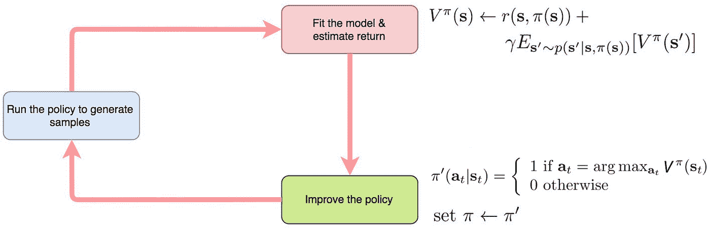
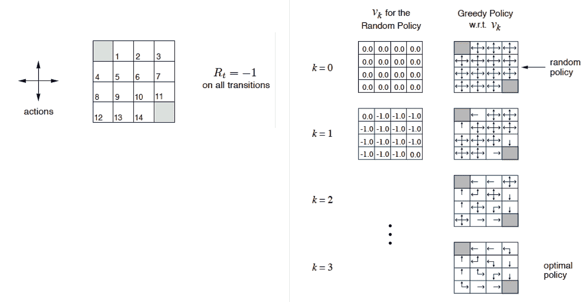
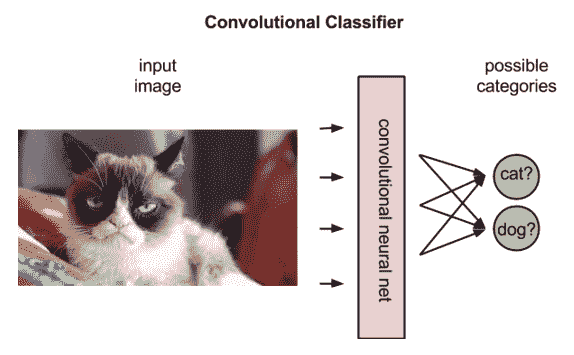
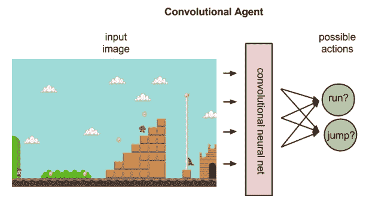
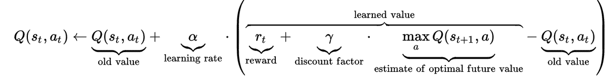

# RL 解释-加强直觉和数学

> 原文：<https://medium.datadriveninvestor.com/rl-explained-reinforcing-the-intuition-and-math-fd1185369186?source=collection_archive---------4----------------------->

# 吃豆人的困境

理解强化学习类似于我童年最喜欢的游戏，吃豆人！考虑以下环境，其中吃豆人肯定知道以下是正确的。

*   可能的动作有向前、向后、向左和向右
*   一些动作/物体奖励吃豆人
*   每步移动 1 格(适用于所有方向)
*   小圆圈-> 10 分
*   较大的圆-> 100 点
*   浆果-> 1000 点(头奖！)
*   墙壁-> -100 分
*   鬼-> -500 点

通过试验和磨难，吃豆人将每个对象的相对满意度联系起来，并了解哪些具体的**行动**和**状态**最有利于获得更高的**奖励**。

从那里开始，Pac-Man 将重复他的方法，即*最大化奖励*和*最小化惩罚*。这个简单的奖励反馈让吃豆人学会了自己的行为；这可以描述为**加强信号**。

吃豆人的思维过程和重新配置其方法的能力可以通过**强化学习**和**深度 Q 学习**来理解。

 [## 深度学习用 7 个步骤解释-更新|数据驱动的投资者

### 在深度学习的帮助下，自动驾驶汽车、Alexa、医学成像-小工具正在我们周围变得超级智能…

www.datadriveninvestor.com](https://www.datadriveninvestor.com/2019/01/23/deep-learning-explained-in-7-steps/) 

# 强化学习解释

强化学习探索了*机器学习*的基本范式，其中软件代理在一个环境中采取行动，目的是最大化某种累积回报的概念。

本质上，机器学习算法(*代理*)评估环境(*状态*)，采取*行动*，并从环境接收*反馈*，反馈可以是**正面**(奖励)或**负面**(惩罚)。奖励是标量*反馈信号*，其指示代理在步骤时间 *t.* 的表现

**环境**接收代理动作并产生新的观察值 *O(t)* 和标量奖励信号 *R(t)* 。产生的下一个动作依赖于**历史**，历史是指*序列*的观察、动作和奖励信号 *t* 。

这些环境可以是**完全可观测环境**，其中智能体直接观测环境状态( *Oₜ=Sₜᵃ=Sₜᵉ* )或**部分可观测环境**，其中智能体间接观测环境( *Sₜᵃ≠Sₜᵉ* )。

**状态**是用于确定接下来发生什么的信息。有三种主要类型的状态——环境状态 *(Sₜᵉ)* 、代理状态 *(Sₜᵃ)* ，以及信息/马尔可夫状态(Sₜ).

这种现象可以这样建模。

建模的**反馈回路**表示具有 t 和 t + 1 的时间步长，其中每个时刻的状态是不同的。与无监督和有监督学习相反，强化学习围绕着**状态-动作对**的*顺序出现*。代理人通常希望最大化目标函数，并根据之前每个行为的结果和反馈评估未来的行为。

例如，大多数视频游戏都是以获得最多分数为目标的——代理人在游戏中获得的每一个额外分数都有助于其随后的行为。通过这些互动和反馈，代理变得更加了解哪些对象和行动与*正面*和*负面*反馈相关联，以及采取哪些行动可以最大化得分。这些通常可以表示为**奖励计数**。当奖励次数增加时，代理人知道他们在做正确的事情。

目标函数可以这样建模。

> *奖励函数* r *在* t *(时间步长)上求和，这意味着目标函数计算通过游戏可以获得的所有潜在奖励。* x *代表任意给定时间步的状态(用* t *表示)，而* r *代表* x *和* a *的奖励函数。*

# 基于价值的强化学习

基于价值的强化学习最大化价值函数 V(s ),并且代理期望在策略下当前状态的长期回报。它们本质上代表了每个代理存在的状态有多“好”，这等于来自状态( *s* )的回报假设。

价值函数取决于代理执行动作的策略，这意味着当代理使用给定策略来决定动作时，相应的价值函数表示为:

**值迭代**实质上是通过改进*值状态估计*来计算**最优状态值**函数。在算法将 V(s)初始化为随机值之后，它不断更新 Q(s，a)和 V(s)值，直到它们**收敛**。这个值迭代负责收敛到最优值。通过*动态编程*，这个值可以用下面的等式求出。

> 让我们用下面的例子来说明这个定理。

你进入了一个迷宫，出口在左上方。每种状态都提供了四种可能的动作——上、下、左、右。与任何界限的接触都会使你回到原来的位置，每一步的移动都被归因于负一奖励。从**终端状态**开始，所述公式可用于传播 *V** 的值

> 考虑到前 7 次迭代的可视化表示，代理将定位最高的相邻 V*值，并对每个状态执行。

# 策略迭代

尽管价值迭代结构继续改进 V(s)直到函数收敛，但是**最优策略可能在价值函数**之前收敛，因为代理的唯一优先级是找到最优策略。

因此，另一个算法- **策略迭代**在*每个步骤*之后重新定义策略，并根据新策略计算值，直到达到收敛值。该方法将总是在最优策略处达到收敛，并且通常比先前的框架需要更少的迭代。

> *下面是我们应用 Q-learning 时策略迭代的样子。*

> *这是 4 次迭代后的样子。*

# 深度 Q 学习

让我们再看一遍 Pac-Mac 的例子——除了这一次，Pac-Man 只意识到他的功能运动，而不是*奖励和惩罚对他所做的每个物体和动作都有影响。*

因为吃豆人不知道先验的状态转换和奖励模式，他不知道他的行为对环境的影响。相反，他可以简单地观察任何给定状态下的环境并采取行动。

**Q-learning** 描述了吃豆人从*每次与环境*的互动中学习的过程； **Q 函数**将代理的状态和动作作为输入，并将它们导向与未来可能的动作相关的可能的回报；本质上*将状态-动作对*映射到期望它们产生的值。

本质上，强化学习概述了代理通过状态-动作对序列导航的过程。他们观察来自每个结果的反馈，并使他们的预测适应那些奖励的 Q 函数，直到他们能够准确地预测最佳路径以最大化奖励；这个预测被称为**策略**。

> *这些学习算法主要有两类。*

## 基于模型的学习

代理利用他们与环境交互的历史来近似环境-状态转换和奖励模型。然后，代理使用值迭代或策略迭代来传播最优策略。

## 无模型学习

不是代理学习特定的奖励函数和环境状态转换，而是代理*直接从与环境的交互中推导出最优策略*

**Q-learning** 是无模型学习算法的扩展，其中状态-动作对是从 Q(s，a)的样本中近似得到的，这些样本是从与环境的交互中观察到的——这种方法被称为**时差学习**。

# 勘探和开发

探索与利用的两难困境描述了代理在学习过程中如何选择采取哪些行动。**ε-贪婪方法**经常在代理决定一个*随机动作*(因此，探索)或概率(1-ε)的每一步使用，代理根据 Q 函数值的当前估计选择动作。随着时间的推移，代理对 Q 值的估计变得更有信心，而ε值下降。

# 神经网络和深度 Q 学习

由于神经网络基本上是函数逼近器，因此可以通过学习构建 Q 值的**状态-动作对**来利用它们预测值或政策函数。神经网络不是使用 Q 表，而是简单地在来自状态或动作空间的数据集上训练，以预测与每个连续运动相关联的值。

> *通过反向传播和梯度下降的迭代过程，这些权重和偏差最终被优化以最小化误差函数。*

**卷积网络**，负责图像识别和分类，在环境可视化时常用于识别智能体的当前状态。应用强化学习架构不同于监督学习架构，因为监督学习将标签与图像匹配。

下面的示例显示了神经网络将如何计算每个类名为真的概率。下面的卷积层可以预测图像是 95%的猫和 5%的狗。

然而，在强化学习中——输入的图像反映了智能体的当前状态，卷积神经网络用于对智能体接下来可能执行的动作进行排序。

看这个例子，神经网络可能预测跑步将获得 5 分，而跳跃将获得 10 分。这说明了策略代理的功能及其在将状态映射到最佳动作中的作用，最佳动作可以描述为 *a= π(s)。*

我们的 Q 值方程看起来像这样。

然而，由于神经网络被用来代替 Q 表的使用，原始方程可以进一步简化。由于反向传播优化器*已经具有学习速率*，等式中的这一部分可以被移除。在移除学习率之后，两个 Q(s，a)项都被取消，并且也可以被移除。

# 培训过程

虽然强化学习模型不需要任何特定的训练数据集，但它们需要在探索环境时收集的数据点。

**每次经历=(先前状态，动作，奖励功能，新状态)**

> *用每个经验训练模型基本上遵循相同的框架*

1.  从先前状态估计 Q 值
2.  估计新状态的 Q 值
3.  使用已知的相关奖励计算每个行动的目标 Q 值
4.  用输入=(旧状态)和输出=(目标 Q 值)训练模型

# 强化学习——人工智能的未来

强化学习的含义和应用绝对是疯狂的——在自动驾驶汽车的 RL 架构、网络系统配置、个性化医疗和视频游戏开发之间，这种机器学习的范式几乎可以用于任何事情。

# 最后一件事

> *感谢你阅读我的文章，我希望你能学到更多关于* ***强化学习背后的数学和直觉。如果你能做以下事情来支持我这个作者，那对我来说就意味着一切！***

1.  注意👏图标？给我的文章发些掌声
2.  **在 [LinkedIn](https://www.linkedin.com/in/suraj-bansal/) 上连接**和我👈
3.  跟着我去✍️
4.  查看我的作品集，了解我的最新作品💪
5.  关注我的旅程，订阅我的每月时事通讯🦄