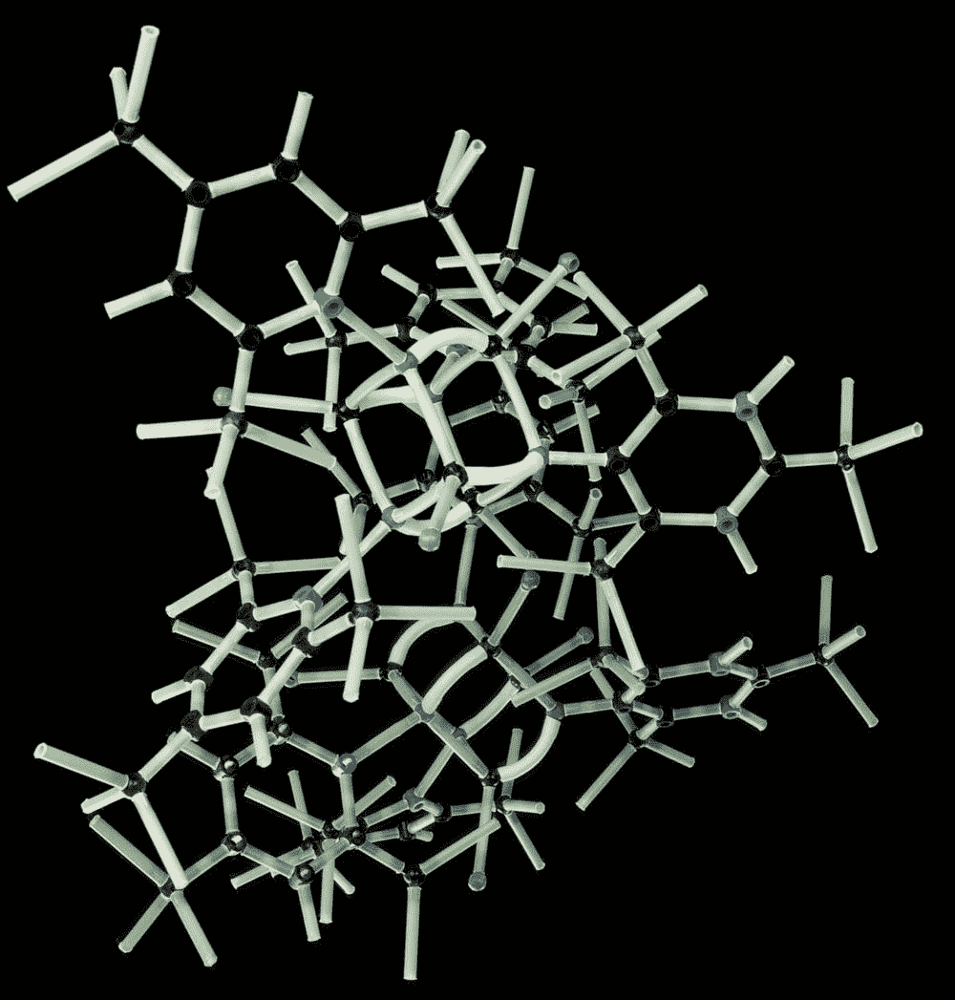
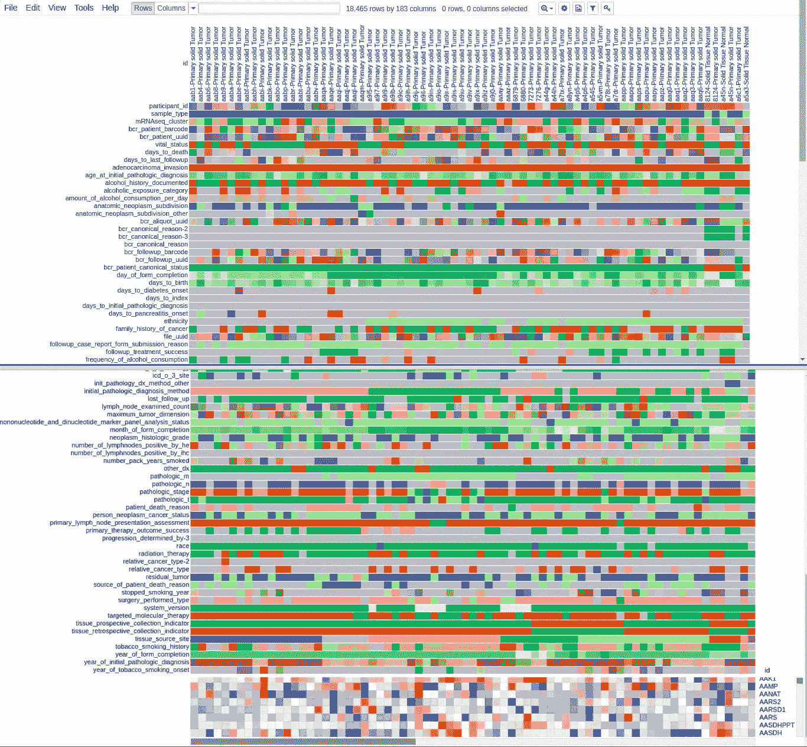
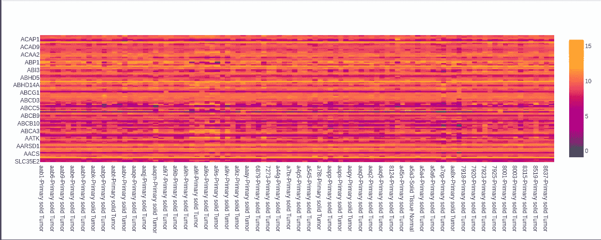
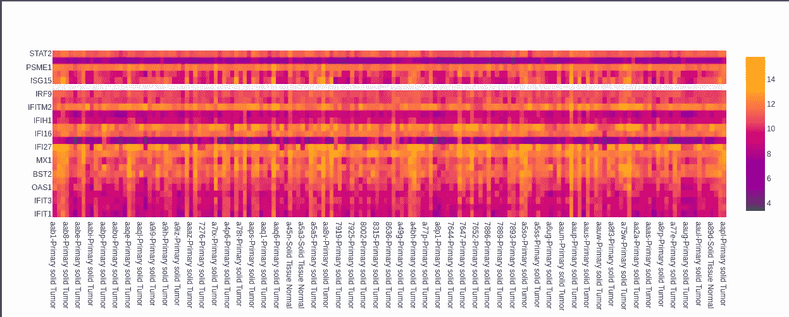
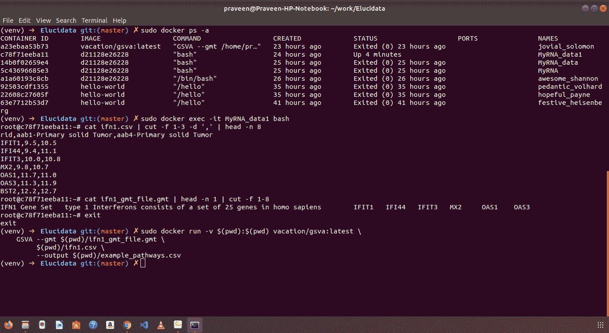

# 使用 PCA(主成分分析)的 RNA-Seq 数据分析

> 原文：<https://medium.datadriveninvestor.com/rna-seq-data-analysis-using-pca-principal-component-analysis-a28156d72c0d?source=collection_archive---------1----------------------->

今天，我将告诉你 **RNA 测序分析**如何改变**医学研究。**

看完你会知道:如何使用**机器学习算法**来获得对各种**疾病**的**正确洞察**。

> 最后你就知道这个过程的 **Python** 代码了。所以，让我们首先建立对整个场景的**理解**。

# 简介:

**胰腺癌** (PAAD)是**癌症**的第三大常见死因，总体 5 年生存率低于 5%

据预测，到 2030 年，它将成为美国第二大癌症死亡原因 。

 [## 认知计算——一套被广泛认为是……

### 作为它的用户，我们已经习惯了科技。这些天几乎没有什么是司空见惯的…

www.datadriveninvestor.com](https://www.datadriveninvestor.com/2020/02/19/cognitive-computing-a-skill-set-widely-considered-to-be-the-most-vital-manifestation-of-artificial-intelligence/) 

**核糖核酸(RNA )** 是一种聚合分子，在基因的编码、解码、调节和**表达的各种生物学作用中必不可少。**

**RNA-Seq (RNA 测序)**，是一种在给定时刻检测生物样本中 RNA 的**数量的测序技术。**

这里我们有一个**标准化 RNA 测序数据集**读取**胰腺癌肿瘤**。该测量包括 185 个胰腺癌肿瘤的约 20，000 个基因。

**文件格式为 GCT** ，一个制表符分隔的文件，用于共享样本的基因表达数据和元数据(每个样本的详细信息)。

> **GCT 文件就像一个多维数据帧，由 3 个二维数据帧组成。**

这些是:

*   **data_df:** 它有 18465 行(基因 ID)和 183 列(样本名称/ID)
*   **row_metadata_df:** 它有行元数据，当我们看到类型时，它是一个空的数据框。这意味着在我们的数据中，行元数据不存在。
*   **col_metadata_df:** 对于每个样本，它有 183 列(样本名称/ID)和 124 行(列元数据，如组织学类型、患者 ID、状态(他是否活着))。

# 数据清理和检查样本间基因表达的分布:

在 18465 行中，有 4367 行在某些列中有空值**。**

所以我在数据清理过程中删除了它们。因此，在数据清理后，有 14098 行和 183 列。

这 14098 行代表基因 ID，183 列代表 183 个不同的样本。

# 生成所有样品的基因表达分布:

这里我们画出了表达式(范围从 0 到 15 的数值，例如 7.5 或 11.2 等。)理解图的要点:

*   热图的 x 轴有样本名称。
*   热图的 y 轴具有基因 id。
*   颜色表示对应于每个样品的基因表达值。
*   所以右边的颜色条帮助我们深入了解基因表达的分布，因为这些值是通过颜色编码的。

# 使用 Phantasus 工具在线可视化所有数据。

# 所有样本基因分布图:

# 仅识别外分泌(腺癌)肿瘤，去除神经内分泌肿瘤:

## 为 PCA 准备数据:

使用 PCA 结果绘制数据。

我们已经知道这些数据是针对两大类胰腺癌的:

*   **外分泌**
*   **神经内分泌**基于此，将会有 2 组不同的**数据点**。

这里我使用了**‘organization _ type _ other’**数据来区分这两种类型的癌症。

# PCA 图图像:

我们可以看到，大多数点都集中在 PC1 和 PC2 值的特定范围内。这样我们就可以把样本从**神经内分泌**和**外分泌**中分离出来。

异常值为-100 > PC1，PC1 > 100。我选择这个范围是因为它是 **PC1 和一个更突出的特征**。另一个约束是 PC2 < 50。

它将为我们分离出**异常值**。因此，在下一步中，我们将从数据框中移除异常样本。

# 了解干扰素在胰腺癌中的作用:

**干扰素(IFNs)** 是一组**信号蛋白**，由宿主细胞在对几种病原体(如病毒、细菌、寄生虫以及肿瘤细胞)的存在做出反应时产生并释放。

I 型干扰素(IFNs)是干扰素蛋白的一个大亚群，有助于调节免疫系统的活动。

负责 1 型干扰素的基因被称为 1 型干扰素标记，在智人中由 25 个基因组成。

现在，我们知道了属于**胰腺癌**类别的样本，我们也知道了负责 1 型干扰素(1 型 IFN 信号)的基因。

这些基因是智人的一组 25 个基因。因此，为了绘制基因表达图，对于**胰腺癌**，我们将创建一个数据帧，其中这 25 个基因作为行，样本名称(这是 pp 数据帧的索引。)作为列。

# 1 型干扰素基因(25 个基因)的图像→这是外分泌样本的分布。

因此，我们可以看到基因在不同样本中的分布，就像它在 10 和 12 附近有最多的值，因为 10 和 12 附近的热图颜色最有可能被观察到。蓝色的频率较低。所以它表示一些值在 4 左右。

# GSVA 算法的输出显示为命令终端的屏幕截图。我在 Docker 中运行了这个算法。

> [**完整代码，访问我的 GitHub 句柄。**](https://github.com/praveenpareek11/RNA-Seq/blob/master/run.ipynb)

# 总结:

*   我们学习了 RNA 测序数据。
*   用于更好分析的 RNA 测序的数据存储格式。
*   在医学研究中使用机器学习算法，如 PCA(主成分分析)。
*   外行人对算法输出的理解。
*   干扰素及其对免疫系统的影响。
*   最后使用 Docker 中的 GSVA(基因集变异分析)算法得到具体的见解。

> 【阅读更多】在[**https://praveenpareek11.github.io/**](https://praveenpareek11.github.io/)
> 
> [**更多有趣的博文，安装 medium app 关注我！**](https://medium.com/@praveen.pareek)