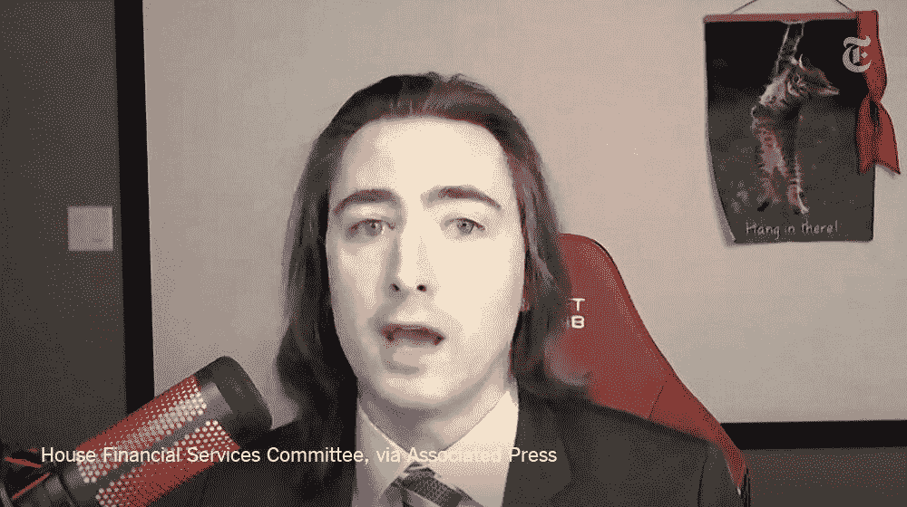

# 咆哮的小猫抢尽了风头，罗宾汉和城堡受到了国会的质询

> 原文：<https://medium.datadriveninvestor.com/roaring-kitty-steals-the-show-as-robinhood-and-citadel-are-grilled-by-congress-33a663ea7343?source=collection_archive---------14----------------------->

欢迎来到 2021 年，长发的 YouTube/Redditor 基思·吉尔(Keith Gill)在国会面前证明了他对 Gamestop (GME)的看好。听证会的标题听起来像是一个高中项目:“游戏停止了？卖空者、社交媒体和散户投资者发生碰撞，谁赢谁输。”

你不可能写出比一月底发生的事情更好的剧本了。精英对小人物。对冲基金反对华尔街的赌注(WSB)。卷入这场争斗的是视频游戏零售公司 Gamestop。单一股票从未像 Gamestop 那样渗透到流行文化中。从来没有投资过自己生活的人现在一天要查看 GME 股票价格几十次。埃隆·马斯克(Elon Musk)在推特上发布了关于 Gamestop 的消息，股价飙升。说唱歌手杰·鲁，你可能还记得臭名昭著的 Fyre festival 纪录片中的他，在美国消费者新闻与商业频道谈论这一丑闻。任何告诉你他们曾经想象过杰·鲁去美国消费者新闻与商业频道的情景的人都是骗子。特德·克鲁兹和 AOC 在争论中是站在同一边的。那不会再发生了。

WSB 的 Reddit 用户从 2021 年初的 170 万增加到 910 万。在 WSB，Redditors 称自己为“退化者”这个故事是一场完美的风暴。它把坚持和成为运动的一部分结合在一起。现在比以往任何时候都更需要成为某事的一部分。自 2020 年 3 月以来，世界一直处于封锁状态。收购 GME 填补了这一空白。加入一个由数百万“堕落者”组成的社区，从 1%的人群中攫取财富，是一种双赢。赚点钱，成为故事的一部分。

[https://www.reddit.com/r/wallstreetbets/](https://www.reddit.com/r/wallstreetbets/)

我看得入迷，心想，GME 还能继续腾飞多久？GME 最终不得不回到现实，对吗？就在这时，罗宾汉(右)介入了。RH 限制购买 GME，但继续允许出售。股票暴跌。他们没有坦率说明停止购买的原因。持有空头头寸的对冲基金(尤其是在 GME 持有大量空头头寸的 Melvin Capital)受益于这种暂停买入的做法。他们能够弥补他们的空头头寸并挽回一些损失。

RH 不向客户收取交易费用。相反，RH 的大部分收入来自向对冲基金出售交易信息。阴谋论出现了。RH 似乎与其最大的客户 Melvin Capital 合谋停止了交易。人们对缺乏透明度感到愤怒。RH 首席执行官弗拉德·特涅夫(Vlad Tenev)受到了批评，很明显他不是处理这场危机的合适人选。尘埃落定后，RH 显然遇到了流动性问题。手头没有资金来满足他们的抵押要求。

从这个故事中，一个英雄出现了，他点燃了革命的火花。基思·吉尔，又名咆哮的小猫，代表你和我，散户。最高时，他在 GME 的头寸价值超过 4000 万美元。吉尔不太把自己当回事。在听证会上，他引用了一段视频说，“有几件事我不是。我不是猫。”这个视频是一个律师在一个变焦会议上打开了猫过滤器。他在推特上保持沉默，只通过模因交流。在听证会之前，他发布了这个迷因。

直到昨天的听证会。吉尔描绘了他卑微的成长经历以及他和他的家人所经历的挣扎。

> “我在马萨诸塞州的布罗克顿长大。我的家庭并不富裕。我父亲是一名卡车司机，我母亲是一名注册护士。”——基思·吉尔

大学毕业后，他长期失业。吉尔利用空闲时间自学投资。失业两年后，他在 Mass Mutual 找到了一份营销和金融教育的工作。吉尔谈到了他姐姐在 2020 年的悲惨遭遇。
他不提供投资建议，以及个人如何负责尽职调查。吉尔仍然相信今天 GME 股票的价值是每股 40 美元。

Robinhood 首席执行官 Vlad Tenev 在昨天的国会听证会上向他们的客户道歉。Robinhood 停止 Gamestop 和其他“meme 股票”交易几周后由于清算所提高了监管保证金要求，罗宾汉停止了交易。

Robinhood 首席执行官弗拉德·特涅夫(Vlad Tenev)最近几周一直在经受这场风暴。RH 在与客户沟通他们停止购买的原因时行动迟缓。这变成了该公司的公关噩梦。阴谋论者正忙着呢。很明显，特涅夫不是领导罗宾汉度过这场危机的合适人选。

Tenev 回答的每一个问题，他都避免直接回答。一个接一个的发言人对他的策略越来越失望。他过分礼貌的行为显示出不真实。

Tenev 认为，目前的清算系统需要改为当天结算。目前的设计需要两天时间来完成交易。
所有的宣传都是好的宣传。在 RH 停止交易的第二天，他们上升到了 app store 下载量第一的位置。一旦尘埃落定，从长远来看，这将有助于而不是阻碍罗宾汉。他们一下子就筹集了 30 亿美元的资金。

当被问及互联网瞄准他们的空头头寸时，Melvin Capital 首席执行官 Gabriel Plotkin 承认他的公司没有考虑这一风险。他承认他的公司和整个行业都必须适应。Citadel 创始人肯·格里芬否认 Citadel 与 RH 有任何沟通，以停止在 GME 的交易。Citadel 避免回答为订单流付款是否是对冲基金的道德行为。

这一事件是否会成为新法规的起因还有待观察。RH 和 Citadel 在未来必须有更好的风险管理实践。令人怀疑的是，一家对冲基金是否会让自己暴露在另一场攻击面前，就像我们在 GME 看到的那样。