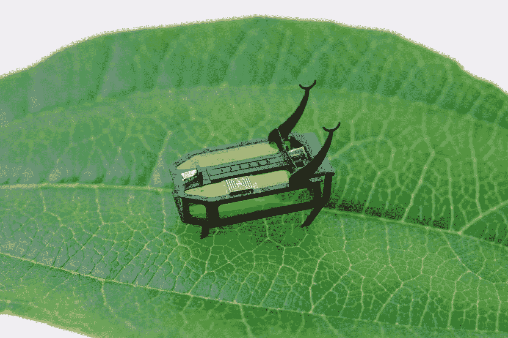
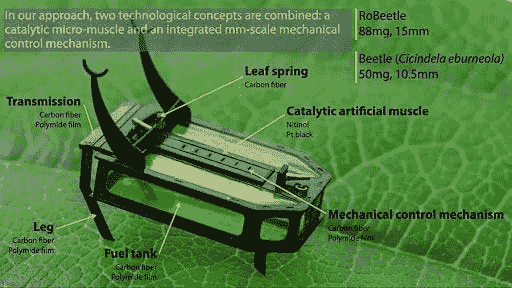

# 酒精驱动的微型机器人

> 原文：<https://medium.datadriveninvestor.com/robeetle-alcohol-powered-microbot-6b9225cbd2e9?source=collection_archive---------19----------------------->

***人们见过很多用插座和电池供电的机器人，但这个微型机器人有点叛逆。***

这个名为“Robeetle”的微型机器人使用甲醇，也就是众所周知的木醇。(CH3OH)甲醇燃料比电池含有更多的能量，它也不需要任何额外的电源或电磁场。

根据[科学机器人](https://www.linkedin.com/company/scienceegypt/)的报道，Robeetle 能够爬上斜坡，并能够在玻璃、泡沫或混凝土等表面上行走。它可以携带 95 毫克的燃料，可以供电长达 2 小时。

现在，科学家们需要了解它的燃料补给，以保持它在更长的时间内持续充电，如果他们设计与人类交流，那么 Robeetle 可以在微观层面的复杂手术和其他科学任务中帮助人类。

罗宾德·库马尔