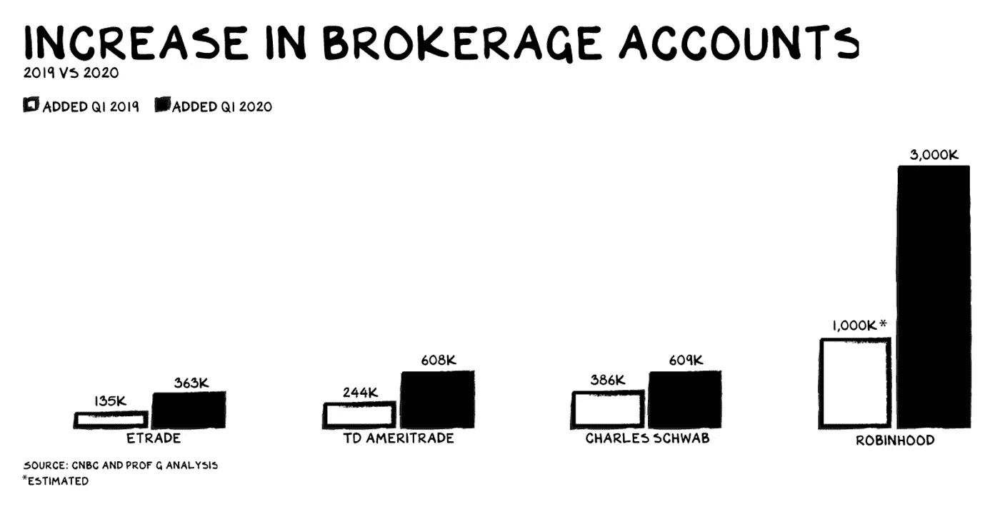

# 罗宾汉继续成为头条新闻

> 原文：<https://medium.datadriveninvestor.com/robinhood-continues-to-make-headlines-7bd30120c69a?source=collection_archive---------7----------------------->

Robinhood 刚刚宣布以与 5 月份 2.8 亿美元相同的估值额外融资 3.2 亿美元。这使其 F 轮融资达到 6 亿美元，融资后估值达到 86 亿美元。

## **自成立(2013 年)以来，资金总额为 15 亿美元。**

在美国，没有另一个纯粹的 Robinhood 的竞争对手。我们可以看看比特币基地，他只专注于加密货币，但除了 B2B 产品外，B2B 产品也在增长。比特币基地获得了大约三分之一的资金，估值约为 80 亿美元。

在某种程度上，我们可以说 Robinhood 也有 B2B 业务，因为他们从销售订单流(尤其是期权)中获得的收入正在增长(详见下文)。

我们还可以看看像 Acorns 这样的储蓄金融科技，它们也在这些转型时期成长并受益，类似于其他储蓄和投资应用。Acorns 迄今只筹集了 2.07 亿美元，其估值可能接近 10 亿美元。

正如 Techcrunch 评论的那样，Robinhood 在今年春天经历了成长的烦恼，并以不那么偶然的消息成为头条新闻。

 [## 金融科技的全球趋势|数据驱动的投资者

### 各国可能已经封锁了边境，以减轻新冠肺炎疫情，但当地和国际贸易必须去…

www.datadriveninvestor.com](https://www.datadriveninvestor.com/2020/04/28/global-trends-in-fintech-technology/) 

2020 年的痛点包括应用崩溃、首次披露可观的订单流量收入(查看详情)等等。

有明显的证据表明**零售交易整体上自 2019 年以来一直在上升**，并在 Q1 2020 年期间达到峰值。这是因为有如此多的现金闲置(美国 M2 股市上涨了 23%，我们不得不相信其中一些进入了股市)，当然还有我所说的“罗宾汉效应”。简单来说，就是股票交易的极度商品化。

Scott Galloway 是 NYU 斯特恩大学市场营销的临床教授，也是一名连续创业者，他写了一篇很棒的文章。根据他对在线交易活动增长的估计(主要基于开户数量的增长，而非交易规模或交易量)，罗宾汉显然正在引领这一趋势。Robinhood 增加了 3 倍，Schwab 增加了 1.6 倍，TD Ameritrade 增加了 2.5 倍，Etrade 增加了 2.7 倍。

我没有发现任何数据支持围绕散户交易对美国股市自 3 月中旬触底以来的惊人反弹做出了重大甚至是主要贡献的说法。

我们可以报告的数字是，订单流业务在 2020 年的 Q1 非常强劲，Robinhood 来自销售订单流的收入领先。

去年，Alphacution 首次报道了罗宾汉的隐性收入来源。我去年 11 月在 **Z** [**中写道，佣金经纪人销售订单流是新的中介。**谁来扰乱他们？](https://medium.com/@efipm/zero-commission-brokers-selling-order-flow-are-the-new-intermediaries-who-will-disrupt-them-5e79628b32f1)

现在，从 2020 年开始，围绕订单流业务实践有了新的披露要求。因此，我们掌握了整个行业、现有企业和金融科技公司的具体数据。

弗兰克·恰帕罗在 6 月中旬的报告中指出，新的文件显示罗宾汉在第一季度通过卸载订单流获得了近 1 亿美元的收入。因此，2018 年全年，Robinhood 和 Alphacution 的 Q1 收入为 1 亿美元，估计为 6900 万美元。

对于这些增加的数字，我有两个问题。其一是罗宾汉的商业主张和盈利策略缺乏透明度。多年来一直流传的说法是，罗宾汉通过保证金账户和现金利息赚钱。没有一个罗宾汉经理否认这一点，或者自豪地展示他们不断增长的订单流业务。当然，既然其他人都这么做(除了富达)，为什么罗宾汉不呢？这就是讽刺的地方。Robinhood 和在职人员有什么不同？

我的第二个问题是，订单流披露的细节(见这里的)清楚地表明，这些收入大部分来自期权交易，而不是普通的股票订单。不用说，期权交易需要更多的教育和经验，比普通股票交易风险更大。这一切都不重要了，直到它发生。

***罗宾汉期权交易的订单流销售，超过普通订单流收入。***

此外，回到 2019 年 12 月，当[罗宾汉因违反最佳执行实践而被 FINRA](https://www.finra.org/media-center/newsreleases/2019/finra-fines-robinhood-financial-llc-125-million-best-execution#:~:text=WASHINGTON%E2%80%94FINRA%20announced%20today%20that,October%202016%20to%20November%202017.) 罚款时，这并不重要。问题是什么时候会有影响？

我停止了我的案例，因为在罗宾汉的价值主张旁边，我一直有一个大大的问号。显然，这是围绕着零售交易的民主化。但是我总是努力想出一个有力的论据来说明“为什么”需要这种东西。我还没有回答它。我理解零股的“为什么”,我理解小额储蓄投资、大众投资、社会交易等。以及随着时间的推移培养更好的个人投资理财习惯的其他方法。

我也了解各种 DIY 产品，但这种类似 Instagram 的工具并不能解决任何核心的财务需求。我们需要管理预算，明智地投资，储蓄，计划退休。Robinhood 及其未来路线图解决的是什么大的需求？

2020 年将给我们留下围绕 Instagram 的可悲现实，如期权交易的能力和围绕交易破产的赫兹股票的犬儒主义，以及对电动汽车股票 NKLA 的罗宾汉的狂热。

罗宾汉的创始人已经承诺处理期权交易的相关问题。[承诺改善我们的期权产品](https://blog.robinhood.com/news/2020/6/19/commitments-to-improving-our-options-offering)

这没有回答客户的需求——为什么需要 Robinhood！

www.efipylarinou.com

**来源:**

[*https://TechCrunch . com/2020/07/13/robin hood-raises-320m-more-bring-its-latest-round-to-600m-at-an-8-6b-evaluation/*](https://techcrunch.com/2020/07/13/robinhood-raises-320m-more-bringing-its-latest-round-to-600m-at-an-8-6b-valuation/)

[*https://TechCrunch . com/2020/06/23/immina-robinhoods-planned-service-changes-a-tension-between-growth-and-safety/*](https://techcrunch.com/2020/06/23/amidst-robinhoods-planned-service-changes-a-tension-between-growth-and-safety/)

[*https://www . the street . com/ETF focus/market-intelligence/robin hood-Nikola-goes-from-0-accounts-to-140-000-in-two-weeks-fcwu 1 axd 20 arnaoneb-G-A*](https://www.thestreet.com/etffocus/market-intelligence/robinhood-nikola-goes-from-0-accounts-to-140-000-in-two-weeks-fCWU1AXD20aRNAONEB-G-A)

[*https://www . Forbes . com/advisor/investing/robin hood-pulsed-hertz/*](https://www.forbes.com/advisor/investing/robinhood-bankrupt-hertz/)

 [## 20 岁的罗宾汉客户在看到 73 万美元的负余额后自杀身亡

### 2020 年 6 月 12 日父母在他电脑上发现的纸条，问了一个简单的问题。“一个 20 岁没有……

www.forbes.com](https://www.forbes.com/sites/sergeiklebnikov/2020/06/17/20-year-old-robinhood-customer-dies-by-suicide-after-seeing-a-730000-negative-balance/#5740a3241638) 

**进入专家视图—** [**订阅 DDI 英特尔**](https://datadriveninvestor.com/ddi-intel)